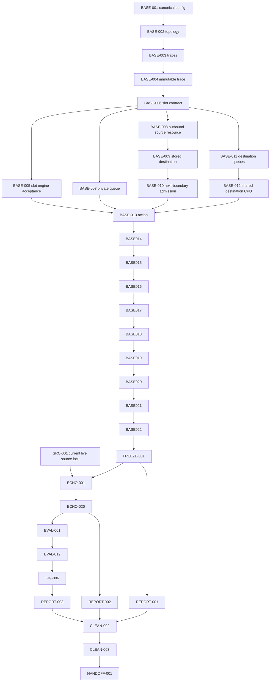

# ECHO Master Execution Plan

## 1. Document control

| Field | Value |
|---|---|
| Plan version | `ECHO-MEP-v3.0` |
| Status | `APPROVED FOR SOURCE-LOCK AND BASE-HOODIE WORK ONLY` |
| Repository | `hadifarajvand/hoodie_sim_v2` |
| Branch | `main` |
| Planning-start HEAD | `6dbca5c0a1cec9cfaa5d986aded6833cf7805a3d` |
| Planning-start plan blob | `4c2bc565f9f35ae98bff4f8d63f8fe00072a5005` |
| Audited pre-implementation baseline | `d8dbf131dc4cff3879636853cafa9371a0914d99` |
| Live document title | `مقاله` |
| Live document ID | `17iqZWA0bF5unbyuVYnRiW1IUcr0Ctb2KFw1f5XE2poE` |
| Live proposed-method tab ID | `t.iav4589yyeo7` |
| Live content heading | `III. Proposed Effective Completion via Hybrid Offloading Framework (ECHO)` |
| Current live revision | `ALtnJHz611-DqkvSCGUC_z6Fe7oTOtKddqKX28Uy-8yxMUchKHt1qIK0ynQUDlus57gMvnBz5VJeXCNzVUVbhwab1h05IlKz0AKes7cQJg` |
| Superseded live revision | `ALtnJHzzm4hFNZK8DdBeKreoGaZ2RSO7F5oymwXZTjamK8fUxsa71RdvAu-7KkfW25xxeNA3C-Ns0TIbs-kwgO8FwUg1U68nloS7CIA1sg` |
| Historical repository-export revision | `ALtnJHyTLdhKaOnVqfvxB74eKtegK8Hrsx5l2yaYdk68tSHgf-QdYtM6nrsTZrwFDm3DbTUFkeWajyCFP0Eevns2d7r0_twwuuYjD4ZcMQ` |

No tab title is asserted. The connector exposed the document title, tab ID, revision, heading, and content, but not a tab title.

## 2. Executive decision

The project is no longer treated as a clean sequential implementation. The repository already contains substantial base/shared and ECHO code written out of dependency order. That code is **evidence and potential implementation**, not automatic task completion.

Current authorization:

- `SRC-001` may run now and must lock the current live revision.
- `BASE-001` may run now because it is configuration-only and does not depend on ECHO.
- Existing base/shared code may be tested and accepted under its corresponding Phase-1 task after prerequisites close.
- Existing ECHO code must remain quarantined from scientific claims until `SRC-001` and `FREEZE-001` are complete.
- No pilot, full evaluation, final figure, or superiority claim is approved.

Overall approval: **APPROVED FOR SOURCE-LOCK AND BASE-HOODIE WORK ONLY**.

## 3. Authority hierarchy

1. Current live proposed-method tab at the revision recorded above.
2. Original HOODIE paper PDF and OCR bundle for base mechanics and base learning.
3. `research/ECHO_evaluation_spec.md` when consistent with the current live method.
4. Topology and PNG-export authorization files.
5. Repository code and tests as implementation evidence only.
6. Legacy reports, smoke outputs, checkpoints, and old figures as historical evidence only.

A test cannot override the paper. Existing code cannot define the method. A newer live revision invalidates the previous ECHO implementation lock until an explicit migration audit is completed.

## 4. Current live ECHO contract

The current live revision contains Equations (1)–(67), Algorithm 1 with 23 numbered lines, and Algorithm 2 with 12 numbered lines. The implementation lock must preserve all of the following:

- independent per-EA arrival indicator `χ_n(t)`;
- absolute deadline `d_i = t + δ_i - 1`;
- one direct route decision at arrival and one stored destination;
- one local waiting queue and one outbound waiting queue per source, excluding active service;
- non-preemptive local computation and transmission;
- transmission completion at the end of slot `t` becoming destination admission at the boundary opening `t+1`;
- source-indexed FIFO destination queues and shared destination capacity;
- remaining destination workload measured in CPU cycles;
- fresh destination status preferred, LSTM used only for stale or missing status;
- constructive deterministic ERT ordering with smallest nonnegative ERT, minimum lateness fallback, FIFO final tie break, `O(q²)` rebuild cost;
- fixed maximum-size scalability architecture: 30 destination feature blocks and 32 canonical action outputs;
- ECHO reward from Equations (55)–(58);
- source-specific discounted interval return from Equation (59);
- one non-overlapping transition between consecutive actual decisions of the same EA;
- event-epoch target discount `γ^Δ_(n,m)`;
- masked Dueling Double-DQL from Equations (61)–(67);
- separate supervised LSTM forecasting objective and no held-out evaluation data used for fitting.

### Current slot chronology

At the boundary opening slot `t`:

1. apply completions and destination admissions generated at the end of `t-1`;
2. resolve outcomes and add their task rewards to the still-open source-EA interval;
3. obtain fresh load status or the stale/missing LSTM estimate;
4. remove expired waiting tasks, without preempting active operations;
5. observe all arrivals;
6. for each arriving EA, finalize its previous interval before opening the new decision interval;
7. evaluate candidates, select actions, and admit tasks;
8. rebuild changed ERT orders and start idle source resources;
9. schedule destination processing;
10. execute exactly one slot of active service;
11. update history/LSTM and perform learning/target-copy work;
12. apply terminal resolution and interval flush at `T+1`.

## 5. Current codebase audit at planning-start HEAD

| Area | Observed implementation | Plan disposition |
|---|---|---|
| Per-EA traces | `src/evaluation/trace_protocol.py` now creates independent Bernoulli opportunities for every EA, supports 100 decision + 10 drain slots, and uses the expected task-size set and density. | `BASE-003` potentially implemented; acceptance blocked by config and trace immutability tests. |
| Trace immutability | `EvaluationTrace` and `TraceTaskBlueprint` are mutable dataclasses. | `BASE-004` not complete. |
| Synchronized decisions | `EvaluationHoodieGymEnvironment.step_slot()` processes all same-slot arrivals before one service advance. | Potential `BASE-005/006` implementation; exact boundary chronology still requires hand-calculated tests. |
| Physical-method separation | The evaluation adapter contains `_echo_enabled` and ERT behavior inside the shared environment. | Shared kernel is not yet cleanly frozen; `ECHO-001` isolation remains incomplete. |
| Private service start | Queue admission no longer automatically sets computation start. | Potential `BASE-007` implementation; requires lifecycle acceptance tests. |
| Source transmission | Active transmission is tracked per source while destination-indexed containers remain internally present. | Potential `BASE-008`; must prove only one physical transmitter per source and no simultaneous transmissions. |
| Stored destination | Destination-specific metadata is carried through action admission. | Potential `BASE-009`; requires no-second-decision test. |
| Next-slot destination admission | Recent commits stage completed transmissions for the next boundary. | Potential `BASE-010`; requires one-slot and multi-slot timeline tests. |
| ERT order | `src/echo_queue_ordering.py` implements constructive feasible/minimum-lateness ordering and reports candidate evaluations. | Potential `ECHO-007/008`; must be re-audited against the current revision and destination workload equations. |
| Canonical action output | `src/echo_action_space.py` implements 30 padded horizontal positions plus local and cloud, for 32 outputs. | Potential `ECHO-009`; only the physical mask is established here, not the full deadline-valid mask. |
| Event SMDP accumulator | `AgentEventSMDPAccumulator` creates one interval per source EA and discounts task rewards inside the interval. | Potential `ECHO-014`; unit tests are evidence, not acceptance. |
| ECHO training event order | `TrainingLoop._run_echo_episode()` currently processes returned `decision_events` before returned `task_resolution_events`. | **Scientific defect:** boundary rewards can be assigned to the new interval instead of the previous interval. Must be corrected under `ECHO-018` after source lock. |
| HOODIE learner isolation | A separate HOODIE branch exists, but it still uses one `TrainingLoop.policy`, passes `delta_slots`, and is explicitly labeled legacy pending paper audit. | `BASE-016–018` not complete; one independent learner per EA and exact base Bellman timing remain unproven. |
| Evaluation | Paired-trace infrastructure exists. | No authoritative evaluation until base freeze, ECHO source lock, pilot, accounting, mask, and hash gates pass. |
| CI | No combined status checks were attached to the planning-start HEAD. | Local/CI test evidence must be recorded per task. |

### Existing-code rule

Existing implementation is retained in place. It is not reverted merely because it was written early. Each affected task must first test the current implementation against its authority and then choose one of: accept unchanged, repair, isolate, or supersede. No task may be marked complete solely from a commit title or passing legacy test.

## 6. Source-lock procedure (`SRC-001`)

Status: **READY**.

Required outputs:

- `research/authority/echo/live/ECHO_PROPOSED_METHOD.md`
- `research/authority/echo/live/source_metadata.json`
- `research/authority/echo/live/SHA256SUMS`
- `artifacts/audits/echo_live_revision_audit.md`

Required metadata:

- document title `مقاله`;
- document ID and tab ID;
- current revision ID;
- retrieval timestamp and method;
- raw and normalized SHA-256 values;
- first/last equation and equation count;
- Algorithm 1 and Algorithm 2 presence;
- Algorithm 1 line count 23 and Algorithm 2 line count 12;
- implementation-lock approval.

The 69 audit rows are reset to `UNRESOLVED — CURRENT LIVE REVISION REQUIRES AUDIT`. The old live revision and repository export may be compared, but neither is current authority.

`SRC-001` is complete only when all 67 equations and both algorithms are classified and every semantic difference has a mapped task/test consequence.

## 7. Master task register

Status vocabulary:

- `VERIFIED COMPLETE`: evidence is sufficient for planning.
- `READY`: may be executed now.
- `EXISTING CODE — ACCEPTANCE REQUIRED`: implementation exists out of order; scientific completion is not granted.
- `BLOCKED`: prerequisites are incomplete.

### Phase 0 — source and audit (6)

| ID | Status | Objective |
|---|---|---|
| SRC-001 | READY | Lock the current live ECHO revision and close the 69-row audit. |
| SRC-002 | VERIFIED COMPLETE | Maintain the HOODIE paper evidence registry. |
| AUDIT-001 | VERIFIED COMPLETE | Maintain the code-path and dependency inventory. |
| AUDIT-002 | VERIFIED COMPLETE | Reconcile existing commits and completion claims against current paths. |
| PLAN-001 | VERIFIED COMPLETE | Maintain this authoritative execution plan. |
| CLEAN-001 | VERIFIED COMPLETE | Classify historical and non-authoritative artifacts. |

### Phase 1 — faithful base HOODIE (23)

| ID | Status | Objective / acceptance focus |
|---|---|---|
| BASE-001 | READY | Create canonical HOODIE Table-4 config, schema, manifest, and dedicated tests. |
| BASE-002 | BLOCKED | Freeze approved 20-EA topology and scalable topology rule. |
| BASE-003 | EXISTING CODE — ACCEPTANCE REQUIRED | Independent per-EA arrivals and 100+10 behavior. |
| BASE-004 | BLOCKED | Immutable directly supplied trace objects and byte-identical method inputs. |
| BASE-005 | EXISTING CODE — ACCEPTANCE REQUIRED | Synchronized multi-agent slot engine. |
| BASE-006 | EXISTING CODE — ACCEPTANCE REQUIRED | Exact base slot-order contract and timelines. |
| BASE-007 | EXISTING CODE — ACCEPTANCE REQUIRED | Private FIFO waiting versus active service. |
| BASE-008 | EXISTING CODE — ACCEPTANCE REQUIRED | One outbound FIFO/transmitter per source. |
| BASE-009 | EXISTING CODE — ACCEPTANCE REQUIRED | Stored destination and no second destination decision. |
| BASE-010 | EXISTING CODE — ACCEPTANCE REQUIRED | End-of-slot transmission completion and next-boundary admission. |
| BASE-011 | BLOCKED | Source-indexed destination FIFO queues. |
| BASE-012 | BLOCKED | Equal public-CPU sharing among active source queues. |
| BASE-013 | BLOCKED | Exact destination-specific HOODIE action semantics. |
| BASE-014 | BLOCKED | Exact HOODIE state and load-history construction. |
| BASE-015 | BLOCKED | Real HOODIE LSTM/load forecast. |
| BASE-016 | BLOCKED | One independent HOODIE learner/replay/online/target set per EA. |
| BASE-017 | EXISTING CODE — ACCEPTANCE REQUIRED | Original HOODIE delayed reward/replay timing without ECHO contamination. |
| BASE-018 | BLOCKED | Paper-correct Dueling Double-DQN, epsilon, reward sign, target copy, and normal base discount. |
| BASE-019 | BLOCKED | RO/FLC/VO/HO/BCO/MLEO on the same physical simulator. |
| BASE-020 | BLOCKED | Deterministic unit/integration suite for all base mechanics. |
| BASE-021 | BLOCKED | Bounded base runtime and learner smoke. |
| BASE-022 | BLOCKED | Reproduce base experiment organization and trend-level evidence. |
| FREEZE-001 | BLOCKED | Freeze the validated physical simulator and HOODIE baseline. |

### Phase 2 — ECHO on frozen base (20)

All Phase-2 tasks depend on both `SRC-001` and `FREEZE-001`. Existing code is quarantined until those gates close.

| ID | Status | Objective |
|---|---|---|
| ECHO-001 | EXISTING CODE — ACCEPTANCE REQUIRED | Isolate ECHO from frozen HOODIE/shared mechanics. |
| ECHO-002 | EXISTING CODE — ACCEPTANCE REQUIRED | Equations (1)–(8), lifecycle and dispatch. |
| ECHO-003 | EXISTING CODE — ACCEPTANCE REQUIRED | Equations (9)–(11), local completion estimates. |
| ECHO-004 | EXISTING CODE — ACCEPTANCE REQUIRED | Equations (12)–(16), outbound completion estimates. |
| ECHO-005 | BLOCKED | Equations (17)–(25), destination workload and capacity. |
| ECHO-006 | BLOCKED | Equations (26)–(28), history and supervised LSTM. |
| ECHO-007 | EXISTING CODE — ACCEPTANCE REQUIRED | Equation (29), constructive local ERT order. |
| ECHO-008 | EXISTING CODE — ACCEPTANCE REQUIRED | Equation (30), end-to-end outbound ERT order. |
| ECHO-009 | EXISTING CODE — ACCEPTANCE REQUIRED | Equation (41), 32-position canonical action output. |
| ECHO-010 | BLOCKED | Equations (42)–(46), deadline-valid mask and fallback. |
| ECHO-011 | BLOCKED | Equations (47)–(50), direct decision and pending records. |
| ECHO-012 | BLOCKED | Equations (51)–(54), normalized fixed state and candidate ERT vector. |
| ECHO-013 | BLOCKED | Equations (55)–(58), ECHO task reward. |
| ECHO-014 | EXISTING CODE — ACCEPTANCE REQUIRED | Equations (59)–(60), non-overlapping source-EA event intervals. |
| ECHO-015 | BLOCKED | Equations (61)–(67), masked Dueling Double-DQL and `γ^Δ`. |
| ECHO-016 | BLOCKED | Fresh/stale status switching and LSTM forecasting protocol. |
| ECHO-017 | BLOCKED | Isolated ECHO-NoLSTM ablation. |
| ECHO-018 | EXISTING CODE — ACCEPTANCE REQUIRED | Exact Algorithm-1/Algorithm-2 chronology; repair reward-before-decision ordering. |
| ECHO-019 | EXISTING CODE — ACCEPTANCE REQUIRED | Deterministic ECHO unit/smoke evidence already present but not authoritative. |
| ECHO-020 | BLOCKED | Equation/algorithm coverage report and ECHO pilot gate. |

### Phase 3 — evaluation (12)

| ID | Status | Objective |
|---|---|---|
| EVAL-001 | BLOCKED | Freeze evaluation defaults and run manifest. |
| EVAL-002 | BLOCKED | Generate immutable paired trace bank and hashes. |
| EVAL-003 | BLOCKED | Freeze topology/config/checkpoint lineage. |
| EVAL-004 | BLOCKED | Validate all method adapters and common physical inputs. |
| EVAL-005 | BLOCKED | Measure throughput and shard/resume budget. |
| EVAL-006 | BLOCKED | Figure-5 learning-rate and discount sweeps. |
| EVAL-007 | BLOCKED | Equal-budget training for reported methods and scenarios. |
| EVAL-008 | BLOCKED | 10 seeds × 200 held-out episodes per reported point. |
| EVAL-009 | BLOCKED | Enforce generated = completed + dropped. |
| EVAL-010 | BLOCKED | Enforce no masked ECHO action selection. |
| EVAL-011 | BLOCKED | Enforce paired trace/topology/config/checkpoint hashes. |
| EVAL-012 | BLOCKED | Seed means, pooled ratios, and 95% confidence intervals. |

### Phase 4 — figures, reports, cleanup (12)

| ID | Status | Objective |
|---|---|---|
| FIG-001 | BLOCKED | Figure 4 topology from the actual topology object. |
| FIG-002 | BLOCKED | Figure 5(a–b) from real training sweeps. |
| FIG-003 | BLOCKED | Figure 6(a–e) behavior/scalability panels. |
| FIG-004 | BLOCKED | Figure 7(a–f) paired comparisons. |
| FIG-005 | BLOCKED | Figure 8 ECHO/ECHO-NoLSTM ablation. |
| FIG-006 | BLOCKED | SVG/PDF and deterministic 300-dpi PNG exports with lineage. |
| REPORT-001 | BLOCKED | Final HOODIE reproduction report. |
| REPORT-002 | BLOCKED | Final ECHO implementation/invariant report. |
| REPORT-003 | BLOCKED | Final evaluation and figure-lineage report. |
| CLEAN-002 | BLOCKED | Mark stale evidence superseded after replacement exists. |
| CLEAN-003 | BLOCKED | Archive duplicate noncanonical paths after all gates pass. |
| HANDOFF-001 | BLOCKED | Final exact-command handoff and artifact index. |

Task total remains 73: `6 / 23 / 20 / 12 / 12`.

## 8. Dependency and execution gates



Hard gates:

- Gate 0A: canonical HOODIE authority/config is executable.
- Gate 0B: current live ECHO snapshot, hashes, and 69-row audit are locked.
- Gate 1: traces and slot chronology pass hand-calculated tests.
- Gate 2: physical queues/resources and accounting pass deterministic tests.
- Gate 3: exact HOODIE learner and baselines pass smoke and reproduction checks.
- Gate 4: `FREEZE-001` creates an immutable base manifest.
- Gate 5: every ECHO equation/algorithm row maps to code and tests.
- Gate 6: paired pilot passes route, mask, reward, replay, and accounting invariants.
- Gate 7: full held-out evaluation and statistical aggregation pass.
- Gate 8: figures/reports are generated from preserved raw outputs only.

## 9. Concrete next task cards

### SRC-001 — current live source lock

Files to create/update:

- `research/authority/echo/live/ECHO_PROPOSED_METHOD.md`
- `research/authority/echo/live/source_metadata.json`
- `research/authority/echo/live/SHA256SUMS`
- `artifacts/audits/echo_live_revision_audit.md`
- this plan’s source register/status only after validation

Acceptance:

- current revision exactly matches the value in Document Control;
- normalized snapshot contains tags (1)–(67), Algorithm 1 and Algorithm 2;
- algorithm line counts are 23 and 12;
- no unsupported tab title is recorded;
- all 69 rows have a semantic classification and task/test consequence;
- future ECHO tasks consume the committed snapshot, not a mutable live fetch.

### BASE-001 — canonical HOODIE configuration

Files to inspect:

- `resources/papers/hoodie/ocr/merged.md`
- `resources/papers/hoodie/ocr/merged.txt`
- `configs/simulation.yaml`
- `configs/runtime_model.yml`
- `configs/experiments/exp_small_deterministic.json`
- topology authorization

Files to create:

- `configs/authoritative/hoodie_table4.yaml`
- `configs/authoritative/hoodie_table4.schema.json`
- `tests/unit/test_hoodie_table4_config.py`
- `artifacts/authority/hoodie/table4_manifest.json`

Required canonical contract:

- 20 EAs for the default experiment;
- 110 slots = 100 decision + 10 drain;
- independent Bernoulli arrivals, default `P = 0.5`;
- task size set `{2.0, 2.1, …, 5.0}` Mbits;
- processing density `0.297 Gcycles/Mbit`;
- slot duration `0.1 s`;
- default timeout `20 slots = 2 s`;
- edge processing `5 GHz` and cloud processing `30 GHz` where supported by the cited paper row;
- horizontal/vertical rates and all learning parameters copied from the original HOODIE Table 4, with exact source row and units;
- every value classified as `PAPER-EXPLICIT`, `PAPER-DERIVED`, `APPROVED CLARIFICATION`, or `UNRESOLVED`;
- no smoke-only value promoted to authority.

Command after the task creates the test:

```bash
python3 -m pytest tests/unit/test_hoodie_table4_config.py -q
```

Acceptance:

- schema passes;
- manifest records source locations and hashes;
- all current configs are classified as match, conflict, smoke-only, assumption-backed, or unrelated;
- no unresolved value is silently treated as paper-explicit.

### BASE-003/005/006 acceptance bundle

After BASE-001 and BASE-002:

```bash
python3 -m pytest \
  tests/unit/test_trace_protocol_paper_semantics.py \
  tests/unit/test_slot_engine.py \
  -q
```

The executing agent must first verify the second path exists and create a dedicated slot-contract test when it does not.

Required deterministic scenarios:

- `N=20`, `P=0.5`, 100 decision slots produces expectation 1000 arrivals across repeated seeds;
- no arrivals in the 10 drain slots;
- every same-slot arriving EA gets one decision before one global service advance;
- one-slot local/transmission service finishes at the end of its start slot and is applied at the next boundary;
- boundary rewards are attributed to the interval that was open before the boundary’s new decision.

## 10. Evaluation and figure contract

- Figure 4: actual default 20-EA topology.
- Figure 5(a): learning rate `{10^-9, 5×10^-9, 10^-8, 10^-7, 5×10^-7, 7×10^-7}`.
- Figure 5(b): discount `{0.2, 0.4, 0.6, 0.8, 0.99}`.
- Figure 6(a–e): default timeout `20 slots = 2 s`; exact P, capacity, N, traffic, and link-rate series from `research/ECHO_evaluation_spec.md`.
- Figure 7(a–c): average delay; fixed 10 s for (a,b), swept `{9.6,9.8,10.0,10.2,10.4}` s for (c).
- Figure 7(d–f): pooled drop ratio; fixed 2 s for (d,e), swept `{1.6,1.8,2.0,2.2,2.4}` s for (f).
- Figure 8: ECHO vs ECHO-NoLSTM, `N=20`, `P=0.3`, timeout 1 s, episodes 0–3000.
- Every reported point: 10 fixed seeds × 200 held-out episodes, paired traces, seed-level 95% confidence intervals.
- Average delay retains the negative-delay convention; drop ratio pools counts across episodes before the seed ratio.
- Outputs: raw task logs, run manifest, seed CSV, panel CSV, vector figure, 300-dpi PNG, lineage index.

## 11. Mandatory concurrency and branch guard

- One task or one explicitly independent task bundle per branch.
- Do not push implementation directly to `main` while the plan/source lock is changing.
- Record the starting HEAD before every task.
- If `main` changes during a task, rebase/refresh the evidence before claiming completion.
- Existing ECHO work may be inspected and tested before source lock, but may not be modified or accepted as scientific completion.
- A live revision change immediately blocks new ECHO changes and invalidates unreviewed ECHO acceptance evidence.

## 12. Dashboard

| Metric | Current value |
|---|---|
| Total task IDs | 73 |
| Phase totals | 6 / 23 / 20 / 12 / 12 |
| Verified planning tasks | 5 |
| Ready tasks | `SRC-001`, `BASE-001` |
| Existing code requiring acceptance | 18 task IDs |
| ECHO authority | blocked until current revision snapshot/audit closes |
| Base authority | approved to begin with BASE-001 |
| Evaluation | blocked |
| Figures/reports | blocked |
| First parallel work | `SRC-001 || BASE-001` |
| First code-acceptance work after config/topology | `BASE-003`, then `BASE-004/006/005` |
| Current critical scientific defect | ECHO boundary resolution events are processed after new decision events in the training loop |

## 13. Next exact commands

Run in parallel on separate branches:

```text
Task A: Execute SRC-001 only. Lock the current live revision, generate the immutable snapshot, hashes, metadata, and 69-row semantic audit. Do not change simulator code.
```

```text
Task B: Execute BASE-001 only. Create the canonical HOODIE Table-4 configuration, schema, manifest, and dedicated tests. Do not change ECHO code.
```

After both branches are reviewed, update this plan with evidence and advance only dependency-complete tasks.

## 14. Evidence history

- v2.0–v2.7 are retained in Git history.
- v3.0 replaces stale source/repository claims with the current live revision and current codebase audit.
- v3.0 recognizes existing out-of-order implementation without granting unsupported completion.
- This plan-file update itself does not validate tests, create a source snapshot, freeze HOODIE, or approve ECHO evaluation.
