# ECHO Master Execution Plan

## 1. Document Control

| Field | Value |
|---|---|
| Title | ECHO Master Execution Plan |
| Plan version | `ECHO-MEP-v2.3` |
| Status | `CONDITIONALLY APPROVED — BASE-HOODIE PHASE ONLY` |
| Creation time | `2026-07-13T18:30:45Z` |
| Last updated time | `2026-07-13T19:30:14Z` |
| Repository branch | `main` |
| Repository HEAD | `d8dbf131dc4cff3879636853cafa9371a0914d99` |
| Working-tree status | clean at verification start; this file is the only intended tracked edit from this pass |
| Authoritative source identifiers | Live ECHO method tab `t.iav4589yyeo7` (`روش پیشنهادی`), externally verified current revision `ALtnJHzzm4hFNZK8DdBeKreoGaZ2RSO7F5oymwXZTjamK8fUxsa71RdvAu-7KkfW25xxeNA3C-Ns0TIbs-kwgO8FwUg1U68nloS7CIA1sg`; historical repository export `ALtnJHyTLdhKaOnVqfvxB74eKtegK8Hrsx5l2yaYdk68tSHgf-QdYtM6nrsTZrwFDm3DbTUFkeWajyCFP0Eevns2d7r0_twwuuYjD4ZcMQ` for offline comparison only; HOODIE OCR bundle; topology authorization v2; PNG export authorization |
| Plan owner | Principal research-simulation architect / distributed-systems engineer / deep-RL specialist / scientific execution planner |
| Update policy | Append-only evidence log; refresh before and after every scoped run; never erase history; recalculate counts from task register after every edit |

## 2. Executive Verdict

Plan structural readiness: PASS. Base-HOODIE execution readiness: PASS. ECHO implementation readiness: BLOCKED — SOURCE LOCK AND BASE FREEZE REQUIRED. Overall approval: CONDITIONALLY APPROVED — BASE-HOODIE PHASE ONLY.

ECHO-MEP-v2.0 treated the historical export as live authority. ECHO-MEP-v2.1 fixed source hierarchy but could not complete live validation in this environment. ECHO-MEP-v2.2 preserved that limitation but left readiness semantics too coarse. ECHO-MEP-v2.3 separates base execution readiness from ECHO source-lock readiness, preserves external live verification, and blocks only the work that truly depends on an immutable source lock.

The base HOODIE phase may proceed now. ECHO implementation and authoritative evaluation remain blocked until the source-lock bundle exists and FREEZE-001 is complete.

## 3. Authority Hierarchy

1. Live ECHO method tab `t.iav4589yyeo7` (`روش پیشنهادی`) as externally verified live authority.
2. HOODIE paper PDF + OCR bundle for the frozen base simulator.
3. ECHO evaluation material only when consistent with the live method tab.
4. `research/ECHO_topology_authorization_v2.md` and `research/ECHO_png_export_authorization.md`.
5. Repository code and tests as evidence only, never as method authority.
6. Legacy artifacts and reports as lowest authority.

Repository export snapshot `research/ECHO_method_spec.md` is a historical offline aid only. It may support comparison after the live snapshot is locked, but it is not the implementation lock source.

## 4. Source Revision Register

| Source | Revision / identifier | Coverage | Status |
| --- | --- | --- | --- |
| Live ECHO method tab | Google Doc `17iqZWA0bF5unbyuVYnRiW1IUcr0Ctb2KFw1f5XE2poE`, tab `t.iav4589yyeo7`, title `روش پیشنهادی`, externally verified current revision `ALtnJHzzm4hFNZK8DdBeKreoGaZ2RSO7F5oymwXZTjamK8fUxsa71RdvAu-7KkfW25xxeNA3C-Ns0TIbs-kwgO8FwUg1U68nloS7CIA1sg` | Equations (1)–(67); Algorithm 1; Algorithm 2; arrivals; dispatch; queues; ERT; canonical mask; state; reward; masked Dueling Double-DQL | EXTERNALLY VERIFIED — LOCAL SOURCE SNAPSHOT STILL REQUIRED |
| Repository export snapshot | `research/ECHO_method_spec.md`, revision `ALtnJHyTLdhKaOnVqfvxB74eKtegK8Hrsx5l2yaYdk68tSHgf-QdYtM6nrsTZrwFDm3DbTUFkeWajyCFP0Eevns2d7r0_twwuuYjD4ZcMQ` | Offline comparison snapshot only | HISTORICAL / SECONDARY |
| HOODIE paper | Original PDF + OCR exports in `resources/papers/hoodie/ocr/*` | Base simulator, learning, queueing, baselines, experiments | VERIFIED |
| Topology authorization | `research/ECHO_topology_authorization_v2.md` | Five-cluster scalable topology and Figure 4 / 6(d) / 6(e) | VERIFIED |
| PNG export authorization | `research/ECHO_png_export_authorization.md` | Vector + 300-dpi export without CairoSVG dependency | VERIFIED |
| Evaluation specification | `research/ECHO_evaluation_spec.md` | Figures 4–8 panel matrix and held-out evaluation rules | VERIFIED |
| Source-lock paths | `research/authority/echo/live/ECHO_PROPOSED_METHOD.md`; `research/authority/echo/live/source_metadata.json`; `research/authority/echo/live/SHA256SUMS` | Future immutable snapshot bundle for the live ECHO tab | PLANNED |

## Required ECHO Source-Lock Handoff

1. Fetch exact document and tab with a trusted live Docs environment.
2. Record returned revision ID and retrieval metadata.
3. Export only authoritative tab content.
4. Normalize line endings and Unicode consistently.
5. Store snapshot at `research/authority/echo/live/ECHO_PROPOSED_METHOD.md`.
6. Compute SHA-256 and write `research/authority/echo/live/SHA256SUMS`.
7. Verify Equations (1)–(67), Algorithm 1, and Algorithm 2.
8. Write `research/authority/echo/live/source_metadata.json` with document ID, tab ID, tab title, revision ID, retrieval timestamp, retrieval method, normalized SHA-256, raw SHA-256 when available, equation range, algorithm presence, approver, and authority status.
9. Commit the source snapshot and metadata in the trusted environment.
10. Update `SRC-001` evidence in this plan.
11. Run the 69-row drift audit against the snapshot and the repository export.
12. Lock ECHO implementation to that revision; any later live revision change stops new ECHO work until reviewed and approved.

## 5. Non-Negotiable Reproduction Principles

- Reproduce HOODIE first; do not replace the paper with a cleaner simulator.
- Keep ECHO isolated; it may only extend the frozen physical simulator where the live method tab explicitly says so.
- Never let a test override the live method or HOODIE paper.
- Never use MPS; use CUDA when available, CPU otherwise.
- Never treat a smoke artifact, report, or placeholder figure as authoritative scientific evidence.
- Never run pilot or full evaluation before runtime, state, mask, and replay contracts are frozen and tested.
- Before any ECHO implementation task, fetch live tab revision first; if the live revision differs from the plan, stop and update the plan before coding.

## 6. Current Repository and Git State

- Branch: `main`.
- Local HEAD: `d747b0c1f9dc2c956b7272fa7b4e3b9da0d836d7`.
- `origin/main`: `d747b0c1f9dc2c956b7272fa7b4e3b9da0d836d7`.
- Worktree: clean.
- Plan file is the only file intentionally rewritten in this planning pass.
- Current repo evidence already includes `artifacts/smoke/echo_runtime/*`, `artifacts/smoke/echo_learner/*`, `artifacts/checkpoints/echo_smoke/*`, and triage artifacts under `artifacts/test_triage/*`.

## 7. Verified Current-State Audit

| Component | Current status | Evidence | Remaining gap | Planned task IDs |
| --- | --- | --- | --- | --- |
| Plan structure | PASS | This document now has 30 required sections plus the dedicated source-lock handoff section | None | PLAN-001 |
| Base-HOODIE execution | PASS | Phase 1 begins with READY `BASE-001`; later Phase 1 tasks are dependency-blocked until executed | Base simulator and learner work still needs implementation | BASE-001–FREEZE-001 |
| ECHO source-lock | BLOCKED | Live method was externally verified, but no immutable local snapshot exists in repo | Source-lock bundle and hash still absent | SRC-001 |
| Full ECHO execution | BLOCKED | FREEZE-001 is incomplete and ECHO depends on both FREEZE-001 and SRC-001 | No authoritative ECHO work may start yet | ECHO-001–ECHO-020 |
| Evaluation and figures | BLOCKED | Authoritative evaluation and figures require ECHO pilot outputs | No Figure 4–8 lineage yet | EVAL-001–HANDOFF-001 |

## 8. Confirmed Paper-to-Code Gaps

1. `src/evaluation/trace_protocol.py:51-77` still builds a single deterministic trace stream with round-robin source assignment, not the paper's independent Bernoulli per-EA arrivals and final drain behavior. Fix in `BASE-003`.
2. `src/environment/gym_adapter.py:71-228` still uses a single `_current_task` flow, not an explicit synchronized `step_slot(actions_by_agent)` engine. Fix in `BASE-005` and `BASE-006`.
3. `src/environment/gym_adapter.py:90, 339-438, 566-724` still keys outbound flow by `(source, destination)` in the live adapter, which is too permissive for the frozen base simulator. Fix in `BASE-008` and `BASE-010`.
4. `src/agents/paper_state_builder.py:11-75` still exposes a paper-state builder, but the authoritative ECHO equation-53 tensor and equation-54 candidate-ERT vector must be the live learner input. Fix in `BASE-014`, `ECHO-012`.
5. `src/training/training_loop.py:59-135` still needs a strict semi-Markov finalization audit so replay inserts exactly one transition per delivered reward with `gamma ** Delta_i`. Fix in `BASE-017`, `BASE-018`, `ECHO-014`, `ECHO-015`.
6. `src/evaluation/policy_registry.py:1-40` aliases `HOODIE` to `ADAPTIVE`, which is useful for compatibility but not a faithful HOODIE baseline freeze. Fix in `BASE-019` and `FREEZE-001`.
7. `scripts/run_figures_8_11_validation.py` and the legacy analysis bundles are historical evidence only; they are not authoritative Figure 4–8 outputs. Fix in `CLEAN-002`, `FIG-001`–`FIG-006`.

## Live ECHO Source Drift Audit

Source authority validation is externally verified at the live revision above, but no immutable local snapshot has been committed in this repository. Every row below remains UNRESOLVED until the source-lock handoff completes.

| Audit ID | Live item | Live scientific meaning | Repository-export equivalent | Existing task IDs | Comparison result | Difference description | Scientific consequence | Required plan correction | Verification evidence |
|---|---|---|---|---|---|---|---|---|---|
| `A-001` | Equation (1) | Live mathematical contract for Equation (1) | Repository export Equation (1) | SRC-001, ECHO-002–ECHO-020 | UNRESOLVED | Live authority not locally snapshotted | High | Lock arrivals, deadlines, actions, and dispatch semantics to live tab | External live verification only |
| `A-002` | Equation (2) | Live mathematical contract for Equation (2) | Repository export Equation (2) | SRC-001, ECHO-002–ECHO-020 | UNRESOLVED | Live authority not locally snapshotted | High | Lock arrivals, deadlines, actions, and dispatch semantics to live tab | External live verification only |
| `A-003` | Equation (3) | Live mathematical contract for Equation (3) | Repository export Equation (3) | SRC-001, ECHO-002–ECHO-020 | UNRESOLVED | Live authority not locally snapshotted | High | Lock arrivals, deadlines, actions, and dispatch semantics to live tab | External live verification only |
| `A-004` | Equation (4) | Live mathematical contract for Equation (4) | Repository export Equation (4) | SRC-001, ECHO-002–ECHO-020 | UNRESOLVED | Live authority not locally snapshotted | High | Lock arrivals, deadlines, actions, and dispatch semantics to live tab | External live verification only |
| `A-005` | Equation (5) | Live mathematical contract for Equation (5) | Repository export Equation (5) | SRC-001, ECHO-002–ECHO-020 | UNRESOLVED | Live authority not locally snapshotted | High | Lock arrivals, deadlines, actions, and dispatch semantics to live tab | External live verification only |
| `A-006` | Equation (6) | Live mathematical contract for Equation (6) | Repository export Equation (6) | SRC-001, ECHO-002–ECHO-020 | UNRESOLVED | Live authority not locally snapshotted | High | Lock arrivals, deadlines, actions, and dispatch semantics to live tab | External live verification only |
| `A-007` | Equation (7) | Live mathematical contract for Equation (7) | Repository export Equation (7) | SRC-001, ECHO-002–ECHO-020 | UNRESOLVED | Live authority not locally snapshotted | High | Lock arrivals, deadlines, actions, and dispatch semantics to live tab | External live verification only |
| `A-008` | Equation (8) | Live mathematical contract for Equation (8) | Repository export Equation (8) | SRC-001, ECHO-002–ECHO-020 | UNRESOLVED | Live authority not locally snapshotted | High | Lock arrivals, deadlines, actions, and dispatch semantics to live tab | External live verification only |
| `A-009` | Equation (9) | Live mathematical contract for Equation (9) | Repository export Equation (9) | SRC-001, ECHO-002–ECHO-020 | UNRESOLVED | Live authority not locally snapshotted | High | Lock queue, service, and transmission lifecycle semantics to live tab | External live verification only |
| `A-010` | Equation (10) | Live mathematical contract for Equation (10) | Repository export Equation (10) | SRC-001, ECHO-002–ECHO-020 | UNRESOLVED | Live authority not locally snapshotted | High | Lock queue, service, and transmission lifecycle semantics to live tab | External live verification only |
| `A-011` | Equation (11) | Live mathematical contract for Equation (11) | Repository export Equation (11) | SRC-001, ECHO-002–ECHO-020 | UNRESOLVED | Live authority not locally snapshotted | High | Lock queue, service, and transmission lifecycle semantics to live tab | External live verification only |
| `A-012` | Equation (12) | Live mathematical contract for Equation (12) | Repository export Equation (12) | SRC-001, ECHO-002–ECHO-020 | UNRESOLVED | Live authority not locally snapshotted | High | Lock queue, service, and transmission lifecycle semantics to live tab | External live verification only |
| `A-013` | Equation (13) | Live mathematical contract for Equation (13) | Repository export Equation (13) | SRC-001, ECHO-002–ECHO-020 | UNRESOLVED | Live authority not locally snapshotted | High | Lock queue, service, and transmission lifecycle semantics to live tab | External live verification only |
| `A-014` | Equation (14) | Live mathematical contract for Equation (14) | Repository export Equation (14) | SRC-001, ECHO-002–ECHO-020 | UNRESOLVED | Live authority not locally snapshotted | High | Lock queue, service, and transmission lifecycle semantics to live tab | External live verification only |
| `A-015` | Equation (15) | Live mathematical contract for Equation (15) | Repository export Equation (15) | SRC-001, ECHO-002–ECHO-020 | UNRESOLVED | Live authority not locally snapshotted | High | Lock queue, service, and transmission lifecycle semantics to live tab | External live verification only |
| `A-016` | Equation (16) | Live mathematical contract for Equation (16) | Repository export Equation (16) | SRC-001, ECHO-002–ECHO-020 | UNRESOLVED | Live authority not locally snapshotted | High | Lock queue, service, and transmission lifecycle semantics to live tab | External live verification only |
| `A-017` | Equation (17) | Live mathematical contract for Equation (17) | Repository export Equation (17) | SRC-001, ECHO-002–ECHO-020 | UNRESOLVED | Live authority not locally snapshotted | High | Lock destination workload and LSTM semantics to live tab | External live verification only |
| `A-018` | Equation (18) | Live mathematical contract for Equation (18) | Repository export Equation (18) | SRC-001, ECHO-002–ECHO-020 | UNRESOLVED | Live authority not locally snapshotted | High | Lock destination workload and LSTM semantics to live tab | External live verification only |
| `A-019` | Equation (19) | Live mathematical contract for Equation (19) | Repository export Equation (19) | SRC-001, ECHO-002–ECHO-020 | UNRESOLVED | Live authority not locally snapshotted | High | Lock destination workload and LSTM semantics to live tab | External live verification only |
| `A-020` | Equation (20) | Live mathematical contract for Equation (20) | Repository export Equation (20) | SRC-001, ECHO-002–ECHO-020 | UNRESOLVED | Live authority not locally snapshotted | High | Lock destination workload and LSTM semantics to live tab | External live verification only |
| `A-021` | Equation (21) | Live mathematical contract for Equation (21) | Repository export Equation (21) | SRC-001, ECHO-002–ECHO-020 | UNRESOLVED | Live authority not locally snapshotted | High | Lock destination workload and LSTM semantics to live tab | External live verification only |
| `A-022` | Equation (22) | Live mathematical contract for Equation (22) | Repository export Equation (22) | SRC-001, ECHO-002–ECHO-020 | UNRESOLVED | Live authority not locally snapshotted | High | Lock destination workload and LSTM semantics to live tab | External live verification only |
| `A-023` | Equation (23) | Live mathematical contract for Equation (23) | Repository export Equation (23) | SRC-001, ECHO-002–ECHO-020 | UNRESOLVED | Live authority not locally snapshotted | High | Lock destination workload and LSTM semantics to live tab | External live verification only |
| `A-024` | Equation (24) | Live mathematical contract for Equation (24) | Repository export Equation (24) | SRC-001, ECHO-002–ECHO-020 | UNRESOLVED | Live authority not locally snapshotted | High | Lock destination workload and LSTM semantics to live tab | External live verification only |
| `A-025` | Equation (25) | Live mathematical contract for Equation (25) | Repository export Equation (25) | SRC-001, ECHO-002–ECHO-020 | UNRESOLVED | Live authority not locally snapshotted | High | Lock destination workload and LSTM semantics to live tab | External live verification only |
| `A-026` | Equation (26) | Live mathematical contract for Equation (26) | Repository export Equation (26) | SRC-001, ECHO-002–ECHO-020 | UNRESOLVED | Live authority not locally snapshotted | High | Lock destination workload and LSTM semantics to live tab | External live verification only |
| `A-027` | Equation (27) | Live mathematical contract for Equation (27) | Repository export Equation (27) | SRC-001, ECHO-002–ECHO-020 | UNRESOLVED | Live authority not locally snapshotted | High | Lock destination workload and LSTM semantics to live tab | External live verification only |
| `A-028` | Equation (28) | Live mathematical contract for Equation (28) | Repository export Equation (28) | SRC-001, ECHO-002–ECHO-020 | UNRESOLVED | Live authority not locally snapshotted | High | Lock destination workload and LSTM semantics to live tab | External live verification only |
| `A-029` | Equation (29) | Live mathematical contract for Equation (29) | Repository export Equation (29) | SRC-001, ECHO-002–ECHO-020 | UNRESOLVED | Live authority not locally snapshotted | High | Lock ERT scheduling, fallback, and tie-break semantics to live tab | External live verification only |
| `A-030` | Equation (30) | Live mathematical contract for Equation (30) | Repository export Equation (30) | SRC-001, ECHO-002–ECHO-020 | UNRESOLVED | Live authority not locally snapshotted | High | Lock ERT scheduling, fallback, and tie-break semantics to live tab | External live verification only |
| `A-031` | Equation (31) | Live mathematical contract for Equation (31) | Repository export Equation (31) | SRC-001, ECHO-002–ECHO-020 | UNRESOLVED | Live authority not locally snapshotted | High | Lock ERT scheduling, fallback, and tie-break semantics to live tab | External live verification only |
| `A-032` | Equation (32) | Live mathematical contract for Equation (32) | Repository export Equation (32) | SRC-001, ECHO-002–ECHO-020 | UNRESOLVED | Live authority not locally snapshotted | High | Lock ERT scheduling, fallback, and tie-break semantics to live tab | External live verification only |
| `A-033` | Equation (33) | Live mathematical contract for Equation (33) | Repository export Equation (33) | SRC-001, ECHO-002–ECHO-020 | UNRESOLVED | Live authority not locally snapshotted | High | Lock ERT scheduling, fallback, and tie-break semantics to live tab | External live verification only |
| `A-034` | Equation (34) | Live mathematical contract for Equation (34) | Repository export Equation (34) | SRC-001, ECHO-002–ECHO-020 | UNRESOLVED | Live authority not locally snapshotted | High | Lock ERT scheduling, fallback, and tie-break semantics to live tab | External live verification only |
| `A-035` | Equation (35) | Live mathematical contract for Equation (35) | Repository export Equation (35) | SRC-001, ECHO-002–ECHO-020 | UNRESOLVED | Live authority not locally snapshotted | High | Lock ERT scheduling, fallback, and tie-break semantics to live tab | External live verification only |
| `A-036` | Equation (36) | Live mathematical contract for Equation (36) | Repository export Equation (36) | SRC-001, ECHO-002–ECHO-020 | UNRESOLVED | Live authority not locally snapshotted | High | Lock ERT scheduling, fallback, and tie-break semantics to live tab | External live verification only |
| `A-037` | Equation (37) | Live mathematical contract for Equation (37) | Repository export Equation (37) | SRC-001, ECHO-002–ECHO-020 | UNRESOLVED | Live authority not locally snapshotted | High | Lock ERT scheduling, fallback, and tie-break semantics to live tab | External live verification only |
| `A-038` | Equation (38) | Live mathematical contract for Equation (38) | Repository export Equation (38) | SRC-001, ECHO-002–ECHO-020 | UNRESOLVED | Live authority not locally snapshotted | High | Lock ERT scheduling, fallback, and tie-break semantics to live tab | External live verification only |
| `A-039` | Equation (39) | Live mathematical contract for Equation (39) | Repository export Equation (39) | SRC-001, ECHO-002–ECHO-020 | UNRESOLVED | Live authority not locally snapshotted | High | Lock ERT scheduling, fallback, and tie-break semantics to live tab | External live verification only |
| `A-040` | Equation (40) | Live mathematical contract for Equation (40) | Repository export Equation (40) | SRC-001, ECHO-002–ECHO-020 | UNRESOLVED | Live authority not locally snapshotted | High | Lock ERT scheduling, fallback, and tie-break semantics to live tab | External live verification only |
| `A-041` | Equation (41) | Live mathematical contract for Equation (41) | Repository export Equation (41) | SRC-001, ECHO-002–ECHO-020 | UNRESOLVED | Live authority not locally snapshotted | High | Lock canonical actions, mask, and pending-record semantics to live tab | External live verification only |
| `A-042` | Equation (42) | Live mathematical contract for Equation (42) | Repository export Equation (42) | SRC-001, ECHO-002–ECHO-020 | UNRESOLVED | Live authority not locally snapshotted | High | Lock canonical actions, mask, and pending-record semantics to live tab | External live verification only |
| `A-043` | Equation (43) | Live mathematical contract for Equation (43) | Repository export Equation (43) | SRC-001, ECHO-002–ECHO-020 | UNRESOLVED | Live authority not locally snapshotted | High | Lock canonical actions, mask, and pending-record semantics to live tab | External live verification only |
| `A-044` | Equation (44) | Live mathematical contract for Equation (44) | Repository export Equation (44) | SRC-001, ECHO-002–ECHO-020 | UNRESOLVED | Live authority not locally snapshotted | High | Lock canonical actions, mask, and pending-record semantics to live tab | External live verification only |
| `A-045` | Equation (45) | Live mathematical contract for Equation (45) | Repository export Equation (45) | SRC-001, ECHO-002–ECHO-020 | UNRESOLVED | Live authority not locally snapshotted | High | Lock canonical actions, mask, and pending-record semantics to live tab | External live verification only |
| `A-046` | Equation (46) | Live mathematical contract for Equation (46) | Repository export Equation (46) | SRC-001, ECHO-002–ECHO-020 | UNRESOLVED | Live authority not locally snapshotted | High | Lock canonical actions, mask, and pending-record semantics to live tab | External live verification only |
| `A-047` | Equation (47) | Live mathematical contract for Equation (47) | Repository export Equation (47) | SRC-001, ECHO-002–ECHO-020 | UNRESOLVED | Live authority not locally snapshotted | High | Lock canonical actions, mask, and pending-record semantics to live tab | External live verification only |
| `A-048` | Equation (48) | Live mathematical contract for Equation (48) | Repository export Equation (48) | SRC-001, ECHO-002–ECHO-020 | UNRESOLVED | Live authority not locally snapshotted | High | Lock canonical actions, mask, and pending-record semantics to live tab | External live verification only |
| `A-049` | Equation (49) | Live mathematical contract for Equation (49) | Repository export Equation (49) | SRC-001, ECHO-002–ECHO-020 | UNRESOLVED | Live authority not locally snapshotted | High | Lock canonical actions, mask, and pending-record semantics to live tab | External live verification only |
| `A-050` | Equation (50) | Live mathematical contract for Equation (50) | Repository export Equation (50) | SRC-001, ECHO-002–ECHO-020 | UNRESOLVED | Live authority not locally snapshotted | High | Lock canonical actions, mask, and pending-record semantics to live tab | External live verification only |
| `A-051` | Equation (51) | Live mathematical contract for Equation (51) | Repository export Equation (51) | SRC-001, ECHO-002–ECHO-020 | UNRESOLVED | Live authority not locally snapshotted | High | Lock state, reward, semi-Markov transition, and masked target semantics to live tab | External live verification only |
| `A-052` | Equation (52) | Live mathematical contract for Equation (52) | Repository export Equation (52) | SRC-001, ECHO-002–ECHO-020 | UNRESOLVED | Live authority not locally snapshotted | High | Lock state, reward, semi-Markov transition, and masked target semantics to live tab | External live verification only |
| `A-053` | Equation (53) | Live mathematical contract for Equation (53) | Repository export Equation (53) | SRC-001, ECHO-002–ECHO-020 | UNRESOLVED | Live authority not locally snapshotted | High | Lock state, reward, semi-Markov transition, and masked target semantics to live tab | External live verification only |
| `A-054` | Equation (54) | Live mathematical contract for Equation (54) | Repository export Equation (54) | SRC-001, ECHO-002–ECHO-020 | UNRESOLVED | Live authority not locally snapshotted | High | Lock state, reward, semi-Markov transition, and masked target semantics to live tab | External live verification only |
| `A-055` | Equation (55) | Live mathematical contract for Equation (55) | Repository export Equation (55) | SRC-001, ECHO-002–ECHO-020 | UNRESOLVED | Live authority not locally snapshotted | High | Lock state, reward, semi-Markov transition, and masked target semantics to live tab | External live verification only |
| `A-056` | Equation (56) | Live mathematical contract for Equation (56) | Repository export Equation (56) | SRC-001, ECHO-002–ECHO-020 | UNRESOLVED | Live authority not locally snapshotted | High | Lock state, reward, semi-Markov transition, and masked target semantics to live tab | External live verification only |
| `A-057` | Equation (57) | Live mathematical contract for Equation (57) | Repository export Equation (57) | SRC-001, ECHO-002–ECHO-020 | UNRESOLVED | Live authority not locally snapshotted | High | Lock state, reward, semi-Markov transition, and masked target semantics to live tab | External live verification only |
| `A-058` | Equation (58) | Live mathematical contract for Equation (58) | Repository export Equation (58) | SRC-001, ECHO-002–ECHO-020 | UNRESOLVED | Live authority not locally snapshotted | High | Lock state, reward, semi-Markov transition, and masked target semantics to live tab | External live verification only |
| `A-059` | Equation (59) | Live mathematical contract for Equation (59) | Repository export Equation (59) | SRC-001, ECHO-002–ECHO-020 | UNRESOLVED | Live authority not locally snapshotted | High | Lock state, reward, semi-Markov transition, and masked target semantics to live tab | External live verification only |
| `A-060` | Equation (60) | Live mathematical contract for Equation (60) | Repository export Equation (60) | SRC-001, ECHO-002–ECHO-020 | UNRESOLVED | Live authority not locally snapshotted | High | Lock state, reward, semi-Markov transition, and masked target semantics to live tab | External live verification only |
| `A-061` | Equation (61) | Live mathematical contract for Equation (61) | Repository export Equation (61) | SRC-001, ECHO-002–ECHO-020 | UNRESOLVED | Live authority not locally snapshotted | High | Lock state, reward, semi-Markov transition, and masked target semantics to live tab | External live verification only |
| `A-062` | Equation (62) | Live mathematical contract for Equation (62) | Repository export Equation (62) | SRC-001, ECHO-002–ECHO-020 | UNRESOLVED | Live authority not locally snapshotted | High | Lock state, reward, semi-Markov transition, and masked target semantics to live tab | External live verification only |
| `A-063` | Equation (63) | Live mathematical contract for Equation (63) | Repository export Equation (63) | SRC-001, ECHO-002–ECHO-020 | UNRESOLVED | Live authority not locally snapshotted | High | Lock state, reward, semi-Markov transition, and masked target semantics to live tab | External live verification only |
| `A-064` | Equation (64) | Live mathematical contract for Equation (64) | Repository export Equation (64) | SRC-001, ECHO-002–ECHO-020 | UNRESOLVED | Live authority not locally snapshotted | High | Lock state, reward, semi-Markov transition, and masked target semantics to live tab | External live verification only |
| `A-065` | Equation (65) | Live mathematical contract for Equation (65) | Repository export Equation (65) | SRC-001, ECHO-002–ECHO-020 | UNRESOLVED | Live authority not locally snapshotted | High | Lock state, reward, semi-Markov transition, and masked target semantics to live tab | External live verification only |
| `A-066` | Equation (66) | Live mathematical contract for Equation (66) | Repository export Equation (66) | SRC-001, ECHO-002–ECHO-020 | UNRESOLVED | Live authority not locally snapshotted | High | Lock state, reward, semi-Markov transition, and masked target semantics to live tab | External live verification only |
| `A-067` | Equation (67) | Live mathematical contract for Equation (67) | Repository export Equation (67) | SRC-001, ECHO-002–ECHO-020 | UNRESOLVED | Live authority not locally snapshotted | High | Lock state, reward, semi-Markov transition, and masked target semantics to live tab | External live verification only |
| `A-068` | Algorithm 1 | Live ECHO training algorithm | Exported training algorithm snapshot | ECHO-018–ECHO-020, EVAL-001–EVAL-012 | UNRESOLVED | Live algorithm not locally snapshotted | High | Lock training slot order and replay-finalization order to live tab | External live verification only |
| `A-069` | Algorithm 2 | Live ECHO inference algorithm | Exported inference algorithm snapshot | ECHO-018–ECHO-020, EVAL-001–EVAL-012 | UNRESOLVED | Live algorithm not locally snapshotted | High | Lock inference slot order and masked argmax semantics to live tab | External live verification only |

## 9. Target Shared Physical Architecture

### Shared physical simulator
- Tasks, slots, queues, topology, trace ingestion, lifecycle events, raw metrics, and runtime state snapshots.
- Must be method-neutral and reusable by HOODIE, ECHO, and baseline adapters.

### HOODIE method adapter
- Exact base-paper state, FIFO source scheduling, original reward / replay timing, distributed learners, and the original LSTM behavior.

### ECHO method adapter
- Live equations (1)–(67), ERT scheduling, candidate ERT vector, canonical mask, equation-53 state, equation-58 reward, equation-59 transitions, equation-65 target.

### Baseline adapters
- RO, FLC, VO, HO, BCO, MLEO.

### Trace bank and paired evaluation
- Generated once, hashed, immutable, and reused across methods.

### Authoritative experiment / figure pipeline
- Raw task-level outputs → per-episode aggregates → per-seed confidence intervals → panel CSVs → SVG / PDF → 300-dpi PNG → manifests / lineage.

## 10. Exact Base HOODIE Slot Workflow

1. Observe arrival and current queue / load snapshot.
2. Advance active local service and active transmission service without preemption.
3. Resolve transmission completions and admit tasks to destination queues on the next slot boundary.
4. Advance destination computation with equal share across active source queues.
5. Resolve physical task success / drop exactly once.
6. Deliver delayed learner rewards only when the next valid learner decision epoch or terminal flush arrives.
7. Build the next observation, mask, and next-decision state.

Local example: arrival → local admission → local wait / service → physical completion → resolution event → later reward delivery.
Horizontal example: arrival → outbound queue → source transmission → next-slot destination admission → destination queue service → physical completion → resolution event → later reward delivery.
Cloud example: same as horizontal, but with cloud destination capacity and cloud-specific queue share.

## 11. Exact Base HOODIE Training Workflow

- One edge agent per EA; each agent owns its own model, target model, replay buffer, epsilon state, and pending-decision records.
- The decision state is captured before action selection and reused when the corresponding reward-delivery event is processed.
- The replay transition is finalised only when the reward becomes deliverable or the terminal flush occurs.
- Double-DQN target selection must use the same canonical mask as exploration and exploitation.
- Epsilon decay, target-copy period, optimizer step, and replay sampling must match the base paper once the faithful simulator is frozen.

## 12. Base-HOODIE Validation and Freeze Strategy

1. Lock Table-4 configuration and approved 20-EA topology.
2. Freeze trace generation and the base slot engine on the shared simulator.
3. Validate queue / deadline / reward / replay semantics with focused unit and integration tests.
4. Run bounded HOODIE smoke, then freeze the faithful HOODIE simulator and baseline under a versioned artifact set.

## 13. Exact ECHO Delta over Frozen HOODIE

- ECHO does not change physical simulation semantics; it adds deadline-aware route evaluation, canonical masking, ERT-based scheduling, delayed reward delivery, and semi-Markov learning semantics on top of the frozen base simulator.
- The live method tab, not the old export alone, is the source of truth for equations (1)–(67).
- ECHO-NoLSTM is a one-factor ablation that only removes load-estimation recovery; it must not perturb any other routing, reward, or replay contract.

## 14. ECHO Equations (1)–(67) Traceability Matrix

| Equation group | Meaning | Target code modules | Task IDs |
| --- | --- | --- | --- |
| (1)–(2) | Arrivals and absolute deadlines | src/evaluation/trace_protocol.py; src/environment/deadline_rules.py; src/environment/task.py | BASE-003, ECHO-002 |
| (3)–(8) | Action set, destination mapping, queue choice, and stored route metadata | src/echo_action_space.py; src/environment/gym_adapter.py | BASE-013, ECHO-002, ECHO-009, ECHO-011 |
| (9)–(16) | Local completion timing and residual-service model | src/echo_ert.py; src/environment/runtime_model.py; src/environment/private_queue.py | BASE-007, ECHO-003 |
| (17)–(25) | Destination workload, capacity sharing, and transfer ERT | src/echo_ert.py; src/environment/public_queue.py; src/environment/gym_adapter.py | BASE-011, BASE-012, ECHO-004, ECHO-005, ECHO-007 |
| (26)–(28) | Load history, fresh status, and LSTM-estimated workload | src/agents/paper_state_builder.py; src/environment/runtime_model.py; src/environment/gym_adapter.py | BASE-015, ECHO-006 |
| (29)–(32) | Local and end-to-end ERT formulas | src/echo_ert.py; src/environment/gym_adapter.py | ECHO-007 |
| (33)–(40) | ERT-based source-queue scheduling | src/environment/gym_adapter.py; src/environment/slot_engine.py | BASE-006, BASE-007, ECHO-008 |
| (41) | Canonical action set | src/echo_action_space.py | BASE-013, ECHO-009 |
| (42)–(46) | Deadline-valid actions, minimum-lateness fallback, and masks | src/environment/gym_adapter.py; src/policies/action_masking.py | ECHO-010 |
| (47)–(50) | Direct decision, admission metadata, and pending records | src/environment/task.py; src/environment/environment.py; src/environment/gym_adapter.py | BASE-009, ECHO-011 |
| (51)–(54) | Normalized state and candidate ERT vector | src/environment/gym_adapter.py; src/agents/paper_state_builder.py | BASE-014, ECHO-012 |
| (55)–(58) | Duration, risk, drop, and task reward | src/environment/task.py; src/environment/gym_adapter.py; src/environment/reward_timing.py | BASE-017, ECHO-013 |
| (59)–(60) | Next-decision semi-Markov transition and terminal handling | src/training/training_loop.py; src/environment/gym_adapter.py | BASE-017, ECHO-014 |
| (61)–(67) | Masked Dueling Double-DQL and loss | src/agents/double_dqn.py; src/agents/dueling_dqn_network.py; src/training/training_loop.py | BASE-018, ECHO-015, ECHO-017 |

## 15. Evaluation and Figure Traceability Matrix

| Panel | Purpose | Methods | Dependent metric | Fixed parameters | Training dependency | Evaluation dependency | Topology | Trace policy | Seed policy | Confidence interval | Artifact outputs | Task IDs |
| --- | --- | --- | --- | --- | --- | --- | --- | --- | --- | --- | --- | --- |
| Figure 4 | 20-EA topology | ECHO topology family | Topology hash / routing legality | Fixed 20-EA anchor + scalable five-cluster family | None | None | 5-cluster topology only | Paired traces for topology export | Same seed family | 95% CI not applicable | raw topology CSV/JSON + SVG/PDF + PNG + manifest + lineage | FIG-001 |
| Figure 5(a) | Learning-rate sweep | ECHO training | Reward / stability vs alpha_lr | Selected Table-2 anchor values | Training traces | Held-out eval traces | Approved topology anchor | Paired traces | Same seeds across rates | 95% CI over seeds | raw logs + seed CSV + panel CSV + SVG/PDF + PNG + manifest + lineage | EVAL-002, EVAL-006, FIG-002 |
| Figure 5(b) | Discount-factor sweep | ECHO training | Reward / stability vs gamma | Selected Table-2 anchor values | Training traces | Held-out eval traces | Approved topology anchor | Paired traces | Same seeds across gammas | 95% CI over seeds | raw logs + seed CSV + panel CSV + SVG/PDF + PNG + manifest + lineage | EVAL-002, EVAL-006, FIG-002 |
| Figure 6(a) | Arrival probability sweep | ECHO | Average reward vs P | Table-2 anchor except P | Trained ECHO | Held-out eval | Five-cluster family | Paired traces | Same seeds | 95% CI | raw task logs + seed CSV + panel CSV + SVG/PDF + PNG + manifest + lineage | EVAL-007, EVAL-008, FIG-003 |
| Figure 6(b) | Action distribution vs arrival probability | ECHO | Action mix vs P | Table-2 anchor except P | Trained ECHO | Held-out eval | Five-cluster family | Paired traces | Same seeds | 95% CI | raw task logs + seed CSV + panel CSV + SVG/PDF + PNG + manifest + lineage | EVAL-007, EVAL-008, FIG-003 |
| Figure 6(c) | CPU-capacity sweep | ECHO | Average reward vs compute capacity | Table-2 anchor except CPU | Trained ECHO | Held-out eval | Five-cluster family | Paired traces | Same seeds | 95% CI | raw task logs + seed CSV + panel CSV + SVG/PDF + PNG + manifest + lineage | EVAL-007, EVAL-008, FIG-003 |
| Figure 6(d) | Topology-scale sweep | ECHO | Average reward vs EA count | Topological family and approved anchor | Trained ECHO | Held-out eval | Five-cluster family | Paired traces | Same seeds | 95% CI | raw task logs + seed CSV + panel CSV + SVG/PDF + PNG + manifest + lineage | EVAL-007, EVAL-008, FIG-003 |
| Figure 6(e) | Link-rate sweep | ECHO | Average reward vs data-rate profile | Topology + rate profiles | Trained ECHO | Held-out eval | Five-cluster family | Paired traces | Same seeds | 95% CI | raw task logs + seed CSV + panel CSV + SVG/PDF + PNG + manifest + lineage | EVAL-007, EVAL-008, FIG-003 |
| Figure 7(a–f) | ECHO vs HOODIE / RO / FLC / VO / HO / BCO / MLEO | ECHO + baselines | Delay / drop vs traffic, CPU, timeout | Equal topology, equal traces, equal seeds | Final trained models | Held-out eval | Same hash across all methods | Paired traces across methods | Same seeds | 95% CI | raw task logs + seed CSV + panel CSV + SVG/PDF + PNG + manifest + lineage | EVAL-007, EVAL-008, FIG-004 |
| Figure 8 | ECHO vs ECHO-NoLSTM | ECHO ablation | Average delay vs training episode | Same topology / traces / seeds | Trained ECHO + ECHO-NoLSTM | Held-out eval | Same hash | Paired traces | Same seeds | 95% CI | raw task logs + seed CSV + panel CSV + SVG/PDF + PNG + manifest + lineage | EVAL-007, EVAL-008, FIG-005 |

## 16. Cleanup and Deprecation Matrix

- Canonical execution code: shared simulator, frozen HOODIE baseline, ECHO adapter, baseline adapters, evaluation runner, and figure pipeline.
- Reusable physical components: tasks, queues, slot engine, topology, trace ingestion, and lifecycle events.
- HOODIE-only components: base-paper state, original reward / replay timing, distributed learners, and the original LSTM behavior.
- ECHO-only components: ERT scheduling, canonical mask, pending reward / decision ledgers, and semi-Markov replay.
- Baseline-only components: RO, FLC, VO, HO, BCO, MLEO policies and their evaluation wrappers.
- Duplicate campaign runners: retain only the authoritative paired-evaluation path after freeze; archive legacy runners as historical evidence.
- Placeholder / dummy models: mark as superseded once a real path replaces them.
- Obsolete reports: keep as historical evidence, but never cite them as final ECHO claims.
- Legacy Figures 8–11: superseded by authoritative Figures 4–8 and the lineage-backed raw outputs.
- Smoke checkpoints from non-authoritative paths: keep only if needed for forensic comparison, otherwise archive after replacement gates pass.
- Redundant feature / readiness artifacts: keep until replacement gates pass, then archive with a clear lineage note.
- Stale configs and summaries: replace with authoritative run manifests and report files.

## 17. Master Task Register

## Phase 0 — Source, audit, and plan reset

| ID | Status | Title | Dependencies |
| --- | --- | --- | --- |
| `SRC-001` | `BLOCKED — EXTERNAL SOURCE ACCESS` | Fetch and register the current live ECHO method tab and revision | External live Google Docs access or trusted source-lock handoff |
| `SRC-002` | `PARTIALLY IMPLEMENTED` | Build a HOODIE paper evidence registry by section, equation, table, and figure | resources/papers/hoodie/ocr/*; resources/papers/hoodie/original/HOODIE_paper.pdf |
| `AUDIT-001` | `VERIFIED COMPLETE` | Produce the current code-path and dependency inventory | src/ and tests/ inventory |
| `AUDIT-002` | `PARTIALLY IMPLEMENTED` | Reconcile old completion claims against real live paths | artifacts/reports/ECHO_AUTONOMOUS_HANDOFF.md; artifacts/reports/ECHO_FULL_TEST_TRIAGE_REPORT.md |
| `PLAN-001` | `VERIFIED COMPLETE` | Correct version, HEAD, task totals, statuses, dependencies, critical path, and dashboard | existing master plan history |
| `CLEAN-001` | `VERIFIED COMPLETE` | Classify existing artifacts as authoritative, historical, superseded, or removable later | artifacts/*; research/* |

## Phase 1 — Faithful base HOODIE simulator

| ID | Status | Title | Dependencies |
| --- | --- | --- | --- |
| `BASE-001` | `READY` | Freeze one canonical Table-4 configuration | PLAN-001, CLEAN-001 |
| `BASE-002` | `BLOCKED BY DEPENDENCY` | Freeze the exact approved 20-EA topology and scalable topology rules | BASE-001 |
| `BASE-003` | `BLOCKED BY DEPENDENCY` | Implement per-EA Bernoulli trace generation and 100+10 decision/drain behavior | BASE-002 |
| `BASE-004` | `BLOCKED BY DEPENDENCY` | Make trace objects immutable and directly consumable by all methods | BASE-003 |
| `BASE-005` | `BLOCKED BY DEPENDENCY` | Implement the synchronous multi-agent slot engine | BASE-004 |
| `BASE-006` | `BLOCKED BY DEPENDENCY` | Formalize the base HOODIE slot-order and off-by-one contract | BASE-005 |
| `BASE-007` | `BLOCKED BY DEPENDENCY` | Correct private FIFO queue and active private service separation | BASE-006 |
| `BASE-008` | `BLOCKED BY DEPENDENCY` | Correct one outbound FIFO queue/transmission resource per source EA | BASE-007 |
| `BASE-009` | `BLOCKED BY DEPENDENCY` | Preserve the selected destination inside every outbound task | BASE-008 |
| `BASE-010` | `BLOCKED BY DEPENDENCY` | Correct transmission completion and next-slot destination admission | BASE-009 |
| `BASE-011` | `BLOCKED BY DEPENDENCY` | Correct source-indexed destination queues | BASE-010 |
| `BASE-012` | `BLOCKED BY DEPENDENCY` | Implement equal public-CPU sharing among active source queues | BASE-011 |
| `BASE-013` | `BLOCKED BY DEPENDENCY` | Implement the exact destination-specific base action space | BASE-012 |
| `BASE-014` | `BLOCKED BY DEPENDENCY` | Implement the exact HOODIE state and load-history construction | BASE-013 |
| `BASE-015` | `BLOCKED BY DEPENDENCY` | Implement and train the real HOODIE LSTM/load forecast | BASE-014 |
| `BASE-016` | `BLOCKED BY DEPENDENCY` | Implement one independent HOODIE learner per EA | BASE-015 |
| `BASE-017` | `BLOCKED BY DEPENDENCY` | Implement original delayed reward and replay semantics | BASE-016 |
| `BASE-018` | `BLOCKED BY DEPENDENCY` | Implement paper-correct Dueling Double-DQN, epsilon schedule, sign convention, and target copying | BASE-017 |
| `BASE-019` | `BLOCKED BY DEPENDENCY` | Verify RO/FLC/VO/HO/BCO/MLEO against the same physical simulator | BASE-018 |
| `BASE-020` | `BLOCKED BY DEPENDENCY` | Build deterministic unit and integration tests for all base mechanics | BASE-019 |
| `BASE-021` | `BLOCKED BY DEPENDENCY` | Run a bounded base-HOODIE runtime and learner smoke | BASE-020 |
| `BASE-022` | `BLOCKED BY DEPENDENCY` | Reproduce the base paper experiment organization and trend-level evidence | BASE-021 |
| `BASE-023` | `BLOCKED BY DEPENDENCY` | Freeze and version the validated HOODIE physical simulator and HOODIE baseline | BASE-022 |

## Phase 2 — ECHO implementation on frozen base

| ID | Status | Title | Dependencies |
| --- | --- | --- | --- |
| `ECHO-001` | `BLOCKED BY DEPENDENCY` | Add explicit ECHO method isolation without changing frozen HOODIE semantics | FREEZE-001 AND SRC-001 |
| `ECHO-002` | `BLOCKED BY DEPENDENCY` | Implement live Equations (1)–(8), task/deadline/action/dispatch lifecycle | ECHO-001 |
| `ECHO-003` | `BLOCKED BY DEPENDENCY` | Implement local completion estimates from Equations (9)–(11) | ECHO-002 |
| `ECHO-004` | `BLOCKED BY DEPENDENCY` | Implement outbound completion estimates from Equations (12)–(16) | ECHO-003 |
| `ECHO-005` | `BLOCKED BY DEPENDENCY` | Implement destination workload/capacity estimates from Equations (17)–(25) | ECHO-004 |
| `ECHO-006` | `BLOCKED BY DEPENDENCY` | Implement load history and LSTM integration from Equations (26)–(28) | ECHO-005 |
| `ECHO-007` | `BLOCKED BY DEPENDENCY` | Implement local and transfer ERT from Equations (29)–(32) | ECHO-006 |
| `ECHO-008` | `BLOCKED BY DEPENDENCY` | Implement iterative ERT source-queue scheduling from Equations (33)–(40) | ECHO-007 |
| `ECHO-009` | `BLOCKED BY DEPENDENCY` | Implement the canonical action set from Equation (41) | ECHO-008 |
| `ECHO-010` | `BLOCKED BY DEPENDENCY` | Implement valid actions, lateness fallback, and mask from Equations (42)–(46) | ECHO-009 |
| `ECHO-011` | `BLOCKED BY DEPENDENCY` | Implement direct decision, admission metadata, and pending records from Equations (47)–(50) | ECHO-010 |
| `ECHO-012` | `BLOCKED BY DEPENDENCY` | Implement fixed normalized state and candidate ERT vector from Equations (51)–(54) | ECHO-011 |
| `ECHO-013` | `BLOCKED BY DEPENDENCY` | Implement duration, risk, drop, and reward from Equations (55)–(58) | ECHO-012 |
| `ECHO-014` | `BLOCKED BY DEPENDENCY` | Implement next-decision semi-Markov transitions from Equations (59)–(60) | ECHO-013 |
| `ECHO-015` | `BLOCKED BY DEPENDENCY` | Implement masked Dueling Double-DQL from Equations (61)–(67) | ECHO-014 |
| `ECHO-016` | `BLOCKED BY DEPENDENCY` | Implement ECHO-NoLSTM as a controlled one-factor ablation | ECHO-015 |
| `ECHO-017` | `BLOCKED BY DEPENDENCY` | Add portable ECHO checkpoints and deterministic resume | ECHO-016 |
| `ECHO-018` | `BLOCKED BY DEPENDENCY` | Add equation-level unit tests and end-to-end integration tests | ECHO-017 |
| `ECHO-019` | `BLOCKED BY DEPENDENCY` | Run deterministic ECHO runtime and learner smoke | ECHO-018 |
| `ECHO-020` | `BLOCKED BY DEPENDENCY` | Run a paired bounded pilot against frozen HOODIE | ECHO-019 |

## Phase 3 — Authoritative evaluation

| ID | Status | Title | Dependencies |
| --- | --- | --- | --- |
| `EVAL-001` | `BLOCKED BY DEPENDENCY` | Build immutable paired training/validation/test trace banks | ECHO-020 |
| `EVAL-002` | `BLOCKED BY DEPENDENCY` | Define the complete Figures 4–8 job matrix | EVAL-001 |
| `EVAL-003` | `BLOCKED BY DEPENDENCY` | Create authoritative configuration and run manifests | EVAL-002 |
| `EVAL-004` | `BLOCKED BY DEPENDENCY` | Measure throughput on CUDA when available, otherwise CPU | EVAL-003 |
| `EVAL-005` | `BLOCKED BY DEPENDENCY` | Produce a resumable compute and checkpoint plan | EVAL-004 |
| `EVAL-006` | `BLOCKED BY DEPENDENCY` | Run selected learning-parameter training | EVAL-005 |
| `EVAL-007` | `BLOCKED BY DEPENDENCY` | Train ECHO, HOODIE, and ECHO-NoLSTM with equal budgets where required | EVAL-006 |
| `EVAL-008` | `BLOCKED BY DEPENDENCY` | Run 10 seeds × 200 held-out episodes for reported points | EVAL-007 |
| `EVAL-009` | `BLOCKED BY DEPENDENCY` | Enforce generated = completed + dropped accounting | EVAL-008 |
| `EVAL-010` | `BLOCKED BY DEPENDENCY` | Enforce no masked ECHO action selection | EVAL-009 |
| `EVAL-011` | `BLOCKED BY DEPENDENCY` | Enforce paired trace, topology, and configuration hashes | EVAL-010 |
| `EVAL-012` | `BLOCKED BY DEPENDENCY` | Compute seed-level means and 95% confidence intervals | EVAL-011 |

## Phase 4 — Figures, reporting, and cleanup

| ID | Status | Title | Dependencies |
| --- | --- | --- | --- |
| `FIG-001` | `BLOCKED BY DEPENDENCY` | Generate Figure 4 from the actual simulator topology | EVAL-012 |
| `FIG-002` | `BLOCKED BY DEPENDENCY` | Generate Figure 5(a–b) from real training curves | FIG-001 |
| `FIG-003` | `BLOCKED BY DEPENDENCY` | Generate Figure 6(a–e) from real behavioral/scalability outputs | FIG-002 |
| `FIG-004` | `BLOCKED BY DEPENDENCY` | Generate Figure 7(a–f) from real paired comparison outputs | FIG-003 |
| `FIG-005` | `BLOCKED BY DEPENDENCY` | Generate Figure 8 from ECHO/ECHO-NoLSTM runs | FIG-004 |
| `FIG-006` | `BLOCKED BY DEPENDENCY` | Export vector files and 300-dpi PNGs with panel/seed CSV lineage | FIG-005 |
| `REPORT-001` | `BLOCKED BY DEPENDENCY` | Produce the final base-HOODIE reproduction report | FIG-006 |
| `REPORT-002` | `BLOCKED BY DEPENDENCY` | Produce the final ECHO implementation and invariant report | REPORT-001 |
| `REPORT-003` | `BLOCKED BY DEPENDENCY` | Produce the final evaluation and figure-lineage report | REPORT-002 |
| `CLEAN-002` | `BLOCKED BY DEPENDENCY` | Mark stale smoke/checkpoint/figure evidence as superseded | REPORT-003 |
| `CLEAN-003` | `BLOCKED BY DEPENDENCY` | Remove or archive duplicate noncanonical execution paths only after all replacement gates pass | CLEAN-002 |
| `HANDOFF-001` | `BLOCKED BY DEPENDENCY` | Produce the final exact-command handoff and artifact index | CLEAN-003 |

## 18. Dependency Graph

```mermaid
graph TD
  SRC1[SRC-001] --> SRC2[SRC-002]
  SRC2 --> AUD1[AUDIT-001]
  AUD1 --> AUD2[AUDIT-002]
  AUD2 --> PLAN[PLAN-001]
  AUD1 --> CLEAN1[CLEAN-001]
  PLAN --> B1[BASE-001]
  B1 --> B2[BASE-002]
  B2 --> B3[BASE-003]
  B3 --> B4[BASE-004]
  B4 --> B5[BASE-005]
  B5 --> B6[BASE-006]
  B6 --> B7[BASE-007]
  B7 --> B8[BASE-008]
  B8 --> B9[BASE-009]
  B9 --> B10[BASE-010]
  B10 --> B11[BASE-011]
  B11 --> B12[BASE-012]
  B12 --> B13[BASE-013]
  B13 --> B14[BASE-014]
  B14 --> B15[BASE-015]
  B15 --> B16[BASE-016]
  B16 --> B17[BASE-017]
  B17 --> B18[BASE-018]
  B18 --> B19[BASE-019]
  B19 --> B20[BASE-020]
  B20 --> B21[BASE-021]
  B21 --> B22[BASE-022]
  B22 --> FREEZE[FREEZE-001]
  FREEZE --> E1[ECHO-001]
  E1 --> E2[ECHO-002]
  E2 --> E3[ECHO-003]
  E3 --> E4[ECHO-004]
  E4 --> E5[ECHO-005]
  E5 --> E6[ECHO-006]
  E6 --> E7[ECHO-007]
  E7 --> E8[ECHO-008]
  E8 --> E9[ECHO-009]
  E9 --> E10[ECHO-010]
  E10 --> E11[ECHO-011]
  E11 --> E12[ECHO-012]
  E12 --> E13[ECHO-013]
  E13 --> E14[ECHO-014]
  E14 --> E15[ECHO-015]
  E15 --> E16[ECHO-016]
  E16 --> E17[ECHO-017]
  E17 --> E18[ECHO-018]
  E18 --> E19[ECHO-019]
  E19 --> E20[ECHO-020]
  E20 --> EV1[EVAL-001]
  EV1 --> EV2[EVAL-002]
  EV2 --> EV3[EVAL-003]
  EV3 --> EV4[EVAL-004]
  EV4 --> EV5[EVAL-005]
  EV5 --> EV6[EVAL-006]
  EV6 --> EV7[EVAL-007]
  EV7 --> EV8[EVAL-008]
  EV8 --> EV9[EVAL-009]
  EV9 --> EV10[EVAL-010]
  EV10 --> EV11[EVAL-011]
  EV11 --> EV12[EVAL-012]
  EV12 --> F1[FIG-001]
  F1 --> F2[FIG-002]
  F2 --> F3[FIG-003]
  F3 --> F4[FIG-004]
  F4 --> F5[FIG-005]
  F5 --> F6[FIG-006]
  F6 --> R1[REPORT-001]
  R1 --> R2[REPORT-002]
  R2 --> R3[REPORT-003]
  R3 --> C2[CLEAN-002]
  C2 --> C3[CLEAN-003]
  C3 --> H[HANDOFF-001]
```

## 19. Critical Path

- Base implementation critical path: `PLAN-001` → `CLEAN-001` → `BASE-001` → `BASE-002` → `BASE-003` → `BASE-004` → `BASE-005` → `BASE-006` → `BASE-007` → `BASE-008` → `BASE-009` → `BASE-010` → `BASE-011` → `BASE-012` → `BASE-013` → `BASE-014` → `BASE-015` → `BASE-016` → `BASE-017` → `BASE-018` → `BASE-019` → `BASE-020` → `BASE-021` → `BASE-022` → `FREEZE-001`.
- Source-lock path: `SRC-001` → `SRC-002` → `AUDIT-001` → `AUDIT-002` → source-lock bundle creation and hash confirmation in a trusted environment; this path is external and blocked here until the handoff exists.
- Joined project critical path: `FREEZE-001` + `SRC-001` → `ECHO-001` → `ECHO-002` → `ECHO-003` → `ECHO-004` → `ECHO-005` → `ECHO-006` → `ECHO-007` → `ECHO-008` → `ECHO-009` → `ECHO-010` → `ECHO-011` → `ECHO-012` → `ECHO-013` → `ECHO-014` → `ECHO-015` → `ECHO-016` → `ECHO-017` → `ECHO-018` → `ECHO-019` → `ECHO-020` → `EVAL-001` → `EVAL-002` → `EVAL-003` → `EVAL-004` → `EVAL-005` → `EVAL-006` → `EVAL-007` → `EVAL-008` → `EVAL-009` → `EVAL-010` → `EVAL-011` → `EVAL-012` → `FIG-001` → `FIG-002` → `FIG-003` → `FIG-004` → `FIG-005` → `FIG-006` → `REPORT-001` → `REPORT-002` → `REPORT-003` → `CLEAN-002` → `CLEAN-003` → `HANDOFF-001`.
- First READY implementation task after plan approval: `BASE-001`.
- Parallel task groups: `SRC-001` can proceed independently of `BASE-001`; `AUDIT-001` and `AUDIT-002` only support the source-lock path; later base tasks remain serial by design.

## 20. Gate Definitions

- Gate 0 — Source and plan consistency: live method revision recorded externally, base-paper evidence map complete, task totals consistent, no stale HEAD, no impossible ordering.
- Gate 1 — Base traffic and synchronized slots: per-EA Bernoulli arrivals, same-slot decisions, 100 decision + 10 drain slots, deterministic paired traces.
- Gate 2 — Base physical mechanics: correct queues, one transmission resource, next-slot destination admission, equal public CPU sharing, exact lifecycle accounting.
- Gate 3 — Base HOODIE learner: one learner per EA, real LSTM, real Dueling Double-DQN, delayed replay, finite losses, target updates.
- Gate 4 — Base reproduction and freeze: paper experiment organization reproduced, baselines validated, outputs derived from real simulation, baseline frozen.
- Gate 5 — ECHO equation fidelity: equations (1)–(67) mapped to code and tests with exact state / reward / transition semantics.
- Gate 6 — ECHO smoke and pilot: all three routes, ERT-driven scheduling, fresh/stale LSTM behavior, gamma^Delta, isolated ECHO-NoLSTM, paired pilot.
- Gate 7 — Full evaluation: paired trace bank, 10 seeds × 200 episodes, confidence intervals, invariants.
- Gate 8 — Figures and final reporting: Figures 4–8 from preserved raw outputs, panel CSVs, SVG / PNG exports, no fabricated claims.

No ECHO implementation may begin before the physical base simulator gate is complete. No authoritative ECHO evaluation may begin before the ECHO pilot gate passes.

## 21. Test Strategy

- Pure unit tests: topology legality, task lifecycle, queue algebra, deadline arithmetic, and state-schema invariants.
- Hand-calculated ERT tests: local, horizontal, cloud, late-candidate fallback, and tie-break cases.
- State-schema and mask tests: normalized tensor, candidate ordering, canonical mask, and invalid-action rejection.
- Queue lifecycle and reward-event tests: admission, transmission completion, terminal flush, and duplicate-prevention rules.
- Replay and semi-Markov tests: one transition per delivered reward, `gamma ** Delta_i`, and terminal next-state handling.
- LSTM and trainer-binding tests: fresh/stale load estimates, real tensor input, Double-DQL target masking, and checkpoint portability.
- Integration tests: event-ledger, offload lifecycle, baseline isolation, trace pairing, evaluation manifests, and report schemas.
- Runtime smoke: deterministic live ECHO runtime path with local / horizontal / cloud / waiting-expire / late-completion / terminal-flush coverage.

## 22. Smoke and Pilot Strategy

### Runtime smoke
One deterministic scenario with local execution, horizontal offload, cloud offload, waiting expiration, late active completion, delayed reward, and terminal flush. Outputs: `artifacts/smoke/echo_runtime/event_trace.jsonl`, `task_lifecycles.csv`, `state_vectors.csv`, `action_masks.csv`, `candidate_ert.csv`, `queue_snapshots.jsonl`, `reward_deliveries.csv`, `replay_insertions.csv`, `invariant_report.json`, `smoke_manifest.json`.

### Learner smoke
Tiny training job using `device = torch.device("cuda" if torch.cuda.is_available() else "cpu")`, no MPS, with checkpoint manifest, losses, gradient checks, Q-value ranges, and evaluation summary under `artifacts/smoke/echo_learner/`.

### Checkpoint-resume smoke
Train briefly, save checkpoint, reload with `map_location=device`, resume, confirm counters continue, then run deterministic evaluation.

### Pilot
Bounded paired comparison across ECHO, ECHO-NoLSTM, HOODIE, RO, FLC, VO, HO, BCO, and MLEO, all on identical topology hashes, trace IDs, and seeds, with `pilot / non-authoritative` labels everywhere.

## 23. Compute and Resume Strategy

- Device policy: CUDA first, CPU fallback, no MPS.
- Tensor placement: tensors must be created on the selected device and checkpointed device-agnostically.
- Resume policy: store online / target networks, optimizer, scheduler, replay buffer, epsilon state, random states, model config, dimensions, and device metadata.
- Throughput measurement: collect wall time, steps / s, updates / s, memory use, checkpoint size, and expected CPU / CUDA hours during the pilot phase before full evaluation.
- Recovery policy: if OOM or schema mismatch occurs, resume from the last valid checkpoint shard rather than rerunning from scratch.

## 24. Artifact and Lineage Requirements

- Research authority: live method snapshot, HOODIE OCR bundle, topology authorization v2, PNG export authorization, evaluation spec.
- Smoke artifacts: `artifacts/smoke/echo_runtime/*`, `artifacts/smoke/echo_learner/*`, `artifacts/checkpoints/echo_smoke/*`.
- Pilot artifacts: `artifacts/pilot/echo_comparison/*` with raw task logs, seed CSVs, panel CSVs, SVG, PNG, manifest, and lineage record.
- Evaluation artifacts: authoritative run manifests, raw outputs, aggregated metrics, and confidence intervals.
- Final reports: `ECHO_TEST_AND_INVARIANT_REPORT.md`, `ECHO_FULL_TEST_TRIAGE_REPORT.md`, `ECHO_STATE_SCHEMA.md`, `ECHO_COMPUTE_PLAN.md`, `ECHO_AUTONOMOUS_HANDOFF.md`, `ECHO_FINAL_IMPLEMENTATION_REPORT.md`, `ECHO_FINAL_ARTIFACT_INDEX.md`.
- Historical artifacts must be retained when they explain a replacement or a failure mode; they must be labeled superseded when non-authoritative.

## 25. Risk Register

| Risk ID | Description | Probability | Impact | Detection | Mitigation | Contingency | Related task IDs | Current status |
| --- | --- | --- | --- | --- | --- | --- | --- | --- |
| R-001 | HOODIE / ECHO contamination | Medium | High | Code review + isolated baselines | Freeze HOODIE before ECHO edits | Keep adapters separate | BASE-019, FREEZE-001, ECHO-001 | Planning |
| R-002 | Off-by-one deadlines | High | High | Slot-order tests and hand-check cases | Explicit deadline equations | Fix lifecycle order and terminal flush | BASE-006, ECHO-002, ECHO-014 | Planning |
| R-003 | Incorrect delayed rewards | High | High | Reward ledger / replay assertions | One reward per resolution | Rebuild pending reward flow | ECHO-013, ECHO-014, ECHO-015 | Planning |
| R-004 | Mask mismatch | High | High | Mask / action / target selection tests | Canonical mask shared everywhere | Tie exploration, exploitation, target selection to same mask | ECHO-009, ECHO-010, ECHO-015 | Planning |
| R-005 | Checkpoint incompatibility | High | High | Save / load / resume smoke | Use map_location=device | Version checkpoint schema | ECHO-017, EVAL-005 | Planning |
| R-006 | Legacy figures mistaken for final claims | High | High | Figure-lineage checks | Use only raw-authoritative outputs | Mark legacy outputs superseded | FIG-001–FIG-006, CLEAN-002 | Planning |
| R-007 | Compute overrun | High | High | Pilot throughput and wall-time measurement | Measure before scaling | Shard and resume campaigns | EVAL-004, EVAL-005, EVAL-008 | Planning |

## 26. Unresolved Decisions

| Decision ID | Question | Existing evidence | Options | Recommended choice | Scientific consequence | Implementation consequence |
| --- | --- | --- | --- | --- | --- | --- |
| D-001 | What exact compute budget should the authoritative full campaign reserve after pilot throughput is measured? | Smoke / pilot outputs exist, but the final CUDA/CPU budget still needs measured throughput and wall-time estimates. | Set budget after EVAL-004 and EVAL-005. | Set budget after EVAL-004 and EVAL-005. | Campaign sizing and shard plan | Do not launch full evaluation until measured. |

## 27. Progress Dashboard

| Metric | Count / value |
| --- | --- |
| Total tasks | 73 |
| Verified complete | 3 |
| Partially implemented | 2 |
| Ready | 1 |
| Blocked by dependency | 66 |
| Blocked — external source access | 1 |
| Not started | 0 |
| Superseded | 0 |
| Structural plan audit | PASS |
| Base-HOODIE execution audit | PASS |
| ECHO source-lock audit | BLOCKED |
| Full ECHO execution audit | BLOCKED |
| Overall approval | CONDITIONALLY APPROVED — BASE-HOODIE PHASE ONLY |
| Current critical-path task | `BASE-001` |
| Next exact command | `Read artifacts/reports/ECHO_MASTER_EXECUTION_PLAN.md completely. Execute only BASE-001. Do not modify any ECHO-specific implementation. Before editing, mark BASE-001 IN PROGRESS and record the starting HEAD. After validation, attach exact test and artifact evidence and update dependent readiness.` |

## 28. Next Exact Command

`Read artifacts/reports/ECHO_MASTER_EXECUTION_PLAN.md completely. Execute only BASE-001. Do not modify any ECHO-specific implementation. Before editing, mark BASE-001 IN PROGRESS and record the starting HEAD. After validation, attach exact test and artifact evidence and update dependent readiness.`

## 29. Append-Only Evidence Log

| Timestamp | Change | Evidence |
|---|---|---|
| 2026-07-13T18:30:45Z | v2.0 plan rewrite established 73-task register and base-first architecture. | Current git state, task register, and initial source inventory. |
| 2026-07-13T18:30:45Z | v2.1 corrected source authority hierarchy but live final validation failed. | External live-source verification was not available inside the coding environment. |
| 2026-07-13T18:30:45Z | v2.2 recorded the externally verified live revision and the unresolved 69-row audit but left readiness semantics too coarse. | External verification string for the live tab and historical export snapshot. |
| 2026-07-13T19:30:14Z | v2.3 separates base execution readiness from ECHO source-lock readiness, blocks only source-dependent work, and corrects the critical path. | Externally verified live revision `ALtnJHzzm4hFNZK8DdBeKreoGaZ2RSO7F5oymwXZTjamK8fUxsa71RdvAu-7KkfW25xxeNA3C-Ns0TIbs-kwgO8FwUg1U68nloS7CIA1sg`; repository export `ALtnJHyTLdhKaOnVqfvxB74eKtegK8Hrsx5l2yaYdk68tSHgf-QdYtM6nrsTZrwFDm3DbTUFkeWajyCFP0Eevns2d7r0_twwuuYjD4ZcMQ`; current HEAD `d8dbf131dc4cff3879636853cafa9371a0914d99`. |

## 30. Plan Quality Audit

| Criterion | Result | Evidence |
| --- | --- | --- |
| Structural Plan Audit | PASS | Task totals, phase totals, dependency graph, and status counts are internally consistent. |
| Base-HOODIE Execution Audit | PASS | BASE-001 is the first READY implementation task and the base path is isolated from ECHO semantics. |
| ECHO Source-Lock Audit | BLOCKED | Live method was externally verified, but no immutable local source-lock bundle exists yet. |
| Full ECHO Execution Audit | BLOCKED | FREEZE-001 and SRC-001 are both required before any ECHO implementation starts. |
| Overall Approval | CONDITIONALLY APPROVED — BASE-HOODIE PHASE ONLY | The plan can be executed through the base simulator phase, not through ECHO. |
| Source authority consistency | PASS | Live tab authority is explicit; repository export is demoted to secondary offline evidence. |
| Current HEAD consistency | PASS | Branch main; HEAD `d8dbf131dc4cff3879636853cafa9371a0914d99`; origin/main `d8dbf131dc4cff3879636853cafa9371a0914d99`. |
| Task-count consistency | PASS | 73 tasks total; phase counts 6 / 23 / 20 / 12 / 12; status totals sum to 73. |
| Dependency consistency | PASS | Dependency graph is acyclic and cross-phase gates are explicit. |
| Status consistency | PASS | No ECHO or evaluation task is READY; READY remains limited to BASE-001. |
| Base-first enforcement | PASS | All ECHO work waits on FREEZE-001 and SRC-001; base work starts with BASE-001. |
| ECHO isolation | PASS | ECHO only changes the decision layer after freeze; base physics remain untouched. |
| Equation coverage 1–67 | UNRESOLVED | 69-row drift audit exists, but live snapshot is still missing locally. |
| Base-paper mechanism coverage | PASS | Slot workflow, queues, delayed reward, learner structure, and freeze strategy are explicit. |
| Figure coverage: five figures, fifteen panels | PASS | Figures 4–8 are mapped to the evaluation and figure traceability matrix. |
| Trace pairing | PASS | Paired, hashed, immutable trace banks are required before evaluation. |
| Compute sequencing | PASS | Smoke → pilot → evaluation → figures → reports is enforced. |
| Artifact lineage | PASS | Panel CSVs, manifests, SVG / PNG exports, and evidence logs are required for final claims. |
| Cleanup safety | PASS | Historical artifacts are retained or superseded explicitly; deletion is not scheduled early. |
| No unsupported completion claims | PASS | No task is marked complete without its stated authority and evidence. |

