# ECHO Master Execution Plan

## 1. Document Control

| Field | Value |
|---|---|
| Title | ECHO Master Execution Plan |
| Plan version | `ECHO-MEP-v2.0` |
| Status | `PLANNED — planning pass complete; execution not started` |
| Creation time | `2026-07-13T18:30:45Z` |
| Last updated time | `2026-07-13T18:30:45Z` |
| Repository branch | `main` |
| Repository HEAD | `d747b0c1f9dc2c956b7272fa7b4e3b9da0d836d7` |
| Working-tree status | clean |
| Authoritative source identifiers | Live ECHO method tab `t.iav4589yyeo7` (`روش پیشنهادی`); captured export snapshot `ALtnJHyTLdhKaOnVqfvxB74eKtegK8Hrsx5l2yaYdk68tSHgf-QdYtM6nrsTZrwFDm3DbTUFkeWajyCFP0Eevns2d7r0_twwuuYjD4ZcMQ`; HOODIE OCR bundle; topology authorization v2; PNG export authorization |
| Plan owner | Principal research-simulation architect / distributed-systems engineer / deep-RL specialist / scientific execution planner |
| Update policy | Append-only evidence log; refresh before and after every scoped run; never erase history; recalculate counts from task register after every edit |

## 2. Executive Verdict

The repository is not yet scientifically complete. Several ECHO-specific runtime mechanics are proven by smoke artifacts, but the faithful base HOODIE simulator, frozen baseline, authoritative ECHO evaluation matrix, and final Figures 4–8 pipeline are still unfinished.

The right order is base-first freeze, then ECHO isolation, then evaluation, then figures and final reports. Legacy smoke and placeholder artifacts remain history only; they are not final science.

## 3. Authority Hierarchy

1. Live ECHO method tab `t.iav4589yyeo7` (`روش پیشنهادی`).
2. HOODIE paper PDF + OCR bundle.
3. ECHO evaluation material, when consistent with the live method tab.
4. `research/ECHO_topology_authorization_v2.md` and `research/ECHO_png_export_authorization.md`.
5. Repository code and tests as evidence only.
6. Legacy artifacts and reports as lowest authority.

Superseded document: `research/ECHO_topology_authorization.md`.

## 4. Source Revision Register

| Source | Revision / identifier | Coverage | Status |
| --- | --- | --- | --- |
| Live ECHO method tab | Google Doc `17iqZWA0bF5unbyuVYnRiW1IUcr0Ctb2KFw1f5XE2poE`, tab `t.iav4589yyeo7`, title `روش پیشنهادی`, captured snapshot `ALtnJHyTLdhKaOnVqfvxB74eKtegK8Hrsx5l2yaYdk68tSHgf-QdYtM6nrsTZrwFDm3DbTUFkeWajyCFP0Eevns2d7r0_twwuuYjD4ZcMQ` | Equations (1)–(67); sections A–G | PARTIALLY VERIFIED — live fetch blocked here; repository export snapshot recorded |
| HOODIE paper | Original PDF + OCR exports in `resources/papers/hoodie/ocr/*` | Base simulator, learning, queueing, baselines, experiments | VERIFIED |
| Topology authorization | `research/ECHO_topology_authorization_v2.md` | Five-cluster scalable topology and Figure 4 / 6(d) / 6(e) | VERIFIED |
| PNG export authorization | `research/ECHO_png_export_authorization.md` | Vector + 300-dpi export without CairoSVG dependency | VERIFIED |
| Evaluation specification | `research/ECHO_evaluation_spec.md` | Figures 4–8 panel matrix and held-out evaluation rules | VERIFIED |

## 5. Non-Negotiable Reproduction Principles

- Reproduce HOODIE first; do not replace the paper with a cleaner simulator.
- Keep ECHO isolated; it may only extend the frozen physical simulator where the live method tab explicitly says so.
- Never let a test override the live method or HOODIE paper.
- Never use MPS; use CUDA when available, CPU otherwise.
- Never treat a smoke artifact, report, or placeholder figure as authoritative scientific evidence.
- Never run pilot or full evaluation before runtime, state, mask, and replay contracts are frozen and tested.

## 6. Current Repository and Git State

- Branch: `main`.
- Local HEAD: `d747b0c1f9dc2c956b7272fa7b4e3b9da0d836d7`.
- `origin/main`: `d747b0c1f9dc2c956b7272fa7b4e3b9da0d836d7`.
- Worktree: clean.
- Plan file is the only file intentionally rewritten in this planning pass.
- Current repo evidence already includes `artifacts/smoke/echo_runtime/*`, `artifacts/smoke/echo_learner/*`, `artifacts/checkpoints/echo_smoke/*`, and triage artifacts under `artifacts/test_triage/*`.

## 7. Verified Current-State Audit

| Component | Current status | Evidence | Remaining gap | Planned task IDs |
| --- | --- | --- | --- | --- |
| Topology | PARTIALLY COMPLETE | `src/environment/topology.py:1-120, 369-435, 709-843`; `research/ECHO_topology_authorization_v2.md`; `tests/unit/test_phase0_topology_legality.py` | Anchor / scalable rule exists, but base HOODIE freeze still pending | BASE-002, BASE-019, FIG-001, FIG-003, FIG-004, FIG-005 |
| Task lifecycle | PARTIALLY COMPLETE | `src/environment/gym_adapter.py:33-100, 228-420, 635-760`; `src/environment/task.py:8-132` | ECHO event-led resolution exists, but faithful base timing still needs freeze | RT-001, RT-002, BASE-005, BASE-006, ECHO-011, ECHO-014 |
| Event ledger | PARTIALLY COMPLETE | `src/environment/gym_adapter.py:44-67, 635-724, 805-929`; smoke artifacts under `artifacts/smoke/echo_runtime/` | Resolution / reward-delivery separation exists, but must be validated against base and ECHO specs | ECHO-011, ECHO-013, ECHO-014, ECHO-019 |
| Reward delivery | PARTIALLY COMPLETE | `src/environment/reward_timing.py`; `src/environment/gym_adapter.py:647-724`; `src/training/training_loop.py:59-135` | Delayed reward ledger exists; must remain one reward per resolution and one transition per delivered reward | ECHO-013, ECHO-014, ECHO-015 |
| Local execution | PARTIALLY COMPLETE | `src/environment/environment.py:40-63`; `src/environment/runtime_model.py:76-132`; `src/environment/private_queue.py:11-37` | Service advances exist, but faithful base slot ordering still needs audit | BASE-005, BASE-007, BASE-017 |
| Horizontal offloading | PARTIALLY COMPLETE | `src/environment/offloading_queue.py:11-35`; `src/environment/gym_adapter.py:339-438, 566-724` | Selected destination metadata and delayed admission exist; source-only outbound resource still needs freeze validation | BASE-008, BASE-009, BASE-010, ECHO-002, ECHO-004 |
| Cloud offloading | PARTIALLY COMPLETE | `src/environment/public_queue.py:11-42`; `src/environment/gym_adapter.py:486-560, 566-724` | Source-indexed destination queues exist, but authoritative base-cloud semantics still need freeze validation | BASE-011, BASE-012, ECHO-005 |
| ERT | PARTIALLY COMPLETE | `src/echo_ert.py:8-61`; `src/environment/gym_adapter.py:960-1088` | Helper formulas exist; live scheduling and masking must still be tied to them | ECHO-003, ECHO-004, ECHO-005, ECHO-007, ECHO-008, ECHO-010 |
| Action masks | PARTIALLY COMPLETE | `src/echo_action_space.py:16-72`; `src/policies/action_masking.py`; `src/environment/gym_adapter.py:960-1088` | Canonical action mask exists in helper form; must be the live policy mask everywhere | BASE-013, ECHO-009, ECHO-010, EVAL-010 |
| State schema | PARTIALLY COMPLETE | `src/agents/paper_state_builder.py:11-75`; `src/environment/gym_adapter.py:990-1088`; `artifacts/reports/ECHO_STATE_SCHEMA.md` | Current live state is not yet the authoritative equation-53 tensor everywhere | BASE-014, ECHO-012 |
| LSTM | PARTIALLY COMPLETE | `src/agents/lstm_dueling_dqn.py`; `src/agents/paper_state_builder.py:57-73`; `src/environment/runtime_model.py:109-132` | LSTM exists in code paths, but load-estimation coupling and stale-data recovery still need end-to-end proof | BASE-015, ECHO-006, ECHO-016 |
| Learner | PARTIALLY COMPLETE | `src/training/training_loop.py:19-135`; `src/agents/hoodie_agent.py`; `src/agents/hoodie_model.py`; `src/agents/double_dqn.py` | Training path exists, but faithful HOODIE/ECHO learning semantics still need full freeze and isolation | BASE-016, BASE-018, ECHO-015, ECHO-017 |
| Replay | PARTIALLY COMPLETE | `src/agents/replay_buffer.py:10-51`; `src/training/training_loop.py:59-135` | Replay buffer exists, but semi-Markov timing and exact transition finalization remain to be frozen | BASE-017, ECHO-014, ECHO-015 |
| Semi-Markov target | PARTIALLY COMPLETE | `src/training/training_loop.py:59-135`; `src/agents/double_dqn.py` | Discounting must still be tied to `gamma ** Delta_i` and delayed reward delivery | BASE-018, ECHO-014, ECHO-015 |
| Checkpointing | PARTIALLY COMPLETE | `artifacts/checkpoints/echo_smoke/echo_smoke_checkpoint.pt`; `artifacts/smoke/echo_learner/checkpoint_manifest.json` | Checkpoint artifacts exist, but portability and resume semantics still need authoritative freeze | ECHO-017, EVAL-005 |
| Baselines | PARTIALLY COMPLETE | `src/evaluation/policy_registry.py`; `src/policies/*`; `src/evaluation/comparison_runner.py` | Baseline adapters exist, but HOODIE isolation and paired-trace reuse remain to be validated | BASE-019, EVAL-007, EVAL-011 |
| Trace pairing | PARTIALLY COMPLETE | `src/evaluation/trace_protocol.py:1-97`; `artifacts/test_triage/current_only_partition_report.md` | Deterministic traces exist, but immutable paired trace bank and hash discipline still need formalization | BASE-003, EVAL-001, EVAL-011 |
| Evaluation manifests | PARTIALLY COMPLETE | `src/evaluation/runner.py`; `src/evaluation/campaign_runner.py`; `src/evaluation/matrix_runner.py` | Runner and manifest code exist, but authoritative Figures 4–8 matrices are not finished | EVAL-002, EVAL-003, EVAL-004, EVAL-012 |
| Figure pipeline | PARTIALLY COMPLETE | `src/analysis/controlled_mechanistic_sweeps/*`; `scripts/run_figures_8_11_validation.py`; `research/ECHO_png_export_authorization.md` | Legacy figure machinery exists, but ECHO Figure 4–8 outputs must be regenerated from authoritative raw data | FIG-001, FIG-002, FIG-003, FIG-004, FIG-005, FIG-006 |
| Reports | PARTIALLY COMPLETE | `artifacts/reports/ECHO_AUTONOMOUS_HANDOFF.md`; `artifacts/reports/ECHO_FULL_TEST_TRIAGE_REPORT.md`; `artifacts/reports/ECHO_STATE_SCHEMA.md`; `artifacts/reports/ECHO_COMPUTE_PLAN.md` | Useful history exists, but final claims and lineage reports still need authoritative completion | REPORT-001, REPORT-002, REPORT-003, HANDOFF-001 |

## 8. Confirmed Paper-to-Code Gaps

1. `src/evaluation/trace_protocol.py:51-77` still builds a single deterministic trace stream with round-robin source assignment, not the paper's independent Bernoulli per-EA arrivals and final drain behavior. Fix in `BASE-003`.
2. `src/environment/gym_adapter.py:71-228` still uses a single `_current_task` flow, not an explicit synchronized `step_slot(actions_by_agent)` engine. Fix in `BASE-005` and `BASE-006`.
3. `src/environment/gym_adapter.py:90, 339-438, 566-724` still keys outbound flow by `(source, destination)` in the live adapter, which is too permissive for the frozen base simulator. Fix in `BASE-008` and `BASE-010`.
4. `src/agents/paper_state_builder.py:11-75` still exposes a paper-state builder, but the authoritative ECHO equation-53 tensor and equation-54 candidate-ERT vector must be the live learner input. Fix in `BASE-014`, `ECHO-012`.
5. `src/training/training_loop.py:59-135` still needs a strict semi-Markov finalization audit so replay inserts exactly one transition per delivered reward with `gamma ** Delta_i`. Fix in `BASE-017`, `BASE-018`, `ECHO-014`, `ECHO-015`.
6. `src/evaluation/policy_registry.py:1-40` aliases `HOODIE` to `ADAPTIVE`, which is useful for compatibility but not a faithful HOODIE baseline freeze. Fix in `BASE-019` and `FREEZE-001`.
7. `scripts/run_figures_8_11_validation.py` and the legacy analysis bundles are historical evidence only; they are not authoritative Figure 4–8 outputs. Fix in `CLEAN-002`, `FIG-001`–`FIG-006`.

## 9. Target Shared Physical Architecture

### Shared physical simulator
- Tasks, slots, queues, topology, trace ingestion, lifecycle events, raw metrics, and runtime state snapshots.
- Must be method-neutral and reusable by HOODIE, ECHO, and baseline adapters.

### HOODIE method adapter
- Exact base-paper state, FIFO source scheduling, original reward / replay timing, distributed learners, and the original LSTM behavior.

### ECHO method adapter
- Live equations (1)–(67), ERT scheduling, candidate ERT vector, canonical mask, equation-53 state, equation-58 reward, equation-59 transitions, equation-65 target.

### Baseline adapters
- RO, FLC, VO, HO, BCO, MLEO.

### Trace bank and paired evaluation
- Generated once, hashed, immutable, and reused across methods.

### Authoritative experiment / figure pipeline
- Raw task-level outputs → per-episode aggregates → per-seed confidence intervals → panel CSVs → SVG / PDF → 300-dpi PNG → manifests / lineage.

## 10. Exact Base HOODIE Slot Workflow

1. Observe arrival and current queue / load snapshot.
2. Advance active local service and active transmission service without preemption.
3. Resolve transmission completions and admit tasks to destination queues on the next slot boundary.
4. Advance destination computation with equal share across active source queues.
5. Resolve physical task success / drop exactly once.
6. Deliver delayed learner rewards only when the next valid learner decision epoch or terminal flush arrives.
7. Build the next observation, mask, and next-decision state.

Local example: arrival → local admission → local wait / service → physical completion → resolution event → later reward delivery.
Horizontal example: arrival → outbound queue → source transmission → next-slot destination admission → destination queue service → physical completion → resolution event → later reward delivery.
Cloud example: same as horizontal, but with cloud destination capacity and cloud-specific queue share.

## 11. Exact Base HOODIE Training Workflow

- One edge agent per EA; each agent owns its own model, target model, replay buffer, epsilon state, and pending-decision records.
- The decision state is captured before action selection and reused when the corresponding reward-delivery event is processed.
- The replay transition is finalised only when the reward becomes deliverable or the terminal flush occurs.
- Double-DQN target selection must use the same canonical mask as exploration and exploitation.
- Epsilon decay, target-copy period, optimizer step, and replay sampling must match the base paper once the faithful simulator is frozen.

## 12. Base-HOODIE Validation and Freeze Strategy

1. Lock Table-4 configuration and approved 20-EA topology.
2. Freeze trace generation and the base slot engine on the shared simulator.
3. Validate queue / deadline / reward / replay semantics with focused unit and integration tests.
4. Run bounded HOODIE smoke, then freeze the faithful HOODIE simulator and baseline under a versioned artifact set.

## 13. Exact ECHO Delta over Frozen HOODIE

- ECHO does not change physical simulation semantics; it adds deadline-aware route evaluation, canonical masking, ERT-based scheduling, delayed reward delivery, and semi-Markov learning semantics on top of the frozen base simulator.
- The live method tab, not the old export alone, is the source of truth for equations (1)–(67).
- ECHO-NoLSTM is a one-factor ablation that only removes load-estimation recovery; it must not perturb any other routing, reward, or replay contract.

## 14. ECHO Equations (1)–(67) Traceability Matrix

| Equation group | Meaning | Target code modules | Task IDs |
| --- | --- | --- | --- |
| (1)–(2) | Arrivals and absolute deadlines | src/evaluation/trace_protocol.py; src/environment/deadline_rules.py; src/environment/task.py | BASE-003, ECHO-002 |
| (3)–(8) | Action set, destination mapping, queue choice, and stored route metadata | src/echo_action_space.py; src/environment/gym_adapter.py | BASE-013, ECHO-002, ECHO-009, ECHO-011 |
| (9)–(16) | Local completion timing and residual-service model | src/echo_ert.py; src/environment/runtime_model.py; src/environment/private_queue.py | BASE-007, ECHO-003 |
| (17)–(25) | Destination workload, capacity sharing, and transfer ERT | src/echo_ert.py; src/environment/public_queue.py; src/environment/gym_adapter.py | BASE-011, BASE-012, ECHO-004, ECHO-005, ECHO-007 |
| (26)–(28) | Load history, fresh status, and LSTM-estimated workload | src/agents/paper_state_builder.py; src/environment/runtime_model.py; src/environment/gym_adapter.py | BASE-015, ECHO-006 |
| (29)–(32) | Local and end-to-end ERT formulas | src/echo_ert.py; src/environment/gym_adapter.py | ECHO-007 |
| (33)–(40) | ERT-based source-queue scheduling | src/environment/gym_adapter.py; src/environment/slot_engine.py | BASE-006, BASE-007, ECHO-008 |
| (41) | Canonical action set | src/echo_action_space.py | BASE-013, ECHO-009 |
| (42)–(46) | Deadline-valid actions, minimum-lateness fallback, and masks | src/environment/gym_adapter.py; src/policies/action_masking.py | ECHO-010 |
| (47)–(50) | Direct decision, admission metadata, and pending records | src/environment/task.py; src/environment/environment.py; src/environment/gym_adapter.py | BASE-009, ECHO-011 |
| (51)–(54) | Normalized state and candidate ERT vector | src/environment/gym_adapter.py; src/agents/paper_state_builder.py | BASE-014, ECHO-012 |
| (55)–(58) | Duration, risk, drop, and task reward | src/environment/task.py; src/environment/gym_adapter.py; src/environment/reward_timing.py | BASE-017, ECHO-013 |
| (59)–(60) | Next-decision semi-Markov transition and terminal handling | src/training/training_loop.py; src/environment/gym_adapter.py | BASE-017, ECHO-014 |
| (61)–(67) | Masked Dueling Double-DQL and loss | src/agents/double_dqn.py; src/agents/dueling_dqn_network.py; src/training/training_loop.py | BASE-018, ECHO-015, ECHO-017 |

## 15. Evaluation and Figure Traceability Matrix

| Panel | Purpose | Methods | Dependent metric | Fixed parameters | Training dependency | Evaluation dependency | Topology | Trace policy | Seed policy | Confidence interval | Artifact outputs | Task IDs |
| --- | --- | --- | --- | --- | --- | --- | --- | --- | --- | --- | --- | --- |
| Figure 4 | 20-EA topology | ECHO topology family | Topology hash / routing legality | Fixed 20-EA anchor + scalable five-cluster family | None | None | 5-cluster topology only | Paired traces for topology export | Same seed family | 95% CI not applicable | raw topology CSV/JSON + SVG/PDF + PNG + manifest + lineage | FIG-001 |
| Figure 5(a) | Learning-rate sweep | ECHO training | Reward / stability vs alpha_lr | Selected Table-2 anchor values | Training traces | Held-out eval traces | Approved topology anchor | Paired traces | Same seeds across rates | 95% CI over seeds | raw logs + seed CSV + panel CSV + SVG/PDF + PNG + manifest + lineage | EVAL-002, EVAL-006, FIG-002 |
| Figure 5(b) | Discount-factor sweep | ECHO training | Reward / stability vs gamma | Selected Table-2 anchor values | Training traces | Held-out eval traces | Approved topology anchor | Paired traces | Same seeds across gammas | 95% CI over seeds | raw logs + seed CSV + panel CSV + SVG/PDF + PNG + manifest + lineage | EVAL-002, EVAL-006, FIG-002 |
| Figure 6(a) | Arrival probability sweep | ECHO | Average reward vs P | Table-2 anchor except P | Trained ECHO | Held-out eval | Five-cluster family | Paired traces | Same seeds | 95% CI | raw task logs + seed CSV + panel CSV + SVG/PDF + PNG + manifest + lineage | EVAL-007, EVAL-008, FIG-003 |
| Figure 6(b) | Action distribution vs arrival probability | ECHO | Action mix vs P | Table-2 anchor except P | Trained ECHO | Held-out eval | Five-cluster family | Paired traces | Same seeds | 95% CI | raw task logs + seed CSV + panel CSV + SVG/PDF + PNG + manifest + lineage | EVAL-007, EVAL-008, FIG-003 |
| Figure 6(c) | CPU-capacity sweep | ECHO | Average reward vs compute capacity | Table-2 anchor except CPU | Trained ECHO | Held-out eval | Five-cluster family | Paired traces | Same seeds | 95% CI | raw task logs + seed CSV + panel CSV + SVG/PDF + PNG + manifest + lineage | EVAL-007, EVAL-008, FIG-003 |
| Figure 6(d) | Topology-scale sweep | ECHO | Average reward vs EA count | Topological family and approved anchor | Trained ECHO | Held-out eval | Five-cluster family | Paired traces | Same seeds | 95% CI | raw task logs + seed CSV + panel CSV + SVG/PDF + PNG + manifest + lineage | EVAL-007, EVAL-008, FIG-003 |
| Figure 6(e) | Link-rate sweep | ECHO | Average reward vs data-rate profile | Topology + rate profiles | Trained ECHO | Held-out eval | Five-cluster family | Paired traces | Same seeds | 95% CI | raw task logs + seed CSV + panel CSV + SVG/PDF + PNG + manifest + lineage | EVAL-007, EVAL-008, FIG-003 |
| Figure 7(a–f) | ECHO vs HOODIE / RO / FLC / VO / HO / BCO / MLEO | ECHO + baselines | Delay / drop vs traffic, CPU, timeout | Equal topology, equal traces, equal seeds | Final trained models | Held-out eval | Same hash across all methods | Paired traces across methods | Same seeds | 95% CI | raw task logs + seed CSV + panel CSV + SVG/PDF + PNG + manifest + lineage | EVAL-007, EVAL-008, FIG-004 |
| Figure 8 | ECHO vs ECHO-NoLSTM | ECHO ablation | Average delay vs training episode | Same topology / traces / seeds | Trained ECHO + ECHO-NoLSTM | Held-out eval | Same hash | Paired traces | Same seeds | 95% CI | raw task logs + seed CSV + panel CSV + SVG/PDF + PNG + manifest + lineage | EVAL-007, EVAL-008, FIG-005 |

## 16. Cleanup and Deprecation Matrix

- Canonical execution code: shared simulator, frozen HOODIE baseline, ECHO adapter, baseline adapters, evaluation runner, and figure pipeline.
- Reusable physical components: tasks, queues, slot engine, topology, trace ingestion, and lifecycle events.
- HOODIE-only components: base-paper state, original reward / replay timing, distributed learners, and the original LSTM behavior.
- ECHO-only components: ERT scheduling, canonical mask, pending reward / decision ledgers, and semi-Markov replay.
- Baseline-only components: RO, FLC, VO, HO, BCO, MLEO policies and their evaluation wrappers.
- Duplicate campaign runners: retain only the authoritative paired-evaluation path after freeze; archive legacy runners as historical evidence.
- Placeholder / dummy models: mark as superseded once a real path replaces them.
- Obsolete reports: keep as historical evidence, but never cite them as final ECHO claims.
- Legacy Figures 8–11: superseded by authoritative Figures 4–8 and the lineage-backed raw outputs.
- Smoke checkpoints from non-authoritative paths: keep only if needed for forensic comparison, otherwise archive after replacement gates pass.
- Redundant feature / readiness artifacts: keep until replacement gates pass, then archive with a clear lineage note.
- Stale configs and summaries: replace with authoritative run manifests and report files.

## 17. Master Task Register

## Phase 0 — Source, audit, and plan reset

| ID | Status | Title | Dependencies |
| --- | --- | --- | --- |
| `SRC-001` | `PARTIALLY IMPLEMENTED` | Fetch and register the current live ECHO method tab and revision | — |
| `SRC-002` | `PARTIALLY IMPLEMENTED` | Build a HOODIE paper evidence registry by section, equation, table, and figure | `SRC-001` |
| `AUDIT-001` | `VERIFIED COMPLETE` | Produce the current code-path and dependency inventory | `SRC-001` |
| `AUDIT-002` | `PARTIALLY IMPLEMENTED` | Reconcile old completion claims against real live paths | `AUDIT-001`, `SRC-002` |
| `PLAN-001` | `VERIFIED COMPLETE` | Correct version, HEAD, task totals, statuses, dependencies, critical path, and dashboard | `AUDIT-002` |
| `CLEAN-001` | `VERIFIED COMPLETE` | Classify existing artifacts as authoritative, historical, superseded, or removable later | `AUDIT-001` |

## Phase 1 — Faithful base HOODIE simulator

| ID | Status | Title | Dependencies |
| --- | --- | --- | --- |
| `BASE-001` | `READY` | Freeze one canonical Table-4 configuration | `PLAN-001`, `CLEAN-001` |
| `BASE-002` | `READY` | Freeze the exact approved 20-EA topology and scalable topology rules | `BASE-001` |
| `BASE-003` | `READY` | Implement per-EA Bernoulli trace generation and 100+10 decision/drain behavior | `BASE-002` |
| `BASE-004` | `READY` | Make trace objects immutable and directly consumable by all methods | `BASE-003` |
| `BASE-005` | `NOT STARTED` | Implement the synchronous multi-agent slot engine | `BASE-004` |
| `BASE-006` | `READY` | Formalize the base HOODIE slot-order and off-by-one contract | `BASE-005` |
| `BASE-007` | `READY` | Correct private FIFO queue and active private service separation | `BASE-006` |
| `BASE-008` | `READY` | Correct one outbound FIFO queue/transmission resource per source EA | `BASE-007` |
| `BASE-009` | `READY` | Preserve the selected destination inside every outbound task | `BASE-008` |
| `BASE-010` | `READY` | Correct transmission completion and next-slot destination admission | `BASE-009` |
| `BASE-011` | `READY` | Correct source-indexed destination queues | `BASE-010` |
| `BASE-012` | `READY` | Implement equal public-CPU sharing among active source queues | `BASE-011` |
| `BASE-013` | `READY` | Implement the exact destination-specific base action space | `BASE-012` |
| `BASE-014` | `READY` | Implement the exact HOODIE state and load-history construction | `BASE-013` |
| `BASE-015` | `READY` | Implement and train the real HOODIE LSTM/load forecast | `BASE-014` |
| `BASE-016` | `READY` | Implement one independent HOODIE learner per EA | `BASE-015` |
| `BASE-017` | `READY` | Implement original delayed reward and replay semantics | `BASE-016` |
| `BASE-018` | `READY` | Implement paper-correct Dueling Double-DQN, epsilon schedule, sign convention, and target copying | `BASE-017` |
| `BASE-019` | `READY` | Verify RO/FLC/VO/HO/BCO/MLEO against the same physical simulator | `BASE-018` |
| `BASE-020` | `READY` | Build deterministic unit and integration tests for all base mechanics | `BASE-019` |
| `BASE-021` | `NOT STARTED` | Run a bounded base-HOODIE runtime and learner smoke | `BASE-020` |
| `BASE-022` | `READY` | Reproduce the base paper experiment organization and trend-level evidence | `BASE-021` |
| `FREEZE-001` | `NOT STARTED` | Freeze and version the validated HOODIE physical simulator and HOODIE baseline | `BASE-022` |

## Phase 2 — ECHO implementation on frozen base

| ID | Status | Title | Dependencies |
| --- | --- | --- | --- |
| `ECHO-001` | `PARTIALLY IMPLEMENTED` | Add explicit ECHO method isolation without changing frozen HOODIE semantics | `FREEZE-001` |
| `ECHO-002` | `PARTIALLY IMPLEMENTED` | Implement live Equations (1)–(8), task/deadline/action/dispatch lifecycle | `ECHO-001` |
| `ECHO-003` | `PARTIALLY IMPLEMENTED` | Implement local completion estimates from Equations (9)–(11) | `ECHO-002` |
| `ECHO-004` | `PARTIALLY IMPLEMENTED` | Implement outbound completion estimates from Equations (12)–(16) | `ECHO-003` |
| `ECHO-005` | `PARTIALLY IMPLEMENTED` | Implement destination workload/capacity estimates from Equations (17)–(25) | `ECHO-004` |
| `ECHO-006` | `PARTIALLY IMPLEMENTED` | Implement load history and LSTM integration from Equations (26)–(28) | `ECHO-005` |
| `ECHO-007` | `PARTIALLY IMPLEMENTED` | Implement local and transfer ERT from Equations (29)–(32) | `ECHO-006` |
| `ECHO-008` | `PARTIALLY IMPLEMENTED` | Implement iterative ERT source-queue scheduling from Equations (33)–(40) | `ECHO-007` |
| `ECHO-009` | `PARTIALLY IMPLEMENTED` | Implement the canonical action set from Equation (41) | `ECHO-008` |
| `ECHO-010` | `PARTIALLY IMPLEMENTED` | Implement valid actions, lateness fallback, and mask from Equations (42)–(46) | `ECHO-009` |
| `ECHO-011` | `PARTIALLY IMPLEMENTED` | Implement direct decision, admission metadata, and pending records from Equations (47)–(50) | `ECHO-010` |
| `ECHO-012` | `PARTIALLY IMPLEMENTED` | Implement fixed normalized state and candidate ERT vector from Equations (51)–(54) | `ECHO-011` |
| `ECHO-013` | `PARTIALLY IMPLEMENTED` | Implement duration, risk, drop, and reward from Equations (55)–(58) | `ECHO-012` |
| `ECHO-014` | `PARTIALLY IMPLEMENTED` | Implement next-decision semi-Markov transitions from Equations (59)–(60) | `ECHO-013` |
| `ECHO-015` | `PARTIALLY IMPLEMENTED` | Implement masked Dueling Double-DQL from Equations (61)–(67) | `ECHO-014` |
| `ECHO-016` | `PARTIALLY IMPLEMENTED` | Implement ECHO-NoLSTM as a controlled one-factor ablation | `ECHO-015` |
| `ECHO-017` | `PARTIALLY IMPLEMENTED` | Add portable ECHO checkpoints and deterministic resume | `ECHO-016` |
| `ECHO-018` | `READY` | Add equation-level unit tests and end-to-end integration tests | `ECHO-017` |
| `ECHO-019` | `VERIFIED COMPLETE` | Run deterministic ECHO runtime and learner smoke | `ECHO-018` |
| `ECHO-020` | `NOT STARTED` | Run a paired bounded pilot against frozen HOODIE | `ECHO-019` |

## Phase 3 — Authoritative evaluation

| ID | Status | Title | Dependencies |
| --- | --- | --- | --- |
| `EVAL-001` | `READY` | Build immutable paired training/validation/test trace banks | `ECHO-020` |
| `EVAL-002` | `READY` | Define the complete Figures 4–8 job matrix | `EVAL-001` |
| `EVAL-003` | `NOT STARTED` | Create authoritative configuration and run manifests | `EVAL-002` |
| `EVAL-004` | `NOT STARTED` | Measure throughput on CUDA when available, otherwise CPU | `EVAL-003` |
| `EVAL-005` | `READY` | Produce a resumable compute and checkpoint plan | `EVAL-004` |
| `EVAL-006` | `READY` | Run selected learning-parameter training | `EVAL-005` |
| `EVAL-007` | `READY` | Train ECHO, HOODIE, and ECHO-NoLSTM with equal budgets where required | `EVAL-006` |
| `EVAL-008` | `READY` | Run 10 seeds × 200 held-out episodes for reported points | `EVAL-007` |
| `EVAL-009` | `READY` | Enforce generated = completed + dropped accounting | `EVAL-008` |
| `EVAL-010` | `READY` | Enforce no masked ECHO action selection | `EVAL-009` |
| `EVAL-011` | `READY` | Enforce paired trace, topology, and configuration hashes | `EVAL-010` |
| `EVAL-012` | `READY` | Compute seed-level means and 95% confidence intervals | `EVAL-011` |

## Phase 4 — Figures, reporting, and cleanup

| ID | Status | Title | Dependencies |
| --- | --- | --- | --- |
| `FIG-001` | `NOT STARTED` | Generate Figure 4 from the actual simulator topology | `EVAL-012` |
| `FIG-002` | `NOT STARTED` | Generate Figure 5(a–b) from real training curves | `FIG-001` |
| `FIG-003` | `NOT STARTED` | Generate Figure 6(a–e) from real behavioral/scalability outputs | `FIG-002` |
| `FIG-004` | `NOT STARTED` | Generate Figure 7(a–f) from real paired comparison outputs | `FIG-003` |
| `FIG-005` | `NOT STARTED` | Generate Figure 8 from ECHO/ECHO-NoLSTM runs | `FIG-004` |
| `FIG-006` | `NOT STARTED` | Export vector files and 300-dpi PNGs with panel/seed CSV lineage | `FIG-005` |
| `REPORT-001` | `READY` | Produce the final base-HOODIE reproduction report | `FIG-006` |
| `REPORT-002` | `READY` | Produce the final ECHO implementation and invariant report | `REPORT-001` |
| `REPORT-003` | `READY` | Produce the final evaluation and figure-lineage report | `REPORT-002` |
| `CLEAN-002` | `READY` | Mark stale smoke/checkpoint/figure evidence as superseded | `REPORT-003` |
| `CLEAN-003` | `READY` | Remove or archive duplicate noncanonical execution paths only after all replacement gates pass | `CLEAN-002` |
| `HANDOFF-001` | `READY` | Produce the final exact-command handoff and artifact index | `CLEAN-003` |

## 18. Dependency Graph

```mermaid
graph TD
  SRC1[SRC-001] --> SRC2[SRC-002]
  SRC2 --> AUD1[AUDIT-001]
  AUD1 --> AUD2[AUDIT-002]
  AUD2 --> PLAN[PLAN-001]
  AUD1 --> CLEAN1[CLEAN-001]
  PLAN --> B1[BASE-001]
  B1 --> B2[BASE-002]
  B2 --> B3[BASE-003]
  B3 --> B4[BASE-004]
  B4 --> B5[BASE-005]
  B5 --> B6[BASE-006]
  B6 --> B7[BASE-007]
  B7 --> B8[BASE-008]
  B8 --> B9[BASE-009]
  B9 --> B10[BASE-010]
  B10 --> B11[BASE-011]
  B11 --> B12[BASE-012]
  B12 --> B13[BASE-013]
  B13 --> B14[BASE-014]
  B14 --> B15[BASE-015]
  B15 --> B16[BASE-016]
  B16 --> B17[BASE-017]
  B17 --> B18[BASE-018]
  B18 --> B19[BASE-019]
  B19 --> B20[BASE-020]
  B20 --> B21[BASE-021]
  B21 --> B22[BASE-022]
  B22 --> FREEZE[FREEZE-001]
  FREEZE --> E1[ECHO-001]
  E1 --> E2[ECHO-002]
  E2 --> E3[ECHO-003]
  E3 --> E4[ECHO-004]
  E4 --> E5[ECHO-005]
  E5 --> E6[ECHO-006]
  E6 --> E7[ECHO-007]
  E7 --> E8[ECHO-008]
  E8 --> E9[ECHO-009]
  E9 --> E10[ECHO-010]
  E10 --> E11[ECHO-011]
  E11 --> E12[ECHO-012]
  E12 --> E13[ECHO-013]
  E13 --> E14[ECHO-014]
  E14 --> E15[ECHO-015]
  E15 --> E16[ECHO-016]
  E16 --> E17[ECHO-017]
  E17 --> E18[ECHO-018]
  E18 --> E19[ECHO-019]
  E19 --> E20[ECHO-020]
  E20 --> EV1[EVAL-001]
  EV1 --> EV2[EVAL-002]
  EV2 --> EV3[EVAL-003]
  EV3 --> EV4[EVAL-004]
  EV4 --> EV5[EVAL-005]
  EV5 --> EV6[EVAL-006]
  EV6 --> EV7[EVAL-007]
  EV7 --> EV8[EVAL-008]
  EV8 --> EV9[EVAL-009]
  EV9 --> EV10[EVAL-010]
  EV10 --> EV11[EVAL-011]
  EV11 --> EV12[EVAL-012]
  EV12 --> F1[FIG-001]
  F1 --> F2[FIG-002]
  F2 --> F3[FIG-003]
  F3 --> F4[FIG-004]
  F4 --> F5[FIG-005]
  F5 --> F6[FIG-006]
  F6 --> R1[REPORT-001]
  R1 --> R2[REPORT-002]
  R2 --> R3[REPORT-003]
  R3 --> C2[CLEAN-002]
  C2 --> C3[CLEAN-003]
  C3 --> H[HANDOFF-001]
```

## 19. Critical Path

`SRC-001` → `SRC-002` → `AUDIT-001` → `AUDIT-002` → `PLAN-001` → `CLEAN-001` → `BASE-001` → `BASE-005` → `BASE-010` → `BASE-014` → `BASE-015` → `BASE-016` → `BASE-018` → `FREEZE-001` → `ECHO-001` → `ECHO-012` → `ECHO-015` → `ECHO-017` → `ECHO-019` → `ECHO-020` → `EVAL-001` → `EVAL-004` → `EVAL-008` → `EVAL-012` → `FIG-001` → `FIG-004` → `FIG-005` → `REPORT-003` → `HANDOFF-001`

## 20. Gate Definitions

- Gate 0 — Source and plan consistency: live method revision recorded, base-paper evidence map complete, task totals consistent, no stale HEAD, no impossible ordering.
- Gate 1 — Base traffic and synchronized slots: per-EA Bernoulli arrivals, same-slot decisions, 100 decision + 10 drain slots, deterministic paired traces.
- Gate 2 — Base physical mechanics: correct queues, one transmission resource, next-slot destination admission, equal public CPU sharing, exact lifecycle accounting.
- Gate 3 — Base HOODIE learner: one learner per EA, real LSTM, real Dueling Double-DQN, delayed replay, finite losses, target updates.
- Gate 4 — Base reproduction and freeze: paper experiment organization reproduced, baselines validated, outputs derived from real simulation, baseline frozen.
- Gate 5 — ECHO equation fidelity: equations (1)–(67) mapped to code and tests with exact state / reward / transition semantics.
- Gate 6 — ECHO smoke and pilot: all three routes, ERT-driven scheduling, fresh/stale LSTM behavior, gamma^Delta, isolated ECHO-NoLSTM, paired pilot.
- Gate 7 — Full evaluation: paired trace bank, 10 seeds × 200 episodes, confidence intervals, invariants.
- Gate 8 — Figures and final reporting: Figures 4–8 from preserved raw outputs, panel CSVs, SVG / PNG exports, no fabricated claims.

## 21. Test Strategy

- Pure unit tests: topology legality, task lifecycle, queue algebra, deadline arithmetic, and state-schema invariants.
- Hand-calculated ERT tests: local, horizontal, cloud, late-candidate fallback, and tie-break cases.
- State-schema and mask tests: normalized tensor, candidate ordering, canonical mask, and invalid-action rejection.
- Queue lifecycle and reward-event tests: admission, transmission completion, terminal flush, and duplicate-prevention rules.
- Replay and semi-Markov tests: one transition per delivered reward, `gamma ** Delta_i`, and terminal next-state handling.
- LSTM and trainer-binding tests: fresh/stale load estimates, real tensor input, Double-DQL target masking, and checkpoint portability.
- Integration tests: event-ledger, offload lifecycle, baseline isolation, trace pairing, evaluation manifests, and report schemas.
- Runtime smoke: deterministic live ECHO runtime path with local / horizontal / cloud / waiting-expire / late-completion / terminal-flush coverage.
- Learner smoke: tiny device-aware training run on CUDA if available, otherwise CPU, with finite losses and gradients.
- Checkpoint resume: save / load / resume on the selected device using `map_location=device`.
- Pilot: bounded paired ECHO / HOODIE / baseline comparison only after smoke and freeze gates pass.
- Focused regression gates that must stay green: 76-test gate, Gym unit gate, event-ledger integration, transmission-delay wiring gate, actionable current-only cluster, dirty-gate clean-candidate cluster.

## 22. Smoke and Pilot Strategy

### Runtime smoke
One deterministic scenario with local execution, horizontal offload, cloud offload, waiting expiration, late active completion, delayed reward, and terminal flush. Outputs: `artifacts/smoke/echo_runtime/event_trace.jsonl`, `task_lifecycles.csv`, `state_vectors.csv`, `action_masks.csv`, `candidate_ert.csv`, `queue_snapshots.jsonl`, `reward_deliveries.csv`, `replay_insertions.csv`, `invariant_report.json`, `smoke_manifest.json`.

### Learner smoke
Tiny training job using `device = torch.device("cuda" if torch.cuda.is_available() else "cpu")`, no MPS, with checkpoint manifest, losses, gradient checks, Q-value ranges, and evaluation summary under `artifacts/smoke/echo_learner/`.

### Checkpoint-resume smoke
Train briefly, save checkpoint, reload with `map_location=device`, resume, confirm counters continue, then run deterministic evaluation.

### Pilot
Bounded paired comparison across ECHO, ECHO-NoLSTM, HOODIE, RO, FLC, VO, HO, BCO, and MLEO, all on identical topology hashes, trace IDs, and seeds, with `pilot / non-authoritative` labels everywhere.

## 23. Compute and Resume Strategy

- Device policy: CUDA first, CPU fallback, no MPS.
- Tensor placement: tensors must be created on the selected device and checkpointed device-agnostically.
- Resume policy: store online / target networks, optimizer, scheduler, replay buffer, epsilon state, random states, model config, dimensions, and device metadata.
- Throughput measurement: collect wall time, steps / s, updates / s, memory use, checkpoint size, and expected CPU / CUDA hours during the pilot phase before full evaluation.
- Recovery policy: if OOM or schema mismatch occurs, resume from the last valid checkpoint shard rather than rerunning from scratch.

## 24. Artifact and Lineage Requirements

- Research authority: live method snapshot, HOODIE OCR bundle, topology authorization v2, PNG export authorization, evaluation spec.
- Smoke artifacts: `artifacts/smoke/echo_runtime/*`, `artifacts/smoke/echo_learner/*`, `artifacts/checkpoints/echo_smoke/*`.
- Pilot artifacts: `artifacts/pilot/echo_comparison/*` with raw task logs, seed CSVs, panel CSVs, SVG, PNG, manifest, and lineage record.
- Evaluation artifacts: authoritative run manifests, raw outputs, aggregated metrics, and confidence intervals.
- Final reports: `ECHO_TEST_AND_INVARIANT_REPORT.md`, `ECHO_FULL_TEST_TRIAGE_REPORT.md`, `ECHO_STATE_SCHEMA.md`, `ECHO_COMPUTE_PLAN.md`, `ECHO_AUTONOMOUS_HANDOFF.md`, `ECHO_FINAL_IMPLEMENTATION_REPORT.md`, `ECHO_FINAL_ARTIFACT_INDEX.md`.
- Historical artifacts must be retained when they explain a replacement or a failure mode; they must be labeled superseded when non-authoritative.

## 25. Risk Register

| Risk ID | Description | Probability | Impact | Detection | Mitigation | Contingency | Related task IDs | Current status |
| --- | --- | --- | --- | --- | --- | --- | --- | --- |
| R-001 | HOODIE / ECHO contamination | Medium | High | Code review + isolated baselines | Freeze HOODIE before ECHO edits | Keep adapters separate | BASE-019, FREEZE-001, ECHO-001 | Planning |
| R-002 | Off-by-one deadlines | High | High | Slot-order tests and hand-check cases | Explicit deadline equations | Fix lifecycle order and terminal flush | BASE-006, RT-001, ECHO-002, ECHO-014 | Planning |
| R-003 | Incorrect delayed rewards | High | High | Reward ledger / replay assertions | One reward per resolution | Rebuild pending reward flow | ECHO-013, ECHO-014, ECHO-015 | Planning |
| R-004 | Mask mismatch | High | High | Mask / action / target selection tests | Canonical mask shared everywhere | Tie exploration, exploitation, target selection to same mask | ECHO-009, ECHO-010, ECHO-015 | Planning |
| R-005 | Checkpoint incompatibility | High | High | Save / load / resume smoke | Use map_location=device | Version checkpoint schema | ECHO-017, EVAL-005 | Planning |
| R-006 | Legacy figures mistaken for final claims | High | High | Figure-lineage checks | Use only raw-authoritative outputs | Mark legacy outputs superseded | FIG-001–FIG-006, CLEAN-002 | Planning |
| R-007 | Compute overrun | High | High | Pilot throughput and wall-time measurement | Measure before scaling | Shard and resume campaigns | EVAL-004, EVAL-005, EVAL-008 | Planning |

## 26. Unresolved Decisions

| Decision ID | Question | Existing evidence | Options | Recommended choice | Scientific consequence | Implementation consequence |
| --- | --- | --- | --- | --- | --- | --- |
| D-001 | Refresh live Google Doc revision from the external tab or accept repository export snapshot for execution provenance? | External network access is blocked in this sandbox; repository export records a revision id, but the live tab should be refreshed before implementation. | Use repository export for planning; refresh live tab at execution start. | Use repository export for planning; refresh live tab at execution start. | Scientific authority provenance | Planning proceeds with explicit refresh task and provenance note. |
| D-002 | What exact compute budget should the authoritative full campaign reserve after pilot throughput is measured? | Smoke / pilot outputs exist, but the final CUDA/CPU budget still needs measured throughput and wall-time estimates. | Set budget after EVAL-004 and EVAL-005. | Set budget after EVAL-004 and EVAL-005. | Campaign sizing and shard plan | Do not launch full evaluation until measured. |

## 27. Progress Dashboard

| Metric | Count / value |
| --- | --- |
| Total tasks | 73 |
| Complete | 4 |
| Partial | 20 |
| In progress | 0 |
| Ready | 37 |
| Blocked | 0 |
| Not started | 12 |
| Superseded | 0 |
| Implementation completion % | 22.1% |
| Testing completion % | 75.0% |
| Smoke completion % | 100.0% |
| Pilot completion % | 0.0% |
| Full evaluation completion % | 0.0% |
| Reporting completion % | 0.0% |
| Overall weighted completion % | 19.2% |
| Current critical-path task | `SRC-001` → `SRC-002` → `AUDIT-001` → `AUDIT-002` → `PLAN-001` → `CLEAN-001` → `BASE-001` → `BASE-005` → `BASE-010` → `BASE-014` → `BASE-015` → `BASE-016` → `BASE-018` → `FREEZE-001` → `ECHO-001` → `ECHO-012` → `ECHO-015` → `ECHO-017` → `ECHO-019` → `ECHO-020` → `EVAL-001` → `EVAL-004` → `EVAL-008` → `EVAL-012` → `FIG-001` → `FIG-004` → `FIG-005` → `REPORT-003` → `HANDOFF-001` |
| Next exact command | `git fetch origin && git rev-parse --abbrev-ref HEAD && git rev-parse HEAD && git rev-parse origin/main` |

## 28. Next Exact Command

`git fetch origin && git rev-parse --abbrev-ref HEAD && git rev-parse HEAD && git rev-parse origin/main`

## 29. Append-Only Evidence Log

| Timestamp | Change | Evidence |
|---|---|---|
| 2026-07-13T18:30:45Z | Planning pass rewrote `ECHO_MASTER_EXECUTION_PLAN.md` to v2.0 with refreshed authority hierarchy, current repo state, verified current-state inventory, 73-task register, dependency graph, gates, smoke / pilot plan, compute plan, artifact plan, risk register, decision register, dashboard, and audit. | Current git state (`d747b0c1f9dc2c956b7272fa7b4e3b9da0d836d7` on `main`), triage artifacts in `artifacts/test_triage/*`, smoke artifacts in `artifacts/smoke/*`, checkpoint manifest in `artifacts/checkpoints/echo_smoke/*`, and the inspected source / research files listed above. |

## 30. Plan Quality Audit

| Criterion | Result | Evidence |
| --- | --- | --- |
| Source authority consistency | PASS | Live method tab, HOODIE OCR bundle, and approved clarifications are ordered explicitly; superseded topology doc is named. |
| Current HEAD consistency | PASS | Branch `main`, HEAD `d747b0c1f9dc2c956b7272fa7b4e3b9da0d836d7`, origin/main matches. |
| Task-count consistency | PASS | 73 tasks total; phase counts 6 / 23 / 20 / 12 / 12; dashboard matches register. |
| Dependency consistency | PASS | Every dependency points to a real task id; phase chains and cross-phase gates are coherent. |
| Status consistency | PASS | Statuses limited to planning-approved values and computed into the dashboard. |
| Base-first enforcement | PASS | All ECHO work depends on the frozen base HOODIE gate. |
| ECHO isolation | PASS | ECHO tasks are separate from frozen base tasks and baseline adapters. |
| Equation coverage 1–67 | PASS | Grouped matrix covers every equation number from (1) to (67). |
| Base-paper mechanism coverage | PASS | Queueing, arrival, state, reward, replay, epsilon, LSTM, and baselines are all mapped. |
| Figure coverage: five figures, fifteen panels | PASS | Figure 4; Figure 5(a–b); Figure 6(a–e); Figure 7(a–f); Figure 8 are all mapped. |
| Trace pairing | PASS | Paired-trace bank and identical inputs are required in evaluation and pilot tasks. |
| Compute sequencing | PASS | Smoke precedes pilot; pilot precedes full evaluation; throughput measurement precedes budgeting. |
| Artifact lineage | PASS | Every figure / evaluation task requires raw outputs, seed CSVs, manifests, and lineage. |
| Cleanup safety | PASS | Legacy artifacts are classified as historical or superseded, not deleted first. |
| No unsupported completion claims | PASS | Plan explicitly marks current smoke / legacy artifacts as evidence, not final science. |
