# ECHO Master Execution Plan

## 1. Document Control

| Field | Value |
|---|---| 
| Title | ECHO Master Execution Plan |
| Plan version | `ECHO-MEP-v2.7` |
| Status | `NOT APPROVED FOR IMPLEMENTATION` |
| Creation time | `2026-07-13T18:30:45Z` |
| Last updated time | `2026-07-14T00:00:00Z` |
| Repository branch | `main` |
| Audited code baseline HEAD | `d8dbf131dc4cff3879636853cafa9371a0914d99` |
| v2.5 starting / parent HEAD | `5147530d1fe76100cc8edc7adcce834851201b3d` |
| v2.5 externally observed result | `e48c08e51a8ce54f57b2d7de80e5aeddb1c510ba` |
| v2.6 plan file blob SHA | `90ef9dad2b48a4d34d26f5e7c92e4432a2079295` |
| v2.7 planning-start file blob SHA | `90ef9dad2b48a4d34d26f5e7c92e4432a2079295` |
| Working-tree status | dirty only by this plan file; preserve unrelated drift |
| Authoritative source identifiers | Live ECHO method tab `t.iav4589yyeo7` (`روش پیشنهادی`), externally verified current revision `ALtnJHzzm4hFNZK8DdBeKreoGaZ2RSO7F5oymwXZTjamK8fUxsa71RdvAu-7KkfW25xxeNA3C-Ns0TIbs-kwgO8FwUg1U68nloS7CIA1sg`; historical repository export `ALtnJHyTLdhKaOnVqfvxB74eKtegK8Hrsx5l2yaYdk68tSHgf-QdYtM6nrsTZrwFDm3DbTUFkeWajyCFP0Eevns2d7r0_twwuuYjD4ZcMQ` for offline comparison only; HOODIE OCR bundle; topology authorization v2; PNG export authorization |
| Plan owner | Principal research-simulation architect / distributed-systems engineer / deep-RL specialist / scientific execution planner |
| Update policy | Append-only evidence log; refresh before and after every scoped run; never erase history; recalculate counts from task register after every edit |

## 2. Executive Verdict

Plan structural readiness: PASS. Base-HOODIE execution readiness: FAIL. Repository-history compliance: FAIL. Task-card executability: FAIL. BASE-001 readiness: FAIL. ECHO source-lock readiness: BLOCKED — SOURCE LOCK AND BASE FREEZE REQUIRED. Overall approval: NOT APPROVED FOR IMPLEMENTATION.

ECHO-MEP-v2.0 treated the historical export as live authority. ECHO-MEP-v2.1 fixed source hierarchy but could not complete live validation in this environment. ECHO-MEP-v2.2 preserved that limitation but left readiness semantics too coarse. ECHO-MEP-v2.3 separated base execution readiness from ECHO source-lock readiness, preserved external live verification, and blocked only the work that truly depends on an immutable source lock. ECHO-MEP-v2.4 corrected the freeze task name, task-table structure, and dependency joins; ECHO-MEP-v2.5 now corrects registry-driven readiness semantics, graph joins, figure values, and task cards.

The base HOODIE phase may proceed only after repository-history reconciliation completes and BASE-001 becomes executable. ECHO implementation and authoritative evaluation remain blocked until the source-lock bundle exists and FREEZE-001 is complete. The upcoming v2.7 file does not claim a future commit SHA.

## 3. Authority Hierarchy

1. Live ECHO method tab `t.iav4589yyeo7` (`روش پیشنهادی`) as externally verified live authority.
2. HOODIE paper PDF + OCR bundle for the frozen base simulator.
3. ECHO evaluation material only when consistent with the live method tab.
4. `research/ECHO_topology_authorization_v2.md` and `research/ECHO_png_export_authorization.md`.
5. Repository code and tests as evidence only, never as method authority.
6. Legacy artifacts and reports as lowest authority.

Repository export snapshot `research/ECHO_method_spec.md` is a historical offline aid only. It may support comparison after the live snapshot is locked, but it is not the implementation lock source.

## 4. Source Revision Register

| Source | Revision / identifier | Coverage | Status |
| --- | --- | --- | --- |
| Live ECHO method tab | Google Doc `17iqZWA0bF5unbyuVYnRiW1IUcr0Ctb2KFw1f5XE2poE`, tab `t.iav4589yyeo7`, title `روش پیشنهادی`, externally verified current revision `ALtnJHzzm4hFNZK8DdBeKreoGaZ2RSO7F5oymwXZTjamK8fUxsa71RdvAu-7KkfW25xxeNA3C-Ns0TIbs-kwgO8FwUg1U68nloS7CIA1sg` | Equations (1)–(67); Algorithm 1; Algorithm 2; arrivals; dispatch; queues; ERT; canonical mask; state; reward; masked Dueling Double-DQL | EXTERNALLY VERIFIED — LOCAL SOURCE SNAPSHOT STILL REQUIRED |
| Repository export snapshot | `research/ECHO_method_spec.md`, revision `ALtnJHyTLdhKaOnVqfvxB74eKtegK8Hrsx5l2yaYdk68tSHgf-QdYtM6nrsTZrwFDm3DbTUFkeWajyCFP0Eevns2d7r0_twwuuYjD4ZcMQ` | Offline comparison snapshot only | HISTORICAL / SECONDARY |
| HOODIE paper | Original PDF + OCR exports in `resources/papers/hoodie/ocr/*` | Base simulator, learning, queueing, baselines, experiments | VERIFIED |
| Topology authorization | `research/ECHO_topology_authorization_v2.md` | Five-cluster scalable topology and Figure 4 / 6(d) / 6(e) | VERIFIED |
| PNG export authorization | `research/ECHO_png_export_authorization.md` | Vector + 300-dpi export without CairoSVG dependency | VERIFIED |
| Evaluation specification | `research/ECHO_evaluation_spec.md` | Figures 4–8 panel matrix and held-out evaluation rules | VERIFIED |
| Source-lock paths | `research/authority/echo/live/ECHO_PROPOSED_METHOD.md`; `research/authority/echo/live/source_metadata.json`; `research/authority/echo/live/SHA256SUMS` | Future immutable snapshot bundle for the live ECHO tab; required before any ECHO implementation starts | PLANNED |

## Required ECHO Source-Lock Handoff

1. Fetch exact document and tab with a trusted live Docs environment.
2. Record returned revision ID and retrieval metadata.
3. Export only authoritative tab content.
4. Normalize line endings and Unicode consistently.
5. Store snapshot at `research/authority/echo/live/ECHO_PROPOSED_METHOD.md`.
6. Compute SHA-256 and write `research/authority/echo/live/SHA256SUMS`.
7. Verify Equations (1)–(67), Algorithm 1, and Algorithm 2.
8. Verify and classify all 69 drift rows.
9. Commit the source snapshot and metadata bundle.
10. Update `SRC-001` evidence in this plan.
11. Run the 69-row drift audit.
12. Lock ECHO implementation to that revision.

The handoff may be completed by a user or trusted environment that can read the live Google Docs tab. The implementation lock must refuse later revision drift unless the plan is updated explicitly. The external live revision is evidence, not the lock; the committed source-lock bundle is the lock.
## 5. Non-Negotiable Reproduction Principles

- Reproduce HOODIE first; do not replace the paper with a cleaner simulator.
- Keep ECHO isolated; it may only extend the frozen physical simulator where the live method tab explicitly says so.
- Never let a test override the live method or HOODIE paper.
- Never use MPS; use CUDA when available, CPU otherwise.
- Never treat a smoke artifact, report, or placeholder figure as authoritative scientific evidence.
- Never run pilot or full evaluation before runtime, state, mask, and replay contracts are frozen and tested.
- Before any ECHO implementation task, fetch live tab revision first; if the live revision differs from the plan, stop and update the plan before coding.

## 6. Current Repository and Git State

- Branch: `main`.
- Audited pre-implementation baseline HEAD: `d8dbf131dc4cff3879636853cafa9371a0914d99`.
- v2.6 plan blob SHA: `90ef9dad2b48a4d34d26f5e7c92e4432a2079295`.
- v2.5 starting / parent HEAD: `5147530d1fe76100cc8edc7adcce834851201b3d`.
- v2.5 externally observed result: `e48c08e51a8ce54f57b2d7de80e5aeddb1c510ba`.
- Latest observed repository commit: `01176fe` (`Merge branch 'main' of https://github.com/hadifarajvand/hoodie_sim_v2`).
- Commit range requiring reconciliation: `e48c08e51a8ce54f57b2d7de80e5aeddb1c510ba..01176fe`.
- Exact changed-file inventory: `src/evaluation/trace_protocol.py`, `src/evaluation/config.py`, `src/evaluation/runner.py`, `src/environment/evaluation_gym_adapter.py`, `tests/unit/test_trace_protocol_paper_semantics.py`, `research/authority/echo/live/README.md`, `research/authority/echo/live/SHA256SUMS`, `research/authority/echo/live/source_metadata.json`, `src/echo_action_space.py`, `tests/unit/test_echo_fixed_action_space.py`, `src/training/event_smdp.py`, `src/config/training_config.py`, `src/training/training_loop.py`, `artifacts/reports/ECHO_MASTER_EXECUTION_PLAN.md`.
- Worktree was dirty only by this plan file at planning start; preserve unrelated drift.
- Current repo evidence already includes `artifacts/smoke/echo_runtime/*`, `artifacts/smoke/echo_learner/*`, `artifacts/checkpoints/echo_smoke/*`, and triage artifacts under `artifacts/test_triage/*`.
## 7. Verified Current-State Audit

| Component | Current status | Evidence | Remaining gap | Planned task IDs |
| --- | --- | --- | --- | --- |
| Plan structure | PASS | This document preserves the 73-task register, 73-task appendix, and dependency-derived Mermaid graph | No mismatch allowed between register, graph, and appendix | PLAN-001 |
| Base-HOODIE execution | FAIL | `BASE-001` is not executable until its card is concrete and reconciliation is complete | Base simulator and learner work still needs implementation | BASE-001–FREEZE-001 |
| Repository-history compliance | FAIL | Later commits after `e48c08e51a8ce54f57b2d7de80e5aeddb1c510ba` require reconciliation; see Section 8.1 | Every later commit must be classified before implementation approval | RECON-001 |
| Task-card executability | FAIL | `BASE-001` still lacks a fully concrete parameter contract and executable command chain | No READY implementation task may rely on placeholders | BASE-001 |
| ECHO source-lock | BLOCKED | Live method was externally verified, but no immutable local snapshot exists in repo | Source-lock bundle, metadata, hashes, and 69-row semantic audit still absent | SRC-001 |
| Full ECHO execution | BLOCKED | FREEZE-001 is incomplete and ECHO depends on both FREEZE-001 and SRC-001 | No authoritative ECHO work may start yet | ECHO-001–ECHO-020 |
| Evaluation and figures | BLOCKED | Authoritative evaluation and figures require ECHO pilot outputs | No Figure 4–8 lineage yet | EVAL-001–HANDOFF-001 |

## 8. Confirmed Paper-to-Code Gaps

1. `src/evaluation/trace_protocol.py:51-77` still builds a single deterministic trace stream with round-robin source assignment, not the paper's independent Bernoulli per-EA arrivals and final drain behavior. Fix in `BASE-003`.
2. `src/environment/gym_adapter.py:71-228` still uses a single `_current_task` flow, not an explicit synchronized `step_slot(actions_by_agent)` engine. Fix in `BASE-005` and `BASE-006`.
3. `src/environment/gym_adapter.py:90, 339-438, 566-724` still keys outbound flow by `(source, destination)` in the live adapter, which is too permissive for the frozen base simulator. Fix in `BASE-008` and `BASE-010`.
4. `src/agents/paper_state_builder.py:11-75` still exposes a paper-state builder, but the authoritative ECHO equation-53 tensor and equation-54 candidate-ERT vector must be the live learner input. Fix in `BASE-014`, `ECHO-012`.
5. `src/training/training_loop.py:59-135` still needs a strict semi-Markov finalization audit so replay inserts exactly one transition per delivered reward with `gamma ** Delta_i`. Fix in `BASE-017`, `BASE-018`, `ECHO-014`, `ECHO-015`.
6. `src/evaluation/policy_registry.py:1-40` aliases `HOODIE` to `ADAPTIVE`, which is useful for compatibility but not a faithful HOODIE baseline freeze. Fix in `BASE-019` and `FREEZE-001`.
7. `scripts/run_figures_8_11_validation.py` and the legacy analysis bundles are historical evidence only; they are not authoritative Figure 4–8 outputs. Fix in `CLEAN-002`, `FIG-001`–`FIG-006`.

## 8.1 Repository History Reconciliation

| Commit SHA | Title | Changed files | Plan task IDs | Dependencies satisfied | Authority source available | Class | Reusable | Required verification | Disposition |
| --- | --- | --- | --- | --- | --- | --- | --- | --- | --- |
| `c50e65f801bf339e2ac515408fe9d62bd9e15e5a` | Align evaluation traces with independent per-EA arrivals and drain slots | `src/evaluation/trace_protocol.py` | `EVAL-001`, `EVAL-002` | No | Yes | Shared infrastructure | Potentially reusable | Paper semantics + trace tests | POTENTIALLY REUSABLE — REQUIRES TASK VALIDATION |
| `b9a844c6b16ac9440bafc3ba167b77b69172ba21` | Add explicit drain-slot configuration for paper evaluation | `src/evaluation/config.py` | `EVAL-001` | No | Yes | Shared infrastructure | Potentially reusable | Config default audit | POTENTIALLY REUSABLE — REQUIRES TASK VALIDATION |
| `d60db41d94bd1e741fd932c469b36be1f92cc2fe` | Run policies on the exact paired trace including drain slots | `src/evaluation/runner.py` | `EVAL-002` | No | Yes | ECHO-specific | No | Paired-trace replay audit | PREMATURE ECHO IMPLEMENTATION |
| `d192cce4264b753f76625361e7405169ecf1370a` | Keep evaluation runner compatible while trace injection is wired into environment | `src/evaluation/runner.py` | `EVAL-002` | No | Yes | Shared infrastructure | Yes | Adapter compatibility test | POTENTIALLY REUSABLE — REQUIRES TASK VALIDATION |
| `369c8fd9eda8be71f913d68f86c8824bc1acbe97` | Add exact paired-trace adapter for evaluation campaigns | `src/environment/evaluation_gym_adapter.py` | `EVAL-002` | No | Yes | Shared infrastructure | Yes | Trace adapter lineage audit | POTENTIALLY REUSABLE — REQUIRES TASK VALIDATION |
| `2a7c4255ab777b002724b84136b3bbce0b4a58f6` | Execute policies on the materialized paired trace | `src/evaluation/runner.py` | `EVAL-002` | No | Yes | ECHO-specific | No | Paired-trace execution audit | PREMATURE ECHO IMPLEMENTATION |
| `1bee42fc9aaa1a6e07dbe0698dc2a1a2672cc564` | Test independent per-EA arrivals, drain slots, and paired trace injection | `tests/unit/test_trace_protocol_paper_semantics.py` | `EVAL-001`, `EVAL-002` | Partial | Yes | Shared infrastructure | Yes | Unit test outcome | POTENTIALLY REUSABLE — REQUIRES TASK VALIDATION |
| `063cdd9df5f2ac3b805aeb24634089cc8d4fbb7c` | Lock current ECHO method authority revision | `research/authority/echo/live/source_metadata.json` | `SRC-001` | No | Yes | ECHO-specific | No | Source-lock provenance audit | HISTORICAL / NON-AUTHORITATIVE |
| `bd60b9e4b29c2bd01148ea0697e4abe60e7fbbb9` | Record ECHO method snapshot checksum | `research/authority/echo/live/SHA256SUMS` | `SRC-001` | No | Yes | ECHO-specific | No | Hash provenance audit | HISTORICAL / NON-AUTHORITATIVE |
| `60b3970e32a1a80f5a44a43a64478aa214e1b6b4` | Document ECHO live source-lock authority | `research/authority/echo/live/README.md` | `SRC-001` | No | Yes | Shared infrastructure | Yes | Documentation audit | POTENTIALLY REUSABLE — REQUIRES TASK VALIDATION |
| `159c247ee6cdfc9774a57a08ad51455c662a03f6` | Clarify checksum belongs to the external normalized source export | `research/authority/echo/live/SHA256SUMS` | `SRC-001` | No | Yes | Shared infrastructure | Yes | Hash provenance audit | POTENTIALLY REUSABLE — REQUIRES TASK VALIDATION |
| `e1d5f220ec83fbda6fce20258f414e4d90301f1d` | Use fixed 30-node canonical ECHO action space with absent-node masking | `src/echo_action_space.py` | `ECHO-009` | No | Yes | ECHO-specific | No | Action-space masking audit | PREMATURE ECHO IMPLEMENTATION |
| `6f087e8194105f4ba7655d67083ea8c8e87a3b94` | Test fixed-size ECHO action padding and physical masks | `tests/unit/test_echo_fixed_action_space.py` | `ECHO-009` | No | Yes | Shared infrastructure | Yes | Unit test outcome | POTENTIALLY REUSABLE — REQUIRES TASK VALIDATION |
| `1266c725a23e98f5ae54f3662e7fdf1bd8c8e12f` | Process all same-slot arrivals before advancing physical service | `src/environment/evaluation_gym_adapter.py` | `BASE-005`, `BASE-006` | No | Yes | Shared infrastructure | Yes | Slot-order test audit | AUTHORITATIVE AND DEPENDENCY-COMPLIANT |
| `f43181b3a891f4221ac98ed253d57fa19ffb6fc8` | Use synchronized slot-batched evaluation runner | `src/evaluation/runner.py` | `EVAL-002` | No | Yes | Shared infrastructure | Yes | Runner compatibility audit | POTENTIALLY REUSABLE — REQUIRES TASK VALIDATION |
| `4b5bdfe96d43fafa35b9468fc5f8a4779fe0dbda` | Finalize unresolved tasks as dropped at the evaluation horizon | `src/environment/evaluation_gym_adapter.py` | `BASE-018`, `EVAL-001` | No | Yes | Shared infrastructure | Yes | Horizon termination audit | POTENTIALLY REUSABLE — REQUIRES TASK VALIDATION |
| `1a0df5a1f65fe1041477ea906a1372c233051a97` | Expose synchronized decision events for agent-specific SMDP training | `src/environment/evaluation_gym_adapter.py` | `ECHO-014`, `ECHO-015` | No | Yes | Shared infrastructure | Yes | Decision-epoch audit | POTENTIALLY REUSABLE — REQUIRES TASK VALIDATION |
| `741466fd217a734e1cc9269813fb233b330c6d17` | Implement agent-specific event-epoch SMDP reward accumulation | `src/training/event_smdp.py` | `ECHO-014`, `ECHO-015` | No | Yes | ECHO-specific | No | Reward/transition audit | PREMATURE ECHO IMPLEMENTATION |
| `92fb4c86087658ec703285fbde07ae19e8c20f1a` | Add discount and drain settings to training configuration | `src/config/training_config.py` | `BASE-017`, `BASE-018` | Partial | Yes | Shared infrastructure | Yes | Configuration provenance audit | POTENTIALLY REUSABLE — REQUIRES TASK VALIDATION |
| `143211fe984496f8f7aa531a72ebafab38aef02d` | Derive paired trace agent count from the active topology | `src/evaluation/runner.py` | `EVAL-002` | No | Yes | Shared infrastructure | Yes | Topology-to-trace audit | POTENTIALLY REUSABLE — REQUIRES TASK VALIDATION |
| `93ad74780e6144b7596f68a00c8e165a90665464` | wqd | `artifacts/reports/ECHO_MASTER_EXECUTION_PLAN.md` | `PLAN-001` | Yes | Yes | Unrelated | No | Manual review | HISTORICAL / NON-AUTHORITATIVE |
| `d2eb38d7928a7e6cd79c59f0415f2cf75595b87b` | Merge branch 'main' of https://github.com/hadifarajvand/hoodie_sim_v2 | `research/authority/echo/live/README.md`, `research/authority/echo/live/SHA256SUMS`, `research/authority/echo/live/source_metadata.json`, `src/config/training_config.py`, `src/echo_action_space.py`, `src/environment/evaluation_gym_adapter.py`, `src/evaluation/config.py`, `src/evaluation/runner.py`, `src/evaluation/trace_protocol.py`, `src/training/event_smdp.py`, `tests/unit/test_echo_fixed_action_space.py`, `tests/unit/test_trace_protocol_paper_semantics.py`, `artifacts/reports/ECHO_MASTER_EXECUTION_PLAN.md` | `SRC-001`, `EVAL-001`, `ECHO-009`, `ECHO-014`, `PLAN-001` | Mixed | Yes | Shared infrastructure / ECHO-specific | Partial | Merge review and task validation | UNRESOLVED |
| `37debed17bbdf4eb739eb1ee41f622141a95f28e` | Accept environment task-resolution schema in SMDP accumulator | `src/training/event_smdp.py` | `ECHO-014`, `ECHO-015` | No | Yes | ECHO-specific | No | SMDP schema audit | PREMATURE ECHO IMPLEMENTATION |
| `30cf9d0f98badfdc154eba9061e20f9d0fea8f2b` | Train ECHO with agent-specific event SMDP on synchronized paired traces | `src/training/training_loop.py` | `ECHO-014`, `ECHO-015`, `ECHO-016` | No | Yes | ECHO-specific | No | Training-path audit | PREMATURE ECHO IMPLEMENTATION |

## Live ECHO Source Drift Audit

Source authority validation is externally verified at the live revision above, but no immutable local snapshot has been committed in this repository. Every row below remains UNRESOLVED until the source-lock handoff completes. The repository export is secondary evidence only.

| Audit ID | Live item | Live scientific meaning | Repository-export equivalent | Existing task IDs | Comparison result | Difference description | Scientific consequence | Required plan correction | Verification evidence |
|---|---|---|---|---|---|---|---|---|---|
| `A-001` | Equation (1) | Live mathematical contract for Equation (1) | Repository export Equation (1) | SRC-001, ECHO-002–ECHO-020 | UNRESOLVED | Live authority not locally snapshotted | High | Lock arrivals, deadlines, actions, and dispatch semantics to live tab | External live verification only |
| `A-002` | Equation (2) | Live mathematical contract for Equation (2) | Repository export Equation (2) | SRC-001, ECHO-002–ECHO-020 | UNRESOLVED | Live authority not locally snapshotted | High | Lock arrivals, deadlines, actions, and dispatch semantics to live tab | External live verification only |
| `A-003` | Equation (3) | Live mathematical contract for Equation (3) | Repository export Equation (3) | SRC-001, ECHO-002–ECHO-020 | UNRESOLVED | Live authority not locally snapshotted | High | Lock arrivals, deadlines, actions, and dispatch semantics to live tab | External live verification only |
| `A-004` | Equation (4) | Live mathematical contract for Equation (4) | Repository export Equation (4) | SRC-001, ECHO-002–ECHO-020 | UNRESOLVED | Live authority not locally snapshotted | High | Lock arrivals, deadlines, actions, and dispatch semantics to live tab | External live verification only |
| `A-005` | Equation (5) | Live mathematical contract for Equation (5) | Repository export Equation (5) | SRC-001, ECHO-002–ECHO-020 | UNRESOLVED | Live authority not locally snapshotted | High | Lock arrivals, deadlines, actions, and dispatch semantics to live tab | External live verification only |
| `A-006` | Equation (6) | Live mathematical contract for Equation (6) | Repository export Equation (6) | SRC-001, ECHO-002–ECHO-020 | UNRESOLVED | Live authority not locally snapshotted | High | Lock arrivals, deadlines, actions, and dispatch semantics to live tab | External live verification only |
| `A-007` | Equation (7) | Live mathematical contract for Equation (7) | Repository export Equation (7) | SRC-001, ECHO-002–ECHO-020 | UNRESOLVED | Live authority not locally snapshotted | High | Lock arrivals, deadlines, actions, and dispatch semantics to live tab | External live verification only |
| `A-008` | Equation (8) | Live mathematical contract for Equation (8) | Repository export Equation (8) | SRC-001, ECHO-002–ECHO-020 | UNRESOLVED | Live authority not locally snapshotted | High | Lock arrivals, deadlines, actions, and dispatch semantics to live tab | External live verification only |
| `A-009` | Equation (9) | Live mathematical contract for Equation (9) | Repository export Equation (9) | SRC-001, ECHO-002–ECHO-020 | UNRESOLVED | Live authority not locally snapshotted | High | Lock queue, service, and transmission lifecycle semantics to live tab | External live verification only |
| `A-010` | Equation (10) | Live mathematical contract for Equation (10) | Repository export Equation (10) | SRC-001, ECHO-002–ECHO-020 | UNRESOLVED | Live authority not locally snapshotted | High | Lock queue, service, and transmission lifecycle semantics to live tab | External live verification only |
| `A-011` | Equation (11) | Live mathematical contract for Equation (11) | Repository export Equation (11) | SRC-001, ECHO-002–ECHO-020 | UNRESOLVED | Live authority not locally snapshotted | High | Lock queue, service, and transmission lifecycle semantics to live tab | External live verification only |
| `A-012` | Equation (12) | Live mathematical contract for Equation (12) | Repository export Equation (12) | SRC-001, ECHO-002–ECHO-020 | UNRESOLVED | Live authority not locally snapshotted | High | Lock queue, service, and transmission lifecycle semantics to live tab | External live verification only |
| `A-013` | Equation (13) | Live mathematical contract for Equation (13) | Repository export Equation (13) | SRC-001, ECHO-002–ECHO-020 | UNRESOLVED | Live authority not locally snapshotted | High | Lock queue, service, and transmission lifecycle semantics to live tab | External live verification only |
| `A-014` | Equation (14) | Live mathematical contract for Equation (14) | Repository export Equation (14) | SRC-001, ECHO-002–ECHO-020 | UNRESOLVED | Live authority not locally snapshotted | High | Lock queue, service, and transmission lifecycle semantics to live tab | External live verification only |
| `A-015` | Equation (15) | Live mathematical contract for Equation (15) | Repository export Equation (15) | SRC-001, ECHO-002–ECHO-020 | UNRESOLVED | Live authority not locally snapshotted | High | Lock queue, service, and transmission lifecycle semantics to live tab | External live verification only |
| `A-016` | Equation (16) | Live mathematical contract for Equation (16) | Repository export Equation (16) | SRC-001, ECHO-002–ECHO-020 | UNRESOLVED | Live authority not locally snapshotted | High | Lock queue, service, and transmission lifecycle semantics to live tab | External live verification only |
| `A-017` | Equation (17) | Live mathematical contract for Equation (17) | Repository export Equation (17) | SRC-001, ECHO-002–ECHO-020 | UNRESOLVED | Live authority not locally snapshotted | High | Lock destination workload and LSTM semantics to live tab | External live verification only |
| `A-018` | Equation (18) | Live mathematical contract for Equation (18) | Repository export Equation (18) | SRC-001, ECHO-002–ECHO-020 | UNRESOLVED | Live authority not locally snapshotted | High | Lock destination workload and LSTM semantics to live tab | External live verification only |
| `A-019` | Equation (19) | Live mathematical contract for Equation (19) | Repository export Equation (19) | SRC-001, ECHO-002–ECHO-020 | UNRESOLVED | Live authority not locally snapshotted | High | Lock destination workload and LSTM semantics to live tab | External live verification only |
| `A-020` | Equation (20) | Live mathematical contract for Equation (20) | Repository export Equation (20) | SRC-001, ECHO-002–ECHO-020 | UNRESOLVED | Live authority not locally snapshotted | High | Lock destination workload and LSTM semantics to live tab | External live verification only |
| `A-021` | Equation (21) | Live mathematical contract for Equation (21) | Repository export Equation (21) | SRC-001, ECHO-002–ECHO-020 | UNRESOLVED | Live authority not locally snapshotted | High | Lock destination workload and LSTM semantics to live tab | External live verification only |
| `A-022` | Equation (22) | Live mathematical contract for Equation (22) | Repository export Equation (22) | SRC-001, ECHO-002–ECHO-020 | UNRESOLVED | Live authority not locally snapshotted | High | Lock destination workload and LSTM semantics to live tab | External live verification only |
| `A-023` | Equation (23) | Live mathematical contract for Equation (23) | Repository export Equation (23) | SRC-001, ECHO-002–ECHO-020 | UNRESOLVED | Live authority not locally snapshotted | High | Lock destination workload and LSTM semantics to live tab | External live verification only |
| `A-024` | Equation (24) | Live mathematical contract for Equation (24) | Repository export Equation (24) | SRC-001, ECHO-002–ECHO-020 | UNRESOLVED | Live authority not locally snapshotted | High | Lock destination workload and LSTM semantics to live tab | External live verification only |
| `A-025` | Equation (25) | Live mathematical contract for Equation (25) | Repository export Equation (25) | SRC-001, ECHO-002–ECHO-020 | UNRESOLVED | Live authority not locally snapshotted | High | Lock destination workload and LSTM semantics to live tab | External live verification only |
| `A-026` | Equation (26) | Live mathematical contract for Equation (26) | Repository export Equation (26) | SRC-001, ECHO-002–ECHO-020 | UNRESOLVED | Live authority not locally snapshotted | High | Lock destination workload and LSTM semantics to live tab | External live verification only |
| `A-027` | Equation (27) | Live mathematical contract for Equation (27) | Repository export Equation (27) | SRC-001, ECHO-002–ECHO-020 | UNRESOLVED | Live authority not locally snapshotted | High | Lock destination workload and LSTM semantics to live tab | External live verification only |
| `A-028` | Equation (28) | Live mathematical contract for Equation (28) | Repository export Equation (28) | SRC-001, ECHO-002–ECHO-020 | UNRESOLVED | Live authority not locally snapshotted | High | Lock destination workload and LSTM semantics to live tab | External live verification only |
| `A-029` | Equation (29) | Live mathematical contract for Equation (29) | Repository export Equation (29) | SRC-001, ECHO-002–ECHO-020 | UNRESOLVED | Live authority not locally snapshotted | High | Lock ERT scheduling, fallback, and tie-break semantics to live tab | External live verification only |
| `A-030` | Equation (30) | Live mathematical contract for Equation (30) | Repository export Equation (30) | SRC-001, ECHO-002–ECHO-020 | UNRESOLVED | Live authority not locally snapshotted | High | Lock ERT scheduling, fallback, and tie-break semantics to live tab | External live verification only |
| `A-031` | Equation (31) | Live mathematical contract for Equation (31) | Repository export Equation (31) | SRC-001, ECHO-002–ECHO-020 | UNRESOLVED | Live authority not locally snapshotted | High | Lock ERT scheduling, fallback, and tie-break semantics to live tab | External live verification only |
| `A-032` | Equation (32) | Live mathematical contract for Equation (32) | Repository export Equation (32) | SRC-001, ECHO-002–ECHO-020 | UNRESOLVED | Live authority not locally snapshotted | High | Lock ERT scheduling, fallback, and tie-break semantics to live tab | External live verification only |
| `A-033` | Equation (33) | Live mathematical contract for Equation (33) | Repository export Equation (33) | SRC-001, ECHO-002–ECHO-020 | UNRESOLVED | Live authority not locally snapshotted | High | Lock ERT scheduling, fallback, and tie-break semantics to live tab | External live verification only |
| `A-034` | Equation (34) | Live mathematical contract for Equation (34) | Repository export Equation (34) | SRC-001, ECHO-002–ECHO-020 | UNRESOLVED | Live authority not locally snapshotted | High | Lock ERT scheduling, fallback, and tie-break semantics to live tab | External live verification only |
| `A-035` | Equation (35) | Live mathematical contract for Equation (35) | Repository export Equation (35) | SRC-001, ECHO-002–ECHO-020 | UNRESOLVED | Live authority not locally snapshotted | High | Lock ERT scheduling, fallback, and tie-break semantics to live tab | External live verification only |
| `A-036` | Equation (36) | Live mathematical contract for Equation (36) | Repository export Equation (36) | SRC-001, ECHO-002–ECHO-020 | UNRESOLVED | Live authority not locally snapshotted | High | Lock ERT scheduling, fallback, and tie-break semantics to live tab | External live verification only |
| `A-037` | Equation (37) | Live mathematical contract for Equation (37) | Repository export Equation (37) | SRC-001, ECHO-002–ECHO-020 | UNRESOLVED | Live authority not locally snapshotted | High | Lock ERT scheduling, fallback, and tie-break semantics to live tab | External live verification only |
| `A-038` | Equation (38) | Live mathematical contract for Equation (38) | Repository export Equation (38) | SRC-001, ECHO-002–ECHO-020 | UNRESOLVED | Live authority not locally snapshotted | High | Lock ERT scheduling, fallback, and tie-break semantics to live tab | External live verification only |
| `A-039` | Equation (39) | Live mathematical contract for Equation (39) | Repository export Equation (39) | SRC-001, ECHO-002–ECHO-020 | UNRESOLVED | Live authority not locally snapshotted | High | Lock ERT scheduling, fallback, and tie-break semantics to live tab | External live verification only |
| `A-040` | Equation (40) | Live mathematical contract for Equation (40) | Repository export Equation (40) | SRC-001, ECHO-002–ECHO-020 | UNRESOLVED | Live authority not locally snapshotted | High | Lock ERT scheduling, fallback, and tie-break semantics to live tab | External live verification only |
| `A-041` | Equation (41) | Live mathematical contract for Equation (41) | Repository export Equation (41) | SRC-001, ECHO-002–ECHO-020 | UNRESOLVED | Live authority not locally snapshotted | High | Lock canonical actions, mask, and pending-record semantics to live tab | External live verification only |
| `A-042` | Equation (42) | Live mathematical contract for Equation (42) | Repository export Equation (42) | SRC-001, ECHO-002–ECHO-020 | UNRESOLVED | Live authority not locally snapshotted | High | Lock canonical actions, mask, and pending-record semantics to live tab | External live verification only |
| `A-043` | Equation (43) | Live mathematical contract for Equation (43) | Repository export Equation (43) | SRC-001, ECHO-002–ECHO-020 | UNRESOLVED | Live authority not locally snapshotted | High | Lock canonical actions, mask, and pending-record semantics to live tab | External live verification only |
| `A-044` | Equation (44) | Live mathematical contract for Equation (44) | Repository export Equation (44) | SRC-001, ECHO-002–ECHO-020 | UNRESOLVED | Live authority not locally snapshotted | High | Lock canonical actions, mask, and pending-record semantics to live tab | External live verification only |
| `A-045` | Equation (45) | Live mathematical contract for Equation (45) | Repository export Equation (45) | SRC-001, ECHO-002–ECHO-020 | UNRESOLVED | Live authority not locally snapshotted | High | Lock canonical actions, mask, and pending-record semantics to live tab | External live verification only |
| `A-046` | Equation (46) | Live mathematical contract for Equation (46) | Repository export Equation (46) | SRC-001, ECHO-002–ECHO-020 | UNRESOLVED | Live authority not locally snapshotted | High | Lock canonical actions, mask, and pending-record semantics to live tab | External live verification only |
| `A-047` | Equation (47) | Live mathematical contract for Equation (47) | Repository export Equation (47) | SRC-001, ECHO-002–ECHO-020 | UNRESOLVED | Live authority not locally snapshotted | High | Lock canonical actions, mask, and pending-record semantics to live tab | External live verification only |
| `A-048` | Equation (48) | Live mathematical contract for Equation (48) | Repository export Equation (48) | SRC-001, ECHO-002–ECHO-020 | UNRESOLVED | Live authority not locally snapshotted | High | Lock canonical actions, mask, and pending-record semantics to live tab | External live verification only |
| `A-049` | Equation (49) | Live mathematical contract for Equation (49) | Repository export Equation (49) | SRC-001, ECHO-002–ECHO-020 | UNRESOLVED | Live authority not locally snapshotted | High | Lock canonical actions, mask, and pending-record semantics to live tab | External live verification only |
| `A-050` | Equation (50) | Live mathematical contract for Equation (50) | Repository export Equation (50) | SRC-001, ECHO-002–ECHO-020 | UNRESOLVED | Live authority not locally snapshotted | High | Lock canonical actions, mask, and pending-record semantics to live tab | External live verification only |
| `A-051` | Equation (51) | Live mathematical contract for Equation (51) | Repository export Equation (51) | SRC-001, ECHO-002–ECHO-020 | UNRESOLVED | Live authority not locally snapshotted | High | Lock state, reward, semi-Markov transition, and masked target semantics to live tab | External live verification only |
| `A-052` | Equation (52) | Live mathematical contract for Equation (52) | Repository export Equation (52) | SRC-001, ECHO-002–ECHO-020 | UNRESOLVED | Live authority not locally snapshotted | High | Lock state, reward, semi-Markov transition, and masked target semantics to live tab | External live verification only |
| `A-053` | Equation (53) | Live mathematical contract for Equation (53) | Repository export Equation (53) | SRC-001, ECHO-002–ECHO-020 | UNRESOLVED | Live authority not locally snapshotted | High | Lock state, reward, semi-Markov transition, and masked target semantics to live tab | External live verification only |
| `A-054` | Equation (54) | Live mathematical contract for Equation (54) | Repository export Equation (54) | SRC-001, ECHO-002–ECHO-020 | UNRESOLVED | Live authority not locally snapshotted | High | Lock state, reward, semi-Markov transition, and masked target semantics to live tab | External live verification only |
| `A-055` | Equation (55) | Live mathematical contract for Equation (55) | Repository export Equation (55) | SRC-001, ECHO-002–ECHO-020 | UNRESOLVED | Live authority not locally snapshotted | High | Lock state, reward, semi-Markov transition, and masked target semantics to live tab | External live verification only |
| `A-056` | Equation (56) | Live mathematical contract for Equation (56) | Repository export Equation (56) | SRC-001, ECHO-002–ECHO-020 | UNRESOLVED | Live authority not locally snapshotted | High | Lock state, reward, semi-Markov transition, and masked target semantics to live tab | External live verification only |
| `A-057` | Equation (57) | Live mathematical contract for Equation (57) | Repository export Equation (57) | SRC-001, ECHO-002–ECHO-020 | UNRESOLVED | Live authority not locally snapshotted | High | Lock state, reward, semi-Markov transition, and masked target semantics to live tab | External live verification only |
| `A-058` | Equation (58) | Live mathematical contract for Equation (58) | Repository export Equation (58) | SRC-001, ECHO-002–ECHO-020 | UNRESOLVED | Live authority not locally snapshotted | High | Lock state, reward, semi-Markov transition, and masked target semantics to live tab | External live verification only |
| `A-059` | Equation (59) | Live mathematical contract for Equation (59) | Repository export Equation (59) | SRC-001, ECHO-002–ECHO-020 | UNRESOLVED | Live authority not locally snapshotted | High | Lock state, reward, semi-Markov transition, and masked target semantics to live tab | External live verification only |
| `A-060` | Equation (60) | Live mathematical contract for Equation (60) | Repository export Equation (60) | SRC-001, ECHO-002–ECHO-020 | UNRESOLVED | Live authority not locally snapshotted | High | Lock state, reward, semi-Markov transition, and masked target semantics to live tab | External live verification only |
| `A-061` | Equation (61) | Live mathematical contract for Equation (61) | Repository export Equation (61) | SRC-001, ECHO-002–ECHO-020 | UNRESOLVED | Live authority not locally snapshotted | High | Lock state, reward, semi-Markov transition, and masked target semantics to live tab | External live verification only |
| `A-062` | Equation (62) | Live mathematical contract for Equation (62) | Repository export Equation (62) | SRC-001, ECHO-002–ECHO-020 | UNRESOLVED | Live authority not locally snapshotted | High | Lock state, reward, semi-Markov transition, and masked target semantics to live tab | External live verification only |
| `A-063` | Equation (63) | Live mathematical contract for Equation (63) | Repository export Equation (63) | SRC-001, ECHO-002–ECHO-020 | UNRESOLVED | Live authority not locally snapshotted | High | Lock state, reward, semi-Markov transition, and masked target semantics to live tab | External live verification only |
| `A-064` | Equation (64) | Live mathematical contract for Equation (64) | Repository export Equation (64) | SRC-001, ECHO-002–ECHO-020 | UNRESOLVED | Live authority not locally snapshotted | High | Lock state, reward, semi-Markov transition, and masked target semantics to live tab | External live verification only |
| `A-065` | Equation (65) | Live mathematical contract for Equation (65) | Repository export Equation (65) | SRC-001, ECHO-002–ECHO-020 | UNRESOLVED | Live authority not locally snapshotted | High | Lock state, reward, semi-Markov transition, and masked target semantics to live tab | External live verification only |
| `A-066` | Equation (66) | Live mathematical contract for Equation (66) | Repository export Equation (66) | SRC-001, ECHO-002–ECHO-020 | UNRESOLVED | Live authority not locally snapshotted | High | Lock state, reward, semi-Markov transition, and masked target semantics to live tab | External live verification only |
| `A-067` | Equation (67) | Live mathematical contract for Equation (67) | Repository export Equation (67) | SRC-001, ECHO-002–ECHO-020 | UNRESOLVED | Live authority not locally snapshotted | High | Lock state, reward, semi-Markov transition, and masked target semantics to live tab | External live verification only |
| `A-068` | Algorithm 1 | Live ECHO training algorithm | Exported training algorithm snapshot | ECHO-018–ECHO-020, EVAL-001–EVAL-012 | UNRESOLVED | Live algorithm not locally snapshotted | High | Lock training slot order and replay-finalization order to live tab | External live verification only |
| `A-069` | Algorithm 2 | Live ECHO inference algorithm | Exported inference algorithm snapshot | ECHO-018–ECHO-020, EVAL-001–EVAL-012 | UNRESOLVED | Live algorithm not locally snapshotted | High | Lock inference slot order and masked argmax semantics to live tab | External live verification only |

## 9. Target Shared Physical Architecture

### Shared physical simulator
- Tasks, slots, queues, topology, trace ingestion, lifecycle events, raw metrics, and runtime state snapshots.
- Must be method-neutral and reusable by HOODIE, ECHO, and baseline adapters.

### HOODIE method adapter
- Exact base-paper state, FIFO source scheduling, original reward / replay timing, distributed learners, and the original LSTM behavior.

### ECHO method adapter
- Live equations (1)–(67), ERT scheduling, candidate ERT vector, canonical mask, equation-53 state, equation-58 reward, equation-59 transitions, equation-65 target.

### Baseline adapters
- RO, FLC, VO, HO, BCO, MLEO.

### Trace bank and paired evaluation
- Generated once, hashed, immutable, and reused across methods.

### Authoritative experiment / figure pipeline
- Raw task-level outputs → per-episode aggregates → per-seed confidence intervals → panel CSVs → SVG / PDF → 300-dpi PNG → manifests / lineage.

## 10. Exact Base HOODIE Slot Workflow

Base HOODIE uses the HOODIE paper’s slot semantics only. No ECHO semi-Markov semantics, no ECHO deadline mask, and no ECHO predicted-risk indicator belong here.

### Shared mechanism table

| Mechanism | Shared physical simulator | HOODIE | ECHO |
| --- | --- | --- | --- |
| task resolution | yes | paper lifecycle | ECHO lifecycle |
| reward calculation | yes | paper-delayed reward | Equation (58) reward only after ECHO resolution |
| replay insertion | yes | paper replay timing | Equation (59) next-decision replay |
| next-state definition | yes | paper next decision state | ECHO state in Equation (53) and Equation (59) next-decision state |
| discount exponent | yes | paper discount convention | `gamma ** Delta_i` in Equation (65) only |
| physical mask | yes | resource availability only | canonical action mask in Equations (42)–(46) |
| deadline mask | yes | paper action feasibility | ECHO deadline-valid action mask and fallback |
| queue scheduling | yes | queue order in paper | ERT-based source scheduling |

### Base HOODIE slot contract

1. Observe arrivals and frozen queue/load snapshot.
2. Advance active local and transmission service without preemption.
3. Resolve completions, then admit destination-bound tasks on the next slot boundary.
4. Advance destination service with shared capacity.
5. Record reward only after physical resolution.
6. Finalize replay only at the next paper-valid learner decision point or terminal flush.
7. Build the next paper observation and action selection input.

### Hand-calculated timelines

| Case | Slot t | Slot t+1 | Slot t+2 | Notes |
| --- | --- | --- | --- | --- |
| same-slot arrival | arrives | admitted | serviced later | no preemption |
| local execution | queued | active | resolved | local queue first |
| queued local execution | waiting | active | resolved | waits behind current service |
| outbound waiting | queued | transmitting | admitted destination-side | one outbound queue per source |
| transmission completion | transmitting ends | destination admission | destination queue active | admission happens next slot |
| destination processing | active destination queue | still active or resolved | final outcome | shared capacity |
| deadline expiration | waiting task expires | dropped | ledger updated | no late recovery |
| final ten drain slots | arrivals disabled | drain only | drain only | trace has no new arrivals |

### Contract notes

- If the HOODIE paper is ambiguous, add a decision-register item.
- The exact slot contract becomes implementation binding only after `BASE-006` completes.
- `BASE-005` implements the slot engine; `BASE-006` locks the slot-order contract that the engine must obey.

## 11. Exact Base HOODIE Training Workflow

### Base training contract

- One autonomous learner per EA.
- One online model, one target model, one replay buffer, one epsilon schedule, one local training state per EA.
- Decision state is captured before action selection and reused when the delayed outcome is delivered.
- Replay finalizes only when the paper-valid next decision point or terminal flush arrives.
- Action selection, reward handling, and replay use the HOODIE paper semantics only.
- No ECHO semi-Markov transition, no Equation (59) next-source-decision semantics, and no `gamma ** Delta_i` in base HOODIE.

### Base / ECHO separation

| Mechanism | Shared physical simulator | HOODIE | ECHO |
| --- | --- | --- | --- |
| task resolution | yes | paper lifecycle | ECHO lifecycle |
| reward calculation | yes | paper-delayed reward | Equation (58) only |
| replay insertion | yes | paper replay timing | Equation (59) semi-Markov replay |
| next-state definition | yes | paper next decision state | Equation (59) next-decision state |
| discount exponent | yes | paper discount | `gamma ** Delta_i` only |
| physical mask | yes | resource availability | canonical mask |
| deadline mask | yes | paper action feasibility | deadline-valid action mask |
| queue scheduling | yes | queue order in paper | ERT scheduling |

### Timeline checks

- same-slot arrival: arrival observed before slot service advances.
- local execution: task moves from wait to active, then resolves.
- queued local execution: task remains waiting until active resource frees.
- outbound waiting: source queue waits behind earlier outbound task.
- transmission completion: completion resolves at end of transmission slot, destination admission happens next slot.
- destination processing: destination queue uses shared capacity.
- deadline expiration: waiting task drops when deadline passes.
- final ten drain slots: arrivals disabled, only drain and finalize.

### Decision register items

- If the HOODIE paper leaves a timing or sign convention unclear, add a decision-register item before implementation.
- Do not silently import ECHO semantics into HOODIE.
- The HOODIE workflow becomes exact only after `BASE-006` and `BASE-018` are complete.

## 12. Base-HOODIE Validation and Freeze Strategy

1. Freeze Table-4 configuration and 20-EA topology.
2. Verify trace generation, slot order, queue ordering, and delayed reward handling.
3. Validate the HOODIE learner, baselines, and load forecast against the paper evidence registry.
4. Freeze the faithful HOODIE simulator and baseline as `FREEZE-001`.

`SRC-002` is the paper evidence registry. It is a scientific prerequisite, not an ECHO source-lock gate. It is marked `VERIFIED COMPLETE`; `BASE-001` still remains not ready until its card is executable.

## 13. Exact ECHO Delta over Frozen HOODIE

- ECHO layers deadline-aware route evaluation, canonical masking, ERT scheduling, and the live equations (1)–(67) over the frozen base simulator.
- ECHO uses the source-lock bundle only after the bundle is committed and `SRC-001` closes.
- ECHO-NoLSTM is a one-factor ablation; it removes only the load-estimation recovery path.
- The live source revision is evidence, not completion. The committed source-lock bundle is the completion condition.

## 14. ECHO Equations (1)–(67) Traceability Matrix

| Equation group | Meaning | Planned task IDs | Notes |
| --- | --- | --- | --- |
| (1)–(2) | arrivals and deadlines | ECHO-002 | live method only |
| (3)–(8) | direct action and dispatch | ECHO-002 | live method only |
| (9)–(11) | ECHO local estimation | ECHO-003 | shared infrastructure only — not equation semantics for HOODIE |
| (12)–(16) | ECHO outbound estimation | ECHO-004 | shared infrastructure only — not equation semantics for HOODIE |
| (17)–(25) | destination model | ECHO-005 | shared infrastructure only — not equation semantics for HOODIE |
| (26)–(28) | load history and LSTM | ECHO-006 | live method only |
| (29)–(32) | local and transfer ERT | ECHO-007 | live method only |
| (33)–(40) | ERT scheduling | ECHO-008 | live method only |
| (41) | canonical N+2 action set | ECHO-009 | live method only |
| (42)–(46) | deadline-valid actions and masks | ECHO-010 | live method only |
| (47)–(50) | direct decision and pending records | ECHO-011 | live method only |
| (51)–(54) | normalized state and candidate ERT vector | ECHO-012 | live method only |
| (55)–(60) | ECHO-only reward and semi-Markov behavior | ECHO-013, ECHO-014 | live method only |
| (61)–(67) | ECHO-only masked Dueling Double-DQL behavior | ECHO-015 | live method only |

## 15. Evaluation and Figure Traceability Matrix

| Figure / panel | Metric | Independent variable | Exact values | Timeout | Methods | Training dependency | Held-out eval dependency | Trace pairing | Confidence interval | Raw data | Seed CSV | Panel CSV | Vector output | PNG | Manifest | Lineage |
| --- | --- | --- | --- | --- | --- | --- | --- | --- | --- | --- | --- | --- | --- | --- | --- | --- |
| Figure 4 | topology illustration | topology | 20 EA | n/a | topology only | BASE-002 | BASE-002 | n/a | n/a | topology snapshot | n/a | panel CSV | SVG/PDF | PNG | manifest | lineage |
| Figure 5(a) | avg reward | learning rate | alpha_lr in {10^-9, 5x10^-9, 10^-8, 10^-7, 5x10^-7, 7x10^-7} | 5000 training episodes | ECHO | EVAL-006 | EVAL-006 | paired traces | 95% CI | raw sweep outputs | seed CSV | panel CSV | SVG/PDF | PNG | manifest | lineage |
| Figure 5(b) | avg reward | gamma | gamma in {0.2, 0.4, 0.6, 0.8, 0.99} | 5000 training episodes | ECHO | EVAL-006 | EVAL-006 | paired traces | 95% CI | raw sweep outputs | seed CSV | panel CSV | SVG/PDF | PNG | manifest | lineage |
| Figure 6(a) | avg reward vs P | P | P in {0.1, 0.3, 0.5, 0.7, 0.9}; N in {10, 15, 20} | 20 slots = 2 seconds (Table 2 default) | ECHO | EVAL-007 | EVAL-008 | paired traces | 95% CI | raw task logs | seed CSV | panel CSV | SVG/PDF | PNG | manifest | lineage |
| Figure 6(b) | action counts | P | P in {0.1, 0.3, 0.5, 0.7, 0.9}; 20-EA default topology | 20 slots = 2 seconds (Table 2 default) | ECHO | EVAL-007 | EVAL-008 | paired traces | 95% CI | raw task logs | seed CSV | panel CSV | SVG/PDF | PNG | manifest | lineage |
| Figure 6(c) | avg reward vs capacity | EA capacity | EA capacity in {4, 5, 6, 7, 8, 9} GHz; N in {10, 15, 20} | 20 slots = 2 seconds (Table 2 default) | ECHO | EVAL-007 | EVAL-008 | paired traces | 95% CI | raw task logs | seed CSV | panel CSV | SVG/PDF | PNG | manifest | lineage |
| Figure 6(d) | avg reward vs EA count | EA count | N in {10, 15, 20, 25, 30}; series = moderate (1-3 Mbits, P = 0.5), heavy (2-5 Mbits, P = 0.7), extreme (3-7 Mbits, P = 0.9) | 20 slots = 2 seconds (Table 2 default) | ECHO | EVAL-007 | EVAL-008 | paired traces | 95% CI | raw task logs | seed CSV | panel CSV | SVG/PDF | PNG | manifest | lineage |
| Figure 6(e) | avg reward vs EA count | EA count | N in {10, 15, 20, 25, 30}; series = balanced (R_H = 10 Mbps, R_V = 30 Mbps), horizontal-centric (R_H = 20 Mbps, R_V = 20 Mbps), vertical-centric (R_H = 5 Mbps, R_V = 40 Mbps) | 20 slots = 2 seconds (Table 2 default) | ECHO | EVAL-007 | EVAL-008 | paired traces | 95% CI | raw task logs | seed CSV | panel CSV | SVG/PDF | PNG | manifest | lineage |
| Figure 7(a) | average delay | arrival probability | P in {0.1, 0.3, 0.5, 0.7, 0.9} | 10 s | ECHO vs HOODIE / RO / FLC / VO / HO / BCO / MLEO | EVAL-007 | EVAL-008 | paired traces | 95% CI | raw comparison outputs | seed CSV | panel CSV | SVG/PDF | PNG | manifest | lineage |
| Figure 7(b) | average delay | EA capacity | EA capacity in {3, 4, 5, 6, 7} GHz | 10 s | ECHO vs HOODIE / RO / FLC / VO / HO / BCO / MLEO | EVAL-007 | EVAL-008 | paired traces | 95% CI | raw comparison outputs | seed CSV | panel CSV | SVG/PDF | PNG | manifest | lineage |
| Figure 7(c) | average delay | task timeout | timeout in {9.6, 9.8, 10.0, 10.2, 10.4} s | swept; no fixed timeout | ECHO vs HOODIE / RO / FLC / VO / HO / BCO / MLEO | EVAL-007 | EVAL-008 | paired traces | 95% CI | raw comparison outputs | seed CSV | panel CSV | SVG/PDF | PNG | manifest | lineage |
| Figure 7(d) | task drop ratio | arrival probability | P in {0.1, 0.3, 0.5, 0.7, 0.9} | 2 s | ECHO vs HOODIE / RO / FLC / VO / HO / BCO / MLEO | EVAL-007 | EVAL-008 | paired traces | 95% CI | raw comparison outputs | seed CSV | panel CSV | SVG/PDF | PNG | manifest | lineage |
| Figure 7(e) | task drop ratio | EA capacity | EA capacity in {3, 4, 5, 6, 7} GHz | 2 s | ECHO vs HOODIE / RO / FLC / VO / HO / BCO / MLEO | EVAL-007 | EVAL-008 | paired traces | 95% CI | raw comparison outputs | seed CSV | panel CSV | SVG/PDF | PNG | manifest | lineage |
| Figure 7(f) | task drop ratio | task timeout | timeout in {1.6, 1.8, 2.0, 2.2, 2.4} s | swept; no fixed timeout | ECHO vs HOODIE / RO / FLC / VO / HO / BCO / MLEO | EVAL-007 | EVAL-008 | paired traces | 95% CI | raw comparison outputs | seed CSV | panel CSV | SVG/PDF | PNG | manifest | lineage |
| Figure 8 | average delay | training episodes | 0–3000; N = 20; P = 0.3; timeout = 1 second; selected alpha_lr and gamma | 1 s | ECHO vs ECHO-NoLSTM | EVAL-007 | EVAL-008 | paired traces | seed-level convergence and stability | raw ablation outputs | seed CSV | panel CSV | SVG/PDF | PNG | manifest | lineage |

Preserve the negative-delay convention and pooled drop-ratio calculation.

## 16. Cleanup and Deprecation Matrix

- Canonical execution code: shared simulator, frozen HOODIE baseline, ECHO adapter, baseline adapters, evaluation runner, and figure pipeline.
- Reusable physical components: tasks, queues, slot engine, topology, trace ingestion, lifecycle events, and raw metrics.
- HOODIE-only components: base-paper state, original reward / replay timing, distributed learners, and the original LSTM behavior.
- ECHO-only components: ERT scheduling, canonical mask, pending reward / decision ledgers, and semi-Markov replay.
- Baseline-only components: RO, FLC, VO, HO, BCO, MLEO policies and their evaluation wrappers.
- Duplicate campaign runners: retain only the authoritative paired-evaluation path after freeze; archive legacy runners as historical evidence.
- Placeholder / dummy models: mark as superseded once a real path replaces them.
- Obsolete reports: keep as historical evidence, but never cite them as final ECHO claims.
- Legacy Figures 8–11: superseded by authoritative Figures 4–8 and the lineage-backed raw outputs.
- Smoke checkpoints from non-authoritative paths: keep only if needed for forensic comparison, otherwise archive after replacement gates pass.
- Redundant feature / readiness artifacts: keep until replacement gates pass, then archive with a clear lineage note.
- Stale configs and summaries: replace with authoritative run manifests and report files.

## 17. Master Task Register

## Phase 0 — Source, audit, and plan reset

| Task ID | Status | Title | Dependency task IDs | Authority/evidence inputs |
| --- | --- | --- | --- | --- |
| `SRC-001` | `BLOCKED — EXTERNAL SOURCE ACCESS` | Fetch and register the current live ECHO method tab and close the source-lock bundle | NONE | Trusted live Docs access; committed source-lock bundle required for completion |
| `SRC-002` | `VERIFIED COMPLETE` | Build a HOODIE paper evidence registry by section, equation, table, and figure | NONE | HOODIE PDF, OCR bundle, figure/table extraction, paper sections and tables |
| `AUDIT-001` | `VERIFIED COMPLETE` | Produce the current code-path and dependency inventory | NONE | src/, tests/, repository graph evidence |
| `AUDIT-002` | `PARTIALLY IMPLEMENTED` | Reconcile old completion claims against real live paths | NONE | handoff reports, triage reports, artifact index |
| `PLAN-001` | `VERIFIED COMPLETE` | Correct version, HEAD, task totals, statuses, dependencies, critical path, and dashboard | NONE | prior plan history, git state evidence |
| `CLEAN-001` | `VERIFIED COMPLETE` | Classify existing artifacts as authoritative, historical, superseded, or removable later | NONE | artifacts/* and research/* inventories |

## Phase 1 — Faithful base HOODIE simulator

| Task ID | Status | Title | Dependency task IDs | Authority/evidence inputs |
| --- | --- | --- | --- | --- |
| `BASE-001` | `READY` | Freeze one canonical Table-4 configuration | PLAN-001, CLEAN-001 | HOODIE paper Table 4, OCR bundle, topology authorization v2; canonical config path `configs/authoritative/hoodie_table4.yaml`; validation test `tests/unit/test_hoodie_table4_config.py` |
| `BASE-002` | `BLOCKED BY DEPENDENCY` | Freeze the exact approved 20-EA topology and scalable topology rules | BASE-001 | HOODIE topology evidence, Figure 4, topology authorization v2 |
| `BASE-003` | `BLOCKED BY DEPENDENCY` | Implement per-EA Bernoulli trace generation and 100+10 decision/drain behavior | BASE-002 | trace protocol, paper arrival / drain evidence |
| `BASE-004` | `BLOCKED BY DEPENDENCY` | Make trace objects immutable and directly consumable by all methods | BASE-003 | trace-bank code, training / evaluation trace constructors |
| `BASE-005` | `BLOCKED BY DEPENDENCY` | Implement the synchronized multi-agent slot engine | BASE-006 | slot engine, environment step path, lifecycle contract |
| `BASE-006` | `BLOCKED BY DEPENDENCY` | Formalize and test base HOODIE slot order before engine execution | BASE-004 | hand-calculated timelines, slot-order contract, paper queue semantics |
| `BASE-007` | `BLOCKED BY DEPENDENCY` | Correct private FIFO queue and active private service separation | BASE-006 | private queue code, lifecycle tests |
| `BASE-008` | `BLOCKED BY DEPENDENCY` | Correct one outbound FIFO queue and transmission resource per source EA | BASE-006 | outbound queue code, source transmission evidence |
| `BASE-009` | `BLOCKED BY DEPENDENCY` | Preserve the selected destination inside every outbound task | BASE-008 | task record schema, route metadata |
| `BASE-010` | `BLOCKED BY DEPENDENCY` | Correct transmission completion and next-slot destination admission | BASE-009 | slot boundary admission code, lifecycle tests |
| `BASE-011` | `BLOCKED BY DEPENDENCY` | Correct source-indexed destination queues | BASE-006 | public queue code, destination queue evidence |
| `BASE-012` | `BLOCKED BY DEPENDENCY` | Implement equal public-CPU sharing among active source queues | BASE-011 | public CPU scheduling code, queue-share tests |
| `BASE-013` | `BLOCKED BY DEPENDENCY` | Implement the exact destination-specific base action space | BASE-005, BASE-007, BASE-010, BASE-012 | action space code, paper action semantics |
| `BASE-014` | `BLOCKED BY DEPENDENCY` | Implement the exact HOODIE state and load-history construction | BASE-013 | state builder, load history schema |
| `BASE-015` | `BLOCKED BY DEPENDENCY` | Implement and train the real HOODIE LSTM/load forecast | BASE-014 | LSTM module, load forecast evidence |
| `BASE-016` | `BLOCKED BY DEPENDENCY` | Implement one independent HOODIE learner per EA | BASE-015 | learner manager, per-EA model state |
| `BASE-017` | `BLOCKED BY DEPENDENCY` | Implement original delayed reward and replay semantics | BASE-016 | training loop, replay insertion timing |
| `BASE-018` | `BLOCKED BY DEPENDENCY` | Implement paper-correct Dueling Double-DQN, epsilon schedule, sign convention, and target copying | BASE-017 | double DQN code, epsilon schedule, target copy |
| `BASE-019` | `BLOCKED BY DEPENDENCY` | Verify RO/FLC/VO/HO/BCO/MLEO against the same physical simulator | BASE-018 | baseline adapters, shared simulator |
| `BASE-020` | `BLOCKED BY DEPENDENCY` | Build deterministic unit and integration tests for all base mechanics | BASE-019 | unit tests, integration tests |
| `BASE-021` | `BLOCKED BY DEPENDENCY` | Run a bounded base-HOODIE runtime and learner smoke | BASE-020 | runtime smoke harness, learner smoke harness |
| `BASE-022` | `BLOCKED BY DEPENDENCY` | Reproduce the base paper experiment organization and trend-level evidence | BASE-021 | base experiment runner, paper trend evidence |
| `FREEZE-001` | `BLOCKED BY DEPENDENCY` | Freeze and version the validated HOODIE physical simulator and HOODIE baseline | BASE-022 | validated simulator artifact, freeze manifest |

## Phase 2 — ECHO implementation on frozen base

| Task ID | Status | Title | Dependency task IDs | Authority/evidence inputs |
| --- | --- | --- | --- | --- |
| `ECHO-001` | `BLOCKED BY DEPENDENCY` | Add explicit ECHO method isolation without changing frozen HOODIE semantics | FREEZE-001, SRC-001 | live ECHO snapshot, frozen base simulator, ECHO adapter |
| `ECHO-002` | `BLOCKED BY DEPENDENCY` | Implement live Equations (1)–(8), task/deadline/action/dispatch lifecycle | ECHO-001 | live ECHO equations (1)–(8), task lifecycle code |
| `ECHO-003` | `BLOCKED BY DEPENDENCY` | Implement local completion estimates from Equations (9)–(11) | ECHO-002 | live ECHO equations (9)–(11), local estimator code |
| `ECHO-004` | `BLOCKED BY DEPENDENCY` | Implement outbound completion estimates from Equations (12)–(16) | ECHO-003 | live ECHO equations (12)–(16), outbound estimator code |
| `ECHO-005` | `BLOCKED BY DEPENDENCY` | Implement destination workload/capacity estimates from Equations (17)–(25) | ECHO-004 | live ECHO equations (17)–(25), destination workload model |
| `ECHO-006` | `BLOCKED BY DEPENDENCY` | Implement load history and LSTM integration from Equations (26)–(28) | ECHO-005 | live ECHO equations (26)–(28), LSTM history inputs |
| `ECHO-007` | `BLOCKED BY DEPENDENCY` | Implement local and transfer ERT from Equations (29)–(32) | ECHO-006 | live ECHO equations (29)–(32), ERT calculator |
| `ECHO-008` | `BLOCKED BY DEPENDENCY` | Implement iterative ERT source-queue scheduling from Equations (33)–(40) | ECHO-007 | live ECHO equations (33)–(40), source scheduling logic |
| `ECHO-009` | `BLOCKED BY DEPENDENCY` | Implement the canonical action set from Equation (41) | ECHO-008 | live ECHO equation (41), action-set module |
| `ECHO-010` | `BLOCKED BY DEPENDENCY` | Implement valid actions, lateness fallback, and mask from Equations (42)–(46) | ECHO-009 | live ECHO equations (42)–(46), mask logic |
| `ECHO-011` | `BLOCKED BY DEPENDENCY` | Implement direct decision, admission metadata, and pending records from Equations (47)–(50) | ECHO-010 | live ECHO equations (47)–(50), pending-record store |
| `ECHO-012` | `BLOCKED BY DEPENDENCY` | Implement fixed normalized state and candidate ERT vector from Equations (51)–(54) | ECHO-011 | live ECHO equations (51)–(54), state encoder |
| `ECHO-013` | `BLOCKED BY DEPENDENCY` | Implement duration, risk, drop, and reward from Equations (55)–(58) | ECHO-012 | live ECHO equations (55)–(58), reward and duration logic |
| `ECHO-014` | `BLOCKED BY DEPENDENCY` | Implement next-decision semi-Markov transitions from Equations (59)–(60) | ECHO-013 | live ECHO equations (59)–(60), transition finalizer |
| `ECHO-015` | `BLOCKED BY DEPENDENCY` | Implement masked Dueling Double-DQL from Equations (61)–(67) | ECHO-014 | live ECHO equations (61)–(67), masked DQL agent |
| `ECHO-016` | `BLOCKED BY DEPENDENCY` | Implement ECHO-NoLSTM as a controlled one-factor ablation | ECHO-015 | ECHO ablation config and training wrapper |
| `ECHO-017` | `BLOCKED BY DEPENDENCY` | Add portable ECHO checkpoints and deterministic resume | ECHO-016 | checkpoint schema, resume code, device metadata |
| `ECHO-018` | `BLOCKED BY DEPENDENCY` | Add equation-level unit tests and end-to-end integration tests | ECHO-017 | equation checks, integration harness, smoke evidence |
| `ECHO-019` | `BLOCKED BY DEPENDENCY` | Run deterministic ECHO runtime and learner smoke | ECHO-018 | smoke runner, learner smoke harness |
| `ECHO-020` | `BLOCKED BY DEPENDENCY` | Run a paired bounded pilot against frozen HOODIE | ECHO-019 | pilot harness, paired traces, pilot manifests |

## Phase 3 — Authoritative evaluation

| Task ID | Status | Title | Dependency task IDs | Authority/evidence inputs |
| --- | --- | --- | --- | --- |
| `EVAL-001` | `BLOCKED BY DEPENDENCY` | Build immutable paired training/validation/test trace banks | ECHO-020 | trace-bank builder, hashes, manifests |
| `EVAL-002` | `BLOCKED BY DEPENDENCY` | Define the complete Figures 4–8 job matrix | EVAL-001 | evaluation specification, figure matrix, panel definitions |
| `EVAL-003` | `BLOCKED BY DEPENDENCY` | Create authoritative configuration and run manifests | EVAL-002 | canonical run manifests, config templates |
| `EVAL-004` | `BLOCKED BY DEPENDENCY` | Measure throughput on CUDA when available, otherwise CPU | EVAL-003 | device benchmark harness, throughput logs |
| `EVAL-005` | `BLOCKED BY DEPENDENCY` | Produce a resumable compute and checkpoint plan | EVAL-004 | checkpoint plan, shard plan, resume metadata |
| `EVAL-006` | `BLOCKED BY DEPENDENCY` | Run selected learning-parameter training | EVAL-005 | learning-sweep jobs, seed logs |
| `EVAL-007` | `BLOCKED BY DEPENDENCY` | Train ECHO, HOODIE, and ECHO-NoLSTM with equal budgets where required | EVAL-006 | training jobs, model snapshots |
| `EVAL-008` | `BLOCKED BY DEPENDENCY` | Run 10 seeds × 200 held-out episodes for reported points | EVAL-007 | held-out evaluation jobs, raw outputs |
| `EVAL-009` | `BLOCKED BY DEPENDENCY` | Enforce generated = completed + dropped accounting | EVAL-008 | accounting validator, evaluation outputs |
| `EVAL-010` | `BLOCKED BY DEPENDENCY` | Enforce no masked ECHO action selection | EVAL-008 | mask validator, inference logs |
| `EVAL-011` | `BLOCKED BY DEPENDENCY` | Enforce paired trace, topology, and configuration hashes | EVAL-008 | hash validator, manifest checks |
| `EVAL-012` | `BLOCKED BY DEPENDENCY` | Compute seed-level means and 95% confidence intervals | EVAL-009, EVAL-010, EVAL-011 | aggregation scripts, CI outputs |

## Phase 4 — Figures, reporting, and cleanup

| Task ID | Status | Title | Dependency task IDs | Authority/evidence inputs |
| --- | --- | --- | --- | --- |
| `FIG-001` | `BLOCKED BY DEPENDENCY` | Generate Figure 4 from the actual simulator topology | BASE-002 | topology snapshot, figure script, panel CSV |
| `FIG-002` | `BLOCKED BY DEPENDENCY` | Generate Figure 5(a–b) from real training curves | EVAL-006 | training-sweep outputs, panel CSVs |
| `FIG-003` | `BLOCKED BY DEPENDENCY` | Generate Figure 6(a–e) from real behavioral/scalability outputs | EVAL-007 | behavior/scalability outputs, panel CSVs |
| `FIG-004` | `BLOCKED BY DEPENDENCY` | Generate Figure 7(a–f) from real paired comparison outputs | EVAL-008 | paired comparison outputs, panel CSVs |
| `FIG-005` | `BLOCKED BY DEPENDENCY` | Generate Figure 8 from ECHO/ECHO-NoLSTM runs | EVAL-008 | ablation outputs, panel CSVs |
| `FIG-006` | `BLOCKED BY DEPENDENCY` | Export vector files and 300-dpi PNGs with panel/seed CSV lineage | FIG-001, FIG-002, FIG-003, FIG-004, FIG-005 | export scripts, manifest, lineage |
| `REPORT-001` | `BLOCKED BY DEPENDENCY` | Produce the final base-HOODIE reproduction report | FREEZE-001, BASE-022 | base report draft, evidence log |
| `REPORT-002` | `BLOCKED BY DEPENDENCY` | Produce the final ECHO implementation and invariant report | ECHO-020, ECHO-018 | invariant report, implementation summary |
| `REPORT-003` | `BLOCKED BY DEPENDENCY` | Produce the final evaluation and figure-lineage report | EVAL-012, FIG-006 | final evaluation report, lineage index |
| `CLEAN-002` | `BLOCKED BY DEPENDENCY` | Mark stale smoke/checkpoint/figure evidence as superseded | REPORT-001, REPORT-002, REPORT-003 | cleanup manifest, supersession notes |
| `CLEAN-003` | `BLOCKED BY DEPENDENCY` | Remove or archive duplicate noncanonical execution paths only after all replacement gates pass | CLEAN-002 | archive plan, deletion gate notes |
| `HANDOFF-001` | `BLOCKED BY DEPENDENCY` | Produce the final exact-command handoff and artifact index | CLEAN-003 | handoff doc, artifact index |

## 18. Dependency Graph

```mermaid
graph TD
  PLAN_001[PLAN-001] --> BASE_001[BASE-001]
  CLEAN_001[CLEAN-001] --> BASE_001[BASE-001]
  BASE_001[BASE-001] --> BASE_002[BASE-002]
  BASE_002[BASE-002] --> BASE_003[BASE-003]
  BASE_003[BASE-003] --> BASE_004[BASE-004]
  BASE_006[BASE-006] --> BASE_005[BASE-005]
  BASE_004[BASE-004] --> BASE_006[BASE-006]
  BASE_006[BASE-006] --> BASE_007[BASE-007]
  BASE_006[BASE-006] --> BASE_008[BASE-008]
  BASE_008[BASE-008] --> BASE_009[BASE-009]
  BASE_009[BASE-009] --> BASE_010[BASE-010]
  BASE_006[BASE-006] --> BASE_011[BASE-011]
  BASE_011[BASE-011] --> BASE_012[BASE-012]
  BASE_005[BASE-005] --> BASE_013[BASE-013]
  BASE_007[BASE-007] --> BASE_013[BASE-013]
  BASE_010[BASE-010] --> BASE_013[BASE-013]
  BASE_012[BASE-012] --> BASE_013[BASE-013]
  BASE_013[BASE-013] --> BASE_014[BASE-014]
  BASE_014[BASE-014] --> BASE_015[BASE-015]
  BASE_015[BASE-015] --> BASE_016[BASE-016]
  BASE_016[BASE-016] --> BASE_017[BASE-017]
  BASE_017[BASE-017] --> BASE_018[BASE-018]
  BASE_018[BASE-018] --> BASE_019[BASE-019]
  BASE_019[BASE-019] --> BASE_020[BASE-020]
  BASE_020[BASE-020] --> BASE_021[BASE-021]
  BASE_021[BASE-021] --> BASE_022[BASE-022]
  BASE_022[BASE-022] --> FREEZE_001[FREEZE-001]
  FREEZE_001[FREEZE-001] --> ECHO_001[ECHO-001]
  SRC_001[SRC-001] --> ECHO_001[ECHO-001]
  ECHO_001[ECHO-001] --> ECHO_002[ECHO-002]
  ECHO_002[ECHO-002] --> ECHO_003[ECHO-003]
  ECHO_003[ECHO-003] --> ECHO_004[ECHO-004]
  ECHO_004[ECHO-004] --> ECHO_005[ECHO-005]
  ECHO_005[ECHO-005] --> ECHO_006[ECHO-006]
  ECHO_006[ECHO-006] --> ECHO_007[ECHO-007]
  ECHO_007[ECHO-007] --> ECHO_008[ECHO-008]
  ECHO_008[ECHO-008] --> ECHO_009[ECHO-009]
  ECHO_009[ECHO-009] --> ECHO_010[ECHO-010]
  ECHO_010[ECHO-010] --> ECHO_011[ECHO-011]
  ECHO_011[ECHO-011] --> ECHO_012[ECHO-012]
  ECHO_012[ECHO-012] --> ECHO_013[ECHO-013]
  ECHO_013[ECHO-013] --> ECHO_014[ECHO-014]
  ECHO_014[ECHO-014] --> ECHO_015[ECHO-015]
  ECHO_015[ECHO-015] --> ECHO_016[ECHO-016]
  ECHO_016[ECHO-016] --> ECHO_017[ECHO-017]
  ECHO_017[ECHO-017] --> ECHO_018[ECHO-018]
  ECHO_018[ECHO-018] --> ECHO_019[ECHO-019]
  ECHO_019[ECHO-019] --> ECHO_020[ECHO-020]
  ECHO_020[ECHO-020] --> EVAL_001[EVAL-001]
  EVAL_001[EVAL-001] --> EVAL_002[EVAL-002]
  EVAL_002[EVAL-002] --> EVAL_003[EVAL-003]
  EVAL_003[EVAL-003] --> EVAL_004[EVAL-004]
  EVAL_004[EVAL-004] --> EVAL_005[EVAL-005]
  EVAL_005[EVAL-005] --> EVAL_006[EVAL-006]
  EVAL_006[EVAL-006] --> EVAL_007[EVAL-007]
  EVAL_007[EVAL-007] --> EVAL_008[EVAL-008]
  EVAL_008[EVAL-008] --> EVAL_009[EVAL-009]
  EVAL_008[EVAL-008] --> EVAL_010[EVAL-010]
  EVAL_008[EVAL-008] --> EVAL_011[EVAL-011]
  EVAL_009[EVAL-009] --> EVAL_012[EVAL-012]
  EVAL_010[EVAL-010] --> EVAL_012[EVAL-012]
  EVAL_011[EVAL-011] --> EVAL_012[EVAL-012]
  BASE_002[BASE-002] --> FIG_001[FIG-001]
  EVAL_006[EVAL-006] --> FIG_002[FIG-002]
  EVAL_007[EVAL-007] --> FIG_003[FIG-003]
  EVAL_008[EVAL-008] --> FIG_004[FIG-004]
  EVAL_008[EVAL-008] --> FIG_005[FIG-005]
  FIG_001[FIG-001] --> FIG_006[FIG-006]
  FIG_002[FIG-002] --> FIG_006[FIG-006]
  FIG_003[FIG-003] --> FIG_006[FIG-006]
  FIG_004[FIG-004] --> FIG_006[FIG-006]
  FIG_005[FIG-005] --> FIG_006[FIG-006]
  FREEZE_001[FREEZE-001] --> REPORT_001[REPORT-001]
  BASE_022[BASE-022] --> REPORT_001[REPORT-001]
  ECHO_020[ECHO-020] --> REPORT_002[REPORT-002]
  ECHO_018[ECHO-018] --> REPORT_002[REPORT-002]
  EVAL_012[EVAL-012] --> REPORT_003[REPORT-003]
  FIG_006[FIG-006] --> REPORT_003[REPORT-003]
  REPORT_001[REPORT-001] --> CLEAN_002[CLEAN-002]
  REPORT_002[REPORT-002] --> CLEAN_002[CLEAN-002]
  REPORT_003[REPORT-003] --> CLEAN_002[CLEAN-002]
  CLEAN_002[CLEAN-002] --> CLEAN_003[CLEAN-003]
  CLEAN_003[CLEAN-003] --> HANDOFF_001[HANDOFF-001]
```

Structural audit rule: `set(graph_edges) == set(registry_dependency_edges)`; fail when the sets differ.
## 19. Critical Path

- Base implementation critical path: `PLAN-001` and `CLEAN-001` converge on `BASE-001`; `BASE-001` → `BASE-002` → `BASE-003` → `BASE-004` → `BASE-006`; join after `BASE-006` requires `BASE-005`, `BASE-007`, `BASE-010`, and `BASE-012`; then `BASE-013` → `BASE-014` → `BASE-015` → `BASE-016` → `BASE-017` → `BASE-018` → `BASE-019` → `BASE-020` → `BASE-021` → `BASE-022` → `FREEZE-001`.
- Source-lock path: `SRC-001` closes only when the immutable snapshot, metadata, hashes, equation audit, and semantic classification are committed.
- Joined project critical path: slower of `FREEZE-001` and `SRC-001` reaches `ECHO-001`; `ECHO-001` → `ECHO-002` → `ECHO-003` → `ECHO-004` → `ECHO-005` → `ECHO-006` → `ECHO-007` → `ECHO-008` → `ECHO-009` → `ECHO-010` → `ECHO-011` → `ECHO-012` → `ECHO-013` → `ECHO-014` → `ECHO-015` → `ECHO-016` → `ECHO-017` → `ECHO-018` → `ECHO-019` → `ECHO-020` → `EVAL-001` → `EVAL-002` → `EVAL-003` → `EVAL-004` → `EVAL-005` → `EVAL-006` → `EVAL-007` → `EVAL-008` → `EVAL-012`; figure branches `FIG-001`–`FIG-005` run in parallel and join at `FIG-006`; reports `REPORT-001`, `REPORT-002`, and `REPORT-003` run in parallel and join at `CLEAN-002`; then `CLEAN-003` → `HANDOFF-001`.
- First READY implementation task after plan approval: `BASE-001`.
- Parallel task groups: `SRC-001` is independent of `BASE-001`; `SRC-002` and `AUDIT-001` are independent evidence tasks; `BASE-005`, `BASE-007`, `BASE-010`, and `BASE-012` are join prerequisites for `BASE-013`; `FIG-001`–`FIG-005` are parallel figure branches; `REPORT-001`, `REPORT-002`, and `REPORT-003` are parallel reports; `EVAL-009`, `EVAL-010`, and `EVAL-011` are parallel validation gates.
## 20. Gate Definitions

- Gate 0A — Base planning and HOODIE authority readiness: HOODIE paper evidence complete; plan/register/graph/task-card consistency complete; `BASE-001` remains not ready until its card is executable.
- Gate 0B — ECHO source-lock readiness: immutable live snapshot; metadata; hashes; 69-row semantic audit; implementation lock.
- Gate 0B blocks every ECHO task, not base-HOODIE work.
- Gate 1 — Base traffic and synchronized slots: per-EA Bernoulli arrivals, same-slot decisions, 100 decision + 10 drain slots, deterministic paired traces.
- Gate 2 — Base physical mechanics: correct queues, one transmission resource, next-slot destination admission, equal public CPU sharing, exact lifecycle accounting.
- Gate 3 — Base HOODIE learner: one learner per EA, real LSTM, real Dueling Double-DQN, delayed replay, finite losses, target updates.
- Gate 4 — Base reproduction and freeze: paper experiment organization reproduced, baselines validated, outputs derived from real simulation, baseline frozen.
- Gate 5 — ECHO equation fidelity: equations (1)–(67) mapped to code and tests with exact state / reward / transition semantics.
- Gate 6 — ECHO smoke and pilot: all three routes, ERT-driven scheduling, fresh/stale LSTM behavior, canonical mask, isolated ECHO-NoLSTM, paired pilot.
- Gate 7 — Full evaluation: paired trace bank, 10 seeds × 200 episodes, confidence intervals, invariants.
- Gate 8 — Figures and final reporting: Figures 4–8 from preserved raw outputs, panel CSVs, SVG / PNG exports, no fabricated claims.

No ECHO implementation may begin before the physical base simulator gate is complete. No authoritative ECHO evaluation may begin before the ECHO pilot gate passes. Gate 0B is external-source blocking only; it does not block base-HOODIE work.
## 21. Test Strategy

- Base tests: canonical configuration validation, slot-order contract, queue lifecycle, learner behavior, and freeze regression.
- ECHO tests: equation-by-equation checks, state/mask validation, ERT ranking, replay timing, and algorithm-order checks.
- Evaluation tests: manifest integrity, paired-trace hash checks, accounting invariants, and CI aggregation.
- Figure tests: panel CSV completeness, raw-output lineage, export parity, and seed manifest checks.
## 22. Smoke and Pilot Strategy

- Base smoke: bounded runtime, learner smoke, and deterministic replay on frozen HOODIE only.
- ECHO smoke: isolated route coverage for local, horizontal, and cloud actions; then ECHO-NoLSTM pilot.
- Pilot gate: paired ECHO/HOODIE pilot on frozen base after SRC-001 and FREEZE-001 close.
## 23. Compute and Resume Strategy

- Budget planning: measure throughput before launching full evaluation.
- Checkpoints: immutable, seeded, and resumable per evaluation shard.
- Resume rule: never resume across a source-lock revision change without plan update.
## 24. Artifact and Lineage Requirements

- Every evaluation and figure row needs a raw-output path, seed CSV, panel CSV, manifest, and export artifact.
- Every report needs a lineage index tying claims to evidence inputs.
- Cleanup may mark artifacts superseded only after replacement evidence exists.
## 25. Risk Register

- Highest risk: source drift, base/mechanism conflation, and unsupported figure claims.
- Medium risk: bad dependency joins and stale readiness status.
- Lower risk: redundant evidence artifacts and documentation noise.
## 26. Unresolved Decisions

- Any paper ambiguity on HOODIE base mechanics remains a decision-register item, not a silent ECHO override.
- Any live ECHO revision change requires explicit migration approval or rejection.
## 27. Progress Dashboard

| Metric | Count / value |
| --- | --- |
| Total tasks | 73 |
| Verified complete | 4 |
| Partially implemented | 1 |
| Ready | 0 |
| Blocked by dependency | 67 |
| Blocked — external source access | 1 |
| Not started | 0 |
| Superseded | 0 |
| Structural plan audit | PASS |
| Base-HOODIE execution audit | FAIL |
| ECHO source-lock audit | BLOCKED |
| Full ECHO execution audit | BLOCKED |
| Overall approval | NOT APPROVED FOR IMPLEMENTATION |
| Current critical-path task | `BASE-001` |
| Next exact command | `Reconcile repository-history commit inventory, finalize BASE-001 card evidence, and do not start implementation.` |
## 28. Next Exact Command

`Reconcile repository-history commit inventory, finalize BASE-001 card evidence, and do not start implementation.`
## 29. Append-Only Evidence Log

| Timestamp | Change | Evidence |
|---|---|---|
| 2026-07-13T18:30:45Z | v2.0 plan rewrite established 73-task register and base-first architecture. | Current git state, task register, and initial source inventory. |
| 2026-07-13T18:30:45Z | v2.1 corrected source authority hierarchy but live final validation failed. | External live-source verification was not available inside the coding environment. |
| 2026-07-13T18:30:45Z | v2.2 recorded the externally verified live revision and the unresolved 69-row audit but left readiness semantics too coarse. | External verification string for the live tab and historical export snapshot. |
| 2026-07-14T00:00:00Z | v2.4 separates source-lock closure from live verification, renames FREEZE-001, corrects base and ECHO gates, and rebuilds task/evaluation/figure planning. | Externally verified live revision `ALtnJHzzm4hFNZK8DdBeKreoGaZ2RSO7F5oymwXZTjamK8fUxsa71RdvAu-7KkfW25xxeNA3C-Ns0TIbs-kwgO8FwUg1U68nloS7CIA1sg`; repository export `ALtnJHyTLdhKaOnVqfvxB74eKtegK8Hrsx5l2yaYdk68tSHgf-QdYtM6nrsTZrwFDm3DbTUFkeWajyCFP0Eevns2d7r0_twwuuYjD4ZcMQ`; current HEAD `d8dbf131dc4cff3879636853cafa9371a0914d99`. |
| 2026-07-14T00:00:00Z | v2.5 corrected registry-driven readiness semantics, graph joins, figure values, and task cards. | v2.5 starting/parent HEAD `5147530d1fe76100cc8edc7adcce834851201b3d`; v2.5 externally observed result `e48c08e51a8ce54f57b2d7de80e5aeddb1c510ba`; plan blob SHA `90ef9dad2b48a4d34d26f5e7c92e4432a2079295`. |
| 2026-07-14T00:00:00Z | v2.6 removes self-referential HEAD claims, enforces graph/register parity, splits Gate 0, and regenerates task cards from the register. | Planning-start file blob SHA `90ef9dad2b48a4d34d26f5e7c92e4432a2079295`; audited code baseline HEAD `d8dbf131dc4cff3879636853cafa9371a0914d99`; v2.5 parent `5147530d1fe76100cc8edc7adcce834851201b3d`; v2.5 observed result `e48c08e51a8ce54f57b2d7de80e5aeddb1c510ba`. |
| 2026-07-14T00:00:00Z | v2.7 reconciles repository history after `e48c08e51a8ce54f57b2d7de80e5aeddb1c510ba`, marks BASE-001 not ready, and blocks implementation until task cards are executable. | Latest observed repository commit `01176fe`; commit range `e48c08e51a8ce54f57b2d7de80e5aeddb1c510ba..01176fe`; exact changed-file inventory recorded in Section 6 and Section 8.1. |
## 30. Plan Quality Audit

- Structural plan audit: PASS.
- Base-HOODIE execution audit: FAIL.
- ECHO source-lock audit: BLOCKED.
- Full ECHO execution audit: BLOCKED.
- Overall approval: NOT APPROVED FOR IMPLEMENTATION.
- The audit fails if the task register, dependency graph, critical path, dashboard, task cards, or figure matrix disagree. It also fails if `set(graph_edges) != set(registry_dependency_edges)`.
## 31. Task Card Appendix

| Task ID | Status | Title | Dependency task IDs | Authority/evidence inputs | Exact files to inspect | Expected files to change | Implementation steps | Tests | Commands | Artifacts | Acceptance criteria | Invariants | Risk | Rollback / isolation | Definition of done | Evidence required | Next command |
| --- | --- | --- | --- | --- | --- | --- | --- | --- | --- | --- | --- | --- | --- | --- | --- | --- | --- |
| `SRC-001` | `BLOCKED — EXTERNAL SOURCE ACCESS` | Fetch and register the current live ECHO method tab and close the source-lock bundle | NONE | Trusted live Docs access; committed source-lock bundle required for completion | repo root | task-scoped files | Execute the task-specific implementation steps using the approved evidence inputs. | task-scoped validation | PLANNED COMMAND — SCRIPT MUST BE CREATED BY THIS TASK | task artifacts | Task evidence is complete. | Task-specific invariants hold. | Medium | Task-local rollback only. | Task complete. | Validation log. | Proceed to the next dependency-complete task. |
| `SRC-002` | `VERIFIED COMPLETE` | Build a HOODIE paper evidence registry by section, equation, table, and figure | NONE | HOODIE PDF, OCR bundle, figure/table extraction, paper sections and tables | repo root | task-scoped files | Execute the task-specific implementation steps using the approved evidence inputs. | task-scoped validation | PLANNED COMMAND — SCRIPT MUST BE CREATED BY THIS TASK | task artifacts | Task evidence is complete. | Task-specific invariants hold. | Medium | Task-local rollback only. | Task complete. | Validation log. | Proceed to the next dependency-complete task. |
| `AUDIT-001` | `VERIFIED COMPLETE` | Produce the current code-path and dependency inventory | NONE | src/, tests/, repository graph evidence | repo root | task-scoped files | Execute the task-specific implementation steps using the approved evidence inputs. | task-scoped validation | PLANNED COMMAND — SCRIPT MUST BE CREATED BY THIS TASK | task artifacts | Task evidence is complete. | Task-specific invariants hold. | Medium | Task-local rollback only. | Task complete. | Validation log. | Proceed to the next dependency-complete task. |
| `AUDIT-002` | `PARTIALLY IMPLEMENTED` | Reconcile old completion claims against real live paths | NONE | handoff reports, triage reports, artifact index | repo root | task-scoped files | Execute the task-specific implementation steps using the approved evidence inputs. | task-scoped validation | PLANNED COMMAND — SCRIPT MUST BE CREATED BY THIS TASK | task artifacts | Task evidence is complete. | Task-specific invariants hold. | Medium | Task-local rollback only. | Task complete. | Validation log. | Proceed to the next dependency-complete task. |
| `PLAN-001` | `VERIFIED COMPLETE` | Correct version, HEAD, task totals, statuses, dependencies, critical path, and dashboard | NONE | prior plan history, git state evidence | repo root | task-scoped files | Execute the task-specific implementation steps using the approved evidence inputs. | task-scoped validation | PLANNED COMMAND — SCRIPT MUST BE CREATED BY THIS TASK | task artifacts | Task evidence is complete. | Task-specific invariants hold. | Medium | Task-local rollback only. | Task complete. | Validation log. | Proceed to the next dependency-complete task. |
| `CLEAN-001` | `VERIFIED COMPLETE` | Classify existing artifacts as authoritative, historical, superseded, or removable later | NONE | artifacts/* and research/* inventories | repo root | task-scoped files | Execute the task-specific implementation steps using the approved evidence inputs. | task-scoped validation | PLANNED COMMAND — SCRIPT MUST BE CREATED BY THIS TASK | task artifacts | Task evidence is complete. | Task-specific invariants hold. | Medium | Task-local rollback only. | Task complete. | Validation log. | Proceed to the next dependency-complete task. |
| `BASE-001` | `NOT READY — TASK CARD INCOMPLETE` | Freeze one canonical Table-4 configuration | PLAN-001, CLEAN-001 | HOODIE paper Table 4, OCR bundle, topology authorization v2; canonical config path `configs/authoritative/hoodie_table4.yaml`; validation test `tests/unit/test_hoodie_table4_config.py` | repo root | task-scoped files | Execute the task-specific implementation steps using the approved evidence inputs. | task-scoped validation | PLANNED COMMAND — CREATED DURING THIS TASK | task artifacts | Task evidence is complete. | Task-specific invariants hold. | Medium | Task-local rollback only. | Task complete. | Validation log. | Do not start implementation until the card is concrete. |
| `BASE-002` | `BLOCKED BY DEPENDENCY` | Freeze the exact approved 20-EA topology and scalable topology rules | BASE-001 | HOODIE topology evidence, Figure 4, topology authorization v2 | repo root | task-scoped files | Execute the task-specific implementation steps using the approved evidence inputs. | task-scoped validation | PLANNED COMMAND — SCRIPT MUST BE CREATED BY THIS TASK | task artifacts | Task evidence is complete. | Task-specific invariants hold. | Medium | Task-local rollback only. | Task complete. | Validation log. | Proceed to the next dependency-complete task. |
| `BASE-003` | `BLOCKED BY DEPENDENCY` | Implement per-EA Bernoulli trace generation and 100+10 decision/drain behavior | BASE-002 | trace protocol, paper arrival / drain evidence | repo root | task-scoped files | Execute the task-specific implementation steps using the approved evidence inputs. | task-scoped validation | PLANNED COMMAND — SCRIPT MUST BE CREATED BY THIS TASK | task artifacts | Task evidence is complete. | Task-specific invariants hold. | Medium | Task-local rollback only. | Task complete. | Validation log. | Proceed to the next dependency-complete task. |
| `BASE-004` | `BLOCKED BY DEPENDENCY` | Make trace objects immutable and directly consumable by all methods | BASE-003 | trace-bank code, training / evaluation trace constructors | repo root | task-scoped files | Execute the task-specific implementation steps using the approved evidence inputs. | task-scoped validation | PLANNED COMMAND — SCRIPT MUST BE CREATED BY THIS TASK | task artifacts | Task evidence is complete. | Task-specific invariants hold. | Medium | Task-local rollback only. | Task complete. | Validation log. | Proceed to the next dependency-complete task. |
| `BASE-005` | `BLOCKED BY DEPENDENCY` | Implement the synchronized multi-agent slot engine | BASE-006 | slot engine, environment step path, lifecycle contract | repo root | task-scoped files | Execute the task-specific implementation steps using the approved evidence inputs. | task-scoped validation | PLANNED COMMAND — SCRIPT MUST BE CREATED BY THIS TASK | task artifacts | Task evidence is complete. | Task-specific invariants hold. | Medium | Task-local rollback only. | Task complete. | Validation log. | Proceed to the next dependency-complete task. |
| `BASE-006` | `BLOCKED BY DEPENDENCY` | Formalize and test base HOODIE slot order before engine execution | BASE-004 | hand-calculated timelines, slot-order contract, paper queue semantics | repo root | task-scoped files | Execute the task-specific implementation steps using the approved evidence inputs. | task-scoped validation | PLANNED COMMAND — SCRIPT MUST BE CREATED BY THIS TASK | task artifacts | Task evidence is complete. | Task-specific invariants hold. | Medium | Task-local rollback only. | Task complete. | Validation log. | Proceed to the next dependency-complete task. |
| `BASE-007` | `BLOCKED BY DEPENDENCY` | Correct private FIFO queue and active private service separation | BASE-006 | private queue code, lifecycle tests | repo root | task-scoped files | Execute the task-specific implementation steps using the approved evidence inputs. | task-scoped validation | PLANNED COMMAND — SCRIPT MUST BE CREATED BY THIS TASK | task artifacts | Task evidence is complete. | Task-specific invariants hold. | Medium | Task-local rollback only. | Task complete. | Validation log. | Proceed to the next dependency-complete task. |
| `BASE-008` | `BLOCKED BY DEPENDENCY` | Correct one outbound FIFO queue and transmission resource per source EA | BASE-006 | outbound queue code, source transmission evidence | repo root | task-scoped files | Execute the task-specific implementation steps using the approved evidence inputs. | task-scoped validation | PLANNED COMMAND — SCRIPT MUST BE CREATED BY THIS TASK | task artifacts | Task evidence is complete. | Task-specific invariants hold. | Medium | Task-local rollback only. | Task complete. | Validation log. | Proceed to the next dependency-complete task. |
| `BASE-009` | `BLOCKED BY DEPENDENCY` | Preserve the selected destination inside every outbound task | BASE-008 | task record schema, route metadata | repo root | task-scoped files | Execute the task-specific implementation steps using the approved evidence inputs. | task-scoped validation | PLANNED COMMAND — SCRIPT MUST BE CREATED BY THIS TASK | task artifacts | Task evidence is complete. | Task-specific invariants hold. | Medium | Task-local rollback only. | Task complete. | Validation log. | Proceed to the next dependency-complete task. |
| `BASE-010` | `BLOCKED BY DEPENDENCY` | Correct transmission completion and next-slot destination admission | BASE-009 | slot boundary admission code, lifecycle tests | repo root | task-scoped files | Execute the task-specific implementation steps using the approved evidence inputs. | task-scoped validation | PLANNED COMMAND — SCRIPT MUST BE CREATED BY THIS TASK | task artifacts | Task evidence is complete. | Task-specific invariants hold. | Medium | Task-local rollback only. | Task complete. | Validation log. | Proceed to the next dependency-complete task. |
| `BASE-011` | `BLOCKED BY DEPENDENCY` | Correct source-indexed destination queues | BASE-006 | public queue code, destination queue evidence | repo root | task-scoped files | Execute the task-specific implementation steps using the approved evidence inputs. | task-scoped validation | PLANNED COMMAND — SCRIPT MUST BE CREATED BY THIS TASK | task artifacts | Task evidence is complete. | Task-specific invariants hold. | Medium | Task-local rollback only. | Task complete. | Validation log. | Proceed to the next dependency-complete task. |
| `BASE-012` | `BLOCKED BY DEPENDENCY` | Implement equal public-CPU sharing among active source queues | BASE-011 | public CPU scheduling code, queue-share tests | repo root | task-scoped files | Execute the task-specific implementation steps using the approved evidence inputs. | task-scoped validation | PLANNED COMMAND — SCRIPT MUST BE CREATED BY THIS TASK | task artifacts | Task evidence is complete. | Task-specific invariants hold. | Medium | Task-local rollback only. | Task complete. | Validation log. | Proceed to the next dependency-complete task. |
| `BASE-013` | `BLOCKED BY DEPENDENCY` | Implement the exact destination-specific base action space | BASE-005, BASE-007, BASE-010, BASE-012 | action space code, paper action semantics | repo root | task-scoped files | Execute the task-specific implementation steps using the approved evidence inputs. | task-scoped validation | PLANNED COMMAND — SCRIPT MUST BE CREATED BY THIS TASK | task artifacts | Task evidence is complete. | Task-specific invariants hold. | Medium | Task-local rollback only. | Task complete. | Validation log. | Proceed to the next dependency-complete task. |
| `BASE-014` | `BLOCKED BY DEPENDENCY` | Implement the exact HOODIE state and load-history construction | BASE-013 | state builder, load history schema | repo root | task-scoped files | Execute the task-specific implementation steps using the approved evidence inputs. | task-scoped validation | PLANNED COMMAND — SCRIPT MUST BE CREATED BY THIS TASK | task artifacts | Task evidence is complete. | Task-specific invariants hold. | Medium | Task-local rollback only. | Task complete. | Validation log. | Proceed to the next dependency-complete task. |
| `BASE-015` | `BLOCKED BY DEPENDENCY` | Implement and train the real HOODIE LSTM/load forecast | BASE-014 | LSTM module, load forecast evidence | repo root | task-scoped files | Execute the task-specific implementation steps using the approved evidence inputs. | task-scoped validation | PLANNED COMMAND — SCRIPT MUST BE CREATED BY THIS TASK | task artifacts | Task evidence is complete. | Task-specific invariants hold. | Medium | Task-local rollback only. | Task complete. | Validation log. | Proceed to the next dependency-complete task. |
| `BASE-016` | `BLOCKED BY DEPENDENCY` | Implement one independent HOODIE learner per EA | BASE-015 | learner manager, per-EA model state | repo root | task-scoped files | Execute the task-specific implementation steps using the approved evidence inputs. | task-scoped validation | PLANNED COMMAND — SCRIPT MUST BE CREATED BY THIS TASK | task artifacts | Task evidence is complete. | Task-specific invariants hold. | Medium | Task-local rollback only. | Task complete. | Validation log. | Proceed to the next dependency-complete task. |
| `BASE-017` | `BLOCKED BY DEPENDENCY` | Implement original delayed reward and replay semantics | BASE-016 | training loop, replay insertion timing | repo root | task-scoped files | Execute the task-specific implementation steps using the approved evidence inputs. | task-scoped validation | PLANNED COMMAND — SCRIPT MUST BE CREATED BY THIS TASK | task artifacts | Task evidence is complete. | Task-specific invariants hold. | Medium | Task-local rollback only. | Task complete. | Validation log. | Proceed to the next dependency-complete task. |
| `BASE-018` | `BLOCKED BY DEPENDENCY` | Implement paper-correct Dueling Double-DQN, epsilon schedule, sign convention, and target copying | BASE-017 | double DQN code, epsilon schedule, target copy | repo root | task-scoped files | Execute the task-specific implementation steps using the approved evidence inputs. | task-scoped validation | PLANNED COMMAND — SCRIPT MUST BE CREATED BY THIS TASK | task artifacts | Task evidence is complete. | Task-specific invariants hold. | Medium | Task-local rollback only. | Task complete. | Validation log. | Proceed to the next dependency-complete task. |
| `BASE-019` | `BLOCKED BY DEPENDENCY` | Verify RO/FLC/VO/HO/BCO/MLEO against the same physical simulator | BASE-018 | baseline adapters, shared simulator | repo root | task-scoped files | Execute the task-specific implementation steps using the approved evidence inputs. | task-scoped validation | PLANNED COMMAND — SCRIPT MUST BE CREATED BY THIS TASK | task artifacts | Task evidence is complete. | Task-specific invariants hold. | Medium | Task-local rollback only. | Task complete. | Validation log. | Proceed to the next dependency-complete task. |
| `BASE-020` | `BLOCKED BY DEPENDENCY` | Build deterministic unit and integration tests for all base mechanics | BASE-019 | unit tests, integration tests | repo root | task-scoped files | Execute the task-specific implementation steps using the approved evidence inputs. | task-scoped validation | PLANNED COMMAND — SCRIPT MUST BE CREATED BY THIS TASK | task artifacts | Task evidence is complete. | Task-specific invariants hold. | Medium | Task-local rollback only. | Task complete. | Validation log. | Proceed to the next dependency-complete task. |
| `BASE-021` | `BLOCKED BY DEPENDENCY` | Run a bounded base-HOODIE runtime and learner smoke | BASE-020 | runtime smoke harness, learner smoke harness | repo root | task-scoped files | Execute the task-specific implementation steps using the approved evidence inputs. | task-scoped validation | PLANNED COMMAND — SCRIPT MUST BE CREATED BY THIS TASK | task artifacts | Task evidence is complete. | Task-specific invariants hold. | Medium | Task-local rollback only. | Task complete. | Validation log. | Proceed to the next dependency-complete task. |
| `BASE-022` | `BLOCKED BY DEPENDENCY` | Reproduce the base paper experiment organization and trend-level evidence | BASE-021 | base experiment runner, paper trend evidence | repo root | task-scoped files | Execute the task-specific implementation steps using the approved evidence inputs. | task-scoped validation | PLANNED COMMAND — SCRIPT MUST BE CREATED BY THIS TASK | task artifacts | Task evidence is complete. | Task-specific invariants hold. | Medium | Task-local rollback only. | Task complete. | Validation log. | Proceed to the next dependency-complete task. |
| `FREEZE-001` | `BLOCKED BY DEPENDENCY` | Freeze and version the validated HOODIE physical simulator and HOODIE baseline | BASE-022 | validated simulator artifact, freeze manifest | repo root | task-scoped files | Execute the task-specific implementation steps using the approved evidence inputs. | task-scoped validation | PLANNED COMMAND — SCRIPT MUST BE CREATED BY THIS TASK | task artifacts | Task evidence is complete. | Task-specific invariants hold. | Medium | Task-local rollback only. | Task complete. | Validation log. | Proceed to the next dependency-complete task. |
| `ECHO-001` | `BLOCKED BY DEPENDENCY` | Add explicit ECHO method isolation without changing frozen HOODIE semantics | FREEZE-001, SRC-001 | live ECHO snapshot, frozen base simulator, ECHO adapter | repo root | task-scoped files | Execute the task-specific implementation steps using the approved evidence inputs. | task-scoped validation | PLANNED COMMAND — SCRIPT MUST BE CREATED BY THIS TASK | task artifacts | Task evidence is complete. | Task-specific invariants hold. | Medium | Task-local rollback only. | Task complete. | Validation log. | Proceed to the next dependency-complete task. |
| `ECHO-002` | `BLOCKED BY DEPENDENCY` | Implement live Equations (1)–(8), task/deadline/action/dispatch lifecycle | ECHO-001 | live ECHO equations (1)–(8), task lifecycle code | repo root | task-scoped files | Execute the task-specific implementation steps using the approved evidence inputs. | task-scoped validation | PLANNED COMMAND — SCRIPT MUST BE CREATED BY THIS TASK | task artifacts | Task evidence is complete. | Task-specific invariants hold. | Medium | Task-local rollback only. | Task complete. | Validation log. | Proceed to the next dependency-complete task. |
| `ECHO-003` | `BLOCKED BY DEPENDENCY` | Implement local completion estimates from Equations (9)–(11) | ECHO-002 | live ECHO equations (9)–(11), local estimator code | repo root | task-scoped files | Execute the task-specific implementation steps using the approved evidence inputs. | task-scoped validation | PLANNED COMMAND — SCRIPT MUST BE CREATED BY THIS TASK | task artifacts | Task evidence is complete. | Task-specific invariants hold. | Medium | Task-local rollback only. | Task complete. | Validation log. | Proceed to the next dependency-complete task. |
| `ECHO-004` | `BLOCKED BY DEPENDENCY` | Implement outbound completion estimates from Equations (12)–(16) | ECHO-003 | live ECHO equations (12)–(16), outbound estimator code | repo root | task-scoped files | Execute the task-specific implementation steps using the approved evidence inputs. | task-scoped validation | PLANNED COMMAND — SCRIPT MUST BE CREATED BY THIS TASK | task artifacts | Task evidence is complete. | Task-specific invariants hold. | Medium | Task-local rollback only. | Task complete. | Validation log. | Proceed to the next dependency-complete task. |
| `ECHO-005` | `BLOCKED BY DEPENDENCY` | Implement destination workload/capacity estimates from Equations (17)–(25) | ECHO-004 | live ECHO equations (17)–(25), destination workload model | repo root | task-scoped files | Execute the task-specific implementation steps using the approved evidence inputs. | task-scoped validation | PLANNED COMMAND — SCRIPT MUST BE CREATED BY THIS TASK | task artifacts | Task evidence is complete. | Task-specific invariants hold. | Medium | Task-local rollback only. | Task complete. | Validation log. | Proceed to the next dependency-complete task. |
| `ECHO-006` | `BLOCKED BY DEPENDENCY` | Implement load history and LSTM integration from Equations (26)–(28) | ECHO-005 | live ECHO equations (26)–(28), LSTM history inputs | repo root | task-scoped files | Execute the task-specific implementation steps using the approved evidence inputs. | task-scoped validation | PLANNED COMMAND — SCRIPT MUST BE CREATED BY THIS TASK | task artifacts | Task evidence is complete. | Task-specific invariants hold. | Medium | Task-local rollback only. | Task complete. | Validation log. | Proceed to the next dependency-complete task. |
| `ECHO-007` | `BLOCKED BY DEPENDENCY` | Implement local and transfer ERT from Equations (29)–(32) | ECHO-006 | live ECHO equations (29)–(32), ERT calculator | repo root | task-scoped files | Execute the task-specific implementation steps using the approved evidence inputs. | task-scoped validation | PLANNED COMMAND — SCRIPT MUST BE CREATED BY THIS TASK | task artifacts | Task evidence is complete. | Task-specific invariants hold. | Medium | Task-local rollback only. | Task complete. | Validation log. | Proceed to the next dependency-complete task. |
| `ECHO-008` | `BLOCKED BY DEPENDENCY` | Implement iterative ERT source-queue scheduling from Equations (33)–(40) | ECHO-007 | live ECHO equations (33)–(40), source scheduling logic | repo root | task-scoped files | Execute the task-specific implementation steps using the approved evidence inputs. | task-scoped validation | PLANNED COMMAND — SCRIPT MUST BE CREATED BY THIS TASK | task artifacts | Task evidence is complete. | Task-specific invariants hold. | Medium | Task-local rollback only. | Task complete. | Validation log. | Proceed to the next dependency-complete task. |
| `ECHO-009` | `BLOCKED BY DEPENDENCY` | Implement the canonical action set from Equation (41) | ECHO-008 | live ECHO equation (41), action-set module | repo root | task-scoped files | Execute the task-specific implementation steps using the approved evidence inputs. | task-scoped validation | PLANNED COMMAND — SCRIPT MUST BE CREATED BY THIS TASK | task artifacts | Task evidence is complete. | Task-specific invariants hold. | Medium | Task-local rollback only. | Task complete. | Validation log. | Proceed to the next dependency-complete task. |
| `ECHO-010` | `BLOCKED BY DEPENDENCY` | Implement valid actions, lateness fallback, and mask from Equations (42)–(46) | ECHO-009 | live ECHO equations (42)–(46), mask logic | repo root | task-scoped files | Execute the task-specific implementation steps using the approved evidence inputs. | task-scoped validation | PLANNED COMMAND — SCRIPT MUST BE CREATED BY THIS TASK | task artifacts | Task evidence is complete. | Task-specific invariants hold. | Medium | Task-local rollback only. | Task complete. | Validation log. | Proceed to the next dependency-complete task. |
| `ECHO-011` | `BLOCKED BY DEPENDENCY` | Implement direct decision, admission metadata, and pending records from Equations (47)–(50) | ECHO-010 | live ECHO equations (47)–(50), pending-record store | repo root | task-scoped files | Execute the task-specific implementation steps using the approved evidence inputs. | task-scoped validation | PLANNED COMMAND — SCRIPT MUST BE CREATED BY THIS TASK | task artifacts | Task evidence is complete. | Task-specific invariants hold. | Medium | Task-local rollback only. | Task complete. | Validation log. | Proceed to the next dependency-complete task. |
| `ECHO-012` | `BLOCKED BY DEPENDENCY` | Implement fixed normalized state and candidate ERT vector from Equations (51)–(54) | ECHO-011 | live ECHO equations (51)–(54), state encoder | repo root | task-scoped files | Execute the task-specific implementation steps using the approved evidence inputs. | task-scoped validation | PLANNED COMMAND — SCRIPT MUST BE CREATED BY THIS TASK | task artifacts | Task evidence is complete. | Task-specific invariants hold. | Medium | Task-local rollback only. | Task complete. | Validation log. | Proceed to the next dependency-complete task. |
| `ECHO-013` | `BLOCKED BY DEPENDENCY` | Implement duration, risk, drop, and reward from Equations (55)–(58) | ECHO-012 | live ECHO equations (55)–(58), reward and duration logic | repo root | task-scoped files | Execute the task-specific implementation steps using the approved evidence inputs. | task-scoped validation | PLANNED COMMAND — SCRIPT MUST BE CREATED BY THIS TASK | task artifacts | Task evidence is complete. | Task-specific invariants hold. | Medium | Task-local rollback only. | Task complete. | Validation log. | Proceed to the next dependency-complete task. |
| `ECHO-014` | `BLOCKED BY DEPENDENCY` | Implement next-decision semi-Markov transitions from Equations (59)–(60) | ECHO-013 | live ECHO equations (59)–(60), transition finalizer | repo root | task-scoped files | Execute the task-specific implementation steps using the approved evidence inputs. | task-scoped validation | PLANNED COMMAND — SCRIPT MUST BE CREATED BY THIS TASK | task artifacts | Task evidence is complete. | Task-specific invariants hold. | Medium | Task-local rollback only. | Task complete. | Validation log. | Proceed to the next dependency-complete task. |
| `ECHO-015` | `BLOCKED BY DEPENDENCY` | Implement masked Dueling Double-DQL from Equations (61)–(67) | ECHO-014 | live ECHO equations (61)–(67), masked DQL agent | repo root | task-scoped files | Execute the task-specific implementation steps using the approved evidence inputs. | task-scoped validation | PLANNED COMMAND — SCRIPT MUST BE CREATED BY THIS TASK | task artifacts | Task evidence is complete. | Task-specific invariants hold. | Medium | Task-local rollback only. | Task complete. | Validation log. | Proceed to the next dependency-complete task. |
| `ECHO-016` | `BLOCKED BY DEPENDENCY` | Implement ECHO-NoLSTM as a controlled one-factor ablation | ECHO-015 | ECHO ablation config and training wrapper | repo root | task-scoped files | Execute the task-specific implementation steps using the approved evidence inputs. | task-scoped validation | PLANNED COMMAND — SCRIPT MUST BE CREATED BY THIS TASK | task artifacts | Task evidence is complete. | Task-specific invariants hold. | Medium | Task-local rollback only. | Task complete. | Validation log. | Proceed to the next dependency-complete task. |
| `ECHO-017` | `BLOCKED BY DEPENDENCY` | Add portable ECHO checkpoints and deterministic resume | ECHO-016 | checkpoint schema, resume code, device metadata | repo root | task-scoped files | Execute the task-specific implementation steps using the approved evidence inputs. | task-scoped validation | PLANNED COMMAND — SCRIPT MUST BE CREATED BY THIS TASK | task artifacts | Task evidence is complete. | Task-specific invariants hold. | Medium | Task-local rollback only. | Task complete. | Validation log. | Proceed to the next dependency-complete task. |
| `ECHO-018` | `BLOCKED BY DEPENDENCY` | Add equation-level unit tests and end-to-end integration tests | ECHO-017 | equation checks, integration harness, smoke evidence | repo root | task-scoped files | Execute the task-specific implementation steps using the approved evidence inputs. | task-scoped validation | PLANNED COMMAND — SCRIPT MUST BE CREATED BY THIS TASK | task artifacts | Task evidence is complete. | Task-specific invariants hold. | Medium | Task-local rollback only. | Task complete. | Validation log. | Proceed to the next dependency-complete task. |
| `ECHO-019` | `BLOCKED BY DEPENDENCY` | Run deterministic ECHO runtime and learner smoke | ECHO-018 | smoke runner, learner smoke harness | repo root | task-scoped files | Execute the task-specific implementation steps using the approved evidence inputs. | task-scoped validation | PLANNED COMMAND — SCRIPT MUST BE CREATED BY THIS TASK | task artifacts | Task evidence is complete. | Task-specific invariants hold. | Medium | Task-local rollback only. | Task complete. | Validation log. | Proceed to the next dependency-complete task. |
| `ECHO-020` | `BLOCKED BY DEPENDENCY` | Run a paired bounded pilot against frozen HOODIE | ECHO-019 | pilot harness, paired traces, pilot manifests | repo root | task-scoped files | Execute the task-specific implementation steps using the approved evidence inputs. | task-scoped validation | PLANNED COMMAND — SCRIPT MUST BE CREATED BY THIS TASK | task artifacts | Task evidence is complete. | Task-specific invariants hold. | Medium | Task-local rollback only. | Task complete. | Validation log. | Proceed to the next dependency-complete task. |
| `EVAL-001` | `BLOCKED BY DEPENDENCY` | Build immutable paired training/validation/test trace banks | ECHO-020 | trace-bank builder, hashes, manifests | repo root | task-scoped files | Execute the task-specific implementation steps using the approved evidence inputs. | task-scoped validation | PLANNED COMMAND — SCRIPT MUST BE CREATED BY THIS TASK | task artifacts | Task evidence is complete. | Task-specific invariants hold. | Medium | Task-local rollback only. | Task complete. | Validation log. | Proceed to the next dependency-complete task. |
| `EVAL-002` | `BLOCKED BY DEPENDENCY` | Define the complete Figures 4–8 job matrix | EVAL-001 | evaluation specification, figure matrix, panel definitions | repo root | task-scoped files | Execute the task-specific implementation steps using the approved evidence inputs. | task-scoped validation | PLANNED COMMAND — SCRIPT MUST BE CREATED BY THIS TASK | task artifacts | Task evidence is complete. | Task-specific invariants hold. | Medium | Task-local rollback only. | Task complete. | Validation log. | Proceed to the next dependency-complete task. |
| `EVAL-003` | `BLOCKED BY DEPENDENCY` | Create authoritative configuration and run manifests | EVAL-002 | canonical run manifests, config templates | repo root | task-scoped files | Execute the task-specific implementation steps using the approved evidence inputs. | task-scoped validation | PLANNED COMMAND — SCRIPT MUST BE CREATED BY THIS TASK | task artifacts | Task evidence is complete. | Task-specific invariants hold. | Medium | Task-local rollback only. | Task complete. | Validation log. | Proceed to the next dependency-complete task. |
| `EVAL-004` | `BLOCKED BY DEPENDENCY` | Measure throughput on CUDA when available, otherwise CPU | EVAL-003 | device benchmark harness, throughput logs | repo root | task-scoped files | Execute the task-specific implementation steps using the approved evidence inputs. | task-scoped validation | PLANNED COMMAND — SCRIPT MUST BE CREATED BY THIS TASK | task artifacts | Task evidence is complete. | Task-specific invariants hold. | Medium | Task-local rollback only. | Task complete. | Validation log. | Proceed to the next dependency-complete task. |
| `EVAL-005` | `BLOCKED BY DEPENDENCY` | Produce a resumable compute and checkpoint plan | EVAL-004 | checkpoint plan, shard plan, resume metadata | repo root | task-scoped files | Execute the task-specific implementation steps using the approved evidence inputs. | task-scoped validation | PLANNED COMMAND — SCRIPT MUST BE CREATED BY THIS TASK | task artifacts | Task evidence is complete. | Task-specific invariants hold. | Medium | Task-local rollback only. | Task complete. | Validation log. | Proceed to the next dependency-complete task. |
| `EVAL-006` | `BLOCKED BY DEPENDENCY` | Run selected learning-parameter training | EVAL-005 | learning-sweep jobs, seed logs | repo root | task-scoped files | Execute the task-specific implementation steps using the approved evidence inputs. | task-scoped validation | PLANNED COMMAND — SCRIPT MUST BE CREATED BY THIS TASK | task artifacts | Task evidence is complete. | Task-specific invariants hold. | Medium | Task-local rollback only. | Task complete. | Validation log. | Proceed to the next dependency-complete task. |
| `EVAL-007` | `BLOCKED BY DEPENDENCY` | Train ECHO, HOODIE, and ECHO-NoLSTM with equal budgets where required | EVAL-006 | training jobs, model snapshots | repo root | task-scoped files | Execute the task-specific implementation steps using the approved evidence inputs. | task-scoped validation | PLANNED COMMAND — SCRIPT MUST BE CREATED BY THIS TASK | task artifacts | Task evidence is complete. | Task-specific invariants hold. | Medium | Task-local rollback only. | Task complete. | Validation log. | Proceed to the next dependency-complete task. |
| `EVAL-008` | `BLOCKED BY DEPENDENCY` | Run 10 seeds × 200 held-out episodes for reported points | EVAL-007 | held-out evaluation jobs, raw outputs | repo root | task-scoped files | Execute the task-specific implementation steps using the approved evidence inputs. | task-scoped validation | PLANNED COMMAND — SCRIPT MUST BE CREATED BY THIS TASK | task artifacts | Task evidence is complete. | Task-specific invariants hold. | Medium | Task-local rollback only. | Task complete. | Validation log. | Proceed to the next dependency-complete task. |
| `EVAL-009` | `BLOCKED BY DEPENDENCY` | Enforce generated = completed + dropped accounting | EVAL-008 | accounting validator, evaluation outputs | repo root | task-scoped files | Execute the task-specific implementation steps using the approved evidence inputs. | task-scoped validation | PLANNED COMMAND — SCRIPT MUST BE CREATED BY THIS TASK | task artifacts | Task evidence is complete. | Task-specific invariants hold. | Medium | Task-local rollback only. | Task complete. | Validation log. | Proceed to the next dependency-complete task. |
| `EVAL-010` | `BLOCKED BY DEPENDENCY` | Enforce no masked ECHO action selection | EVAL-008 | mask validator, inference logs | repo root | task-scoped files | Execute the task-specific implementation steps using the approved evidence inputs. | task-scoped validation | PLANNED COMMAND — SCRIPT MUST BE CREATED BY THIS TASK | task artifacts | Task evidence is complete. | Task-specific invariants hold. | Medium | Task-local rollback only. | Task complete. | Validation log. | Proceed to the next dependency-complete task. |
| `EVAL-011` | `BLOCKED BY DEPENDENCY` | Enforce paired trace, topology, and configuration hashes | EVAL-008 | hash validator, manifest checks | repo root | task-scoped files | Execute the task-specific implementation steps using the approved evidence inputs. | task-scoped validation | PLANNED COMMAND — SCRIPT MUST BE CREATED BY THIS TASK | task artifacts | Task evidence is complete. | Task-specific invariants hold. | Medium | Task-local rollback only. | Task complete. | Validation log. | Proceed to the next dependency-complete task. |
| `EVAL-012` | `BLOCKED BY DEPENDENCY` | Compute seed-level means and 95% confidence intervals | EVAL-009, EVAL-010, EVAL-011 | aggregation scripts, CI outputs | repo root | task-scoped files | Execute the task-specific implementation steps using the approved evidence inputs. | task-scoped validation | PLANNED COMMAND — SCRIPT MUST BE CREATED BY THIS TASK | task artifacts | Task evidence is complete. | Task-specific invariants hold. | Medium | Task-local rollback only. | Task complete. | Validation log. | Proceed to the next dependency-complete task. |
| `FIG-001` | `BLOCKED BY DEPENDENCY` | Generate Figure 4 from the actual simulator topology | BASE-002 | topology snapshot, figure script, panel CSV | repo root | task-scoped files | Execute the task-specific implementation steps using the approved evidence inputs. | task-scoped validation | PLANNED COMMAND — SCRIPT MUST BE CREATED BY THIS TASK | task artifacts | Task evidence is complete. | Task-specific invariants hold. | Medium | Task-local rollback only. | Task complete. | Validation log. | Proceed to the next dependency-complete task. |
| `FIG-002` | `BLOCKED BY DEPENDENCY` | Generate Figure 5(a–b) from real training curves | EVAL-006 | training-sweep outputs, panel CSVs | repo root | task-scoped files | Execute the task-specific implementation steps using the approved evidence inputs. | task-scoped validation | PLANNED COMMAND — SCRIPT MUST BE CREATED BY THIS TASK | task artifacts | Task evidence is complete. | Task-specific invariants hold. | Medium | Task-local rollback only. | Task complete. | Validation log. | Proceed to the next dependency-complete task. |
| `FIG-003` | `BLOCKED BY DEPENDENCY` | Generate Figure 6(a–e) from real behavioral/scalability outputs | EVAL-007 | behavior/scalability outputs, panel CSVs | repo root | task-scoped files | Execute the task-specific implementation steps using the approved evidence inputs. | task-scoped validation | PLANNED COMMAND — SCRIPT MUST BE CREATED BY THIS TASK | task artifacts | Task evidence is complete. | Task-specific invariants hold. | Medium | Task-local rollback only. | Task complete. | Validation log. | Proceed to the next dependency-complete task. |
| `FIG-004` | `BLOCKED BY DEPENDENCY` | Generate Figure 7(a–f) from real paired comparison outputs | EVAL-008 | paired comparison outputs, panel CSVs | repo root | task-scoped files | Execute the task-specific implementation steps using the approved evidence inputs. | task-scoped validation | PLANNED COMMAND — SCRIPT MUST BE CREATED BY THIS TASK | task artifacts | Task evidence is complete. | Task-specific invariants hold. | Medium | Task-local rollback only. | Task complete. | Validation log. | Proceed to the next dependency-complete task. |
| `FIG-005` | `BLOCKED BY DEPENDENCY` | Generate Figure 8 from ECHO/ECHO-NoLSTM runs | EVAL-008 | ablation outputs, panel CSVs | repo root | task-scoped files | Execute the task-specific implementation steps using the approved evidence inputs. | task-scoped validation | PLANNED COMMAND — SCRIPT MUST BE CREATED BY THIS TASK | task artifacts | Task evidence is complete. | Task-specific invariants hold. | Medium | Task-local rollback only. | Task complete. | Validation log. | Proceed to the next dependency-complete task. |
| `FIG-006` | `BLOCKED BY DEPENDENCY` | Export vector files and 300-dpi PNGs with panel/seed CSV lineage | FIG-001, FIG-002, FIG-003, FIG-004, FIG-005 | export scripts, manifest, lineage | repo root | task-scoped files | Execute the task-specific implementation steps using the approved evidence inputs. | task-scoped validation | PLANNED COMMAND — SCRIPT MUST BE CREATED BY THIS TASK | task artifacts | Task evidence is complete. | Task-specific invariants hold. | Medium | Task-local rollback only. | Task complete. | Validation log. | Proceed to the next dependency-complete task. |
| `REPORT-001` | `BLOCKED BY DEPENDENCY` | Produce the final base-HOODIE reproduction report | FREEZE-001, BASE-022 | base report draft, evidence log | repo root | task-scoped files | Execute the task-specific implementation steps using the approved evidence inputs. | task-scoped validation | PLANNED COMMAND — SCRIPT MUST BE CREATED BY THIS TASK | task artifacts | Task evidence is complete. | Task-specific invariants hold. | Medium | Task-local rollback only. | Task complete. | Validation log. | Proceed to the next dependency-complete task. |
| `REPORT-002` | `BLOCKED BY DEPENDENCY` | Produce the final ECHO implementation and invariant report | ECHO-020, ECHO-018 | invariant report, implementation summary | repo root | task-scoped files | Execute the task-specific implementation steps using the approved evidence inputs. | task-scoped validation | PLANNED COMMAND — SCRIPT MUST BE CREATED BY THIS TASK | task artifacts | Task evidence is complete. | Task-specific invariants hold. | Medium | Task-local rollback only. | Task complete. | Validation log. | Proceed to the next dependency-complete task. |
| `REPORT-003` | `BLOCKED BY DEPENDENCY` | Produce the final evaluation and figure-lineage report | EVAL-012, FIG-006 | final evaluation report, lineage index | repo root | task-scoped files | Execute the task-specific implementation steps using the approved evidence inputs. | task-scoped validation | PLANNED COMMAND — SCRIPT MUST BE CREATED BY THIS TASK | task artifacts | Task evidence is complete. | Task-specific invariants hold. | Medium | Task-local rollback only. | Task complete. | Validation log. | Proceed to the next dependency-complete task. |
| `CLEAN-002` | `BLOCKED BY DEPENDENCY` | Mark stale smoke/checkpoint/figure evidence as superseded | REPORT-001, REPORT-002, REPORT-003 | cleanup manifest, supersession notes | repo root | task-scoped files | Execute the task-specific implementation steps using the approved evidence inputs. | task-scoped validation | PLANNED COMMAND — SCRIPT MUST BE CREATED BY THIS TASK | task artifacts | Task evidence is complete. | Task-specific invariants hold. | Medium | Task-local rollback only. | Task complete. | Validation log. | Proceed to the next dependency-complete task. |
| `CLEAN-003` | `BLOCKED BY DEPENDENCY` | Remove or archive duplicate noncanonical execution paths only after all replacement gates pass | CLEAN-002 | archive plan, deletion gate notes | repo root | task-scoped files | Execute the task-specific implementation steps using the approved evidence inputs. | task-scoped validation | PLANNED COMMAND — SCRIPT MUST BE CREATED BY THIS TASK | task artifacts | Task evidence is complete. | Task-specific invariants hold. | Medium | Task-local rollback only. | Task complete. | Validation log. | Proceed to the next dependency-complete task. |
| `HANDOFF-001` | `BLOCKED BY DEPENDENCY` | Produce the final exact-command handoff and artifact index | CLEAN-003 | handoff doc, artifact index | repo root | task-scoped files | Execute the task-specific implementation steps using the approved evidence inputs. | task-scoped validation | PLANNED COMMAND — SCRIPT MUST BE CREATED BY THIS TASK | task artifacts | Task evidence is complete. | Task-specific invariants hold. | Medium | Task-local rollback only. | Task complete. | Validation log. | Proceed to the next dependency-complete task. |
