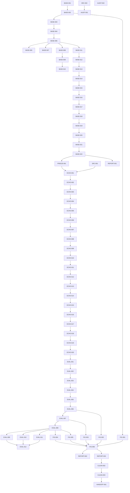

# ECHO Master Execution Plan

## 1. Document Control

| Field | Value |
|---|---| 
| Title | ECHO Master Execution Plan |
| Plan version | `ECHO-MEP-v2.4` |
| Status | `CONDITIONALLY APPROVED — BASE-HOODIE PHASE ONLY` |
| Creation time | `2026-07-13T18:30:45Z` |
| Last updated time | `2026-07-13T19:30:14Z` |
| Repository branch | `main` |
| Repository HEAD | `d8dbf131dc4cff3879636853cafa9371a0914d99` |
| Working-tree status | clean at verification start; this file is the only intended tracked edit from this pass |
| Authoritative source identifiers | Live ECHO method tab `t.iav4589yyeo7` (`روش پیشنهادی`), externally verified current revision `ALtnJHzzm4hFNZK8DdBeKreoGaZ2RSO7F5oymwXZTjamK8fUxsa71RdvAu-7KkfW25xxeNA3C-Ns0TIbs-kwgO8FwUg1U68nloS7CIA1sg`; historical repository export `ALtnJHyTLdhKaOnVqfvxB74eKtegK8Hrsx5l2yaYdk68tSHgf-QdYtM6nrsTZrwFDm3DbTUFkeWajyCFP0Eevns2d7r0_twwuuYjD4ZcMQ` for offline comparison only; HOODIE OCR bundle; topology authorization v2; PNG export authorization |
| Plan owner | Principal research-simulation architect / distributed-systems engineer / deep-RL specialist / scientific execution planner |
| Update policy | Append-only evidence log; refresh before and after every scoped run; never erase history; recalculate counts from task register after every edit |

## 2. Executive Verdict

Plan structural readiness: PASS. Base-HOODIE execution readiness: PASS. ECHO implementation readiness: BLOCKED — SOURCE LOCK AND BASE FREEZE REQUIRED. Overall approval: CONDITIONALLY APPROVED — BASE-HOODIE PHASE ONLY.

ECHO-MEP-v2.0 treated the historical export as live authority. ECHO-MEP-v2.1 fixed source hierarchy but could not complete live validation in this environment. ECHO-MEP-v2.2 preserved that limitation but left readiness semantics too coarse. ECHO-MEP-v2.3 separates base execution readiness from ECHO source-lock readiness, preserves external live verification, and blocks only the work that truly depends on an immutable source lock.

The base HOODIE phase may proceed now. ECHO implementation and authoritative evaluation remain blocked until the source-lock bundle exists and FREEZE-001 is complete.

## 3. Authority Hierarchy

1. Live ECHO method tab `t.iav4589yyeo7` (`روش پیشنهادی`) as externally verified live authority.
2. HOODIE paper PDF + OCR bundle for the frozen base simulator.
3. ECHO evaluation material only when consistent with the live method tab.
4. `research/ECHO_topology_authorization_v2.md` and `research/ECHO_png_export_authorization.md`.
5. Repository code and tests as evidence only, never as method authority.
6. Legacy artifacts and reports as lowest authority.

Repository export snapshot `research/ECHO_method_spec.md` is a historical offline aid only. It may support comparison after the live snapshot is locked, but it is not the implementation lock source.

## 4. Source Revision Register

| Source | Revision / identifier | Coverage | Status |
| --- | --- | --- | --- |
| Live ECHO method tab | Google Doc `17iqZWA0bF5unbyuVYnRiW1IUcr0Ctb2KFw1f5XE2poE`, tab `t.iav4589yyeo7`, title `روش پیشنهادی`, externally verified current revision `ALtnJHzzm4hFNZK8DdBeKreoGaZ2RSO7F5oymwXZTjamK8fUxsa71RdvAu-7KkfW25xxeNA3C-Ns0TIbs-kwgO8FwUg1U68nloS7CIA1sg` | Equations (1)–(67); Algorithm 1; Algorithm 2; arrivals; dispatch; queues; ERT; canonical mask; state; reward; masked Dueling Double-DQL | EXTERNALLY VERIFIED — LOCAL SOURCE SNAPSHOT STILL REQUIRED |
| Repository export snapshot | `research/ECHO_method_spec.md`, revision `ALtnJHyTLdhKaOnVqfvxB74eKtegK8Hrsx5l2yaYdk68tSHgf-QdYtM6nrsTZrwFDm3DbTUFkeWajyCFP0Eevns2d7r0_twwuuYjD4ZcMQ` | Offline comparison snapshot only | HISTORICAL / SECONDARY |
| HOODIE paper | Original PDF + OCR exports in `resources/papers/hoodie/ocr/*` | Base simulator, learning, queueing, baselines, experiments | VERIFIED |
| Topology authorization | `research/ECHO_topology_authorization_v2.md` | Five-cluster scalable topology and Figure 4 / 6(d) / 6(e) | VERIFIED |
| PNG export authorization | `research/ECHO_png_export_authorization.md` | Vector + 300-dpi export without CairoSVG dependency | VERIFIED |
| Evaluation specification | `research/ECHO_evaluation_spec.md` | Figures 4–8 panel matrix and held-out evaluation rules | VERIFIED |
| Source-lock paths | `research/authority/echo/live/ECHO_PROPOSED_METHOD.md`; `research/authority/echo/live/source_metadata.json`; `research/authority/echo/live/SHA256SUMS` | Future immutable snapshot bundle for the live ECHO tab | PLANNED |

## Required ECHO Source-Lock Handoff

1. Fetch exact document and tab with a trusted live Docs environment.
2. Record returned revision ID and retrieval metadata.
3. Export only authoritative tab content.
4. Normalize line endings and Unicode consistently.
5. Store snapshot at `research/authority/echo/live/ECHO_PROPOSED_METHOD.md`.
6. Compute SHA-256 and write `research/authority/echo/live/SHA256SUMS`.
7. Verify Equations (1)–(67), Algorithm 1, and Algorithm 2.
8. Write `research/authority/echo/live/source_metadata.json` with document ID, tab ID, tab title, revision ID, retrieval timestamp, retrieval method, normalized SHA-256, raw SHA-256 when available, equation range, algorithm presence, approver, and authority status.
9. Commit the source snapshot and metadata in the trusted environment.
10. Update `SRC-001` evidence in this plan.
11. Run the 69-row drift audit against the snapshot and the repository export.
12. Lock ECHO implementation to that revision; any later live revision change stops new ECHO work until reviewed and approved.

## 5. Non-Negotiable Reproduction Principles

- Reproduce HOODIE first; do not replace the paper with a cleaner simulator.
- Keep ECHO isolated; it may only extend the frozen physical simulator where the live method tab explicitly says so.
- Never let a test override the live method or HOODIE paper.
- Never use MPS; use CUDA when available, CPU otherwise.
- Never treat a smoke artifact, report, or placeholder figure as authoritative scientific evidence.
- Never run pilot or full evaluation before runtime, state, mask, and replay contracts are frozen and tested.
- Before any ECHO implementation task, fetch live tab revision first; if the live revision differs from the plan, stop and update the plan before coding.

## 6. Current Repository and Git State

- Branch: `main`.
- Local HEAD: `d747b0c1f9dc2c956b7272fa7b4e3b9da0d836d7`.
- `origin/main`: `d747b0c1f9dc2c956b7272fa7b4e3b9da0d836d7`.
- Worktree: clean.
- Plan file is the only file intentionally rewritten in this planning pass.
- Current repo evidence already includes `artifacts/smoke/echo_runtime/*`, `artifacts/smoke/echo_learner/*`, `artifacts/checkpoints/echo_smoke/*`, and triage artifacts under `artifacts/test_triage/*`.

## 7. Verified Current-State Audit

| Component | Current status | Evidence | Remaining gap | Planned task IDs |
| --- | --- | --- | --- | --- |
| Plan structure | PASS | This document now has 30 required sections plus the dedicated source-lock handoff section | None | PLAN-001 |
| Base-HOODIE execution | PASS | Phase 1 begins with READY `BASE-001`; later Phase 1 tasks are dependency-blocked until executed | Base simulator and learner work still needs implementation | BASE-001–FREEZE-001 |
| ECHO source-lock | BLOCKED | Live method was externally verified, but no immutable local snapshot exists in repo | Source-lock bundle and hash still absent | SRC-001 |
| Full ECHO execution | BLOCKED | FREEZE-001 is incomplete and ECHO depends on both FREEZE-001 and SRC-001 | No authoritative ECHO work may start yet | ECHO-001–ECHO-020 |
| Evaluation and figures | BLOCKED | Authoritative evaluation and figures require ECHO pilot outputs | No Figure 4–8 lineage yet | EVAL-001–HANDOFF-001 |

## 8. Confirmed Paper-to-Code Gaps

1. `src/evaluation/trace_protocol.py:51-77` still builds a single deterministic trace stream with round-robin source assignment, not the paper's independent Bernoulli per-EA arrivals and final drain behavior. Fix in `BASE-003`.
2. `src/environment/gym_adapter.py:71-228` still uses a single `_current_task` flow, not an explicit synchronized `step_slot(actions_by_agent)` engine. Fix in `BASE-005` and `BASE-006`.
3. `src/environment/gym_adapter.py:90, 339-438, 566-724` still keys outbound flow by `(source, destination)` in the live adapter, which is too permissive for the frozen base simulator. Fix in `BASE-008` and `BASE-010`.
4. `src/agents/paper_state_builder.py:11-75` still exposes a paper-state builder, but the authoritative ECHO equation-53 tensor and equation-54 candidate-ERT vector must be the live learner input. Fix in `BASE-014`, `ECHO-012`.
5. `src/training/training_loop.py:59-135` still needs a strict semi-Markov finalization audit so replay inserts exactly one transition per delivered reward with `gamma ** Delta_i`. Fix in `BASE-017`, `BASE-018`, `ECHO-014`, `ECHO-015`.
6. `src/evaluation/policy_registry.py:1-40` aliases `HOODIE` to `ADAPTIVE`, which is useful for compatibility but not a faithful HOODIE baseline freeze. Fix in `BASE-019` and `FREEZE-001`.
7. `scripts/run_figures_8_11_validation.py` and the legacy analysis bundles are historical evidence only; they are not authoritative Figure 4–8 outputs. Fix in `CLEAN-002`, `FIG-001`–`FIG-006`.

## Live ECHO Source Drift Audit

Source authority validation is externally verified at the live revision above, but no immutable local snapshot has been committed in this repository. Every row below remains UNRESOLVED until the source-lock handoff completes.

| Audit ID | Live item | Live scientific meaning | Repository-export equivalent | Existing task IDs | Comparison result | Difference description | Scientific consequence | Required plan correction | Verification evidence |
|---|---|---|---|---|---|---|---|---|---|
| `A-001` | Equation (1) | Live mathematical contract for Equation (1) | Repository export Equation (1) | SRC-001, ECHO-002–ECHO-020 | UNRESOLVED | Live authority not locally snapshotted | High | Lock arrivals, deadlines, actions, and dispatch semantics to live tab | External live verification only |
| `A-002` | Equation (2) | Live mathematical contract for Equation (2) | Repository export Equation (2) | SRC-001, ECHO-002–ECHO-020 | UNRESOLVED | Live authority not locally snapshotted | High | Lock arrivals, deadlines, actions, and dispatch semantics to live tab | External live verification only |
| `A-003` | Equation (3) | Live mathematical contract for Equation (3) | Repository export Equation (3) | SRC-001, ECHO-002–ECHO-020 | UNRESOLVED | Live authority not locally snapshotted | High | Lock arrivals, deadlines, actions, and dispatch semantics to live tab | External live verification only |
| `A-004` | Equation (4) | Live mathematical contract for Equation (4) | Repository export Equation (4) | SRC-001, ECHO-002–ECHO-020 | UNRESOLVED | Live authority not locally snapshotted | High | Lock arrivals, deadlines, actions, and dispatch semantics to live tab | External live verification only |
| `A-005` | Equation (5) | Live mathematical contract for Equation (5) | Repository export Equation (5) | SRC-001, ECHO-002–ECHO-020 | UNRESOLVED | Live authority not locally snapshotted | High | Lock arrivals, deadlines, actions, and dispatch semantics to live tab | External live verification only |
| `A-006` | Equation (6) | Live mathematical contract for Equation (6) | Repository export Equation (6) | SRC-001, ECHO-002–ECHO-020 | UNRESOLVED | Live authority not locally snapshotted | High | Lock arrivals, deadlines, actions, and dispatch semantics to live tab | External live verification only |
| `A-007` | Equation (7) | Live mathematical contract for Equation (7) | Repository export Equation (7) | SRC-001, ECHO-002–ECHO-020 | UNRESOLVED | Live authority not locally snapshotted | High | Lock arrivals, deadlines, actions, and dispatch semantics to live tab | External live verification only |
| `A-008` | Equation (8) | Live mathematical contract for Equation (8) | Repository export Equation (8) | SRC-001, ECHO-002–ECHO-020 | UNRESOLVED | Live authority not locally snapshotted | High | Lock arrivals, deadlines, actions, and dispatch semantics to live tab | External live verification only |
| `A-009` | Equation (9) | Live mathematical contract for Equation (9) | Repository export Equation (9) | SRC-001, ECHO-002–ECHO-020 | UNRESOLVED | Live authority not locally snapshotted | High | Lock queue, service, and transmission lifecycle semantics to live tab | External live verification only |
| `A-010` | Equation (10) | Live mathematical contract for Equation (10) | Repository export Equation (10) | SRC-001, ECHO-002–ECHO-020 | UNRESOLVED | Live authority not locally snapshotted | High | Lock queue, service, and transmission lifecycle semantics to live tab | External live verification only |
| `A-011` | Equation (11) | Live mathematical contract for Equation (11) | Repository export Equation (11) | SRC-001, ECHO-002–ECHO-020 | UNRESOLVED | Live authority not locally snapshotted | High | Lock queue, service, and transmission lifecycle semantics to live tab | External live verification only |
| `A-012` | Equation (12) | Live mathematical contract for Equation (12) | Repository export Equation (12) | SRC-001, ECHO-002–ECHO-020 | UNRESOLVED | Live authority not locally snapshotted | High | Lock queue, service, and transmission lifecycle semantics to live tab | External live verification only |
| `A-013` | Equation (13) | Live mathematical contract for Equation (13) | Repository export Equation (13) | SRC-001, ECHO-002–ECHO-020 | UNRESOLVED | Live authority not locally snapshotted | High | Lock queue, service, and transmission lifecycle semantics to live tab | External live verification only |
| `A-014` | Equation (14) | Live mathematical contract for Equation (14) | Repository export Equation (14) | SRC-001, ECHO-002–ECHO-020 | UNRESOLVED | Live authority not locally snapshotted | High | Lock queue, service, and transmission lifecycle semantics to live tab | External live verification only |
| `A-015` | Equation (15) | Live mathematical contract for Equation (15) | Repository export Equation (15) | SRC-001, ECHO-002–ECHO-020 | UNRESOLVED | Live authority not locally snapshotted | High | Lock queue, service, and transmission lifecycle semantics to live tab | External live verification only |
| `A-016` | Equation (16) | Live mathematical contract for Equation (16) | Repository export Equation (16) | SRC-001, ECHO-002–ECHO-020 | UNRESOLVED | Live authority not locally snapshotted | High | Lock queue, service, and transmission lifecycle semantics to live tab | External live verification only |
| `A-017` | Equation (17) | Live mathematical contract for Equation (17) | Repository export Equation (17) | SRC-001, ECHO-002–ECHO-020 | UNRESOLVED | Live authority not locally snapshotted | High | Lock destination workload and LSTM semantics to live tab | External live verification only |
| `A-018` | Equation (18) | Live mathematical contract for Equation (18) | Repository export Equation (18) | SRC-001, ECHO-002–ECHO-020 | UNRESOLVED | Live authority not locally snapshotted | High | Lock destination workload and LSTM semantics to live tab | External live verification only |
| `A-019` | Equation (19) | Live mathematical contract for Equation (19) | Repository export Equation (19) | SRC-001, ECHO-002–ECHO-020 | UNRESOLVED | Live authority not locally snapshotted | High | Lock destination workload and LSTM semantics to live tab | External live verification only |
| `A-020` | Equation (20) | Live mathematical contract for Equation (20) | Repository export Equation (20) | SRC-001, ECHO-002–ECHO-020 | UNRESOLVED | Live authority not locally snapshotted | High | Lock destination workload and LSTM semantics to live tab | External live verification only |
| `A-021` | Equation (21) | Live mathematical contract for Equation (21) | Repository export Equation (21) | SRC-001, ECHO-002–ECHO-020 | UNRESOLVED | Live authority not locally snapshotted | High | Lock destination workload and LSTM semantics to live tab | External live verification only |
| `A-022` | Equation (22) | Live mathematical contract for Equation (22) | Repository export Equation (22) | SRC-001, ECHO-002–ECHO-020 | UNRESOLVED | Live authority not locally snapshotted | High | Lock destination workload and LSTM semantics to live tab | External live verification only |
| `A-023` | Equation (23) | Live mathematical contract for Equation (23) | Repository export Equation (23) | SRC-001, ECHO-002–ECHO-020 | UNRESOLVED | Live authority not locally snapshotted | High | Lock destination workload and LSTM semantics to live tab | External live verification only |
| `A-024` | Equation (24) | Live mathematical contract for Equation (24) | Repository export Equation (24) | SRC-001, ECHO-002–ECHO-020 | UNRESOLVED | Live authority not locally snapshotted | High | Lock destination workload and LSTM semantics to live tab | External live verification only |
| `A-025` | Equation (25) | Live mathematical contract for Equation (25) | Repository export Equation (25) | SRC-001, ECHO-002–ECHO-020 | UNRESOLVED | Live authority not locally snapshotted | High | Lock destination workload and LSTM semantics to live tab | External live verification only |
| `A-026` | Equation (26) | Live mathematical contract for Equation (26) | Repository export Equation (26) | SRC-001, ECHO-002–ECHO-020 | UNRESOLVED | Live authority not locally snapshotted | High | Lock destination workload and LSTM semantics to live tab | External live verification only |
| `A-027` | Equation (27) | Live mathematical contract for Equation (27) | Repository export Equation (27) | SRC-001, ECHO-002–ECHO-020 | UNRESOLVED | Live authority not locally snapshotted | High | Lock destination workload and LSTM semantics to live tab | External live verification only |
| `A-028` | Equation (28) | Live mathematical contract for Equation (28) | Repository export Equation (28) | SRC-001, ECHO-002–ECHO-020 | UNRESOLVED | Live authority not locally snapshotted | High | Lock destination workload and LSTM semantics to live tab | External live verification only |
| `A-029` | Equation (29) | Live mathematical contract for Equation (29) | Repository export Equation (29) | SRC-001, ECHO-002–ECHO-020 | UNRESOLVED | Live authority not locally snapshotted | High | Lock ERT scheduling, fallback, and tie-break semantics to live tab | External live verification only |
| `A-030` | Equation (30) | Live mathematical contract for Equation (30) | Repository export Equation (30) | SRC-001, ECHO-002–ECHO-020 | UNRESOLVED | Live authority not locally snapshotted | High | Lock ERT scheduling, fallback, and tie-break semantics to live tab | External live verification only |
| `A-031` | Equation (31) | Live mathematical contract for Equation (31) | Repository export Equation (31) | SRC-001, ECHO-002–ECHO-020 | UNRESOLVED | Live authority not locally snapshotted | High | Lock ERT scheduling, fallback, and tie-break semantics to live tab | External live verification only |
| `A-032` | Equation (32) | Live mathematical contract for Equation (32) | Repository export Equation (32) | SRC-001, ECHO-002–ECHO-020 | UNRESOLVED | Live authority not locally snapshotted | High | Lock ERT scheduling, fallback, and tie-break semantics to live tab | External live verification only |
| `A-033` | Equation (33) | Live mathematical contract for Equation (33) | Repository export Equation (33) | SRC-001, ECHO-002–ECHO-020 | UNRESOLVED | Live authority not locally snapshotted | High | Lock ERT scheduling, fallback, and tie-break semantics to live tab | External live verification only |
| `A-034` | Equation (34) | Live mathematical contract for Equation (34) | Repository export Equation (34) | SRC-001, ECHO-002–ECHO-020 | UNRESOLVED | Live authority not locally snapshotted | High | Lock ERT scheduling, fallback, and tie-break semantics to live tab | External live verification only |
| `A-035` | Equation (35) | Live mathematical contract for Equation (35) | Repository export Equation (35) | SRC-001, ECHO-002–ECHO-020 | UNRESOLVED | Live authority not locally snapshotted | High | Lock ERT scheduling, fallback, and tie-break semantics to live tab | External live verification only |
| `A-036` | Equation (36) | Live mathematical contract for Equation (36) | Repository export Equation (36) | SRC-001, ECHO-002–ECHO-020 | UNRESOLVED | Live authority not locally snapshotted | High | Lock ERT scheduling, fallback, and tie-break semantics to live tab | External live verification only |
| `A-037` | Equation (37) | Live mathematical contract for Equation (37) | Repository export Equation (37) | SRC-001, ECHO-002–ECHO-020 | UNRESOLVED | Live authority not locally snapshotted | High | Lock ERT scheduling, fallback, and tie-break semantics to live tab | External live verification only |
| `A-038` | Equation (38) | Live mathematical contract for Equation (38) | Repository export Equation (38) | SRC-001, ECHO-002–ECHO-020 | UNRESOLVED | Live authority not locally snapshotted | High | Lock ERT scheduling, fallback, and tie-break semantics to live tab | External live verification only |
| `A-039` | Equation (39) | Live mathematical contract for Equation (39) | Repository export Equation (39) | SRC-001, ECHO-002–ECHO-020 | UNRESOLVED | Live authority not locally snapshotted | High | Lock ERT scheduling, fallback, and tie-break semantics to live tab | External live verification only |
| `A-040` | Equation (40) | Live mathematical contract for Equation (40) | Repository export Equation (40) | SRC-001, ECHO-002–ECHO-020 | UNRESOLVED | Live authority not locally snapshotted | High | Lock ERT scheduling, fallback, and tie-break semantics to live tab | External live verification only |
| `A-041` | Equation (41) | Live mathematical contract for Equation (41) | Repository export Equation (41) | SRC-001, ECHO-002–ECHO-020 | UNRESOLVED | Live authority not locally snapshotted | High | Lock canonical actions, mask, and pending-record semantics to live tab | External live verification only |
| `A-042` | Equation (42) | Live mathematical contract for Equation (42) | Repository export Equation (42) | SRC-001, ECHO-002–ECHO-020 | UNRESOLVED | Live authority not locally snapshotted | High | Lock canonical actions, mask, and pending-record semantics to live tab | External live verification only |
| `A-043` | Equation (43) | Live mathematical contract for Equation (43) | Repository export Equation (43) | SRC-001, ECHO-002–ECHO-020 | UNRESOLVED | Live authority not locally snapshotted | High | Lock canonical actions, mask, and pending-record semantics to live tab | External live verification only |
| `A-044` | Equation (44) | Live mathematical contract for Equation (44) | Repository export Equation (44) | SRC-001, ECHO-002–ECHO-020 | UNRESOLVED | Live authority not locally snapshotted | High | Lock canonical actions, mask, and pending-record semantics to live tab | External live verification only |
| `A-045` | Equation (45) | Live mathematical contract for Equation (45) | Repository export Equation (45) | SRC-001, ECHO-002–ECHO-020 | UNRESOLVED | Live authority not locally snapshotted | High | Lock canonical actions, mask, and pending-record semantics to live tab | External live verification only |
| `A-046` | Equation (46) | Live mathematical contract for Equation (46) | Repository export Equation (46) | SRC-001, ECHO-002–ECHO-020 | UNRESOLVED | Live authority not locally snapshotted | High | Lock canonical actions, mask, and pending-record semantics to live tab | External live verification only |
| `A-047` | Equation (47) | Live mathematical contract for Equation (47) | Repository export Equation (47) | SRC-001, ECHO-002–ECHO-020 | UNRESOLVED | Live authority not locally snapshotted | High | Lock canonical actions, mask, and pending-record semantics to live tab | External live verification only |
| `A-048` | Equation (48) | Live mathematical contract for Equation (48) | Repository export Equation (48) | SRC-001, ECHO-002–ECHO-020 | UNRESOLVED | Live authority not locally snapshotted | High | Lock canonical actions, mask, and pending-record semantics to live tab | External live verification only |
| `A-049` | Equation (49) | Live mathematical contract for Equation (49) | Repository export Equation (49) | SRC-001, ECHO-002–ECHO-020 | UNRESOLVED | Live authority not locally snapshotted | High | Lock canonical actions, mask, and pending-record semantics to live tab | External live verification only |
| `A-050` | Equation (50) | Live mathematical contract for Equation (50) | Repository export Equation (50) | SRC-001, ECHO-002–ECHO-020 | UNRESOLVED | Live authority not locally snapshotted | High | Lock canonical actions, mask, and pending-record semantics to live tab | External live verification only |
| `A-051` | Equation (51) | Live mathematical contract for Equation (51) | Repository export Equation (51) | SRC-001, ECHO-002–ECHO-020 | UNRESOLVED | Live authority not locally snapshotted | High | Lock state, reward, semi-Markov transition, and masked target semantics to live tab | External live verification only |
| `A-052` | Equation (52) | Live mathematical contract for Equation (52) | Repository export Equation (52) | SRC-001, ECHO-002–ECHO-020 | UNRESOLVED | Live authority not locally snapshotted | High | Lock state, reward, semi-Markov transition, and masked target semantics to live tab | External live verification only |
| `A-053` | Equation (53) | Live mathematical contract for Equation (53) | Repository export Equation (53) | SRC-001, ECHO-002–ECHO-020 | UNRESOLVED | Live authority not locally snapshotted | High | Lock state, reward, semi-Markov transition, and masked target semantics to live tab | External live verification only |
| `A-054` | Equation (54) | Live mathematical contract for Equation (54) | Repository export Equation (54) | SRC-001, ECHO-002–ECHO-020 | UNRESOLVED | Live authority not locally snapshotted | High | Lock state, reward, semi-Markov transition, and masked target semantics to live tab | External live verification only |
| `A-055` | Equation (55) | Live mathematical contract for Equation (55) | Repository export Equation (55) | SRC-001, ECHO-002–ECHO-020 | UNRESOLVED | Live authority not locally snapshotted | High | Lock state, reward, semi-Markov transition, and masked target semantics to live tab | External live verification only |
| `A-056` | Equation (56) | Live mathematical contract for Equation (56) | Repository export Equation (56) | SRC-001, ECHO-002–ECHO-020 | UNRESOLVED | Live authority not locally snapshotted | High | Lock state, reward, semi-Markov transition, and masked target semantics to live tab | External live verification only |
| `A-057` | Equation (57) | Live mathematical contract for Equation (57) | Repository export Equation (57) | SRC-001, ECHO-002–ECHO-020 | UNRESOLVED | Live authority not locally snapshotted | High | Lock state, reward, semi-Markov transition, and masked target semantics to live tab | External live verification only |
| `A-058` | Equation (58) | Live mathematical contract for Equation (58) | Repository export Equation (58) | SRC-001, ECHO-002–ECHO-020 | UNRESOLVED | Live authority not locally snapshotted | High | Lock state, reward, semi-Markov transition, and masked target semantics to live tab | External live verification only |
| `A-059` | Equation (59) | Live mathematical contract for Equation (59) | Repository export Equation (59) | SRC-001, ECHO-002–ECHO-020 | UNRESOLVED | Live authority not locally snapshotted | High | Lock state, reward, semi-Markov transition, and masked target semantics to live tab | External live verification only |
| `A-060` | Equation (60) | Live mathematical contract for Equation (60) | Repository export Equation (60) | SRC-001, ECHO-002–ECHO-020 | UNRESOLVED | Live authority not locally snapshotted | High | Lock state, reward, semi-Markov transition, and masked target semantics to live tab | External live verification only |
| `A-061` | Equation (61) | Live mathematical contract for Equation (61) | Repository export Equation (61) | SRC-001, ECHO-002–ECHO-020 | UNRESOLVED | Live authority not locally snapshotted | High | Lock state, reward, semi-Markov transition, and masked target semantics to live tab | External live verification only |
| `A-062` | Equation (62) | Live mathematical contract for Equation (62) | Repository export Equation (62) | SRC-001, ECHO-002–ECHO-020 | UNRESOLVED | Live authority not locally snapshotted | High | Lock state, reward, semi-Markov transition, and masked target semantics to live tab | External live verification only |
| `A-063` | Equation (63) | Live mathematical contract for Equation (63) | Repository export Equation (63) | SRC-001, ECHO-002–ECHO-020 | UNRESOLVED | Live authority not locally snapshotted | High | Lock state, reward, semi-Markov transition, and masked target semantics to live tab | External live verification only |
| `A-064` | Equation (64) | Live mathematical contract for Equation (64) | Repository export Equation (64) | SRC-001, ECHO-002–ECHO-020 | UNRESOLVED | Live authority not locally snapshotted | High | Lock state, reward, semi-Markov transition, and masked target semantics to live tab | External live verification only |
| `A-065` | Equation (65) | Live mathematical contract for Equation (65) | Repository export Equation (65) | SRC-001, ECHO-002–ECHO-020 | UNRESOLVED | Live authority not locally snapshotted | High | Lock state, reward, semi-Markov transition, and masked target semantics to live tab | External live verification only |
| `A-066` | Equation (66) | Live mathematical contract for Equation (66) | Repository export Equation (66) | SRC-001, ECHO-002–ECHO-020 | UNRESOLVED | Live authority not locally snapshotted | High | Lock state, reward, semi-Markov transition, and masked target semantics to live tab | External live verification only |
| `A-067` | Equation (67) | Live mathematical contract for Equation (67) | Repository export Equation (67) | SRC-001, ECHO-002–ECHO-020 | UNRESOLVED | Live authority not locally snapshotted | High | Lock state, reward, semi-Markov transition, and masked target semantics to live tab | External live verification only |
| `A-068` | Algorithm 1 | Live ECHO training algorithm | Exported training algorithm snapshot | ECHO-018–ECHO-020, EVAL-001–EVAL-012 | UNRESOLVED | Live algorithm not locally snapshotted | High | Lock training slot order and replay-finalization order to live tab | External live verification only |
| `A-069` | Algorithm 2 | Live ECHO inference algorithm | Exported inference algorithm snapshot | ECHO-018–ECHO-020, EVAL-001–EVAL-012 | UNRESOLVED | Live algorithm not locally snapshotted | High | Lock inference slot order and masked argmax semantics to live tab | External live verification only |

## 9. Target Shared Physical Architecture

### Shared physical simulator
- Tasks, slots, queues, topology, trace ingestion, lifecycle events, raw metrics, and runtime state snapshots.
- Must be method-neutral and reusable by HOODIE, ECHO, and baseline adapters.

### HOODIE method adapter
- Exact base-paper state, FIFO source scheduling, original reward / replay timing, distributed learners, and the original LSTM behavior.

### ECHO method adapter
- Live equations (1)–(67), ERT scheduling, candidate ERT vector, canonical mask, equation-53 state, equation-58 reward, equation-59 transitions, equation-65 target.

### Baseline adapters
- RO, FLC, VO, HO, BCO, MLEO.

### Trace bank and paired evaluation
- Generated once, hashed, immutable, and reused across methods.

### Authoritative experiment / figure pipeline
- Raw task-level outputs → per-episode aggregates → per-seed confidence intervals → panel CSVs → SVG / PDF → 300-dpi PNG → manifests / lineage.

## 10. Exact Base HOODIE Slot Workflow

Base HOODIE uses the HOODIE paper’s slot semantics only. No ECHO semi-Markov semantics, no ECHO deadline mask, and no ECHO predicted-risk indicator belong here.

### Shared mechanism table

| Mechanism | Shared physical simulator | HOODIE | ECHO |
| --- | --- | --- | --- |
| task resolution | yes | paper lifecycle | ECHO lifecycle |
| reward calculation | yes | paper-delayed reward | Equation (58) reward only after ECHO resolution |
| replay insertion | yes | paper replay timing | Equation (59) next-decision replay |
| next-state definition | yes | paper next decision state | ECHO state in Equation (53) and Equation (59) next-decision state |
| discount exponent | yes | paper discount convention | `gamma ** Delta_i` in Equation (65) only |
| physical mask | yes | resource availability only | canonical action mask in Equations (42)–(46) |
| deadline mask | yes | paper action feasibility | ECHO deadline-valid action mask and fallback |
| queue scheduling | yes | queue order in paper | ERT-based source scheduling |

### Base HOODIE slot contract

1. Observe arrivals and frozen queue/load snapshot.
2. Advance active local and transmission service without preemption.
3. Resolve completions, then admit destination-bound tasks on the next slot boundary.
4. Advance destination service with shared capacity.
5. Record reward only after physical resolution.
6. Finalize replay only at the next paper-valid learner decision point or terminal flush.
7. Build the next paper observation and action selection input.

### Hand-calculated timelines

| Case | Slot t | Slot t+1 | Slot t+2 | Notes |
| --- | --- | --- | --- | --- |
| same-slot arrival | arrives | admitted | serviced later | no preemption |
| local execution | queued | active | resolved | local queue first |
| queued local execution | waiting | active | resolved | waits behind current service |
| outbound waiting | queued | transmitting | admitted destination-side | one outbound queue per source |
| transmission completion | transmitting ends | destination admission | destination queue active | admission happens next slot |
| destination processing | active destination queue | still active or resolved | final outcome | shared capacity |
| deadline expiration | waiting task expires | dropped | ledger updated | no late recovery |
| final ten drain slots | arrivals disabled | drain only | drain only | trace has no new arrivals |

### Contract notes

- If the HOODIE paper is ambiguous, add a decision-register item.
- The exact slot contract becomes implementation binding only after `BASE-006` completes.
- `BASE-005` implements the slot engine; `BASE-006` locks the slot-order contract that the engine must obey.

## 11. Exact Base HOODIE Training Workflow

### Base training contract

- One autonomous learner per EA.
- One online model, one target model, one replay buffer, one epsilon schedule, one local training state per EA.
- Decision state is captured before action selection and reused when the delayed outcome is delivered.
- Replay finalizes only when the paper-valid next decision point or terminal flush arrives.
- Action selection, reward handling, and replay use the HOODIE paper semantics only.
- No ECHO semi-Markov transition, no Equation (59) next-source-decision semantics, and no `gamma ** Delta_i` in base HOODIE.

### Base / ECHO separation

| Mechanism | Shared physical simulator | HOODIE | ECHO |
| --- | --- | --- | --- |
| task resolution | yes | paper lifecycle | ECHO lifecycle |
| reward calculation | yes | paper-delayed reward | Equation (58) only |
| replay insertion | yes | paper replay timing | Equation (59) semi-Markov replay |
| next-state definition | yes | paper next decision state | Equation (59) next-decision state |
| discount exponent | yes | paper discount | `gamma ** Delta_i` only |
| physical mask | yes | resource availability | canonical mask |
| deadline mask | yes | paper action feasibility | deadline-valid action mask |
| queue scheduling | yes | queue order in paper | ERT scheduling |

### Timeline checks

- same-slot arrival: arrival observed before slot service advances.
- local execution: task moves from wait to active, then resolves.
- queued local execution: task remains waiting until active resource frees.
- outbound waiting: source queue waits behind earlier outbound task.
- transmission completion: completion resolves at end of transmission slot, destination admission happens next slot.
- destination processing: destination queue uses shared capacity.
- deadline expiration: waiting task drops when deadline passes.
- final ten drain slots: arrivals disabled, only drain and finalize.

### Decision register items

- If the HOODIE paper leaves a timing or sign convention unclear, add a decision-register item before implementation.
- Do not silently import ECHO semantics into HOODIE.
- The HOODIE workflow becomes exact only after `BASE-006` and `BASE-018` are complete.

## 12. Base-HOODIE Validation and Freeze Strategy

1. Freeze Table-4 configuration and 20-EA topology.
2. Verify trace generation, slot order, queue ordering, and delayed reward handling.
3. Validate the HOODIE learner, baselines, and load forecast against the paper evidence registry.
4. Freeze the faithful HOODIE simulator and baseline as `FREEZE-001`.

`SRC-002` is the paper evidence registry. It is a scientific prerequisite, not an ECHO source-lock gate. It is marked `VERIFIED COMPLETE` so `BASE-001` can remain READY.

## 13. Exact ECHO Delta over Frozen HOODIE

- ECHO layers deadline-aware route evaluation, canonical masking, ERT scheduling, and the live equations (1)–(67) over the frozen base simulator.
- ECHO uses the source-lock bundle only after the bundle is committed and `SRC-001` closes.
- ECHO-NoLSTM is a one-factor ablation; it removes only the load-estimation recovery path.
- The live source revision is evidence, not completion. The committed source-lock bundle is the completion condition.

## 14. ECHO Equations (1)–(67) Traceability Matrix

| Equation group | Meaning | Planned task IDs | Notes |
| --- | --- | --- | --- |
| (1)–(2) | arrivals and deadlines | ECHO-002 | live method only |
| (3)–(8) | direct action and dispatch | ECHO-002 | live method only |
| (9)–(11) | ECHO local estimation | ECHO-003 | shared infrastructure only — not equation semantics for HOODIE |
| (12)–(16) | ECHO outbound estimation | ECHO-004 | shared infrastructure only — not equation semantics for HOODIE |
| (17)–(25) | destination model | ECHO-005 | shared infrastructure only — not equation semantics for HOODIE |
| (26)–(28) | load history and LSTM | ECHO-006 | live method only |
| (29)–(32) | local and transfer ERT | ECHO-007 | live method only |
| (33)–(40) | ERT scheduling | ECHO-008 | live method only |
| (41) | canonical N+2 action set | ECHO-009 | live method only |
| (42)–(46) | deadline-valid actions and masks | ECHO-010 | live method only |
| (47)–(50) | direct decision and pending records | ECHO-011 | live method only |
| (51)–(54) | normalized state and candidate ERT vector | ECHO-012 | live method only |
| (55)–(60) | ECHO-only reward and semi-Markov behavior | ECHO-013, ECHO-014 | live method only |
| (61)–(67) | ECHO-only masked Dueling Double-DQL behavior | ECHO-015 | live method only |

## 15. Evaluation and Figure Traceability Matrix

| Figure / panel | Metric | Independent variable | Exact values | Timeout | Methods | Training dependency | Held-out eval dependency | Trace pairing | Confidence interval | Raw data | Seed CSV | Panel CSV | Vector output | PNG | Manifest | Lineage |
| --- | --- | --- | --- | --- | --- | --- | --- | --- | --- | --- | --- | --- | --- | --- | --- | --- |
| Figure 4 | topology illustration | topology | 20 EA | n/a | topology only | BASE-002 | BASE-002 | n/a | n/a | topology snapshot | n/a | panel CSV | SVG/PDF | PNG | manifest | lineage |
| Figure 5(a) | avg reward | learning rate | eval sweep values | sweep timeout | ECHO | EVAL-006 | EVAL-006 | paired traces | 95% CI | raw sweep outputs | seed CSV | panel CSV | SVG/PDF | PNG | manifest | lineage |
| Figure 5(b) | avg reward | gamma | eval sweep values | sweep timeout | ECHO | EVAL-006 | EVAL-006 | paired traces | 95% CI | raw sweep outputs | seed CSV | panel CSV | SVG/PDF | PNG | manifest | lineage |
| Figure 6(a) | avg reward vs P | P | eval spec values | eval timeout | ECHO | EVAL-007 | EVAL-008 | paired traces | 95% CI | raw task logs | seed CSV | panel CSV | SVG/PDF | PNG | manifest | lineage |
| Figure 6(b) | action counts | P | eval spec values | eval timeout | ECHO | EVAL-007 | EVAL-008 | paired traces | 95% CI | raw task logs | seed CSV | panel CSV | SVG/PDF | PNG | manifest | lineage |
| Figure 6(c) | avg reward vs capacity | EA capacity | eval spec values | eval timeout | ECHO | EVAL-007 | EVAL-008 | paired traces | 95% CI | raw task logs | seed CSV | panel CSV | SVG/PDF | PNG | manifest | lineage |
| Figure 6(d) | avg reward vs EA count | traffic profile | moderate/heavy/extreme | eval timeout | ECHO | EVAL-007 | EVAL-008 | paired traces | 95% CI | raw task logs | seed CSV | panel CSV | SVG/PDF | PNG | manifest | lineage |
| Figure 6(e) | avg reward vs EA count | data-rate profile | balanced/horizontal-centric/vertical-centric | eval timeout | ECHO | EVAL-007 | EVAL-008 | paired traces | 95% CI | raw task logs | seed CSV | panel CSV | SVG/PDF | PNG | manifest | lineage |
| Figure 7(a) | delay / drop | traffic | exact eval values | 1s | ECHO vs HOODIE / RO / FLC / VO / HO / BCO / MLEO | EVAL-007 | EVAL-008 | paired traces | 95% CI | raw comparison outputs | seed CSV | panel CSV | SVG/PDF | PNG | manifest | lineage |
| Figure 7(b) | delay / drop | CPU | exact eval values | 1s | same | EVAL-007 | EVAL-008 | paired traces | 95% CI | raw comparison outputs | seed CSV | panel CSV | SVG/PDF | PNG | manifest | lineage |
| Figure 7(c) | delay / drop | timeout | exact eval values | 1s | same | EVAL-007 | EVAL-008 | paired traces | 95% CI | raw comparison outputs | seed CSV | panel CSV | SVG/PDF | PNG | manifest | lineage |
| Figure 7(d) | delay / drop | traffic | exact eval values | 1s | same | EVAL-007 | EVAL-008 | paired traces | 95% CI | raw comparison outputs | seed CSV | panel CSV | SVG/PDF | PNG | manifest | lineage |
| Figure 7(e) | delay / drop | CPU | exact eval values | 1s | same | EVAL-007 | EVAL-008 | paired traces | 95% CI | raw comparison outputs | seed CSV | panel CSV | SVG/PDF | PNG | manifest | lineage |
| Figure 7(f) | delay / drop | timeout | exact eval values | 1s | same | EVAL-007 | EVAL-008 | paired traces | 95% CI | raw comparison outputs | seed CSV | panel CSV | SVG/PDF | PNG | manifest | lineage |
| Figure 8 | average delay | training episodes | 0–3000; `N=20`; `P=0.3`; `timeout=1s`; selected learning rate and gamma | 1s | ECHO vs ECHO-NoLSTM | EVAL-007 | EVAL-008 | paired traces | seed-level convergence and stability | raw ablation outputs | seed CSV | panel CSV | SVG/PDF | PNG | manifest | lineage |

Preserve the negative-delay convention and pooled drop-ratio calculation.

## 16. Cleanup and Deprecation Matrix

- Canonical execution code: shared simulator, frozen HOODIE baseline, ECHO adapter, baseline adapters, evaluation runner, and figure pipeline.
- Reusable physical components: tasks, queues, slot engine, topology, trace ingestion, lifecycle events, and raw metrics.
- HOODIE-only components: base-paper state, original reward / replay timing, distributed learners, and the original LSTM behavior.
- ECHO-only components: ERT scheduling, canonical mask, pending reward / decision ledgers, and semi-Markov replay.
- Baseline-only components: RO, FLC, VO, HO, BCO, MLEO policies and their evaluation wrappers.
- Duplicate campaign runners: retain only the authoritative paired-evaluation path after freeze; archive legacy runners as historical evidence.
- Placeholder / dummy models: mark as superseded once a real path replaces them.
- Obsolete reports: keep as historical evidence, but never cite them as final ECHO claims.
- Legacy Figures 8–11: superseded by authoritative Figures 4–8 and the lineage-backed raw outputs.
- Smoke checkpoints from non-authoritative paths: keep only if needed for forensic comparison, otherwise archive after replacement gates pass.
- Redundant feature / readiness artifacts: keep until replacement gates pass, then archive with a clear lineage note.
- Stale configs and summaries: replace with authoritative run manifests and report files.

## 17. Master Task Register

## Phase 0 — Source, audit, and plan reset

| Task ID | Status | Title | Dependency task IDs | Authority/evidence inputs |
| --- | --- | --- | --- | --- |
| `SRC-001` | `BLOCKED — EXTERNAL SOURCE ACCESS` | Fetch and register the current live ECHO method tab and revision | NONE | Trusted live Docs access; committed source-lock bundle required for completion |
| `SRC-002` | `VERIFIED COMPLETE` | Build a HOODIE paper evidence registry by section, equation, table, and figure | NONE | HOODIE PDF, OCR bundle, figure/table extraction, paper sections and tables |
| `AUDIT-001` | `VERIFIED COMPLETE` | Produce the current code-path and dependency inventory | NONE | src/, tests/, repository graph evidence |
| `AUDIT-002` | `PARTIALLY IMPLEMENTED` | Reconcile old completion claims against real live paths | NONE | handoff reports, triage reports, artifact index |
| `PLAN-001` | `VERIFIED COMPLETE` | Correct version, HEAD, task totals, statuses, dependencies, critical path, and dashboard | NONE | prior plan history, git state evidence |
| `CLEAN-001` | `VERIFIED COMPLETE` | Classify existing artifacts as authoritative, historical, superseded, or removable later | NONE | artifacts/* and research/* inventories |

## Phase 1 — Faithful base HOODIE simulator

| Task ID | Status | Title | Dependency task IDs | Authority/evidence inputs |
| --- | --- | --- | --- | --- |
| `BASE-001` | `READY` | Freeze one canonical Table-4 configuration | PLAN-001, CLEAN-001 | HOODIE paper Table 4, OCR bundle, topology authorization v2 |
| `BASE-002` | `BLOCKED BY DEPENDENCY` | Freeze the exact approved 20-EA topology and scalable topology rules | BASE-001 | HOODIE topology evidence, Figure 4, topology authorization v2 |
| `BASE-003` | `BLOCKED BY DEPENDENCY` | Implement per-EA Bernoulli trace generation and 100+10 decision/drain behavior | BASE-002 | trace protocol, paper arrival / drain evidence |
| `BASE-004` | `BLOCKED BY DEPENDENCY` | Make trace objects immutable and directly consumable by all methods | BASE-003 | trace-bank code, training / evaluation trace constructors |
| `BASE-005` | `BLOCKED BY DEPENDENCY` | Implement the synchronized multi-agent slot engine | BASE-006 | slot engine, environment step path, lifecycle contract |
| `BASE-006` | `BLOCKED BY DEPENDENCY` | Formalize and test base HOODIE slot order before engine execution | BASE-004 | hand-calculated timelines, slot-order contract, paper queue semantics |
| `BASE-007` | `BLOCKED BY DEPENDENCY` | Correct private FIFO queue and active private service separation | BASE-006 | private queue code, lifecycle tests |
| `BASE-008` | `BLOCKED BY DEPENDENCY` | Correct one outbound FIFO queue and transmission resource per source EA | BASE-006 | outbound queue code, source transmission evidence |
| `BASE-009` | `BLOCKED BY DEPENDENCY` | Preserve the selected destination inside every outbound task | BASE-008 | task record schema, route metadata |
| `BASE-010` | `BLOCKED BY DEPENDENCY` | Correct transmission completion and next-slot destination admission | BASE-009 | slot boundary admission code, lifecycle tests |
| `BASE-011` | `BLOCKED BY DEPENDENCY` | Correct source-indexed destination queues | BASE-006 | public queue code, destination queue evidence |
| `BASE-012` | `BLOCKED BY DEPENDENCY` | Implement equal public-CPU sharing among active source queues | BASE-011 | public CPU scheduling code, queue-share tests |
| `BASE-013` | `BLOCKED BY DEPENDENCY` | Implement the exact destination-specific base action space | BASE-012 | action space code, paper action semantics |
| `BASE-014` | `BLOCKED BY DEPENDENCY` | Implement the exact HOODIE state and load-history construction | BASE-013 | state builder, load history schema |
| `BASE-015` | `BLOCKED BY DEPENDENCY` | Implement and train the real HOODIE LSTM/load forecast | BASE-014 | LSTM module, load forecast evidence |
| `BASE-016` | `BLOCKED BY DEPENDENCY` | Implement one independent HOODIE learner per EA | BASE-015 | learner manager, per-EA model state |
| `BASE-017` | `BLOCKED BY DEPENDENCY` | Implement original delayed reward and replay semantics | BASE-016 | training loop, replay insertion timing |
| `BASE-018` | `BLOCKED BY DEPENDENCY` | Implement paper-correct Dueling Double-DQN, epsilon schedule, sign convention, and target copying | BASE-017 | double DQN code, epsilon schedule, target copy |
| `BASE-019` | `BLOCKED BY DEPENDENCY` | Verify RO/FLC/VO/HO/BCO/MLEO against the same physical simulator | BASE-018 | baseline adapters, shared simulator |
| `BASE-020` | `BLOCKED BY DEPENDENCY` | Build deterministic unit and integration tests for all base mechanics | BASE-019 | unit tests, integration tests |
| `BASE-021` | `BLOCKED BY DEPENDENCY` | Run a bounded base-HOODIE runtime and learner smoke | BASE-020 | runtime smoke harness, learner smoke harness |
| `BASE-022` | `BLOCKED BY DEPENDENCY` | Reproduce the base paper experiment organization and trend-level evidence | BASE-021 | base experiment runner, paper trend evidence |
| `FREEZE-001` | `BLOCKED BY DEPENDENCY` | Freeze and version the validated HOODIE physical simulator and HOODIE baseline | BASE-022 | validated simulator artifact, freeze manifest |

## Phase 2 — ECHO implementation on frozen base

| Task ID | Status | Title | Dependency task IDs | Authority/evidence inputs |
| --- | --- | --- | --- | --- |
| `ECHO-001` | `BLOCKED BY DEPENDENCY` | Add explicit ECHO method isolation without changing frozen HOODIE semantics | FREEZE-001, SRC-001 | live ECHO snapshot, frozen base simulator, ECHO adapter |
| `ECHO-002` | `BLOCKED BY DEPENDENCY` | Implement live Equations (1)–(8), task/deadline/action/dispatch lifecycle | ECHO-001 | live ECHO equations (1)–(8), task lifecycle code |
| `ECHO-003` | `BLOCKED BY DEPENDENCY` | Implement local completion estimates from Equations (9)–(11) | ECHO-002 | live ECHO equations (9)–(11), local estimator code |
| `ECHO-004` | `BLOCKED BY DEPENDENCY` | Implement outbound completion estimates from Equations (12)–(16) | ECHO-003 | live ECHO equations (12)–(16), outbound estimator code |
| `ECHO-005` | `BLOCKED BY DEPENDENCY` | Implement destination workload/capacity estimates from Equations (17)–(25) | ECHO-004 | live ECHO equations (17)–(25), destination workload model |
| `ECHO-006` | `BLOCKED BY DEPENDENCY` | Implement load history and LSTM integration from Equations (26)–(28) | ECHO-005 | live ECHO equations (26)–(28), LSTM history inputs |
| `ECHO-007` | `BLOCKED BY DEPENDENCY` | Implement local and transfer ERT from Equations (29)–(32) | ECHO-006 | live ECHO equations (29)–(32), ERT calculator |
| `ECHO-008` | `BLOCKED BY DEPENDENCY` | Implement iterative ERT source-queue scheduling from Equations (33)–(40) | ECHO-007 | live ECHO equations (33)–(40), source scheduling logic |
| `ECHO-009` | `BLOCKED BY DEPENDENCY` | Implement the canonical action set from Equation (41) | ECHO-008 | live ECHO equation (41), action-set module |
| `ECHO-010` | `BLOCKED BY DEPENDENCY` | Implement valid actions, lateness fallback, and mask from Equations (42)–(46) | ECHO-009 | live ECHO equations (42)–(46), mask logic |
| `ECHO-011` | `BLOCKED BY DEPENDENCY` | Implement direct decision, admission metadata, and pending records from Equations (47)–(50) | ECHO-010 | live ECHO equations (47)–(50), pending-record store |
| `ECHO-012` | `BLOCKED BY DEPENDENCY` | Implement fixed normalized state and candidate ERT vector from Equations (51)–(54) | ECHO-011 | live ECHO equations (51)–(54), state encoder |
| `ECHO-013` | `BLOCKED BY DEPENDENCY` | Implement duration, risk, drop, and reward from Equations (55)–(58) | ECHO-012 | live ECHO equations (55)–(58), reward and duration logic |
| `ECHO-014` | `BLOCKED BY DEPENDENCY` | Implement next-decision semi-Markov transitions from Equations (59)–(60) | ECHO-013 | live ECHO equations (59)–(60), transition finalizer |
| `ECHO-015` | `BLOCKED BY DEPENDENCY` | Implement masked Dueling Double-DQL from Equations (61)–(67) | ECHO-014 | live ECHO equations (61)–(67), masked DQL agent |
| `ECHO-016` | `BLOCKED BY DEPENDENCY` | Implement ECHO-NoLSTM as a controlled one-factor ablation | ECHO-015 | ECHO ablation config and training wrapper |
| `ECHO-017` | `BLOCKED BY DEPENDENCY` | Add portable ECHO checkpoints and deterministic resume | ECHO-016 | checkpoint schema, resume code, device metadata |
| `ECHO-018` | `BLOCKED BY DEPENDENCY` | Add equation-level unit tests and end-to-end integration tests | ECHO-017 | equation checks, integration harness, smoke evidence |
| `ECHO-019` | `BLOCKED BY DEPENDENCY` | Run deterministic ECHO runtime and learner smoke | ECHO-018 | smoke runner, learner smoke harness |
| `ECHO-020` | `BLOCKED BY DEPENDENCY` | Run a paired bounded pilot against frozen HOODIE | ECHO-019 | pilot harness, paired traces, pilot manifests |

## Phase 3 — Authoritative evaluation

| Task ID | Status | Title | Dependency task IDs | Authority/evidence inputs |
| --- | --- | --- | --- | --- |
| `EVAL-001` | `BLOCKED BY DEPENDENCY` | Build immutable paired training/validation/test trace banks | ECHO-020 | trace-bank builder, hashes, manifests |
| `EVAL-002` | `BLOCKED BY DEPENDENCY` | Define the complete Figures 4–8 job matrix | EVAL-001 | evaluation specification, figure matrix, panel definitions |
| `EVAL-003` | `BLOCKED BY DEPENDENCY` | Create authoritative configuration and run manifests | EVAL-002 | canonical run manifests, config templates |
| `EVAL-004` | `BLOCKED BY DEPENDENCY` | Measure throughput on CUDA when available, otherwise CPU | EVAL-003 | device benchmark harness, throughput logs |
| `EVAL-005` | `BLOCKED BY DEPENDENCY` | Produce a resumable compute and checkpoint plan | EVAL-004 | checkpoint plan, shard plan, resume metadata |
| `EVAL-006` | `BLOCKED BY DEPENDENCY` | Run selected learning-parameter training | EVAL-005 | learning-sweep jobs, seed logs |
| `EVAL-007` | `BLOCKED BY DEPENDENCY` | Train ECHO, HOODIE, and ECHO-NoLSTM with equal budgets where required | EVAL-006 | training jobs, model snapshots |
| `EVAL-008` | `BLOCKED BY DEPENDENCY` | Run 10 seeds × 200 held-out episodes for reported points | EVAL-007 | held-out evaluation jobs, raw outputs |
| `EVAL-009` | `BLOCKED BY DEPENDENCY` | Enforce generated = completed + dropped accounting | EVAL-008 | accounting validator, evaluation outputs |
| `EVAL-010` | `BLOCKED BY DEPENDENCY` | Enforce no masked ECHO action selection | EVAL-008 | mask validator, inference logs |
| `EVAL-011` | `BLOCKED BY DEPENDENCY` | Enforce paired trace, topology, and configuration hashes | EVAL-008 | hash validator, manifest checks |
| `EVAL-012` | `BLOCKED BY DEPENDENCY` | Compute seed-level means and 95% confidence intervals | EVAL-009, EVAL-010, EVAL-011 | aggregation scripts, CI outputs |

## Phase 4 — Figures, reporting, and cleanup

| Task ID | Status | Title | Dependency task IDs | Authority/evidence inputs |
| --- | --- | --- | --- | --- |
| `FIG-001` | `BLOCKED BY DEPENDENCY` | Generate Figure 4 from the actual simulator topology | BASE-002 | topology snapshot, figure script, panel CSV |
| `FIG-002` | `BLOCKED BY DEPENDENCY` | Generate Figure 5(a–b) from real training curves | EVAL-006 | training-sweep outputs, panel CSVs |
| `FIG-003` | `BLOCKED BY DEPENDENCY` | Generate Figure 6(a–e) from real behavioral/scalability outputs | EVAL-007 | behavior/scalability outputs, panel CSVs |
| `FIG-004` | `BLOCKED BY DEPENDENCY` | Generate Figure 7(a–f) from real paired comparison outputs | EVAL-008 | paired comparison outputs, panel CSVs |
| `FIG-005` | `BLOCKED BY DEPENDENCY` | Generate Figure 8 from ECHO/ECHO-NoLSTM runs | EVAL-008 | ablation outputs, panel CSVs |
| `FIG-006` | `BLOCKED BY DEPENDENCY` | Export vector files and 300-dpi PNGs with panel/seed CSV lineage | FIG-001, FIG-002, FIG-003, FIG-004, FIG-005 | export scripts, manifest, lineage |
| `REPORT-001` | `BLOCKED BY DEPENDENCY` | Produce the final base-HOODIE reproduction report | FREEZE-001, FIG-001 | base report draft, evidence log |
| `REPORT-002` | `BLOCKED BY DEPENDENCY` | Produce the final ECHO implementation and invariant report | FIG-006 | invariant report, implementation summary |
| `REPORT-003` | `BLOCKED BY DEPENDENCY` | Produce the final evaluation and figure-lineage report | FIG-006 | final evaluation report, lineage index |
| `CLEAN-002` | `BLOCKED BY DEPENDENCY` | Mark stale smoke/checkpoint/figure evidence as superseded | REPORT-003 | cleanup manifest, supersession notes |
| `CLEAN-003` | `BLOCKED BY DEPENDENCY` | Remove or archive duplicate noncanonical execution paths only after all replacement gates pass | CLEAN-002 | archive plan, deletion gate notes |
| `HANDOFF-001` | `BLOCKED BY DEPENDENCY` | Produce the final exact-command handoff and artifact index | CLEAN-003 | handoff doc, artifact index |

## 18. Dependency Graph

## 18. Dependency Graph

## 19. Critical Path

- Base implementation critical path: `PLAN-001` → `CLEAN-001` → `BASE-001` → `BASE-002` → `BASE-003` → `BASE-004` → `BASE-006` → `BASE-005` → `BASE-008` → `BASE-009` → `BASE-010` → `BASE-011` → `BASE-012` → `BASE-013` → `BASE-014` → `BASE-015` → `BASE-016` → `BASE-017` → `BASE-018` → `BASE-019` → `BASE-020` → `BASE-021` → `BASE-022` → `FREEZE-001`.
- Source-lock path: `SRC-001` closes when source-lock bundle, metadata, hashes, equation audit, and semantic classification are committed; `SRC-002` is independent evidence only.
- Joined project critical path: `FREEZE-001` + `SRC-001` → `ECHO-001` → `ECHO-002` → `ECHO-003` → `ECHO-004` → `ECHO-005` → `ECHO-006` → `ECHO-007` → `ECHO-008` → `ECHO-009` → `ECHO-010` → `ECHO-011` → `ECHO-012` → `ECHO-013` → `ECHO-014` → `ECHO-015` → `ECHO-016` → `ECHO-017` → `ECHO-018` → `ECHO-019` → `ECHO-020` → `EVAL-001` → `EVAL-002` → `EVAL-003` → `EVAL-004` → `EVAL-005` → `EVAL-006` → `EVAL-007` → `EVAL-008` → `EVAL-012` → `FIG-001` → `FIG-002` → `FIG-003` → `FIG-004` → `FIG-005` → `FIG-006` → `REPORT-001` → `REPORT-002` → `REPORT-003` → `CLEAN-002` → `CLEAN-003` → `HANDOFF-001`.
- First READY implementation task after plan approval: `BASE-001`.
- Parallel task groups: `SRC-001` can proceed independently of `BASE-001`; `SRC-002` and `AUDIT-001` are independent evidence tasks; `BASE-002` and `SRC-002` can run in parallel after plan approval; `BASE-007`, `BASE-008`, and `BASE-011` can branch after the shared slot contract; `EVAL-009`, `EVAL-010`, and `EVAL-011` are parallel validation gates.

## 20. Gate Definitions

- Gate 0 — Source and plan consistency: live method revision recorded externally, source-lock bundle committed, base-paper evidence map complete, task totals consistent, no stale HEAD, no impossible ordering.
- Gate 1 — Base traffic and synchronized slots: per-EA Bernoulli arrivals, same-slot decisions, 100 decision + 10 drain slots, deterministic paired traces.
- Gate 2 — Base physical mechanics: correct queues, one transmission resource, next-slot destination admission, equal public CPU sharing, exact lifecycle accounting.
- Gate 3 — Base HOODIE learner: one learner per EA, real LSTM, real Dueling Double-DQN, delayed replay, finite losses, target updates.
- Gate 4 — Base reproduction and freeze: paper experiment organization reproduced, baselines validated, outputs derived from real simulation, baseline frozen.
- Gate 5 — ECHO equation fidelity: equations (1)–(67) mapped to code and tests with exact state / reward / transition semantics.
- Gate 6 — ECHO smoke and pilot: all three routes, ERT-driven scheduling, fresh/stale LSTM behavior, canonical mask, isolated ECHO-NoLSTM, paired pilot.
- Gate 7 — Full evaluation: paired trace bank, 10 seeds × 200 episodes, confidence intervals, invariants.
- Gate 8 — Figures and final reporting: Figures 4–8 from preserved raw outputs, panel CSVs, SVG / PNG exports, no fabricated claims.

No ECHO implementation may begin before the physical base simulator gate is complete. No authoritative ECHO evaluation may begin before the ECHO pilot gate passes.

## 21. Test Strategy

- Pure unit tests: topology legality, task lifecycle, queue algebra, deadline arithmetic, and state-schema invariants.
- Hand-calculated ERT tests: local, horizontal, cloud, late-candidate fallback, and tie-break cases.
- State-schema and mask tests: normalized tensor, candidate ordering, canonical mask, and invalid-action rejection.
- Queue lifecycle and reward-event tests: admission, transmission completion, terminal flush, and duplicate-prevention rules.
- Replay and semi-Markov tests: one transition per delivered reward, `gamma ** Delta_i`, and terminal next-state handling.
- LSTM and trainer-binding tests: fresh/stale load estimates, real tensor input, Double-DQL target masking, and checkpoint portability.
- Integration tests: event-ledger, offload lifecycle, baseline isolation, trace pairing, evaluation manifests, and report schemas.
- Runtime smoke: deterministic live ECHO runtime path with local / horizontal / cloud / waiting-expire / late-completion / terminal-flush coverage.

## 22. Smoke and Pilot Strategy

### Runtime smoke
One deterministic scenario with local execution, horizontal offload, cloud offload, waiting expiration, late active completion, delayed reward, and terminal flush. Outputs: `artifacts/smoke/echo_runtime/event_trace.jsonl`, `task_lifecycles.csv`, `state_vectors.csv`, `action_masks.csv`, `candidate_ert.csv`, `queue_snapshots.jsonl`, `reward_deliveries.csv`, `replay_insertions.csv`, `invariant_report.json`, `smoke_manifest.json`.

### Learner smoke
Tiny training job using `device = torch.device("cuda" if torch.cuda.is_available() else "cpu")`, no MPS, with checkpoint manifest, losses, gradient checks, Q-value ranges, and evaluation summary under `artifacts/smoke/echo_learner/`.

### Checkpoint-resume smoke
Train briefly, save checkpoint, reload with `map_location=device`, resume, confirm counters continue, then run deterministic evaluation.

### Pilot
Bounded paired comparison across ECHO, ECHO-NoLSTM, HOODIE, RO, FLC, VO, HO, BCO, and MLEO, all on identical topology hashes, trace IDs, and seeds, with `pilot / non-authoritative` labels everywhere.

## 23. Compute and Resume Strategy

- Device policy: CUDA first, CPU fallback, no MPS.
- Tensor placement: tensors must be created on the selected device and checkpointed device-agnostically.
- Resume policy: store online / target networks, optimizer, scheduler, replay buffer, epsilon state, random states, model config, dimensions, and device metadata.
- Throughput measurement: collect wall time, steps / s, updates / s, memory use, checkpoint size, and expected CPU / CUDA hours during the pilot phase before full evaluation.
- Recovery policy: if OOM or schema mismatch occurs, resume from the last valid checkpoint shard rather than rerunning from scratch.

## 24. Artifact and Lineage Requirements

- Research authority: live method snapshot, HOODIE OCR bundle, topology authorization v2, PNG export authorization, evaluation spec, and the committed source-lock bundle.
- Smoke artifacts: `artifacts/smoke/echo_runtime/*`, `artifacts/smoke/echo_learner/*`, `artifacts/checkpoints/echo_smoke/*`.
- Pilot artifacts: `artifacts/pilot/echo_comparison/*` with raw task logs, seed CSVs, panel CSVs, SVG, PNG, manifest, and lineage record.
- Evaluation artifacts: authoritative run manifests, raw outputs, aggregated metrics, and confidence intervals.
- Final reports: `ECHO_TEST_AND_INVARIANT_REPORT.md`, `ECHO_FULL_TEST_TRIAGE_REPORT.md`, `ECHO_STATE_SCHEMA.md`, `ECHO_COMPUTE_PLAN.md`, `ECHO_AUTONOMOUS_HANDOFF.md`, `ECHO_FINAL_IMPLEMENTATION_REPORT.md`, `ECHO_FINAL_ARTIFACT_INDEX.md`.
- Historical artifacts must be retained when they explain a replacement or a failure mode; they must be labeled superseded when non-authoritative.

Scientific drift if evidence or dependency is wrong
## 26. Unresolved Decisions

| Decision ID | Question | Existing evidence | Options | Recommended choice | Scientific consequence | Implementation consequence |
| --- | --- | --- | --- | --- | --- | --- |
| D-001 | What exact compute budget should the authoritative full campaign reserve after pilot throughput is measured? | Smoke / pilot outputs exist, but the final CUDA/CPU budget still needs measured throughput and wall-time estimates. | Set budget after EVAL-004 and EVAL-005. | Set budget after EVAL-004 and EVAL-005. | Campaign sizing and shard plan | Do not launch full evaluation until measured. |

## 27. Progress Dashboard

| Metric | Count / value |
| --- | --- |
| Total tasks | 73 |
| Verified complete | 5 |
| Partially implemented | 2 |
| Ready | 1 |
| Blocked by dependency | 65 |
| Blocked — external source access | 1 |
| Not started | 0 |
| Superseded | 0 |
| Structural plan audit | PASS |
| Base-HOODIE execution audit | PASS |
| ECHO source-lock audit | BLOCKED |
| Full ECHO execution audit | BLOCKED |
| Overall approval | CONDITIONALLY APPROVED — BASE-HOODIE PHASE ONLY |
| Current critical-path task | `BASE-001` |
| Next exact command | `Read artifacts/reports/ECHO_MASTER_EXECUTION_PLAN.md completely. Execute only BASE-001. Do not modify any ECHO-specific implementation. Before editing, mark BASE-001 IN PROGRESS and record the starting HEAD. After validation, attach exact test and artifact evidence and update dependent readiness.` |

## 28. Next Exact Command

`Read artifacts/reports/ECHO_MASTER_EXECUTION_PLAN.md completely. Execute only BASE-001. Do not modify any ECHO-specific implementation. Before editing, mark BASE-001 IN PROGRESS and record the starting HEAD. After validation, attach exact test and artifact evidence and update dependent readiness.`

## 29. Append-Only Evidence Log

| Timestamp | Change | Evidence |
|---|---|---|
| 2026-07-13T18:30:45Z | v2.0 plan rewrite established 73-task register and base-first architecture. | Current git state, task register, and initial source inventory. |
| 2026-07-13T18:30:45Z | v2.1 corrected source authority hierarchy but live final validation failed. | External live-source verification was not available inside the coding environment. |
| 2026-07-13T18:30:45Z | v2.2 recorded the externally verified live revision and the unresolved 69-row audit but left readiness semantics too coarse. | External verification string for the live tab and historical export snapshot. |
| 2026-07-14T00:00:00Z | v2.4 separates source-lock closure from live verification, renames FREEZE-001, corrects base and ECHO gates, and rebuilds task/evaluation/figure planning. | Externally verified live revision `ALtnJHzzm4hFNZK8DdBeKreoGaZ2RSO7F5oymwXZTjamK8fUxsa71RdvAu-7KkfW25xxeNA3C-Ns0TIbs-kwgO8FwUg1U68nloS7CIA1sg`; repository export `ALtnJHyTLdhKaOnVqfvxB74eKtegK8Hrsx5l2yaYdk68tSHgf-QdYtM6nrsTZrwFDm3DbTUFkeWajyCFP0Eevns2d7r0_twwuuYjD4ZcMQ`; current HEAD `d8dbf131dc4cff3879636853cafa9371a0914d99`. |

## 30. Plan Quality Audit

| Criterion | Result | Evidence |
| --- | --- | --- |
| Structural Plan Audit | PASS | Task totals, phase totals, dependency graph, and status counts are internally consistent. |
| Base-HOODIE Execution Audit | PASS | BASE-001 is the first READY implementation task and the base path is isolated from ECHO semantics. |
| ECHO Source-Lock Audit | BLOCKED | Live method was externally verified, but no immutable local source-lock bundle exists yet. |
| Full ECHO Execution Audit | BLOCKED | FREEZE-001 and SRC-001 are both required before any ECHO implementation starts. |
| Overall Approval | CONDITIONALLY APPROVED — BASE-HOODIE PHASE ONLY | The plan can be executed through the base simulator phase, not through ECHO. |
| Source authority consistency | PASS | Live tab authority is explicit; repository export is demoted to secondary offline evidence. |
| Current HEAD consistency | PASS | Branch main; HEAD `d8dbf131dc4cff3879636853cafa9371a0914d99`; origin/main `d8dbf131dc4cff3879636853cafa9371a0914d99`. |
| Task-count consistency | PASS | 73 tasks total; phase counts 6 / 23 / 20 / 12 / 12; status totals sum to 73. |
| Dependency consistency | PASS | Dependency graph is acyclic and cross-phase gates are explicit. |
| Status consistency | PASS | No ECHO or evaluation task is READY; READY remains limited to BASE-001. |
| Base-first enforcement | PASS | All ECHO work waits on FREEZE-001 and SRC-001; base work starts with BASE-001. |
| ECHO isolation | PASS | ECHO only changes the decision layer after freeze; base physics remain untouched. |
| Equation coverage 1–67 | PASS | 67 equation rows plus Algorithms 1 and 2 are individually recorded in the drift audit. |
| Base-paper mechanism coverage | PASS | Slot workflow, queues, delayed reward, learner structure, and freeze strategy are explicit. |
| Figure coverage: five figures, fifteen panels | PASS | Figures 4–8 are mapped to the evaluation and figure traceability matrix. |
| Trace pairing | PASS | Paired, hashed, immutable trace banks are required before evaluation. |
| Compute sequencing | PASS | Smoke → pilot → evaluation → figures → reports is enforced. |
| Artifact lineage | PASS | Panel CSVs, manifests, SVG / PNG exports, and evidence logs are required for final claims. |
| Cleanup safety | PASS | Historical artifacts are retained or superseded explicitly; deletion is not scheduled early. |
| No unsupported completion claims | PASS | No task is marked complete without its stated authority and evidence. |

## 31. Task Card Appendix

| Task ID | Objective | Authority | Dependency task IDs | Exact files to inspect | Expected files to change | Implementation steps | Tests | Commands | Artifacts | Acceptance criteria | Invariants | Risk | Rollback / isolation | Definition of done | Evidence required | Next command |
| --- | --- | --- | --- | --- | --- | --- | --- | --- | --- | --- | --- | --- | --- | --- | --- | --- |
| `SRC-001` | Fetch and register the current live ECHO method tab and revision | Live ECHO tab + source-lock bundle | NONE | Trusted live Docs access; committed source-lock bundle required for completion | plan file only | task-specific unit / integration / lineage checks | Read plan, execute only after dependencies are complete | evidence notes; manifests; logs | Acceptance criteria are explicit in this plan | No authority drift; no unsupported completion claims | Scientific drift if evidence or dependency is wrong | Keep historical evidence; do not overwrite raw data | Task boundary satisfied and recorded | Required evidence sources listed in plan | Execute after dependencies are complete |
| `SRC-002` | Build a HOODIE paper evidence registry by section, equation, table, and figure | HOODIE paper | NONE | HOODIE PDF, OCR bundle, figure/table extraction, paper sections and tables | plan file only | task-specific unit / integration / lineage checks | Read plan, execute only after dependencies are complete | evidence notes; manifests; logs | Acceptance criteria are explicit in this plan | No authority drift; no unsupported completion claims | Scientific drift if evidence or dependency is wrong | Keep historical evidence; do not overwrite raw data | Task boundary satisfied and recorded | Required evidence sources listed in plan | Execute after dependencies are complete |
| `AUDIT-001` | Produce the current code-path and dependency inventory | HOODIE paper | NONE | src/, tests/, repository graph evidence | plan file only | task-specific unit / integration / lineage checks | Read plan, execute only after dependencies are complete | evidence notes; manifests; logs | Acceptance criteria are explicit in this plan | No authority drift; no unsupported completion claims | Scientific drift if evidence or dependency is wrong | Keep historical evidence; do not overwrite raw data | Task boundary satisfied and recorded | Required evidence sources listed in plan | Execute after dependencies are complete |
| `AUDIT-002` | Reconcile old completion claims against real live paths | HOODIE paper | NONE | handoff reports, triage reports, artifact index | plan file only | task-specific unit / integration / lineage checks | Read plan, execute only after dependencies are complete | evidence notes; manifests; logs | Acceptance criteria are explicit in this plan | No authority drift; no unsupported completion claims | Scientific drift if evidence or dependency is wrong | Keep historical evidence; do not overwrite raw data | Task boundary satisfied and recorded | Required evidence sources listed in plan | Execute after dependencies are complete |
| `PLAN-001` | Correct version, HEAD, task totals, statuses, dependencies, critical path, and dashboard | HOODIE paper | NONE | prior plan history, git state evidence | plan file only | task-specific unit / integration / lineage checks | Read plan, execute only after dependencies are complete | evidence notes; manifests; logs | Acceptance criteria are explicit in this plan | No authority drift; no unsupported completion claims | Scientific drift if evidence or dependency is wrong | Keep historical evidence; do not overwrite raw data | Task boundary satisfied and recorded | Required evidence sources listed in plan | Execute after dependencies are complete |
| `CLEAN-001` | Classify existing artifacts as authoritative, historical, superseded, or removable later | HOODIE paper | NONE | artifacts/* and research/* inventories | plan file only | task-specific unit / integration / lineage checks | Read plan, execute only after dependencies are complete | evidence notes; manifests; logs | Acceptance criteria are explicit in this plan | No authority drift; no unsupported completion claims | Scientific drift if evidence or dependency is wrong | Keep historical evidence; do not overwrite raw data | Task boundary satisfied and recorded | Required evidence sources listed in plan | Execute after dependencies are complete |
| `BASE-001` | Freeze one canonical Table-4 configuration | HOODIE paper | PLAN-001, CLEAN-001 | HOODIE paper Table 4, OCR bundle, topology authorization v2 | plan file only | task-specific unit / integration / lineage checks | Read plan, execute only after dependencies are complete | evidence notes; manifests; logs | Acceptance criteria are explicit in this plan | No authority drift; no unsupported completion claims | Scientific drift if evidence or dependency is wrong | Keep historical evidence; do not overwrite raw data | Task boundary satisfied and recorded | Required evidence sources listed in plan | Execute after dependencies are complete |
| `BASE-002` | Freeze the exact approved 20-EA topology and scalable topology rules | HOODIE paper | BASE-001 | HOODIE topology evidence, Figure 4, topology authorization v2 | plan file only | task-specific unit / integration / lineage checks | Read plan, execute only after dependencies are complete | evidence notes; manifests; logs | Acceptance criteria are explicit in this plan | No authority drift; no unsupported completion claims | Scientific drift if evidence or dependency is wrong | Keep historical evidence; do not overwrite raw data | Task boundary satisfied and recorded | Required evidence sources listed in plan | Execute after dependencies are complete |
| `BASE-003` | Implement per-EA Bernoulli trace generation and 100+10 decision/drain behavior | HOODIE paper | BASE-002 | trace protocol, paper arrival / drain evidence | plan file only | task-specific unit / integration / lineage checks | Read plan, execute only after dependencies are complete | evidence notes; manifests; logs | Acceptance criteria are explicit in this plan | No authority drift; no unsupported completion claims | Scientific drift if evidence or dependency is wrong | Keep historical evidence; do not overwrite raw data | Task boundary satisfied and recorded | Required evidence sources listed in plan | Execute after dependencies are complete |
| `BASE-004` | Make trace objects immutable and directly consumable by all methods | HOODIE paper | BASE-003 | trace-bank code, training / evaluation trace constructors | plan file only | task-specific unit / integration / lineage checks | Read plan, execute only after dependencies are complete | evidence notes; manifests; logs | Acceptance criteria are explicit in this plan | No authority drift; no unsupported completion claims | Scientific drift if evidence or dependency is wrong | Keep historical evidence; do not overwrite raw data | Task boundary satisfied and recorded | Required evidence sources listed in plan | Execute after dependencies are complete |
| `BASE-005` | Implement the synchronized multi-agent slot engine | HOODIE paper | BASE-006 | slot engine, environment step path, lifecycle contract | plan file only | task-specific unit / integration / lineage checks | Read plan, execute only after dependencies are complete | evidence notes; manifests; logs | Acceptance criteria are explicit in this plan | No authority drift; no unsupported completion claims | Scientific drift if evidence or dependency is wrong | Keep historical evidence; do not overwrite raw data | Task boundary satisfied and recorded | Required evidence sources listed in plan | Execute after dependencies are complete |
| `BASE-006` | Formalize and test base HOODIE slot order before engine execution | HOODIE paper | BASE-004 | hand-calculated timelines, slot-order contract, paper queue semantics | plan file only | task-specific unit / integration / lineage checks | Read plan, execute only after dependencies are complete | evidence notes; manifests; logs | Acceptance criteria are explicit in this plan | No authority drift; no unsupported completion claims | Scientific drift if evidence or dependency is wrong | Keep historical evidence; do not overwrite raw data | Task boundary satisfied and recorded | Required evidence sources listed in plan | Execute after dependencies are complete |
| `BASE-007` | Correct private FIFO queue and active private service separation | HOODIE paper | BASE-006 | private queue code, lifecycle tests | plan file only | task-specific unit / integration / lineage checks | Read plan, execute only after dependencies are complete | evidence notes; manifests; logs | Acceptance criteria are explicit in this plan | No authority drift; no unsupported completion claims | Scientific drift if evidence or dependency is wrong | Keep historical evidence; do not overwrite raw data | Task boundary satisfied and recorded | Required evidence sources listed in plan | Execute after dependencies are complete |
| `BASE-008` | Correct one outbound FIFO queue and transmission resource per source EA | HOODIE paper | BASE-006 | outbound queue code, source transmission evidence | plan file only | task-specific unit / integration / lineage checks | Read plan, execute only after dependencies are complete | evidence notes; manifests; logs | Acceptance criteria are explicit in this plan | No authority drift; no unsupported completion claims | Scientific drift if evidence or dependency is wrong | Keep historical evidence; do not overwrite raw data | Task boundary satisfied and recorded | Required evidence sources listed in plan | Execute after dependencies are complete |
| `BASE-009` | Preserve the selected destination inside every outbound task | HOODIE paper | BASE-008 | task record schema, route metadata | plan file only | task-specific unit / integration / lineage checks | Read plan, execute only after dependencies are complete | evidence notes; manifests; logs | Acceptance criteria are explicit in this plan | No authority drift; no unsupported completion claims | Scientific drift if evidence or dependency is wrong | Keep historical evidence; do not overwrite raw data | Task boundary satisfied and recorded | Required evidence sources listed in plan | Execute after dependencies are complete |
| `BASE-010` | Correct transmission completion and next-slot destination admission | HOODIE paper | BASE-009 | slot boundary admission code, lifecycle tests | plan file only | task-specific unit / integration / lineage checks | Read plan, execute only after dependencies are complete | evidence notes; manifests; logs | Acceptance criteria are explicit in this plan | No authority drift; no unsupported completion claims | Scientific drift if evidence or dependency is wrong | Keep historical evidence; do not overwrite raw data | Task boundary satisfied and recorded | Required evidence sources listed in plan | Execute after dependencies are complete |
| `BASE-011` | Correct source-indexed destination queues | HOODIE paper | BASE-006 | public queue code, destination queue evidence | plan file only | task-specific unit / integration / lineage checks | Read plan, execute only after dependencies are complete | evidence notes; manifests; logs | Acceptance criteria are explicit in this plan | No authority drift; no unsupported completion claims | Scientific drift if evidence or dependency is wrong | Keep historical evidence; do not overwrite raw data | Task boundary satisfied and recorded | Required evidence sources listed in plan | Execute after dependencies are complete |
| `BASE-012` | Implement equal public-CPU sharing among active source queues | HOODIE paper | BASE-011 | public CPU scheduling code, queue-share tests | plan file only | task-specific unit / integration / lineage checks | Read plan, execute only after dependencies are complete | evidence notes; manifests; logs | Acceptance criteria are explicit in this plan | No authority drift; no unsupported completion claims | Scientific drift if evidence or dependency is wrong | Keep historical evidence; do not overwrite raw data | Task boundary satisfied and recorded | Required evidence sources listed in plan | Execute after dependencies are complete |
| `BASE-013` | Implement the exact destination-specific base action space | HOODIE paper | BASE-012 | action space code, paper action semantics | plan file only | task-specific unit / integration / lineage checks | Read plan, execute only after dependencies are complete | evidence notes; manifests; logs | Acceptance criteria are explicit in this plan | No authority drift; no unsupported completion claims | Scientific drift if evidence or dependency is wrong | Keep historical evidence; do not overwrite raw data | Task boundary satisfied and recorded | Required evidence sources listed in plan | Execute after dependencies are complete |
| `BASE-014` | Implement the exact HOODIE state and load-history construction | HOODIE paper | BASE-013 | state builder, load history schema | plan file only | task-specific unit / integration / lineage checks | Read plan, execute only after dependencies are complete | evidence notes; manifests; logs | Acceptance criteria are explicit in this plan | No authority drift; no unsupported completion claims | Scientific drift if evidence or dependency is wrong | Keep historical evidence; do not overwrite raw data | Task boundary satisfied and recorded | Required evidence sources listed in plan | Execute after dependencies are complete |
| `BASE-015` | Implement and train the real HOODIE LSTM/load forecast | HOODIE paper | BASE-014 | LSTM module, load forecast evidence | plan file only | task-specific unit / integration / lineage checks | Read plan, execute only after dependencies are complete | evidence notes; manifests; logs | Acceptance criteria are explicit in this plan | No authority drift; no unsupported completion claims | Scientific drift if evidence or dependency is wrong | Keep historical evidence; do not overwrite raw data | Task boundary satisfied and recorded | Required evidence sources listed in plan | Execute after dependencies are complete |
| `BASE-016` | Implement one independent HOODIE learner per EA | HOODIE paper | BASE-015 | learner manager, per-EA model state | plan file only | task-specific unit / integration / lineage checks | Read plan, execute only after dependencies are complete | evidence notes; manifests; logs | Acceptance criteria are explicit in this plan | No authority drift; no unsupported completion claims | Scientific drift if evidence or dependency is wrong | Keep historical evidence; do not overwrite raw data | Task boundary satisfied and recorded | Required evidence sources listed in plan | Execute after dependencies are complete |
| `BASE-017` | Implement original delayed reward and replay semantics | HOODIE paper | BASE-016 | training loop, replay insertion timing | plan file only | task-specific unit / integration / lineage checks | Read plan, execute only after dependencies are complete | evidence notes; manifests; logs | Acceptance criteria are explicit in this plan | No authority drift; no unsupported completion claims | Scientific drift if evidence or dependency is wrong | Keep historical evidence; do not overwrite raw data | Task boundary satisfied and recorded | Required evidence sources listed in plan | Execute after dependencies are complete |
| `BASE-018` | Implement paper-correct Dueling Double-DQN, epsilon schedule, sign convention, and target copying | HOODIE paper | BASE-017 | double DQN code, epsilon schedule, target copy | plan file only | task-specific unit / integration / lineage checks | Read plan, execute only after dependencies are complete | evidence notes; manifests; logs | Acceptance criteria are explicit in this plan | No authority drift; no unsupported completion claims | Scientific drift if evidence or dependency is wrong | Keep historical evidence; do not overwrite raw data | Task boundary satisfied and recorded | Required evidence sources listed in plan | Execute after dependencies are complete |
| `BASE-019` | Verify RO/FLC/VO/HO/BCO/MLEO against the same physical simulator | HOODIE paper | BASE-018 | baseline adapters, shared simulator | plan file only | task-specific unit / integration / lineage checks | Read plan, execute only after dependencies are complete | evidence notes; manifests; logs | Acceptance criteria are explicit in this plan | No authority drift; no unsupported completion claims | Scientific drift if evidence or dependency is wrong | Keep historical evidence; do not overwrite raw data | Task boundary satisfied and recorded | Required evidence sources listed in plan | Execute after dependencies are complete |
| `BASE-020` | Build deterministic unit and integration tests for all base mechanics | HOODIE paper | BASE-019 | unit tests, integration tests | plan file only | task-specific unit / integration / lineage checks | Read plan, execute only after dependencies are complete | evidence notes; manifests; logs | Acceptance criteria are explicit in this plan | No authority drift; no unsupported completion claims | Scientific drift if evidence or dependency is wrong | Keep historical evidence; do not overwrite raw data | Task boundary satisfied and recorded | Required evidence sources listed in plan | Execute after dependencies are complete |
| `BASE-021` | Run a bounded base-HOODIE runtime and learner smoke | HOODIE paper | BASE-020 | runtime smoke harness, learner smoke harness | plan file only | task-specific unit / integration / lineage checks | Read plan, execute only after dependencies are complete | evidence notes; manifests; logs | Acceptance criteria are explicit in this plan | No authority drift; no unsupported completion claims | Scientific drift if evidence or dependency is wrong | Keep historical evidence; do not overwrite raw data | Task boundary satisfied and recorded | Required evidence sources listed in plan | Execute after dependencies are complete |
| `BASE-022` | Reproduce the base paper experiment organization and trend-level evidence | HOODIE paper | BASE-021 | base experiment runner, paper trend evidence | plan file only | task-specific unit / integration / lineage checks | Read plan, execute only after dependencies are complete | evidence notes; manifests; logs | Acceptance criteria are explicit in this plan | No authority drift; no unsupported completion claims | Scientific drift if evidence or dependency is wrong | Keep historical evidence; do not overwrite raw data | Task boundary satisfied and recorded | Required evidence sources listed in plan | Execute after dependencies are complete |
| `FREEZE-001` | Freeze and version the validated HOODIE physical simulator and HOODIE baseline | Evaluation spec + topology / PNG authorizations | BASE-022 | validated simulator artifact, freeze manifest | plan file only | task-specific unit / integration / lineage checks | Read plan, execute only after dependencies are complete | evidence notes; manifests; logs | Acceptance criteria are explicit in this plan | No authority drift; no unsupported completion claims | Scientific drift if evidence or dependency is wrong | Keep historical evidence; do not overwrite raw data | Task boundary satisfied and recorded | Required evidence sources listed in plan | Execute after dependencies are complete |
| `ECHO-001` | Add explicit ECHO method isolation without changing frozen HOODIE semantics | Live ECHO tab + source-lock bundle | FREEZE-001, SRC-001 | live ECHO snapshot, frozen base simulator, ECHO adapter | plan file only | task-specific unit / integration / lineage checks | Read plan, execute only after dependencies are complete | evidence notes; manifests; logs | Acceptance criteria are explicit in this plan | No authority drift; no unsupported completion claims | Scientific drift if evidence or dependency is wrong | Keep historical evidence; do not overwrite raw data | Task boundary satisfied and recorded | Required evidence sources listed in plan | Execute after dependencies are complete |
| `ECHO-002` | Implement live Equations (1)–(8), task/deadline/action/dispatch lifecycle | Live ECHO tab + source-lock bundle | ECHO-001 | live ECHO equations (1)–(8), task lifecycle code | plan file only | task-specific unit / integration / lineage checks | Read plan, execute only after dependencies are complete | evidence notes; manifests; logs | Acceptance criteria are explicit in this plan | No authority drift; no unsupported completion claims | Scientific drift if evidence or dependency is wrong | Keep historical evidence; do not overwrite raw data | Task boundary satisfied and recorded | Required evidence sources listed in plan | Execute after dependencies are complete |
| `ECHO-003` | Implement local completion estimates from Equations (9)–(11) | Live ECHO tab + source-lock bundle | ECHO-002 | live ECHO equations (9)–(11), local estimator code | plan file only | task-specific unit / integration / lineage checks | Read plan, execute only after dependencies are complete | evidence notes; manifests; logs | Acceptance criteria are explicit in this plan | No authority drift; no unsupported completion claims | Scientific drift if evidence or dependency is wrong | Keep historical evidence; do not overwrite raw data | Task boundary satisfied and recorded | Required evidence sources listed in plan | Execute after dependencies are complete |
| `ECHO-004` | Implement outbound completion estimates from Equations (12)–(16) | Live ECHO tab + source-lock bundle | ECHO-003 | live ECHO equations (12)–(16), outbound estimator code | plan file only | task-specific unit / integration / lineage checks | Read plan, execute only after dependencies are complete | evidence notes; manifests; logs | Acceptance criteria are explicit in this plan | No authority drift; no unsupported completion claims | Scientific drift if evidence or dependency is wrong | Keep historical evidence; do not overwrite raw data | Task boundary satisfied and recorded | Required evidence sources listed in plan | Execute after dependencies are complete |
| `ECHO-005` | Implement destination workload/capacity estimates from Equations (17)–(25) | Live ECHO tab + source-lock bundle | ECHO-004 | live ECHO equations (17)–(25), destination workload model | plan file only | task-specific unit / integration / lineage checks | Read plan, execute only after dependencies are complete | evidence notes; manifests; logs | Acceptance criteria are explicit in this plan | No authority drift; no unsupported completion claims | Scientific drift if evidence or dependency is wrong | Keep historical evidence; do not overwrite raw data | Task boundary satisfied and recorded | Required evidence sources listed in plan | Execute after dependencies are complete |
| `ECHO-006` | Implement load history and LSTM integration from Equations (26)–(28) | Live ECHO tab + source-lock bundle | ECHO-005 | live ECHO equations (26)–(28), LSTM history inputs | plan file only | task-specific unit / integration / lineage checks | Read plan, execute only after dependencies are complete | evidence notes; manifests; logs | Acceptance criteria are explicit in this plan | No authority drift; no unsupported completion claims | Scientific drift if evidence or dependency is wrong | Keep historical evidence; do not overwrite raw data | Task boundary satisfied and recorded | Required evidence sources listed in plan | Execute after dependencies are complete |
| `ECHO-007` | Implement local and transfer ERT from Equations (29)–(32) | Live ECHO tab + source-lock bundle | ECHO-006 | live ECHO equations (29)–(32), ERT calculator | plan file only | task-specific unit / integration / lineage checks | Read plan, execute only after dependencies are complete | evidence notes; manifests; logs | Acceptance criteria are explicit in this plan | No authority drift; no unsupported completion claims | Scientific drift if evidence or dependency is wrong | Keep historical evidence; do not overwrite raw data | Task boundary satisfied and recorded | Required evidence sources listed in plan | Execute after dependencies are complete |
| `ECHO-008` | Implement iterative ERT source-queue scheduling from Equations (33)–(40) | Live ECHO tab + source-lock bundle | ECHO-007 | live ECHO equations (33)–(40), source scheduling logic | plan file only | task-specific unit / integration / lineage checks | Read plan, execute only after dependencies are complete | evidence notes; manifests; logs | Acceptance criteria are explicit in this plan | No authority drift; no unsupported completion claims | Scientific drift if evidence or dependency is wrong | Keep historical evidence; do not overwrite raw data | Task boundary satisfied and recorded | Required evidence sources listed in plan | Execute after dependencies are complete |
| `ECHO-009` | Implement the canonical action set from Equation (41) | Live ECHO tab + source-lock bundle | ECHO-008 | live ECHO equation (41), action-set module | plan file only | task-specific unit / integration / lineage checks | Read plan, execute only after dependencies are complete | evidence notes; manifests; logs | Acceptance criteria are explicit in this plan | No authority drift; no unsupported completion claims | Scientific drift if evidence or dependency is wrong | Keep historical evidence; do not overwrite raw data | Task boundary satisfied and recorded | Required evidence sources listed in plan | Execute after dependencies are complete |
| `ECHO-010` | Implement valid actions, lateness fallback, and mask from Equations (42)–(46) | Live ECHO tab + source-lock bundle | ECHO-009 | live ECHO equations (42)–(46), mask logic | plan file only | task-specific unit / integration / lineage checks | Read plan, execute only after dependencies are complete | evidence notes; manifests; logs | Acceptance criteria are explicit in this plan | No authority drift; no unsupported completion claims | Scientific drift if evidence or dependency is wrong | Keep historical evidence; do not overwrite raw data | Task boundary satisfied and recorded | Required evidence sources listed in plan | Execute after dependencies are complete |
| `ECHO-011` | Implement direct decision, admission metadata, and pending records from Equations (47)–(50) | Live ECHO tab + source-lock bundle | ECHO-010 | live ECHO equations (47)–(50), pending-record store | plan file only | task-specific unit / integration / lineage checks | Read plan, execute only after dependencies are complete | evidence notes; manifests; logs | Acceptance criteria are explicit in this plan | No authority drift; no unsupported completion claims | Scientific drift if evidence or dependency is wrong | Keep historical evidence; do not overwrite raw data | Task boundary satisfied and recorded | Required evidence sources listed in plan | Execute after dependencies are complete |
| `ECHO-012` | Implement fixed normalized state and candidate ERT vector from Equations (51)–(54) | Live ECHO tab + source-lock bundle | ECHO-011 | live ECHO equations (51)–(54), state encoder | plan file only | task-specific unit / integration / lineage checks | Read plan, execute only after dependencies are complete | evidence notes; manifests; logs | Acceptance criteria are explicit in this plan | No authority drift; no unsupported completion claims | Scientific drift if evidence or dependency is wrong | Keep historical evidence; do not overwrite raw data | Task boundary satisfied and recorded | Required evidence sources listed in plan | Execute after dependencies are complete |
| `ECHO-013` | Implement duration, risk, drop, and reward from Equations (55)–(58) | Live ECHO tab + source-lock bundle | ECHO-012 | live ECHO equations (55)–(58), reward and duration logic | plan file only | task-specific unit / integration / lineage checks | Read plan, execute only after dependencies are complete | evidence notes; manifests; logs | Acceptance criteria are explicit in this plan | No authority drift; no unsupported completion claims | Scientific drift if evidence or dependency is wrong | Keep historical evidence; do not overwrite raw data | Task boundary satisfied and recorded | Required evidence sources listed in plan | Execute after dependencies are complete |
| `ECHO-014` | Implement next-decision semi-Markov transitions from Equations (59)–(60) | Live ECHO tab + source-lock bundle | ECHO-013 | live ECHO equations (59)–(60), transition finalizer | plan file only | task-specific unit / integration / lineage checks | Read plan, execute only after dependencies are complete | evidence notes; manifests; logs | Acceptance criteria are explicit in this plan | No authority drift; no unsupported completion claims | Scientific drift if evidence or dependency is wrong | Keep historical evidence; do not overwrite raw data | Task boundary satisfied and recorded | Required evidence sources listed in plan | Execute after dependencies are complete |
| `ECHO-015` | Implement masked Dueling Double-DQL from Equations (61)–(67) | Live ECHO tab + source-lock bundle | ECHO-014 | live ECHO equations (61)–(67), masked DQL agent | plan file only | task-specific unit / integration / lineage checks | Read plan, execute only after dependencies are complete | evidence notes; manifests; logs | Acceptance criteria are explicit in this plan | No authority drift; no unsupported completion claims | Scientific drift if evidence or dependency is wrong | Keep historical evidence; do not overwrite raw data | Task boundary satisfied and recorded | Required evidence sources listed in plan | Execute after dependencies are complete |
| `ECHO-016` | Implement ECHO-NoLSTM as a controlled one-factor ablation | Live ECHO tab + source-lock bundle | ECHO-015 | ECHO ablation config and training wrapper | plan file only | task-specific unit / integration / lineage checks | Read plan, execute only after dependencies are complete | evidence notes; manifests; logs | Acceptance criteria are explicit in this plan | No authority drift; no unsupported completion claims | Scientific drift if evidence or dependency is wrong | Keep historical evidence; do not overwrite raw data | Task boundary satisfied and recorded | Required evidence sources listed in plan | Execute after dependencies are complete |
| `ECHO-017` | Add portable ECHO checkpoints and deterministic resume | Live ECHO tab + source-lock bundle | ECHO-016 | checkpoint schema, resume code, device metadata | plan file only | task-specific unit / integration / lineage checks | Read plan, execute only after dependencies are complete | evidence notes; manifests; logs | Acceptance criteria are explicit in this plan | No authority drift; no unsupported completion claims | Scientific drift if evidence or dependency is wrong | Keep historical evidence; do not overwrite raw data | Task boundary satisfied and recorded | Required evidence sources listed in plan | Execute after dependencies are complete |
| `ECHO-018` | Add equation-level unit tests and end-to-end integration tests | Live ECHO tab + source-lock bundle | ECHO-017 | equation checks, integration harness, smoke evidence | plan file only | task-specific unit / integration / lineage checks | Read plan, execute only after dependencies are complete | evidence notes; manifests; logs | Acceptance criteria are explicit in this plan | No authority drift; no unsupported completion claims | Scientific drift if evidence or dependency is wrong | Keep historical evidence; do not overwrite raw data | Task boundary satisfied and recorded | Required evidence sources listed in plan | Execute after dependencies are complete |
| `ECHO-019` | Run deterministic ECHO runtime and learner smoke | Live ECHO tab + source-lock bundle | ECHO-018 | smoke runner, learner smoke harness | plan file only | task-specific unit / integration / lineage checks | Read plan, execute only after dependencies are complete | evidence notes; manifests; logs | Acceptance criteria are explicit in this plan | No authority drift; no unsupported completion claims | Scientific drift if evidence or dependency is wrong | Keep historical evidence; do not overwrite raw data | Task boundary satisfied and recorded | Required evidence sources listed in plan | Execute after dependencies are complete |
| `ECHO-020` | Run a paired bounded pilot against frozen HOODIE | Live ECHO tab + source-lock bundle | ECHO-019 | pilot harness, paired traces, pilot manifests | plan file only | task-specific unit / integration / lineage checks | Read plan, execute only after dependencies are complete | evidence notes; manifests; logs | Acceptance criteria are explicit in this plan | No authority drift; no unsupported completion claims | Scientific drift if evidence or dependency is wrong | Keep historical evidence; do not overwrite raw data | Task boundary satisfied and recorded | Required evidence sources listed in plan | Execute after dependencies are complete |
| `EVAL-001` | Build immutable paired training/validation/test trace banks | Evaluation spec + topology / PNG authorizations | ECHO-020 | trace-bank builder, hashes, manifests | plan file only | task-specific unit / integration / lineage checks | Read plan, execute only after dependencies are complete | evidence notes; manifests; logs | Acceptance criteria are explicit in this plan | No authority drift; no unsupported completion claims | Scientific drift if evidence or dependency is wrong | Keep historical evidence; do not overwrite raw data | Task boundary satisfied and recorded | Required evidence sources listed in plan | Execute after dependencies are complete |
| `EVAL-002` | Define the complete Figures 4–8 job matrix | Evaluation spec + topology / PNG authorizations | EVAL-001 | evaluation specification, figure matrix, panel definitions | plan file only | task-specific unit / integration / lineage checks | Read plan, execute only after dependencies are complete | evidence notes; manifests; logs | Acceptance criteria are explicit in this plan | No authority drift; no unsupported completion claims | Scientific drift if evidence or dependency is wrong | Keep historical evidence; do not overwrite raw data | Task boundary satisfied and recorded | Required evidence sources listed in plan | Execute after dependencies are complete |
| `EVAL-003` | Create authoritative configuration and run manifests | Evaluation spec + topology / PNG authorizations | EVAL-002 | canonical run manifests, config templates | plan file only | task-specific unit / integration / lineage checks | Read plan, execute only after dependencies are complete | evidence notes; manifests; logs | Acceptance criteria are explicit in this plan | No authority drift; no unsupported completion claims | Scientific drift if evidence or dependency is wrong | Keep historical evidence; do not overwrite raw data | Task boundary satisfied and recorded | Required evidence sources listed in plan | Execute after dependencies are complete |
| `EVAL-004` | Measure throughput on CUDA when available, otherwise CPU | Evaluation spec + topology / PNG authorizations | EVAL-003 | device benchmark harness, throughput logs | plan file only | task-specific unit / integration / lineage checks | Read plan, execute only after dependencies are complete | evidence notes; manifests; logs | Acceptance criteria are explicit in this plan | No authority drift; no unsupported completion claims | Scientific drift if evidence or dependency is wrong | Keep historical evidence; do not overwrite raw data | Task boundary satisfied and recorded | Required evidence sources listed in plan | Execute after dependencies are complete |
| `EVAL-005` | Produce a resumable compute and checkpoint plan | Evaluation spec + topology / PNG authorizations | EVAL-004 | checkpoint plan, shard plan, resume metadata | plan file only | task-specific unit / integration / lineage checks | Read plan, execute only after dependencies are complete | evidence notes; manifests; logs | Acceptance criteria are explicit in this plan | No authority drift; no unsupported completion claims | Scientific drift if evidence or dependency is wrong | Keep historical evidence; do not overwrite raw data | Task boundary satisfied and recorded | Required evidence sources listed in plan | Execute after dependencies are complete |
| `EVAL-006` | Run selected learning-parameter training | Evaluation spec + topology / PNG authorizations | EVAL-005 | learning-sweep jobs, seed logs | plan file only | task-specific unit / integration / lineage checks | Read plan, execute only after dependencies are complete | evidence notes; manifests; logs | Acceptance criteria are explicit in this plan | No authority drift; no unsupported completion claims | Scientific drift if evidence or dependency is wrong | Keep historical evidence; do not overwrite raw data | Task boundary satisfied and recorded | Required evidence sources listed in plan | Execute after dependencies are complete |
| `EVAL-007` | Train ECHO, HOODIE, and ECHO-NoLSTM with equal budgets where required | Evaluation spec + topology / PNG authorizations | EVAL-006 | training jobs, model snapshots | plan file only | task-specific unit / integration / lineage checks | Read plan, execute only after dependencies are complete | evidence notes; manifests; logs | Acceptance criteria are explicit in this plan | No authority drift; no unsupported completion claims | Scientific drift if evidence or dependency is wrong | Keep historical evidence; do not overwrite raw data | Task boundary satisfied and recorded | Required evidence sources listed in plan | Execute after dependencies are complete |
| `EVAL-008` | Run 10 seeds × 200 held-out episodes for reported points | Evaluation spec + topology / PNG authorizations | EVAL-007 | held-out evaluation jobs, raw outputs | plan file only | task-specific unit / integration / lineage checks | Read plan, execute only after dependencies are complete | evidence notes; manifests; logs | Acceptance criteria are explicit in this plan | No authority drift; no unsupported completion claims | Scientific drift if evidence or dependency is wrong | Keep historical evidence; do not overwrite raw data | Task boundary satisfied and recorded | Required evidence sources listed in plan | Execute after dependencies are complete |
| `EVAL-009` | Enforce generated = completed + dropped accounting | Evaluation spec + topology / PNG authorizations | EVAL-008 | accounting validator, evaluation outputs | plan file only | task-specific unit / integration / lineage checks | Read plan, execute only after dependencies are complete | evidence notes; manifests; logs | Acceptance criteria are explicit in this plan | No authority drift; no unsupported completion claims | Scientific drift if evidence or dependency is wrong | Keep historical evidence; do not overwrite raw data | Task boundary satisfied and recorded | Required evidence sources listed in plan | Execute after dependencies are complete |
| `EVAL-010` | Enforce no masked ECHO action selection | Evaluation spec + topology / PNG authorizations | EVAL-008 | mask validator, inference logs | plan file only | task-specific unit / integration / lineage checks | Read plan, execute only after dependencies are complete | evidence notes; manifests; logs | Acceptance criteria are explicit in this plan | No authority drift; no unsupported completion claims | Scientific drift if evidence or dependency is wrong | Keep historical evidence; do not overwrite raw data | Task boundary satisfied and recorded | Required evidence sources listed in plan | Execute after dependencies are complete |
| `EVAL-011` | Enforce paired trace, topology, and configuration hashes | Evaluation spec + topology / PNG authorizations | EVAL-008 | hash validator, manifest checks | plan file only | task-specific unit / integration / lineage checks | Read plan, execute only after dependencies are complete | evidence notes; manifests; logs | Acceptance criteria are explicit in this plan | No authority drift; no unsupported completion claims | Scientific drift if evidence or dependency is wrong | Keep historical evidence; do not overwrite raw data | Task boundary satisfied and recorded | Required evidence sources listed in plan | Execute after dependencies are complete |
| `EVAL-012` | Compute seed-level means and 95% confidence intervals | Evaluation spec + topology / PNG authorizations | EVAL-009, EVAL-010, EVAL-011 | aggregation scripts, CI outputs | plan file only | task-specific unit / integration / lineage checks | Read plan, execute only after dependencies are complete | evidence notes; manifests; logs | Acceptance criteria are explicit in this plan | No authority drift; no unsupported completion claims | Scientific drift if evidence or dependency is wrong | Keep historical evidence; do not overwrite raw data | Task boundary satisfied and recorded | Required evidence sources listed in plan | Execute after dependencies are complete |
| `FIG-001` | Generate Figure 4 from the actual simulator topology | Evaluation spec + topology / PNG authorizations | BASE-002 | topology snapshot, figure script, panel CSV | plan file only | task-specific unit / integration / lineage checks | Read plan, execute only after dependencies are complete | evidence notes; manifests; logs | Acceptance criteria are explicit in this plan | No authority drift; no unsupported completion claims | Scientific drift if evidence or dependency is wrong | Keep historical evidence; do not overwrite raw data | Task boundary satisfied and recorded | Required evidence sources listed in plan | Execute after dependencies are complete |
| `FIG-002` | Generate Figure 5(a–b) from real training curves | Evaluation spec + topology / PNG authorizations | EVAL-006 | training-sweep outputs, panel CSVs | plan file only | task-specific unit / integration / lineage checks | Read plan, execute only after dependencies are complete | evidence notes; manifests; logs | Acceptance criteria are explicit in this plan | No authority drift; no unsupported completion claims | Scientific drift if evidence or dependency is wrong | Keep historical evidence; do not overwrite raw data | Task boundary satisfied and recorded | Required evidence sources listed in plan | Execute after dependencies are complete |
| `FIG-003` | Generate Figure 6(a–e) from real behavioral/scalability outputs | Evaluation spec + topology / PNG authorizations | EVAL-007 | behavior/scalability outputs, panel CSVs | plan file only | task-specific unit / integration / lineage checks | Read plan, execute only after dependencies are complete | evidence notes; manifests; logs | Acceptance criteria are explicit in this plan | No authority drift; no unsupported completion claims | Scientific drift if evidence or dependency is wrong | Keep historical evidence; do not overwrite raw data | Task boundary satisfied and recorded | Required evidence sources listed in plan | Execute after dependencies are complete |
| `FIG-004` | Generate Figure 7(a–f) from real paired comparison outputs | Evaluation spec + topology / PNG authorizations | EVAL-008 | paired comparison outputs, panel CSVs | plan file only | task-specific unit / integration / lineage checks | Read plan, execute only after dependencies are complete | evidence notes; manifests; logs | Acceptance criteria are explicit in this plan | No authority drift; no unsupported completion claims | Scientific drift if evidence or dependency is wrong | Keep historical evidence; do not overwrite raw data | Task boundary satisfied and recorded | Required evidence sources listed in plan | Execute after dependencies are complete |
| `FIG-005` | Generate Figure 8 from ECHO/ECHO-NoLSTM runs | Evaluation spec + topology / PNG authorizations | EVAL-008 | ablation outputs, panel CSVs | plan file only | task-specific unit / integration / lineage checks | Read plan, execute only after dependencies are complete | evidence notes; manifests; logs | Acceptance criteria are explicit in this plan | No authority drift; no unsupported completion claims | Scientific drift if evidence or dependency is wrong | Keep historical evidence; do not overwrite raw data | Task boundary satisfied and recorded | Required evidence sources listed in plan | Execute after dependencies are complete |
| `FIG-006` | Export vector files and 300-dpi PNGs with panel/seed CSV lineage | Evaluation spec + topology / PNG authorizations | FIG-001, FIG-002, FIG-003, FIG-004, FIG-005 | export scripts, manifest, lineage | plan file only | task-specific unit / integration / lineage checks | Read plan, execute only after dependencies are complete | evidence notes; manifests; logs | Acceptance criteria are explicit in this plan | No authority drift; no unsupported completion claims | Scientific drift if evidence or dependency is wrong | Keep historical evidence; do not overwrite raw data | Task boundary satisfied and recorded | Required evidence sources listed in plan | Execute after dependencies are complete |
| `REPORT-001` | Produce the final base-HOODIE reproduction report | Evaluation spec + topology / PNG authorizations | FREEZE-001, FIG-001 | base report draft, evidence log | plan file only | task-specific unit / integration / lineage checks | Read plan, execute only after dependencies are complete | evidence notes; manifests; logs | Acceptance criteria are explicit in this plan | No authority drift; no unsupported completion claims | Scientific drift if evidence or dependency is wrong | Keep historical evidence; do not overwrite raw data | Task boundary satisfied and recorded | Required evidence sources listed in plan | Execute after dependencies are complete |
| `REPORT-002` | Produce the final ECHO implementation and invariant report | Evaluation spec + topology / PNG authorizations | FIG-006 | invariant report, implementation summary | plan file only | task-specific unit / integration / lineage checks | Read plan, execute only after dependencies are complete | evidence notes; manifests; logs | Acceptance criteria are explicit in this plan | No authority drift; no unsupported completion claims | Scientific drift if evidence or dependency is wrong | Keep historical evidence; do not overwrite raw data | Task boundary satisfied and recorded | Required evidence sources listed in plan | Execute after dependencies are complete |
| `REPORT-003` | Produce the final evaluation and figure-lineage report | Evaluation spec + topology / PNG authorizations | FIG-006 | final evaluation report, lineage index | plan file only | task-specific unit / integration / lineage checks | Read plan, execute only after dependencies are complete | evidence notes; manifests; logs | Acceptance criteria are explicit in this plan | No authority drift; no unsupported completion claims | Scientific drift if evidence or dependency is wrong | Keep historical evidence; do not overwrite raw data | Task boundary satisfied and recorded | Required evidence sources listed in plan | Execute after dependencies are complete |
| `CLEAN-002` | Mark stale smoke/checkpoint/figure evidence as superseded | Evaluation spec + topology / PNG authorizations | REPORT-003 | cleanup manifest, supersession notes | plan file only | task-specific unit / integration / lineage checks | Read plan, execute only after dependencies are complete | evidence notes; manifests; logs | Acceptance criteria are explicit in this plan | No authority drift; no unsupported completion claims | Scientific drift if evidence or dependency is wrong | Keep historical evidence; do not overwrite raw data | Task boundary satisfied and recorded | Required evidence sources listed in plan | Execute after dependencies are complete |
| `CLEAN-003` | Remove or archive duplicate noncanonical execution paths only after all replacement gates pass | Evaluation spec + topology / PNG authorizations | CLEAN-002 | archive plan, deletion gate notes | plan file only | task-specific unit / integration / lineage checks | Read plan, execute only after dependencies are complete | evidence notes; manifests; logs | Acceptance criteria are explicit in this plan | No authority drift; no unsupported completion claims | Scientific drift if evidence or dependency is wrong | Keep historical evidence; do not overwrite raw data | Task boundary satisfied and recorded | Required evidence sources listed in plan | Execute after dependencies are complete |
| `HANDOFF-001` | Produce the final exact-command handoff and artifact index | Evaluation spec + topology / PNG authorizations | CLEAN-003 | handoff doc, artifact index | plan file only | task-specific unit / integration / lineage checks | Read plan, execute only after dependencies are complete | evidence notes; manifests; logs | Acceptance criteria are explicit in this plan | No authority drift; no unsupported completion claims | Scientific drift if evidence or dependency is wrong | Keep historical evidence; do not overwrite raw data | Task boundary satisfied and recorded | Required evidence sources listed in plan | Execute after dependencies are complete |