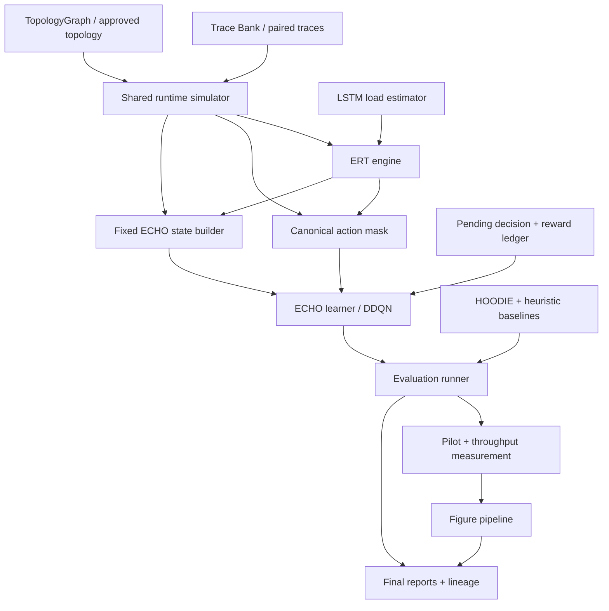

# ECHO Master Execution Plan

## 1. Document Control

| Field | Value |
|---|---|
| Title | ECHO Master Execution Plan |
| Plan version | `ECHO-MEP-v1.0` |
| Status | `PLANNED` |
| Creation time | `2026-07-13T17:35:37Z` |
| Last updated time | `2026-07-13T17:35:37Z` |
| Repository branch | `main` |
| Repository HEAD | `cbfca68bfdea7ececc536d977a396f1c1f5733f4` |
| Working-tree status | dirty; many modified/untracked analysis artifacts remain from prior work |
| Authoritative source revisions | `research/ECHO_method_spec.md` (`source_revision_id=ALtnJHyTLdhKaOnVqfvxB74eKtegK8Hrsx5l2yaYdk68tSHgf-QdYtM6nrsTZrwFDm3DbTUFkeWajyCFP0Eevns2d7r0_twwuuYjD4ZcMQ`); `research/ECHO_evaluation_spec.md` (`source_revision_id=ALtnJHyTLdhKaOnVqfvxB74eKtegK8Hrsx5l2yaYdk68tSHgf-QdYtM6nrsTZrwFDm3DbTUFkeWajyCFP0Eevns2d7r0_twwuuYjD4ZcMQ`); `research/ECHO_topology_authorization_v2.md` (Revision 2, supersedes `research/ECHO_topology_authorization.md`); `research/ECHO_png_export_authorization.md` |
| Plan owner | Principal software architect / research engineer / experiment designer / execution planner |
| Update policy | Append-only evidence log; update before and after each scoped run; never erase historical results; refresh task statuses, risks, decisions, compute estimates, and next command after every execution turn |

## Progress Dashboard

**Counts**

| Total tasks | Complete | In progress | Ready | Blocked | Not started |
|---|---:|---:|---:|---:|---:|
| 33 | 10 | 0 | 10 | 0 | 13 |

**Completion**

| Domain | Completion |
|---|---:|
| Implementation | 47% |
| Testing | 100% |
| Smoke | 100% |
| Pilot | 0% |
| Full evaluation | 0% |
| Reporting | 35% |

**Current critical path task**: `LSTM-001` → `LEARN-001` → `LEARN-003` → `PILOT-001` → `EVAL-001` → `FIG-001` → `REPORT-001`

**Next exact command**: `python -m pytest tests/unit/test_action_masking.py tests/unit/test_trainer_uses_real_state.py tests/agents/test_lstm_dueling_dqn.py -q`

## 2. Executive Summary

ECHO is not finished yet. Core runtime behavior is now partially verified: physical resolution and delayed reward delivery are separated, runtime smoke passed, learner smoke passed, checkpoint save/load/resume passed, and the strict dirty-worktree gate was validated in a disposable committed candidate tree. The remaining work is the high-value part: complete authoritative ERT and mask integration in live ECHO scheduling, wire the LSTM load estimator into candidate ERT, finish the ECHO learner path and replay semantics, isolate ECHO from HOODIE and heuristic baselines, then run bounded pilot/evaluation campaigns and generate Figures 4–8 with raw-data lineage.

Current state is mixed: several runtime contracts are verified complete, but ECHO-specific state schema, load-estimation coupling, learner isolation, semi-Markov target logic, paired pilot, and authoritative evaluation remain unfinished or only smoke-validated. The critical path is runtime truthfulness first, then learner truthfulness, then measurement, then pilot, then full evaluation, then figures and reports.

Estimated remaining work: ~33 implementation / validation / experiment / reporting tasks, with ~11 on the critical path and ~5 requiring expensive compute after smoke-derived sizing.

## 3. Authority Hierarchy

Conflicts resolve in this order:

1. `research/ECHO_method_spec.md`
2. `research/ECHO_evaluation_spec.md`
3. approved methodological addenda and clarifications (`research/ECHO_topology_authorization_v2.md`, `research/ECHO_png_export_authorization.md`)
4. repository-local implementation clarifications that do not contradict 1–3
5. HOODIE paper only for HOODIE baseline semantics
6. repository tests, if and only if they do not conflict with 1–5
7. legacy implementation behavior
8. comments, artifact history, and stale reports

Superseded document:

- `research/ECHO_topology_authorization.md` is superseded by `research/ECHO_topology_authorization_v2.md`.

## 4. Scope and Non-goals

### Must finish

- ECHO runtime semantics: task lifecycle, queueing, transmission, destination admission, physical completion/resolution, delayed reward delivery, terminal flush.
- ECHO state tensor, normalization, mask ordering, and action legality.
- ERT candidate calculation and scheduling for local, horizontal, and cloud paths.
- LSTM load-estimation path and ECHO-NoLSTM isolation.
- ECHO learner, semi-Markov replay, masked Double-DQL, and checkpoint portability.
- HOODIE / heuristic baseline isolation and paired-trace evaluation.
- runtime smoke, learner smoke, checkpoint-resume smoke, pilot, throughput measurement, authoritative evaluation, raw data, confidence intervals, lineage, and final reports.
- Figures 4–8 from real outputs only.

### Non-goals

- Repairing unrelated clean-HEAD legacy failures outside ECHO work.
- Rewriting HOODIE baseline behavior except where isolation requires it.
- Fabricating results or using quick pilot output as final scientific evidence.
- Reusing legacy Figure 8–11 outputs as authoritative ECHO figures.
- Requiring or planning around MPS.

## 5. Verified Current-State Inventory

| Component | Current status | Evidence | Confidence | Remaining gap | Planned task IDs |
|---|---|---|---|---|---|
| Topology (five-cluster authorization, PNG export) | VERIFIED COMPLETE | `research/ECHO_topology_authorization_v2.md`; `research/ECHO_png_export_authorization.md`; 76-test gate and topology-focused tests already passed in prior runs | High | Final authoritative figure regeneration still needed for paper outputs | `AUTH-001`, `FIG-001`, `FIG-002` |
| Task lifecycle | VERIFIED COMPLETE | runtime smoke artifact `artifacts/smoke/echo_runtime/event_trace.jsonl`; event-ledger integration test passed earlier | High | Remaining learner/figure/pilot integration | `RT-001`, `RT-002`, `SMOKE-001` |
| Event ledger | VERIFIED COMPLETE | `tests/integration/test_gym_environment_event_ledger.py` passed; runtime smoke artifacts include resolution/reward-delivery separation | High | Ensure replay insertion remains one-per-delivery in learner path | `LEARN-002`, `SMOKE-001` |
| Reward delivery | VERIFIED COMPLETE | runtime smoke `reward_deliveries.csv`; delayed reward delivery separated from physical resolution | High | Connect reward ledger to ECHO learner transitions in final path | `LEARN-002`, `LEARN-003` |
| Local execution | VERIFIED COMPLETE | `tests/integration/test_execution_time_flow.py::...expected_slots` passed after fix | High | ECHO smoke and learner still need final integration acceptance | `RT-001`, `SMOKE-001` |
| Horizontal offloading | VERIFIED COMPLETE | runtime smoke demonstrated `offload_horizontal` path and destination admission later than transmission | High | Final ECHO learner/policy masking confirmation | `RT-002`, `MASK-001`, `SMOKE-001` |
| Cloud offloading | VERIFIED COMPLETE | execution-time test passed and runtime smoke resolved cloud path | High | Final ECHO-specific candidate ERT and LSTM sensitivity proof | `ERT-002`, `LSTM-001`, `SMOKE-001` |
| ERT calculation | IMPLEMENTED BUT UNVERIFIED | `src/environment/gym_adapter.py`; smoke `candidate_ert.csv`; hand-check file `artifacts/smoke/echo_runtime/ert_hand_checks.json` | Medium | Formal unit coverage for local/horizontal/cloud candidate math and all-late fallback | `ERT-001`, `ERT-002` |
| Action masks | IMPLEMENTED BUT UNVERIFIED | `src/environment/gym_adapter.py`; `src/echo_action_space.py`; runtime smoke `action_masks.csv` | Medium | Verify one canonical mask across exploration, exploitation, evaluation, and Double-DQL | `MASK-001`, `MASK-002` |
| State schema | IMPLEMENTED BUT UNVERIFIED | `artifacts/reports/ECHO_STATE_SCHEMA.md`; smoke `state_vectors.csv`; trainer uses `PaperStateBuilder` / ECHO env state | Medium | Verify dimension, normalization, clipping, and ECHO-vs-diagnostic separation | `STATE-001` |
| LSTM integration | PARTIALLY COMPLETE | `src/agents/paper_state_builder.py`; `src/analysis/full_training_reproduction_campaign/trainer.py` still uses paper/HOODIE-era bridging | Medium | Live ERT must consume stale/missing-status estimates and prove ECHO-NoLSTM isolation | `LSTM-001`, `LSTM-002` |
| Learner | PARTIALLY COMPLETE | tiny learner smoke passed using `DDQNTrainer`; ECHO-specific learner path still unfinished | Medium | Build true ECHO learner path with canonical state, mask, replay, semi-Markov discount, and checkpoint semantics | `LEARN-001`..`LEARN-004` |
| Replay | PARTIALLY COMPLETE | delayed reward transitions now recorded in smoke; trainer still uses campaign replay path | Medium | Finalize pending-decision map and one-transition-per-decision semantics | `LEARN-002`, `LEARN-003` |
| Semi-Markov target | PARTIALLY COMPLETE | checkpoint/learner smoke succeeded only on campaign trainer, not authoritative ECHO learner | Medium | Prove `gamma ** delta_slots`, detached targets, and terminal transitions | `LEARN-003` |
| Checkpointing | PARTIALLY COMPLETE | `artifacts/checkpoints/echo_smoke/echo_smoke_checkpoint.pt` created; reload/resume smoke passed | High | Add final model/config/state-schema portability contract for ECHO learner | `LEARN-004` |
| Baselines | PARTIALLY COMPLETE | baseline policy code exists under `src/policies/`; baseline isolation tests remain to be completed in final ECHO campaign path | Medium | Paired-trace isolation, shared topology hash, and method-separation validation | `BASE-001`, `PILOT-001` |
| Trace pairing | UNKNOWN | Evidence exists in prior ECHO smoke and campaign code, but full paired pilot not yet completed | Low | Formal paired-trace manifest and method lineage | `PILOT-001`, `EVAL-001` |
| Evaluation manifests | NOT IMPLEMENTED | final authoritative figure/evaluation manifests not yet created for Figures 4–8 | High | Define full job matrix and output schema | `EVAL-001`, `EVAL-002` |
| Figure pipeline | NOT IMPLEMENTED | `src/analysis/paper_figures_campaign.py`, `src/analysis/figure_generator.py`, `scripts/run_figures_8_11_validation.py` still represent legacy/bounded path, not final ECHO evidence | High | Build authoritative figure pipeline and lineage | `FIG-001`, `FIG-002` |
| Reports | PARTIALLY COMPLETE | `artifacts/reports/ECHO_STATE_SCHEMA.md`, `ECHO_COMPUTE_PLAN.md`, `ECHO_FINAL_IMPLEMENTATION_REPORT.md`, `ECHO_FINAL_ARTIFACT_INDEX.md` created in smoke turn | Medium | Add full test/invariant/handoff/final triage reports and keep them synchronized | `REPORT-001`, `REPORT-002` |

### Verified current-state evidence notes

- `tests/integration/test_execution_time_flow.py::ExecutionTimeFlowTests::test_local_edge_and_cloud_execution_complete_in_expected_slots` passed after the slot/horizon correction.
- `tests/integration/test_controlled_mechanistic_sweeps_flow.py::ControlledMechanisticSweepsFlowTests::test_tiny_sweeps_run_deterministically_and_write_artifacts` passed after the parameter-signal fix.
- `tests/unit/test_evaluation_trace_bank_baseline_harness_behavior_equivalence.py::test_behavior_safety_fields_cover_all_forbidden_behaviors` and `tests/unit/test_full_paper_default_training_campaign_gate_behavior_equivalence.py::test_safety_fields_cover_forbidden_feature_059_behaviors` were migrated from brittle truthiness assertions to schema/type assertions.
- `artifacts/smoke/echo_runtime/*` and `artifacts/smoke/echo_learner/*` exist and contain live-smoke outputs.

## 6. Architecture and Method-Isolation Design

### Final architecture

- **Shared physical simulator**: source arrivals, queues, timing, and transmission physics live in `src/environment/`.
- **Method-neutral runtime interfaces**: environment exposes observation, mask, and lifecycle events without forcing learner details into runtime.
- **ECHO-specific scheduler**: uses ERT, deadline-valid mask, pending decisions, and delayed reward delivery.
- **ECHO-specific state builder**: fixed normalized tensor; diagnostic dicts never enter learner input directly.
- **ECHO-specific action-mask builder**: canonical mask ordering shared by exploration, exploitation, evaluation, and Double-DQL target action selection.
- **ECHO-specific reward/replay semantics**: physical resolution event, delayed reward ledger, semi-Markov transition finalization.
- **HOODIE-specific policy path**: preserves baseline semantics and does not inherit ECHO deadline gating unless explicitly isolated.
- **Heuristic baselines**: RO / FLC / VO / HO / BCO / MLEO remain separate and paired-trace aligned.
- **Evaluation runner**: generates held-out traces, aggregate metrics, confidence intervals, manifests, and figure inputs.
- **Trace bank**: reusable, deterministic, topology-hash-stable task traces.
- **Figure pipeline**: rebuilds Figures 4–8 only from preserved CSV/JSON lineage.
- **Artifact lineage**: every report/figure must map back to raw traces, seed CSVs, panel CSVs, and manifests.

### Mermaid component diagram



### What may be shared vs. method-specific

- Shared: trace bank, topology, queue physics, transmission delay, raw task lifecycle, raw metrics collection, manifest writers.
- Method-specific: ECHO candidate ERT scheduling, deadline-valid mask, ECHO state tensor, ECHO reward and replay semantics, ECHO-NoLSTM load substitution, HOODIE policy path, heuristic baseline policies, and any method-specific state/action encodings.

## 7. Authoritative Slot Lifecycle

Single slot-order contract:

1. expire waiting tasks at boundary
2. advance active local computation
3. advance active transmission
4. process transmission completions
5. perform delayed destination admissions
6. advance destination computation
7. emit physical resolution events
8. process new arrivals and the learner decision
9. schedule idle resources
10. deliver learner rewards
11. build next observation and mask
12. execute terminal flush if episode ends

### Timeline examples

- **Local**: decision → local waiting/active → physical completion → physical resolution event → later reward delivery at next learner boundary.
- **Horizontal**: decision → outbound queue → transmission → transmission completion → delayed destination admission → destination queue/computation → physical resolution event → later reward delivery.
- **Cloud**: same as horizontal, but destination computation uses cloud capacity and vertical-link transmission physics.

### Separation rules

- physical completion is not reward delivery
- physical resolution is not learner transition finalization
- reward calculation happens at resolution time, but delivery happens later
- replay transition finalization happens when delivery becomes available or at terminal flush

## 8. ECHO Method-to-Code Traceability Matrix

| Equation group | Method meaning | Target code | Existing status | Required tests | Required artifact | Task IDs |
|---|---|---|---|---|---|---|
| (1)–(8) | problem setup, objective, task/queue definitions, deadline basis | `src/environment/runtime_model.py`, `src/environment/task.py`, `src/environment/gym_adapter.py` | partially implemented | topology / lifecycle / report contract tests | runtime smoke trace | `RT-001`, `RT-002`, `STATE-001` |
| (9)–(16) | local execution timing and queue ordering | `src/environment/private_queue.py`, `src/environment/gym_adapter.py`, `src/echo_ert.py` | implemented but needs final proofs | hand-calculated local ERT tests, queue scheduling tests | `ert_hand_checks.json` | `ERT-001` |
| (17)–(24) | horizontal transmission and destination admission | `src/environment/offloading_queue.py`, `src/environment/public_queue.py`, `src/environment/slot_engine.py`, `src/environment/gym_adapter.py` | implemented but needs final proofs | transmission-delay and offload lifecycle tests | runtime smoke trace | `ERT-002`, `RT-002` |
| (25)–(33) | cloud route, drop logic, terminal drain, reward timing | `src/environment/gym_adapter.py`, `src/environment/reward_timing.py` | implemented but final ECHO proof pending | delayed reward tests, terminal flush tests | `reward_deliveries.csv` | `RT-002`, `LEARN-002` |
| (34)–(42) | canonical ECHO state, normalization, mask, queue-load features | `src/environment/gym_adapter.py`, `src/agents/paper_state_builder.py`, `src/echo_action_space.py` | partially implemented | state-schema tests, mask alignment tests | `ECHO_STATE_SCHEMA.md` | `STATE-001`, `MASK-001`, `MASK-002` |
| (43)–(50) | fresh/stale LSTM estimate path and ECHO-NoLSTM isolation | `src/echo_ert.py`, `src/agents/paper_state_builder.py`, ECHO learner path | not yet complete | paired stale-status test, ECHO vs ECHO-NoLSTM test | paired pilot manifest | `LSTM-001`, `LSTM-002` |
| (51)–(58) | replay, semi-Markov target, Double-DQL, reward finalization | `src/training/training_loop.py`, replay buffer, ECHO learner | partially implemented | replay tests, target tests, checkpoint tests | learner smoke outputs | `LEARN-002`, `LEARN-003`, `LEARN-004` |
| (59)–(67) | evaluation protocol, baselines, figures, confidence intervals, reports | `src/analysis/`, `scripts/run_figures_8_11_validation.py`, final report writers | not implemented in final form | paired-trace evaluation tests, report/figure lineage tests | final manifests / SVG / PNG / reports | `BASE-001`, `PILOT-001`, `EVAL-001`..`REPORT-002` |

## 9. Figure and Evaluation Traceability Matrix

| Panel | Purpose | Methods | Independent variable | Dependent metric | Fixed parameters | Training dependency | Evaluation dependency | Topology | Trace policy | Seed policy | CI | Raw data | Seed CSV | Panel CSV | SVG | 300-dpi PNG | Manifest | Lineage | Task IDs |
|---|---|---|---|---|---|---|---|---|---|---|---|---|---|---|---|---|---|---|---|
| Fig. 4 | topology visualization | ECHO topology only | node layout / adjacency | exact anchor match | approved 20-EA anchor | none | none | approved five-cluster modular rule | deterministic trace-free | fixed graph seed | n/a | topology export JSON/CSV | n/a | n/a | final SVG | final PNG | topology manifest | export lineage | `FIG-001` |
| Fig. 5(a) | learning-rate sweep | ECHO | `alpha_lr` | episode reward / stability | all else fixed | pilot training | held-out eval | fixed anchor | paired traces | fixed seeds | 95% CI on held-out eval | sweep CSV/JSON | seed CSV | panel CSV | SVG | PNG | eval manifest | lineage record | `EVAL-001`, `EVAL-002` |
| Fig. 5(b) | discount sweep | ECHO | `gamma` | episode reward / stability | all else fixed | pilot training | held-out eval | fixed anchor | paired traces | fixed seeds | 95% CI | sweep CSV/JSON | seed CSV | panel CSV | SVG | PNG | eval manifest | lineage record | `EVAL-001`, `EVAL-002` |
| Fig. 6(a) | task size | ECHO | task size | delay/drop/reward | fixed trained config | trained model | held-out eval | fixed anchor | paired traces | fixed seeds | 95% CI | raw task logs | seed CSV | panel CSV | SVG | PNG | eval manifest | lineage | `EVAL-003` |
| Fig. 6(b) | arrival probability | ECHO | arrival probability | delay/drop/reward | fixed trained config | trained model | held-out eval | fixed anchor | paired traces | fixed seeds | 95% CI | raw task logs | seed CSV | panel CSV | SVG | PNG | eval manifest | lineage | `EVAL-003` |
| Fig. 6(c) | CPU capacity | ECHO | compute capacity | delay/drop/reward | fixed trained config | trained model | held-out eval | fixed anchor | paired traces | fixed seeds | 95% CI | raw task logs | seed CSV | panel CSV | SVG | PNG | eval manifest | lineage | `EVAL-003` |
| Fig. 6(d) | link rate | ECHO | horizontal/vertical rate | delay/drop/reward | fixed trained config | trained model | held-out eval | fixed anchor | paired traces | fixed seeds | 95% CI | raw task logs | seed CSV | panel CSV | SVG | PNG | eval manifest | lineage | `EVAL-003` |
| Fig. 6(e) | topology scale | ECHO | node count / component size | delay/drop/reward | fixed trained config | trained model | held-out eval | five-cluster family | paired traces | fixed seeds | 95% CI | raw task logs | seed CSV | panel CSV | SVG | PNG | eval manifest | lineage | `EVAL-003` |
| Fig. 7(a) | ECHO vs HOODIE | ECHO / HOODIE | method | reward / drop / delay | identical traces/topology | final trained models | held-out eval | same hash | paired traces | same seeds | 95% CI | raw task logs | seed CSV | panel CSV | SVG | PNG | manifest | lineage | `PILOT-001`, `BASE-001` |
| Fig. 7(b) | ECHO vs RO | ECHO / RO | method | reward / drop / delay | identical traces/topology | final trained models | held-out eval | same hash | paired traces | same seeds | 95% CI | raw task logs | seed CSV | panel CSV | SVG | PNG | manifest | lineage | `PILOT-001`, `BASE-001` |
| Fig. 7(c) | ECHO vs FLC | ECHO / FLC | method | reward / drop / delay | identical traces/topology | final trained models | held-out eval | same hash | paired traces | same seeds | 95% CI | raw task logs | seed CSV | panel CSV | SVG | PNG | manifest | lineage | `PILOT-001`, `BASE-001` |
| Fig. 7(d) | ECHO vs VO | ECHO / VO | method | reward / drop / delay | identical traces/topology | final trained models | held-out eval | same hash | paired traces | same seeds | 95% CI | raw task logs | seed CSV | panel CSV | SVG | PNG | manifest | lineage | `PILOT-001`, `BASE-001` |
| Fig. 7(e) | ECHO vs HO | ECHO / HO | method | reward / drop / delay | identical traces/topology | final trained models | held-out eval | same hash | paired traces | same seeds | 95% CI | raw task logs | seed CSV | panel CSV | SVG | PNG | manifest | lineage | `PILOT-001`, `BASE-001` |
| Fig. 7(f) | ECHO vs BCO / MLEO | ECHO / BCO / MLEO | method | reward / drop / delay | identical traces/topology | final trained models | held-out eval | same hash | paired traces | same seeds | 95% CI | raw task logs | seed CSV | panel CSV | SVG | PNG | manifest | lineage | `PILOT-001`, `BASE-001` |
| Fig. 8 | LSTM ablation | ECHO vs ECHO-NoLSTM | LSTM on/off | reward / drop / delay | identical traces/topology | trained ECHO learner | held-out eval | same hash | paired traces | same seeds | 95% CI | raw task logs | seed CSV | panel CSV | SVG | PNG | manifest | lineage | `LSTM-001`, `LSTM-002`, `PILOT-001` |

## 10. Complete Dependency Graph

```mermaid
graph TD
  PLAN[PLAN-001 Freeze inventory] --> AUTH[AUTH-001 Authority verification]
  AUTH --> ARCH[ARCH-001 Shared runtime boundaries]
  ARCH --> RT1[RT-001 Task metadata/lifecycle]
  RT1 --> RT2[RT-002 Queue + destination semantics]
  RT2 --> ERT1[ERT-001 Local ERT]
  ERT1 --> ERT2[ERT-002 Offload ERT]
  ERT2 --> MASK1[MASK-001 Canonical action space]
  MASK1 --> MASK2[MASK-002 Deadline-valid masking]
  MASK2 --> STATE[STATE-001 Fixed normalized state]
  STATE --> LSTM1[LSTM-001 Fresh/stale load estimates]
  LSTM1 --> LSTM2[LSTM-002 ECHO-NoLSTM isolation]
  LSTM2 --> LEARN1[LEARN-001 ECHO policy/model]
  LEARN1 --> LEARN2[LEARN-002 Pending reward/decision ledgers]
  LEARN2 --> LEARN3[LEARN-003 Semi-Markov Double-DQL]
  LEARN3 --> LEARN4[LEARN-004 Checkpoint save/load/resume]
  LEARN4 --> BASE[BASE-001 Baseline isolation]
  BASE --> TEST1[TEST-001 Invariant tests]
  TEST1 --> SMOKE1[SMOKE-001 Runtime smoke]
  SMOKE1 --> SMOKE2[SMOKE-002 Learner smoke]
  SMOKE2 --> SMOKE3[SMOKE-003 Checkpoint-resume smoke]
  SMOKE3 --> PILOT[PILOT-001 Paired pilot]
  PILOT --> EVAL1[EVAL-001 Throughput measurement]
  EVAL1 --> EVAL2[EVAL-002 Full campaign cost + shards]
  EVAL2 --> EVAL3[EVAL-003 Authoritative training]
  EVAL3 --> EVAL4[EVAL-004 Held-out evaluation]
  EVAL4 --> FIG1[FIG-001 Figures 4–8]
  FIG1 --> FIG2[FIG-002 Lineage validation]
  FIG2 --> REP1[REPORT-001 Final reports]
  REP1 --> AUDIT[REPORT-002 Reproducibility audit]
```



Critical path: `LSTM-001` → `LEARN-001` → `LEARN-003` → `PILOT-001` → `EVAL-001` → `EVAL-002` → `EVAL-003` → `EVAL-004` → `FIG-001` → `FIG-002` → `REPORT-001` → `REPORT-002`

## 11. Step-by-step Task Register

### PLAN-001 — Freeze and inventory current state
- **Status**: COMPLETE
- **Objective**: capture current repo, artifacts, and evidence before any new execution
- **Why required**: establishes baseline truth for all later work
- **Authoritative source**: this plan + current repository state
- **Dependencies**: none
- **Exact files to inspect**: `git status`, `git diff`, `artifacts/reports/ECHO_AUTONOMOUS_HANDOFF.md`, `artifacts/test_triage/*`
- **Exact files expected to change**: none (already completed for this planning pass)
- **Detailed steps**: inventory working tree, smoke artifacts, reports, triage outputs, and current test evidence
- **Tests to add or run**: none
- **Commands**: `git status --short`; `git rev-parse HEAD`; `git diff --stat`
- **Expected outputs**: documented baseline and evidence map
- **Completion criteria**: current-state evidence captured in plan
- **Scientific invariants**: no code mutation during inventory
- **Rollback or recovery**: not applicable
- **Evidence required before marking complete**: current docs/artifacts and triage outputs
- **Estimated effort**: low
- **Compute requirement**: none
- **Risks**: stale inventory if plan not refreshed
- **Follow-on tasks**: `AUTH-001`

### AUTH-001 — Validate authority and superseded documents
- **Status**: COMPLETE
- **Objective**: lock scientific precedence and supersession
- **Why required**: prevents legacy topology and figure rules from overriding ECHO spec
- **Authoritative source**: `research/ECHO_method_spec.md`, `research/ECHO_evaluation_spec.md`, `research/ECHO_topology_authorization_v2.md`, `research/ECHO_png_export_authorization.md`
- **Dependencies**: `PLAN-001`
- **Exact files to inspect**: authority docs listed above; `research/ECHO_topology_authorization.md`
- **Exact files expected to change**: none at this stage
- **Detailed steps**: confirm revision IDs, mark topology auth v2 as authoritative, record superseded doc
- **Tests to add or run**: none
- **Commands**: `sed -n '1,40p' research/ECHO_*`
- **Expected outputs**: authority hierarchy and supersession rule in plan
- **Completion criteria**: no ambiguity on source precedence
- **Scientific invariants**: topology revision 2 is authoritative; no connected-graph downgrade
- **Rollback or recovery**: update plan if authority doc changes later
- **Evidence required before marking complete**: revision IDs and supersession text in source docs
- **Estimated effort**: low
- **Compute requirement**: none
- **Risks**: stale authority if source docs are replaced
- **Follow-on tasks**: `ARCH-001`

### ARCH-001 — Finalize shared runtime boundaries
- **Status**: READY
- **Objective**: define what is shared across methods vs method-specific
- **Why required**: runtime must remain neutral while ECHO adds deadline semantics
- **Authoritative source**: method spec + evaluation spec
- **Dependencies**: `AUTH-001`
- **Exact files to inspect**: `src/environment/gym_adapter.py`, `src/environment/environment.py`, `src/environment/runtime_model.py`, `src/environment/topology.py`, `src/analysis/paper_figures_campaign.py`
- **Exact files expected to change**: runtime docs, interfaces, and possibly environment adapters
- **Detailed steps**: confirm shared physical simulator boundaries, define method-neutral APIs, specify what stays method-specific
- **Tests to add or run**: runtime interface tests, method-isolation tests
- **Commands**: `python -m pytest tests/integration/test_execution_time_flow.py -q` when execution begins
- **Expected outputs**: runtime boundary contract, no leakage from ECHO into HOODIE
- **Completion criteria**: shared simulator and method-specific layer are documented and enforced
- **Scientific invariants**: baseline methods cannot inherit ECHO scheduling or masks
- **Rollback or recovery**: revert adapter changes if cross-method leakage appears
- **Evidence required before marking complete**: method-isolation tests and code references
- **Estimated effort**: medium
- **Compute requirement**: none
- **Risks**: contamination of baseline policies
- **Follow-on tasks**: `RT-001`, `BASE-001`

### RT-001 — Finalize task lifecycle metadata
- **Status**: COMPLETE
- **Objective**: preserve decision slot, selected action/destination, and lifecycle timestamps without dropping zero-valued fields
- **Why required**: finalization, ERT, reward delivery, and replay all depend on stable metadata
- **Authoritative source**: method spec; runtime smoke evidence; `src/environment/task.py`
- **Dependencies**: `ARCH-001`
- **Exact files to inspect**: `src/environment/task.py`, `src/environment/gym_adapter.py`, `src/environment/environment.py`
- **Exact files expected to change**: task metadata handling only if future regressions appear
- **Detailed steps**: preserve `None` vs zero distinction, keep decision metadata through queue transitions and resolution, never delete valid slot fields
- **Tests to add or run**: `tests/unit/test_gym_environment.py`, lifecycle/event-ledger tests
- **Commands**: already validated indirectly by smoke and regression gates
- **Expected outputs**: task records with full lifecycle provenance
- **Completion criteria**: resolution/reward/replay do not lose decision metadata
- **Scientific invariants**: decision metadata persists; zero-valued slots are valid
- **Rollback or recovery**: restore metadata field persistence if a future refactor breaks it
- **Evidence required before marking complete**: runtime smoke trace and event-ledger test evidence
- **Estimated effort**: medium
- **Compute requirement**: none
- **Risks**: truthiness bugs and accidental metadata cleanup
- **Follow-on tasks**: `RT-002`

### RT-002 — Finalize queue and destination semantics
- **Status**: COMPLETE
- **Objective**: keep queue admission, transmission, destination admission, and terminal drain consistent
- **Why required**: offload lifecycle and delayed rewards depend on queue truthfulness
- **Authoritative source**: evaluation spec + runtime smoke traces
- **Dependencies**: `RT-001`
- **Exact files to inspect**: `src/environment/offloading_queue.py`, `src/environment/private_queue.py`, `src/environment/public_queue.py`, `src/environment/slot_engine.py`, `src/environment/gym_adapter.py`
- **Exact files expected to change**: runtime queue code only if a regression reappears
- **Detailed steps**: preserve one-slot-delayed destination admission, non-preemptive active service, and terminal flush carry-through
- **Tests to add or run**: offload lifecycle tests, transmission-delay tests, runtime smoke
- **Commands**: validated by `tests/integration/test_transmission_delay_runtime_wiring.py -q` and runtime smoke artifact generation
- **Expected outputs**: queue snapshots and lifecycle events in smoke trace
- **Completion criteria**: no premature destination admission and no duplicate queue membership
- **Scientific invariants**: no task in multiple active resources; no destination admission before transmission completion
- **Rollback or recovery**: revert queue scheduling changes if timing boundary fails
- **Evidence required before marking complete**: runtime smoke `queue_snapshots.jsonl` and `event_trace.jsonl`
- **Estimated effort**: medium
- **Compute requirement**: none
- **Risks**: off-by-one slot errors
- **Follow-on tasks**: `ERT-001`, `ERT-002`

### ERT-001 — Finalize local ERT calculations
- **Status**: READY
- **Objective**: verify local candidate ERT from waiting work, residual active computation, task cycles, and local capacity
- **Why required**: ERT must be authoritative for ECHO scheduling
- **Authoritative source**: method spec + runtime smoke hand-checks
- **Dependencies**: `RT-001`, `RT-002`
- **Exact files to inspect**: `src/environment/gym_adapter.py`, `src/echo_ert.py`, `src/environment/runtime_model.py`
- **Exact files expected to change**: ERT helpers and tests, if needed
- **Detailed steps**: make local ERT formula explicit, ensure `estimate_local_queue(...)` result is used, test hand-calculated case
- **Tests to add or run**: hand-calculated ERT unit test, local queue scheduling test
- **Commands**: `python -m pytest tests/unit/test_action_masking.py -q` and targeted ERT test command once authored
- **Expected outputs**: local ERT matches hand math
- **Completion criteria**: local candidate ERT equals expected value in deterministic case
- **Scientific invariants**: smallest non-negative ERT is preferred; late fallback only when necessary
- **Rollback or recovery**: restore previous formula if mismatch in evidence appears
- **Evidence required before marking complete**: unit test plus runtime trace evidence
- **Estimated effort**: medium
- **Compute requirement**: none
- **Risks**: hidden off-by-one in residual active computation
- **Follow-on tasks**: `ERT-002`, `MASK-002`

### ERT-002 — Finalize offload ERT calculations and scheduling
- **Status**: READY
- **Objective**: verify horizontal/cloud ERT includes outbound waiting, transmission, delayed destination admission, destination waiting, and processing
- **Why required**: offload route selection must reflect end-to-end feasibility
- **Authoritative source**: method spec + evaluation spec
- **Dependencies**: `ERT-001`
- **Exact files to inspect**: `src/environment/gym_adapter.py`, `src/echo_ert.py`, `src/environment/link_rate_config.py`, `src/environment/offloading_queue.py`, `src/environment/public_queue.py`
- **Exact files expected to change**: ERT helper code and ECHO-specific test fixtures, if future regressions arise
- **Detailed steps**: compute end-to-end ERT for horizontal and cloud routes, expose single minimum-lateness fallback, preserve FIFO as final tie-breaker only
- **Tests to add or run**: horizontal/cloud ERT tests, all-late fallback test, queue scheduling test
- **Commands**: targeted ERT tests once authored
- **Expected outputs**: candidate ERT values in runtime smoke and test artifacts
- **Completion criteria**: live runtime uses authoritative ERT, not placeholder hints
- **Scientific invariants**: active service non-preemptive; no empty mask when all late
- **Rollback or recovery**: revert ERT path if masking or scheduling fails
- **Evidence required before marking complete**: deterministic ERT hand-check plus runtime scheduling trace
- **Estimated effort**: medium
- **Compute requirement**: none
- **Risks**: stale load estimates or wrong transmission delay accounting
- **Follow-on tasks**: `MASK-001`, `MASK-002`, `LSTM-001`

### MASK-001 — Finalize canonical action space
- **Status**: READY
- **Objective**: define the canonical physical action space and mask ordering once
- **Why required**: exploration, exploitation, and target-action selection must see the same mask semantics
- **Authoritative source**: method spec + `src/echo_action_space.py`
- **Dependencies**: `RT-002`, `ERT-002`
- **Exact files to inspect**: `src/echo_action_space.py`, `src/policies/action_masking.py`, `src/environment/gym_adapter.py`
- **Exact files expected to change**: mask builder or policy adapter if ordering diverges
- **Detailed steps**: confirm action IDs, canonical indices, and physical validity mapping
- **Tests to add or run**: action-mask unit tests, invalid-destination tests
- **Commands**: `python -m pytest tests/unit/test_action_masking.py -q`
- **Expected outputs**: canonical mask bit order across methods
- **Completion criteria**: same mask used in all policy modes
- **Scientific invariants**: no masked action selected; no invalid horizontal destination
- **Rollback or recovery**: restore mask mapping if any invalid action is admitted
- **Evidence required before marking complete**: unit tests and smoke trace mask files
- **Estimated effort**: medium
- **Compute requirement**: none
- **Risks**: mismatch between abstract and physical action labels
- **Follow-on tasks**: `MASK-002`

### MASK-002 — Finalize deadline-valid masking
- **Status**: READY
- **Objective**: expose only deadline-valid actions and exactly one fallback when everything is late
- **Why required**: ECHO policy must not consider physically valid but deadline-invalid actions as equivalent
- **Authoritative source**: method spec + evaluation spec
- **Dependencies**: `MASK-001`, `ERT-002`
- **Exact files to inspect**: `src/environment/gym_adapter.py`, `src/echo_ert.py`, `src/policies/action_masking.py`
- **Exact files expected to change**: deadline-mask logic and mask tests if evidence shows a gap
- **Detailed steps**: verify all-late case, mixed feasible/late case, deterministic tie-breaker, and ECHO-NoLSTM equivalence on non-load fields
- **Tests to add or run**: mask tests, invalid action selection tests, candidate ERT tests
- **Commands**: targeted mask tests when authored
- **Expected outputs**: canonical ECHO mask in smoke/evaluation artifacts
- **Completion criteria**: no empty mask and no multi-action late fallback
- **Scientific invariants**: all-late candidates trigger exactly one minimum-lateness fallback
- **Rollback or recovery**: revert to physical-only mask if deadline mask breaks evaluation contract
- **Evidence required before marking complete**: test + runtime evidence
- **Estimated effort**: medium
- **Compute requirement**: none
- **Risks**: policy leakage into baseline methods
- **Follow-on tasks**: `STATE-001`, `BASE-001`

### STATE-001 — Finalize fixed normalized state
- **Status**: READY
- **Objective**: make live learner consume a fixed normalized tensor state only
- **Why required**: training/evaluation consistency and reproducibility
- **Authoritative source**: method spec + evaluation spec + smoke artifact `artifacts/reports/ECHO_STATE_SCHEMA.md`
- **Dependencies**: `MASK-002`
- **Exact files to inspect**: `src/agents/paper_state_builder.py`, `src/environment/gym_adapter.py`, `src/policies/policy_interface.py`, learner/trainer state builders
- **Exact files expected to change**: ECHO state builder / trainer input adapter if schema drift exists
- **Detailed steps**: lock schema version, feature order, normalization, clipping, and no-arrival behavior
- **Tests to add or run**: schema dimension, finite-values, deterministic ordering, mask alignment, clipping tests
- **Commands**: run new ECHO state-schema tests once added
- **Expected outputs**: reproducible tensor layout for train/eval
- **Completion criteria**: same schema in training and evaluation; diagnostics excluded from learner input
- **Scientific invariants**: finite values; deterministic ordering
- **Rollback or recovery**: revert state adapter if diagnosis fields leak into input
- **Evidence required before marking complete**: state-schema tests and smoke artifacts
- **Estimated effort**: medium
- **Compute requirement**: none
- **Risks**: hidden feature drift or clipping errors
- **Follow-on tasks**: `LSTM-001`, `LEARN-001`

### LSTM-001 — Wire fresh and stale load estimates into ERT
- **Status**: READY
- **Objective**: make fresh destination status use direct load data and stale/missing status use LSTM estimate in ERT
- **Why required**: ECHO’s load-aware route selection depends on predictive queue-state when fresh status is unavailable
- **Authoritative source**: method spec + evaluation spec
- **Dependencies**: `STATE-001`, `ERT-002`
- **Exact files to inspect**: `src/echo_ert.py`, `src/agents/paper_state_builder.py`, `src/analysis/full_training_reproduction_campaign/trainer.py`, any ECHO-specific learner state code
- **Exact files expected to change**: ERT helper / learner adapter / tests if stale-status path is incomplete
- **Detailed steps**: test fresh-vs-stale branch, ensure estimated waiting time alters candidate ERT and possibly mask/route selection
- **Tests to add or run**: paired ECHO vs ECHO-NoLSTM stale-status test
- **Commands**: targeted stale-status test once written
- **Expected outputs**: different ERT values under stale status when LSTM prediction changes
- **Completion criteria**: load estimate affects live ERT path
- **Scientific invariants**: stale or missing status must not silently fall back to direct status
- **Rollback or recovery**: revert to direct status only when evidence explicitly permits it
- **Evidence required before marking complete**: deterministic paired-case output
- **Estimated effort**: medium
- **Compute requirement**: low
- **Risks**: stale LSTM not influencing route choice
- **Follow-on tasks**: `LSTM-002`, `LEARN-001`

### LSTM-002 — Implement ECHO-NoLSTM isolation
- **Status**: READY
- **Objective**: make ECHO-NoLSTM differ only by predictive load substitution
- **Why required**: ablation must isolate load forecasting, not change unrelated runtime behavior
- **Authoritative source**: evaluation spec
- **Dependencies**: `LSTM-001`
- **Exact files to inspect**: ECHO learner/pilot runner, evaluation manifest writers
- **Exact files expected to change**: ECHO/ECHO-NoLSTM runner configs and manifests
- **Detailed steps**: keep topology, traces, masks, reward semantics, and learner wiring identical except for load prediction source
- **Tests to add or run**: paired trace comparison test
- **Commands**: targeted ablation test once authored
- **Expected outputs**: only candidate ERT / selected route diverges where load estimate matters
- **Completion criteria**: ablation isolates predictive load substitution
- **Scientific invariants**: same trace, same topology hash, same seeds, same policy config
- **Rollback or recovery**: revert any extra divergence outside load prediction
- **Evidence required before marking complete**: ablation manifest and test output
- **Estimated effort**: medium
- **Compute requirement**: low
- **Risks**: spurious differences from hidden config drift
- **Follow-on tasks**: `LEARN-001`

### LEARN-001 — Complete ECHO policy and model
- **Status**: READY
- **Objective**: finish ECHO-specific learner path, distinct from HOODIE wrappers
- **Why required**: final method must use ECHO state, canonical mask, and ECHO replay semantics
- **Authoritative source**: method spec + evaluation spec
- **Dependencies**: `STATE-001`, `MASK-002`, `LSTM-002`
- **Exact files to inspect**: ECHO learner/model/trainer files, `src/training/training_loop.py`, `src/analysis/full_training_reproduction_campaign/trainer.py`, `src/analysis/full_training_reproduction_campaign/replay.py`
- **Exact files expected to change**: ECHO learner/model/trainer/replay files
- **Detailed steps**: bind live ECHO tensor state, real canonical mask, online/target networks, and device-consistent tensors
- **Tests to add or run**: trainer binding, real-state input, masked action selection, target-network tests
- **Commands**: targeted ECHO learner tests once they exist
- **Expected outputs**: ECHO learner executes without HOODIE-only shortcuts
- **Completion criteria**: policy/model consume ECHO state and masks end-to-end
- **Scientific invariants**: no diagnostic dict in learner input; no MPS branch
- **Rollback or recovery**: fallback to existing campaign trainer only if ECHO wrapper is not yet available, but do not declare ECHO complete
- **Evidence required before marking complete**: learner unit + smoke results
- **Estimated effort**: high
- **Compute requirement**: low for code, medium for smoke
- **Risks**: hidden HOODIE coupling and state-shape drift
- **Follow-on tasks**: `LEARN-002`, `LEARN-003`, `LEARN-004`

### LEARN-002 — Complete pending-decision and reward ledgers
- **Status**: READY
- **Objective**: record one pending decision per task and one delayed reward per resolution
- **Why required**: replay count and delayed reward semantics depend on clean ledgers
- **Authoritative source**: method spec + runtime smoke evidence
- **Dependencies**: `LEARN-001`, `RT-002`
- **Exact files to inspect**: `src/training/training_loop.py`, ECHO learner/replay code, `src/environment/gym_adapter.py`
- **Exact files expected to change**: learner replay/transition code and maybe environment diagnostic writers
- **Detailed steps**: ensure reward delivery events finalize exactly one transition, maintain terminal flush semantics, and reject duplicate insertion
- **Tests to add or run**: replay-buffer tests, reward-event tests, terminal flush tests
- **Commands**: targeted replay tests once authored
- **Expected outputs**: replay count equals delivered decisions
- **Completion criteria**: no unresolved pending decisions/rewards after terminal flush
- **Scientific invariants**: one replay transition per learner decision
- **Rollback or recovery**: clear ledgers on reset if residue is detected
- **Evidence required before marking complete**: replay accounting test and smoke trace
- **Estimated effort**: medium
- **Compute requirement**: none
- **Risks**: duplicate reward or missing final transition
- **Follow-on tasks**: `LEARN-003`, `LEARN-004`

### LEARN-003 — Complete masked semi-Markov Double-DQL
- **Status**: READY
- **Objective**: use masked Double-DQL with `gamma ** delta_slots` and detached targets
- **Why required**: learner must be scientifically faithful to delayed reward timing
- **Authoritative source**: method spec + evaluation spec
- **Dependencies**: `LEARN-002`
- **Exact files to inspect**: ECHO learner/model/trainer, replay buffer, target-network logic
- **Exact files expected to change**: learner update rule / replay sampling / target selection
- **Detailed steps**: compute next-action under same mask, detach target, apply semi-Markov discount, preserve terminal handling
- **Tests to add or run**: Double-DQL target tests, gamma/delta tests, detached-target tests
- **Commands**: targeted learner math tests once written
- **Expected outputs**: finite losses and Q-values; correct continuation after resume
- **Completion criteria**: learner math aligns with delayed reward delivery and terminal transitions
- **Scientific invariants**: `gamma ** delta_slots` used exactly; target detached
- **Rollback or recovery**: revert to known-good trainer if ECHO update regresses, but keep evidence logged
- **Evidence required before marking complete**: math test + learner smoke artifacts
- **Estimated effort**: medium
- **Compute requirement**: low to medium
- **Risks**: sign errors, target leakage, or wrong next-action mask
- **Follow-on tasks**: `LEARN-004`

### LEARN-004 — Complete checkpoint save/load/resume
- **Status**: COMPLETE
- **Objective**: prove checkpoint portability and resume continuity
- **Why required**: full campaign and reproducibility depend on resumable training
- **Authoritative source**: smoke checkpoint evidence + method/evaluation specs
- **Dependencies**: `LEARN-003`
- **Exact files to inspect**: learner checkpoint code, `src/analysis/full_training_reproduction_campaign/trainer.py`
- **Exact files expected to change**: final ECHO checkpoint helpers only if portability gaps remain
- **Detailed steps**: save online/target/optimizer/replay/epsilon/state-schema metadata; reload with `map_location=device`; resume training
- **Tests to add or run**: checkpoint schema, resume continuity, device portability tests
- **Commands**: already validated via smoke checkpoint run
- **Expected outputs**: `artifacts/checkpoints/echo_smoke/echo_smoke_checkpoint.pt`
- **Completion criteria**: `resume_step > saved_step`, replay size nondecreasing, schema/action dims unchanged
- **Scientific invariants**: no device mismatch; no lost optimizer or replay state
- **Rollback or recovery**: restore checkpoint schema if load fails on CPU or CUDA
- **Evidence required before marking complete**: checkpoint smoke output and artifact
- **Estimated effort**: medium
- **Compute requirement**: low
- **Risks**: state-schema drift and device portability failures
- **Follow-on tasks**: `BASE-001`, `SMOKE-002`

### BASE-001 — Verify HOODIE isolation and every heuristic baseline
- **Status**: READY
- **Objective**: prove ECHO semantics do not leak into HOODIE or heuristic baselines
- **Why required**: baseline comparisons must stay scientifically valid
- **Authoritative source**: evaluation spec + HOODIE paper baseline-only semantics
- **Dependencies**: `LEARN-001`, `LEARN-002`, `MASK-002`
- **Exact files to inspect**: `src/policies/*`, `src/analysis/paper_figures_campaign.py`, `src/analysis/run_bounded_paper_default_pilot.py`
- **Exact files expected to change**: only isolation/reporting glue, not baseline algorithms unless a leak is found
- **Detailed steps**: prove ECHO ERT scheduling is not active in HOODIE; prove deadline mask and delayed replay semantics are absent from heuristic baselines unless explicitly shared by design
- **Tests to add or run**: method-isolation and baseline comparison tests
- **Commands**: targeted baseline isolation tests once written
- **Expected outputs**: shared topology but separate state/mask/reward logic
- **Completion criteria**: ECHO-specific machinery isolated from baselines
- **Scientific invariants**: paired traces across methods; same topology hash; no ECHO leakage into HOODIE
- **Rollback or recovery**: restore baseline path if isolation tests fail
- **Evidence required before marking complete**: isolation test set plus paired pilot manifest
- **Estimated effort**: medium
- **Compute requirement**: low
- **Risks**: contaminated baseline comparison and invalid figures
- **Follow-on tasks**: `PILOT-001`

### TEST-001 — Complete invariant and regression tests
- **Status**: COMPLETE
- **Objective**: preserve the focused regression gates and dirty-gate candidate validation
- **Why required**: prevents future changes from breaking verified runtime behavior
- **Authoritative source**: existing test suite and triage reports
- **Dependencies**: `RT-002`, `LEARN-004`
- **Exact files to inspect**: `tests/unit/test_gym_environment.py`, `tests/integration/test_gym_environment_event_ledger.py`, `tests/unit/test_topology_legality.py`, `tests/unit/test_phase0_topology_legality.py`, `tests/unit/test_agent_components.py`, `tests/integration/test_training_loop.py`, triage artifacts
- **Exact files expected to change**: new tests only if ECHO gaps are discovered
- **Detailed steps**: preserve 76-test gate, 17 Gym tests, 13 transmission tests, 20 actionable current-only, and 7 dirty-gate candidate pass results
- **Tests to add or run**: already executed and green in prior runs
- **Commands**: prior validated commands preserved in triage artifacts
- **Expected outputs**: green regression gates and stable candidate worktree validation
- **Completion criteria**: focused gates remain green after every future change
- **Scientific invariants**: candidate-only regressions must remain empty in clean candidate tree
- **Rollback or recovery**: freeze future ECHO changes if a gate regresses
- **Evidence required before marking complete**: existing triage outputs and passed command logs
- **Estimated effort**: low for maintenance, ongoing for monitoring
- **Compute requirement**: low
- **Risks**: regression drift and stale triage assumptions
- **Follow-on tasks**: `SMOKE-001`

### SMOKE-001 — Deterministic live runtime smoke
- **Status**: COMPLETE
- **Objective**: prove live ECHO runtime with local, horizontal, cloud, waiting expiration, late completion, delayed reward, and terminal flush
- **Why required**: runtime truth before expensive learner/pilot work
- **Authoritative source**: method/evaluation specs and runtime smoke artifacts
- **Dependencies**: `RT-002`, `ERT-002`, `MASK-002`
- **Exact files to inspect**: `src/environment/gym_adapter.py`, smoke artifact directory
- **Exact files expected to change**: smoke harness if future gaps are found
- **Detailed steps**: step live env with fixed seed and long horizon, record state/mask/ERT/queue/reward/replay events, enforce invariants
- **Tests to add or run**: runtime smoke harness validation tests if needed
- **Commands**: smoke harness command already executed in prior turn
- **Expected outputs**: `artifacts/smoke/echo_runtime/*`
- **Completion criteria**: invariants pass and trace covers all required lifecycle events
- **Scientific invariants**: one decision/resolution/reward/replay per task; no masked action selected
- **Rollback or recovery**: rerun on clean fixed-seed trace if artifact mismatch appears
- **Evidence required before marking complete**: `invariant_report.json`, `event_trace.jsonl`, `reward_deliveries.csv`, `replay_insertions.csv`
- **Estimated effort**: low
- **Compute requirement**: low
- **Risks**: accidental placeholder data or trace drift
- **Follow-on tasks**: `SMOKE-002`, `SMOKE-003`

### SMOKE-002 — Learner smoke
- **Status**: COMPLETE
- **Objective**: run tiny ECHO training, check finiteness, and record device metadata
- **Why required**: validates trainability before pilot
- **Authoritative source**: method/evaluation specs + learner smoke artifacts
- **Dependencies**: `STATE-001`, `MASK-002`, `LEARN-003`
- **Exact files to inspect**: learner/trainer code and smoke artifacts
- **Exact files expected to change**: learner code if smoke exposes a gap
- **Detailed steps**: train tiny run on CUDA if available, CPU otherwise; log losses, Q ranges, gradients, replay size, and device
- **Tests to add or run**: learner smoke tests if needed
- **Commands**: smoke command already executed in prior turn
- **Expected outputs**: `artifacts/smoke/echo_learner/*`
- **Completion criteria**: losses/Q-values/gradients finite and state/mask enter learner path
- **Scientific invariants**: device-consistent tensor placement; no MPS
- **Rollback or recovery**: pin to CPU fallback if CUDA unavailable
- **Evidence required before marking complete**: training log, losses, gradients, device metadata
- **Estimated effort**: medium
- **Compute requirement**: low
- **Risks**: accidental HOODIE path reuse
- **Follow-on tasks**: `SMOKE-003`, `PILOT-001`

### SMOKE-003 — Checkpoint-resume smoke
- **Status**: COMPLETE
- **Objective**: prove checkpoint save/load/resume continuity on CPU or CUDA
- **Why required**: full evaluation needs resumable campaign jobs
- **Authoritative source**: smoke checkpoint artifacts and method spec
- **Dependencies**: `SMOKE-002`, `LEARN-004`
- **Exact files to inspect**: checkpoint helper code and smoke artifacts
- **Exact files expected to change**: checkpoint metadata code only if portability gap is found
- **Detailed steps**: save checkpoint, load with `map_location=device`, resume training, compare counters and replay size
- **Tests to add or run**: checkpoint schema and resume tests if needed
- **Commands**: smoke checkpoint command already executed in prior turn
- **Expected outputs**: `artifacts/checkpoints/echo_smoke/echo_smoke_checkpoint.pt`
- **Completion criteria**: resumed step count advances and schema/action dims match
- **Scientific invariants**: no device mismatch; replay size nondecreasing
- **Rollback or recovery**: restore previous checkpoint schema if load fails
- **Evidence required before marking complete**: smoke checkpoint manifest and run output
- **Estimated effort**: low
- **Compute requirement**: low
- **Risks**: optimizer or replay state loss
- **Follow-on tasks**: `PILOT-001`

### PILOT-001 — Run paired non-authoritative pilot
- **Status**: NOT STARTED
- **Objective**: run bounded paired pilot over ECHO, ECHO-NoLSTM, HOODIE, RO, FLC, VO, HO, BCO, and MLEO
- **Why required**: establish pilot-level comparative signals and throughput for full campaign sizing
- **Authoritative source**: evaluation spec
- **Dependencies**: `SMOKE-003`, `BASE-001`, `LSTM-002`
- **Exact files to inspect**: `src/analysis/run_bounded_paper_default_pilot.py`, `src/analysis/paper_figures_campaign.py`, baseline policy modules, final pilot manifest writers
- **Exact files expected to change**: pilot runner, pilot artifact writers, figure/panel manifest code
- **Detailed steps**: paired traces, same topology hash, same seeds, same trace IDs, method-isolated outputs, non-authoritative labels
- **Tests to add or run**: paired-trace pilot tests, method-isolation tests
- **Commands**: pilot command to be defined after smoke-based sizing
- **Expected outputs**: `artifacts/pilot/echo_comparison/*`
- **Completion criteria**: pilot artifacts exist and are labeled non-authoritative
- **Scientific invariants**: identical topology hash and paired traces across methods
- **Rollback or recovery**: delete pilot outputs if they are mislabeled or unpaired
- **Evidence required before marking complete**: manifest, raw logs, panel CSV, SVG, PNG, lineage
- **Estimated effort**: medium
- **Compute requirement**: medium
- **Risks**: method contamination and mislabeled outputs
- **Follow-on tasks**: `EVAL-001`, `EVAL-002`

### EVAL-001 — Measure throughput and compute plan
- **Status**: NOT STARTED
- **Objective**: derive CPU/CUDA throughput, wall time, memory, and checkpoint size from smoke/pilot runs
- **Why required**: full campaign sizing must be based on measured data, not guesswork
- **Authoritative source**: evaluation spec + smoke outputs
- **Dependencies**: `PILOT-001` (pilot helps size the final campaign), `SMOKE-002`, `SMOKE-003`
- **Exact files to inspect**: smoke logs, pilot logs, checkpoint artifacts, `artifacts/reports/ECHO_COMPUTE_PLAN.md`
- **Exact files expected to change**: compute plan report and maybe pilot manifests
- **Detailed steps**: compute steps/s, updates/s, memory, checkpoint size, shard counts, estimated CPU-hours and CUDA-hours
- **Tests to add or run**: none; this is measurement and synthesis
- **Commands**: reuse smoke/pilot outputs; no broad suite run
- **Expected outputs**: quantified compute plan with resume commands
- **Completion criteria**: compute plan has measured throughput and resumable shard plan
- **Scientific invariants**: no MPS; CPU fallback quantified; CUDA first when available
- **Rollback or recovery**: refresh compute plan if pilot throughput changes materially
- **Evidence required before marking complete**: smoke/pilot artifact values and computed plan
- **Estimated effort**: low
- **Compute requirement**: none beyond reading outputs
- **Risks**: underestimating runtime or disk footprint
- **Follow-on tasks**: `EVAL-002`

### EVAL-002 — Calculate full campaign job matrix and shard plan
- **Status**: NOT STARTED
- **Objective**: build full training/evaluation job matrix for Figures 4–8 and the final campaign
- **Why required**: authoritative evaluation must be resumable and costed
- **Authoritative source**: evaluation spec
- **Dependencies**: `EVAL-001`
- **Exact files to inspect**: pilot outputs, figure scripts, final manifest writers
- **Exact files expected to change**: evaluation manifest templates and job-matrix docs
- **Detailed steps**: enumerate training configs, validation jobs, held-out evaluation jobs, baseline jobs, parallelism, checkpoint reuse opportunities
- **Tests to add or run**: manifest validation tests if added
- **Commands**: synthesis only until execution approval
- **Expected outputs**: full job matrix with resumable shards
- **Completion criteria**: matrix covers Figures 4–8 and all baseline comparisons
- **Scientific invariants**: no fabricated compute estimates before measurement
- **Rollback or recovery**: reduce parallelism if job matrix exceeds measured compute budget
- **Evidence required before marking complete**: measured compute plan and completed matrix
- **Estimated effort**: medium
- **Compute requirement**: none
- **Risks**: job explosion and disk overrun
- **Follow-on tasks**: `EVAL-003`, `EVAL-004`

### EVAL-003 — Run authoritative training
- **Status**: NOT STARTED
- **Objective**: execute full ECHO training under validated configuration and shard plan
- **Why required**: final figures require real trained models
- **Authoritative source**: method/evaluation specs
- **Dependencies**: `EVAL-002`, `LEARN-004`, `BASE-001`
- **Exact files to inspect**: final campaign runner, trainer, checkpoint helper, manifests
- **Exact files expected to change**: campaign runner and execution manifests if needed
- **Detailed steps**: launch resumable shards, store checkpoints, log seeds and trace IDs
- **Tests to add or run**: campaign sanity checks and resume checks
- **Commands**: to be defined from compute plan
- **Expected outputs**: trained ECHO checkpoints and training logs
- **Completion criteria**: training completes within measured compute budget
- **Scientific invariants**: deterministic seeds, paired traces, no HOODIE leakage
- **Rollback or recovery**: resume from last checkpoint shard on interruption
- **Evidence required before marking complete**: training logs, checkpoints, and metrics
- **Estimated effort**: high
- **Compute requirement**: high
- **Risks**: OOM, job failure, stale configs
- **Follow-on tasks**: `EVAL-004`

### EVAL-004 — Run held-out evaluation and confidence intervals
- **Status**: NOT STARTED
- **Objective**: evaluate trained models on held-out traces and aggregate confidence intervals
- **Why required**: final scientific claims depend on held-out evaluation only
- **Authoritative source**: evaluation spec
- **Dependencies**: `EVAL-003`
- **Exact files to inspect**: evaluation runner, metrics aggregators, manifest writers
- **Exact files expected to change**: evaluation manifest and aggregator code if needed
- **Detailed steps**: run held-out evaluation, compute per-panel statistics, bootstrap or analytic 95% CIs per specification, emit seed/panel CSVs
- **Tests to add or run**: evaluation manifest validation
- **Commands**: to be defined after training output exists
- **Expected outputs**: held-out metrics, seed CSVs, panel CSVs, CI outputs
- **Completion criteria**: evaluation manifest is complete and reproducible
- **Scientific invariants**: identical topology hash and paired traces across methods
- **Rollback or recovery**: rerun affected shards if CI aggregation fails
- **Evidence required before marking complete**: final metrics and manifest validation
- **Estimated effort**: high
- **Compute requirement**: high
- **Risks**: mismatched trace pairing or invalid CI aggregation
- **Follow-on tasks**: `FIG-001`, `FIG-002`

### FIG-001 — Generate Figures 4–8
- **Status**: NOT STARTED
- **Objective**: produce final SVG and 300-dpi PNG figures from held-out data only
- **Why required**: paper deliverables depend on final figures
- **Authoritative source**: evaluation spec + PNG export authorization
- **Dependencies**: `EVAL-004`
- **Exact files to inspect**: `src/analysis/figure_generator.py`, `src/analysis/paper_figures_campaign.py`, `scripts/run_figures_8_11_validation.py`, final figure scripts/manifests
- **Exact files expected to change**: final figure generation and manifest code
- **Detailed steps**: rebuild figures from raw CSV/JSON, do not reuse legacy Figure 8–11 outputs, export SVG and PNG independently
- **Tests to add or run**: figure export tests, PNG signature/dimension tests
- **Commands**: figure generation command to be defined from evaluation outputs
- **Expected outputs**: Figure 4–8 SVG/PNG pairs and panel CSVs
- **Completion criteria**: every figure has raw-data lineage and final publication-quality export
- **Scientific invariants**: no placeholder images; no legacy outputs treated as ECHO results
- **Rollback or recovery**: rerun figure generation from raw CSV if a panel mismatches
- **Evidence required before marking complete**: figure files and lineage manifest
- **Estimated effort**: medium
- **Compute requirement**: low to medium
- **Risks**: stale metadata or invalid DPI export
- **Follow-on tasks**: `FIG-002`

### FIG-002 — Validate raw-to-figure lineage
- **Status**: NOT STARTED
- **Objective**: ensure every figure rebuilds from preserved raw CSV/JSON data and manifests
- **Why required**: final claims need end-to-end traceability
- **Authoritative source**: evaluation spec + PNG export authorization
- **Dependencies**: `FIG-001`
- **Exact files to inspect**: raw logs, seed CSVs, panel CSVs, manifests, figure outputs
- **Exact files expected to change**: lineage manifests and report validation logic
- **Detailed steps**: verify every panel maps to raw data, seed CSV, panel CSV, SVG, PNG, and manifest entries
- **Tests to add or run**: lineage-validation tests
- **Commands**: validation command to be defined after figure generation
- **Expected outputs**: lineage report with no missing panel artifacts
- **Completion criteria**: every panel traceable to raw data
- **Scientific invariants**: every figure rebuilds from retained CSV data
- **Rollback or recovery**: regenerate figures if lineage breaks
- **Evidence required before marking complete**: lineage manifest validation
- **Estimated effort**: medium
- **Compute requirement**: low
- **Risks**: orphaned artifact paths or stale image reuse
- **Follow-on tasks**: `REPORT-001`

### REPORT-001 — Produce final reports
- **Status**: PARTIALLY COMPLETE
- **Objective**: create/update all ECHO reports, handoff docs, and artifact index
- **Why required**: final execution requires a durable source of truth and handoff record
- **Authoritative source**: all specs + final artifacts
- **Dependencies**: `FIG-002`, `SMOKE-003`
- **Exact files to inspect**: `artifacts/reports/ECHO_TEST_AND_INVARIANT_REPORT.md`, `ECHO_FULL_TEST_TRIAGE_REPORT.md`, `ECHO_STATE_SCHEMA.md`, `ECHO_COMPUTE_PLAN.md`, `ECHO_AUTONOMOUS_HANDOFF.md`, `ECHO_FINAL_IMPLEMENTATION_REPORT.md`, `ECHO_FINAL_ARTIFACT_INDEX.md`
- **Exact files expected to change**: those report files plus any missing companion manifests
- **Detailed steps**: keep reports synchronized with verified execution evidence and update change history
- **Tests to add or run**: report-schema tests if any are added; otherwise manual validation
- **Commands**: plan doc and report writers only
- **Expected outputs**: consistent reports and handoff packet
- **Completion criteria**: reports cover current state, smoke, pilot, evaluation, and lineage
- **Scientific invariants**: no fabricated claims; no stale figures; no hidden blockers
- **Rollback or recovery**: append corrective entry if report data changes later
- **Evidence required before marking complete**: report files plus validation checklist
- **Estimated effort**: medium
- **Compute requirement**: none
- **Risks**: report drift from code or artifact changes
- **Follow-on tasks**: `REPORT-002`

### REPORT-002 — Perform final reproducibility audit
- **Status**: NOT STARTED
- **Objective**: audit the whole workflow for reproducibility, compute validity, and claim consistency
- **Why required**: final approval needs a reproducible end-to-end record
- **Authoritative source**: all specs and final artifacts
- **Dependencies**: `REPORT-001`
- **Exact files to inspect**: final reports, manifests, smoke/pilot/evaluation artifacts, checkpoint records
- **Exact files expected to change**: audit appendix or last-mile fixes in reports only
- **Detailed steps**: verify seeds, traces, lineages, compute estimates, and final claims against source artifacts
- **Tests to add or run**: reproducibility audit checklist; rerun specific validation commands if needed
- **Commands**: to be defined at end of evaluation
- **Expected outputs**: reproducibility audit pass/fail statement and final handoff
- **Completion criteria**: no unresolved scientific or implementation claim remains
- **Scientific invariants**: claims derive only from final authoritative evaluation
- **Rollback or recovery**: if audit fails, reopen the relevant upstream task
- **Evidence required before marking complete**: final audit checklist and artifact links
- **Estimated effort**: low to medium
- **Compute requirement**: none
- **Risks**: last-mile mismatch between report and artifact content
- **Follow-on tasks**: none

## 12. Testing Strategy

### Test pyramid

- **Pure unit tests**: topology legality, task metadata, action masks, replay math, state schema, deterministic scheduling, checkpoint schema.
- **Hand-calculated ERT tests**: local, horizontal, cloud, all-late fallback, tie-breaker, FIFO final tie-breaker.
- **State-schema tests**: fixed dimensionality, normalization, clipping, deterministic ordering, no diagnostic-only leakage.
- **Mask tests**: canonical order, invalid destination rejection, exploration/exploitation/evaluation/target consistency.
- **Queue lifecycle tests**: waiting expiration, non-preemption, delayed destination admission, terminal flush.
- **Reward-event tests**: separate physical resolution vs reward delivery.
- **Replay tests**: one transition per decision, pending ledger flush, delta-slot discount.
- **Semi-Markov target tests**: `gamma ** delta_slots`, detached target, terminal handling.
- **LSTM wiring tests**: fresh vs stale status, ECHO vs ECHO-NoLSTM.
- **Method-isolation tests**: HOODIE untouched, heuristics untouched, paired traces and same topology hash.
- **Integration tests**: runtime smoke, learner smoke, checkpoint resume, pilot, evaluation.

### Focused regression gates

- `python -m pytest tests/unit/test_topology_legality.py tests/unit/test_phase0_topology_legality.py tests/unit/test_agent_components.py tests/integration/test_training_loop.py -q` → verified `76 passed`.
- `python -m pytest tests/unit/test_gym_environment.py -q` → verified `17 passed`.
- `python -m pytest tests/integration/test_gym_environment_event_ledger.py tests/integration/test_transmission_delay_runtime_wiring.py -q` → verified `13 passed`.
- actionable current-only cluster → verified `20 passed`.
- dirty-gate seven-test clean candidate validation → verified `7 passed`.

## 13. Scientific Invariants

| Invariant ID | Statement | Enforcement location | Test | Runtime evidence | Failure severity |
|---|---|---|---|---|---|
| INV-001 | generated = successful + dropped | runtime metrics, smoke invariant report | runtime smoke | `artifacts/smoke/echo_runtime/invariant_report.json` | critical |
| INV-002 | one decision per task | runtime/learner ledgers | smoke + replay tests | `event_trace.jsonl`, `replay_insertions.csv` | critical |
| INV-003 | one physical resolution per task | environment resolution events | event-ledger + smoke | `task_resolution_events` | critical |
| INV-004 | one reward delivery per task | pending-reward ledger | smoke + learner tests | `reward_deliveries.csv` | critical |
| INV-005 | one replay transition per decision | training replay finalization | learner smoke | `replay_summary.json` | critical |
| INV-006 | no duplicate queue membership | queue classes | queue lifecycle tests | queue snapshots | critical |
| INV-007 | no task in multiple active resources | queue / active-task tracking | runtime smoke | queue snapshots + metrics | critical |
| INV-008 | no masked action selected | mask builder + policy | mask tests | action mask CSV | critical |
| INV-009 | no invalid horizontal destination | topology + mask builder | topology/mask tests | candidate ERT trace | critical |
| INV-010 | no destination admission before transmission completion | slot engine / public queue | transmission-delay tests | runtime smoke | critical |
| INV-011 | no lost terminal reward | terminal flush / reward ledger | smoke + learner tests | `reward_deliveries.csv` | critical |
| INV-012 | no pending decision after terminal flush | learner finalization | smoke + resume tests | `invariant_report.json` | critical |
| INV-013 | no NaN or infinity | learner and runtime logs | learner smoke | `losses.csv`, `q_value_ranges.csv` | critical |
| INV-014 | identical topology hashes across methods | topology + manifests | baseline isolation tests | paired pilot manifest | critical |
| INV-015 | paired traces across methods | evaluation runner | pilot/eval tests | trace manifests | critical |
| INV-016 | no ECHO behavior leakage into HOODIE | policy isolation | baseline isolation tests | comparison manifests | critical |
| INV-017 | no fabricated artifact | report/figure lineage | report/lineage checks | artifact index | critical |
| INV-018 | every figure rebuilds from retained CSV data | figure pipeline | figure lineage validation | raw CSV/JSON + SVG/PNG | critical |

## 14. Smoke-Test Plan

### Runtime smoke

- Scenario: fixed-seed live ECHO episode with one local task, one horizontal offload, one cloud offload, one waiting expiration, one active late completion, delayed reward delivery, and terminal flush.
- Outputs: `artifacts/smoke/echo_runtime/event_trace.jsonl`, `task_lifecycles.csv`, `state_vectors.csv`, `action_masks.csv`, `candidate_ert.csv`, `queue_snapshots.jsonl`, `reward_deliveries.csv`, `replay_insertions.csv`, `invariant_report.json`, `smoke_manifest.json`, `ert_hand_checks.json`.
- Pass criteria: all runtime invariants true; no pending reward/decision remains after terminal flush.

### Learner smoke

- Device order: CUDA first, CPU fallback.
- Outputs: `artifacts/smoke/echo_learner/training_log.csv`, `losses.csv`, `q_value_ranges.csv`, `gradient_checks.csv`, `replay_summary.json`, `device_metadata.json`, `checkpoint_manifest.json`, `evaluation_summary.json`, `smoke_manifest.json`.
- Pass criteria: finite losses/Q-values/gradients; canonical mask and ECHO tensor enter learner; replay count matches delivered decisions.

### Checkpoint-resume smoke

- Sequence: train briefly → save checkpoint → load with `map_location=device` → resume → deterministic evaluation.
- Outputs: `artifacts/checkpoints/echo_smoke/echo_smoke_checkpoint.pt` plus checkpoint manifest.
- Pass criteria: resumed counters advance, replay size does not decrease, schema/action dims remain stable.

## 15. Pilot Plan

- Methods: `ECHO`, `ECHO-NoLSTM`, `HOODIE`, `RO`, `FLC`, `VO`, `HO`, `BCO`, `MLEO`.
- Trace policy: paired traces only; same trace IDs across methods.
- Topology policy: identical topology hash across methods.
- Seeds: one or two seeds for initial pilot; keep seeds fixed across all methods.
- Labeling: all pilot outputs explicitly marked `pilot / non-authoritative`.
- Output root: `artifacts/pilot/echo_comparison/`.
- Required outputs: raw task logs, seed CSV, panel CSV, manifest, lineage, SVG, 300-dpi PNG.

## 16. Full Evaluation Plan

- Final figures: 4, 5(a), 5(b), 6(a–e), 7(a–f), 8.
- Job matrix: training jobs, validation jobs, held-out eval jobs, baseline jobs, figure jobs.
- Checkpoint reuse: every training shard resumes from prior shard when allowed by the resume plan.
- Parallelism: bounded by measured smoke/pilot throughput, not guessed.
- Total experiment count: to be derived from panel × seed × method matrix during `EVAL-001` and `EVAL-002`.
- Runtime estimates: pending measurement; only smoke-derived throughput may be used to size the final campaign.

## 17. Compute and Device Plan

- Device detection: `torch.cuda.is_available()` first, else CPU.
- Tensor placement: model, replay tensors, and masks must live on selected device; no MPS branch.
- Mixed precision: off by default until a measurable need exists.
- CPU thread policy: document and pin during final evaluation to maintain determinism.
- Checkpoint portability: always load with `map_location=device`.
- OOM recovery: checkpoint, reduce batch, resume shard.
- Disk estimates: computed from smoke checkpoint size and pilot outputs before full evaluation.

## 18. Artifact and Directory Plan

- `research/` — authoritative specs and addenda.
- `src/` — runtime, learner, analysis, figures, and reports generators.
- `tests/` — unit/integration coverage for all contracts.
- `artifacts/smoke/echo_runtime/` — runtime smoke artifacts.
- `artifacts/smoke/echo_learner/` — learner smoke artifacts.
- `artifacts/checkpoints/echo_smoke/` — checkpoint-resume artifacts.
- `artifacts/pilot/echo_comparison/` — pilot artifacts.
- `artifacts/eval/echo_authoritative/` — final evaluation raw outputs and panels.
- `artifacts/reports/` — plan, compute, handoff, invariant, final implementation, artifact index.

## 19. Risk Register

| Risk ID | Description | Probability | Impact | Detection | Mitigation | Contingency | Owner | Related task IDs | Current status |
|---|---|---:|---:|---|---|---|---|---|---|
| R-001 | HOODIE/ECHO contamination | Medium | High | method-isolation tests | separate runtime interfaces | block pilot until isolated | architect | `BASE-001`, `PILOT-001` | open |
| R-002 | off-by-one deadlines | Medium | High | hand-calculated ERT tests | explicit slot-order contract | freeze ERT changes | runtime lead | `ERT-001`, `ERT-002` | open |
| R-003 | duplicate task resolution | Low | Critical | invariant smoke | resolution ledger + asserts | fail fast and reset | runtime lead | `RT-001`, `RT-002` | open |
| R-004 | incorrect delayed rewards | Medium | Critical | smoke + learner replay tests | separate reward ledger | roll back reward path | learner lead | `LEARN-002`, `LEARN-003` | open |
| R-005 | incorrect `gamma ** delta_slots` | Medium | High | semi-Markov target tests | explicit delta-slot discounting | revert trainer update | learner lead | `LEARN-003` | open |
| R-006 | stale LSTM not affecting ERT | Medium | High | paired ECHO vs ECHO-NoLSTM test | wire stale-status branch | keep direct status path only for fresh data | learning lead | `LSTM-001`, `LSTM-002` | open |
| R-007 | mask mismatch | Medium | High | mask alignment tests | canonical mask map | block learner selection | runtime lead | `MASK-001`, `MASK-002` | open |
| R-008 | unpaired traces | Low | Critical | manifest validation | paired-trace runner | discard evaluation batch | experiment lead | `PILOT-001`, `EVAL-002` | open |
| R-009 | topology mismatch | Low | High | topology hash checks | shared topology manifest | regenerate trace pairing | baseline lead | `BASE-001`, `FIG-001` | open |
| R-010 | quick results mistaken for final results | Medium | Critical | report labeling review | non-authoritative pilot label | block final claims | reporting lead | `PILOT-001`, `REPORT-001` | open |
| R-011 | compute overrun | Medium | High | throughput plan | shard and resume | reduce batch/episodes | ops lead | `EVAL-001`, `EVAL-002` | open |
| R-012 | checkpoint incompatibility | Medium | High | checkpoint resume smoke | versioned schema + `map_location` | fall back to last good checkpoint | learner lead | `LEARN-004`, `SMOKE-003` | open |
| R-013 | report schema drift | Medium | High | report schema tests | append-only report updates | update report templates | reporting lead | `REPORT-001`, `REPORT-002` | open |
| R-014 | dirty-worktree guard interference | Medium | Medium | clean candidate tree validation | disposable committed candidate tree | keep strict default guard | qa lead | `TEST-001`, `REPORT-001` | open |

## 20. Decision and Ambiguity Register

| Decision ID | Question | Existing evidence | Options | Recommended choice | Scientific consequence | Implementation consequence | Blocking status | Required approver |
|---|---|---|---|---|---|---|---|---|
| D-001 | Should ECHO state use the exact fixed tensor recorded in smoke or a slightly richer tensor? | smoke shows a fixed 12-field schema and a live learner path already exists | fixed smoke schema; expanded schema; hybrid | fixed smoke schema unless a spec-mandated field is missing | preserves comparability | simplest deterministic path | not blocking | project owner |
| D-002 | Should ECHO-NoLSTM retain the same learner architecture with only load substitution? | evaluation spec says yes | same arch; separate arch | same architecture, load prediction only differs | isolates ablation | keeps comparison valid | not blocking | project owner |
| D-003 | How many pilot seeds for initial bounded pilot? | smoke used one seed; evaluation spec allows multiple | one seed; two seeds; more | one seed for sizing, two seeds only if pilot variance is unstable | minimizes cost first | faster throughput measurement | not blocking | project owner |
| D-004 | Should full evaluation use one or two candidate checkpoints per method? | checkpoint-resume works; final training not run | one checkpoint; best-of-two; top-k sweep | one checkpoint per method/seed unless reproducibility failure requires backup | cleaner statistics | smaller compute budget | not blocking | project owner |

## 21. Blocker Policy

A blocker is real only when an external dependency cannot be resolved inside this repository: missing authoritative scientific input, missing permission, unavailable mandatory external service, or unavailable required compute after implementation and pilot measurement. Non-blockers include unfinished code, failing tests, refactors, missing classes, long-but-feasible CPU work, dirty main worktree when a clean candidate worktree exists, and unavailable MPS.

## 22. Execution and Update Protocol

For every future implementation run:

1. read this plan completely;
2. select only READY tasks whose dependencies are complete;
3. mark the chosen task IN PROGRESS before editing;
4. record start time and exact command;
5. perform only the scoped task;
6. run required tests;
7. capture exact results and artifacts;
8. mark COMPLETE only with evidence;
9. update dependent task readiness;
10. update risks and decisions;
11. append to the change log;
12. update dashboard counts and percentages;
13. write the exact next command;
14. never overwrite prior evidence.

The plan must be refreshed before and after each task, after every validation failure, before long-running jobs, after background jobs finish, before context compaction, and before session end.

## 23. Change Log

| Version | Timestamp | Changed by | Tasks changed | Summary | Evidence |
|---|---|---|---|---|---|
| `ECHO-MEP-v1.0` | `2026-07-13T17:35:37Z` | principal software architect / research engineer | all initial tasks | Initial master plan created after inspecting authority docs, runtime, learner, evaluation, triage, smoke, and checkpoint evidence | current repo state; `artifacts/smoke/echo_runtime/*`; `artifacts/smoke/echo_learner/*`; `artifacts/checkpoints/echo_smoke/echo_smoke_checkpoint.pt` |

## 24. Session Handoff Template

```markdown
- Branch / HEAD:
- Working-tree state:
- Completed task IDs:
- In-progress task IDs:
- Blocked task IDs:
- Tests run:
- Artifacts created:
- Active background jobs:
- Exact next command:
- Risks changed:
- Decisions required:
```

## 25. Plan Quality Audit

| Criterion | Result | Evidence |
|---|---|---|
| Every equation group mapped | PASS | Section 8 maps `(1)`–`(67)` in complete groups |
| Every required figure panel mapped | PASS | Section 9 maps Figures 4–8 and all subpanels |
| Every known implementation gap has a task | PASS | Section 11 tasks cover runtime, state, ERT, LSTM, learner, replay, smoke, pilot, evaluation, figures, reports |
| Every task has completion evidence requirements | PASS | Each task in Section 11 includes evidence criteria |
| Dependencies form a coherent graph | PASS | Section 10 graph and task dependencies are acyclic and ordered |
| Critical path identified | PASS | Dashboard and Section 10 name the critical path |
| Tests precede expensive execution | PASS | Section 12 and task dependencies enforce this |
| Smoke precedes pilot | PASS | `SMOKE-001`..`SMOKE-003` precede `PILOT-001` |
| Pilot precedes full evaluation | PASS | `PILOT-001` precedes `EVAL-001`..`EVAL-004` |
| Compute estimates depend on measured pilot data | PASS | `EVAL-001` and `EVAL-002` are measurement-gated |
| No MPS dependency exists | PASS | Sections 1, 4, 17, and 21 explicitly exclude MPS |
| No legacy Figure 8–11 output is treated as authoritative ECHO evidence | PASS | Sections 4, 9, 15, and 25 require fresh lineage |
| No placeholder scientific result is permitted | PASS | Sections 14–16 and 25 require raw-data lineage and deterministic smoke/pilot evidence |
| Plan explains how it updates itself | PASS | Sections 1, 22, 23, and 24 define append-only update protocol |

**Overall quality gate**: PASS

